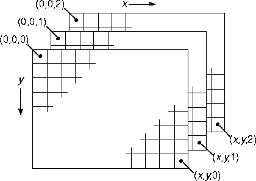
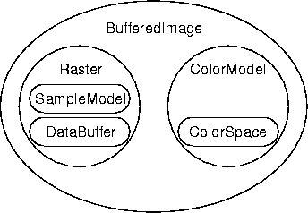
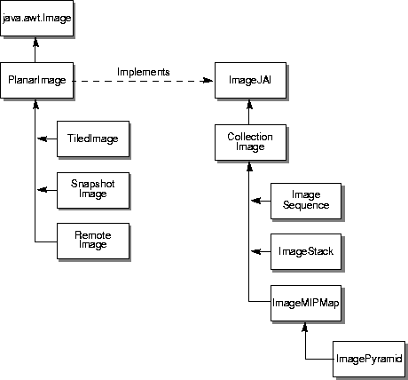
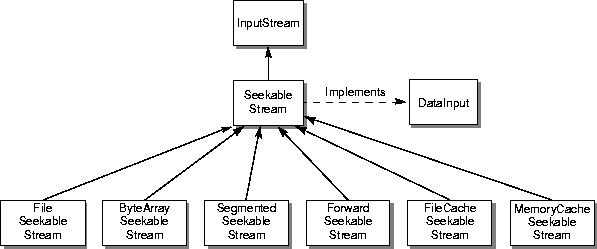
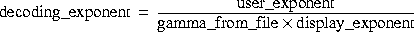
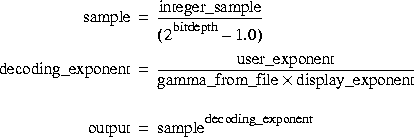
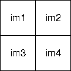

# Chapter 4 Image Acquisition and Display
{: .no_toc }

This chapter describes the ImageN image data types and the API
constructors and methods for image acquisition and display.

* Contents
{:toc}

## 4.1 Introduction

All imaging applications must perform the basic tasks of acquiring,
displaying, and creating (recording) images. Images may be acquired
from many sources, including a disk file, the network, a CD, and so
on. Images may be acquired, processed, and immediately displayed, or
written to a disk file for display at a later time.

As described in [Chapter 3](../programming-environ), ImageN
offers the programmer the flexibility to render and display an image
immediately or to defer the display of the rendered image until there
is a specific request for it.

Image acquisition and display are relatively easy in ImageN, in spite of
all the high-level information presented in the next several sections.
Take for example, the sample code in [Listing
4-1](../acquisition). This is a complete code example for
a simple application called `FileTest`, which takes a single argument;
the path and name of the file to read. `FileTest` reads the named file
and displays it in a `ScrollingImagePanel`. The operator that reads
the image file, `FileLoad`, is described in [Section 4.4.1.2, \"The
FileLoad Operation](../acquisition).\" The
`ScrollingImagePanel` is described in [Section 4.8, \"Image
Display](../acquisition).\"

***Listing 4-1* Example Program to Read and Display an Image File** <a name="listing-4-1"></a>

```java

```

### 4.1.1 Image Data

Image data is, conceptually, a three-dimensional array of pixels, as
shown in [Figure 4-1](../acquisition). Each of the three
arrays in the example is called a *band*. The number of rows specifies
the image height of a band, and the number of columns specifies the
image width of a band.

Monochrome images, such as a grayscale image, have only one band.
Color images have three or more bands, although a band does not
necessarily have to represent color. For example, satellite images of
the earth may be acquired in several different spectral bands, such as
red, green, blue, and infrared.

In a color image, each band stores the red, green, and blue (RGB)
components of an additive image, or the cyan, magenta, and yellow
(CMY) components of a three-color subtractive image, or the cyan,
magenta, yellow, and black (CMYK) components of a four-color
subtractive image. Each pixel of an image is composed of a set of
*samples*. For an RGB pixel, there are three samples; one each for
red, green, and blue.

An image is sampled into a rectangular array of pixels. Each pixel has
an (*x*,*y*) coordinate that corresponds to its location within the
image. The *x* coordinate is the pixel\'s horizontal location; the *y*
coordinate is the pixel\'s vertical location. Within ImageN, the pixel at
location (0,0) is in the upper left corner of the image, with the *x*
coordinates increasing in value to the right and *y* coordinates
increasing in value downward. Sometimes the *x* coordinate is referred
to as the pixel number and the *y* coordinate as the line number.

<a name="figure-4-1"></a>

------------------------------------------------------------------------



------------------------------------------------------------------------

***Figure 4-1* Multi-band Image Structure**

### 4.1.2 Basic Storage Types

In the ImageN API, the basic unit of data storage is the `DataBuffer`
object. The `DataBuffer` object is a kind of raw storage that holds
all the samples that make up the image, but does not contain any
information on how those samples are put together as pixels. How the
samples are put together is contained in a `SampleModel` object. The
`SampleModel` class contains methods for deriving pixel data from a
`DataBuffer`.

ImageN supports several image data types, so the `DataBuffer` class has
the following subclasses, each representing a different data type:

-   `DataBufferByte` - stores data internally as bytes (8-bit values)

-   `DataBufferShort` - stores data internally as shorts (16-bit
    values)

-   `DataBufferUShort` - stores data internally as unsigned shorts
    (16-bit values)``

-   `DataBufferInt` - stores data internally as integers (32-bit
    values)

-   `DataBufferFloat` - stores data internally as single-precision
    floating-point values.

-   `DataBufferDouble` - stores data internally as double-precision
    floating-point values.

[Table 4-1](#table-4-1) lists the `DataBuffer` type elements.

<a name="table-4-1"></a>

***Table 4-1 Data Buffer Type Elements*** 

| Name              | Description                               |  
| ----------------- | ----------------------------------------- |
| TYPE\_INT         | Tag for int data. |
| TYPE\_BYTE        | Tag for unsigned byte data. |
| TYPE\_SHORT       | Tag for signed short data. |
| TYPE\_USHORT      | Tag for unsigned short data. |
| TYPE\_DOUBLE      | Tag for double data. |
| TYPE\_FLOAT       | Tag for float data. |
| TYPE\_UNDEFINED   | Tag for undefined data. |

ImageN also supports a large number of image data formats, so the
`SampleModel` class provides the following types of sample models:

-   `ComponentSampleModel` - used to extract pixels from images that
    store sample data in separate data array elements in one bank of a
    `DataBuffer` object.

-   `ComponentSampleModelImageN` - used to extract pixels from images
    that store sample data such that each sample of a pixel occupies
    one data element of the `DataBuffer`.

-   `BandedSampleModel` - used to extract pixels from images that
    store each sample in a separate data element with bands stored in
    a sequence of data elements.

-   `PixelInterleavedSampleModel` - used to extract pixels from images
    that store each sample in a separate data element with pixels
    stored in a sequence of data elements.

-   `MultiPixelPackedSampleModel` - used to extract pixels from
    single-banded images that store multiple one-sample pixels in one
    data element.

-   `SinglePixelPackedSampleModel` - used to extract samples from
    images that store sample data for a single pixel in one data array
    element in the first bank of a `DataBuffer` object.

-   `FloatComponentSampleModel` - stores *n* samples that make up a
    pixel in *n* separate data array elements, all of which are in the
    same bank in a `DataBuffer` object. This class supports different
    kinds of interleaving.

The combination of a `DataBuffer` object, a `SampleModel` object, and
an origin constitute a meaningful multi-pixel image storage unit
called a `Raster`. The `Raster` class has methods that directly return
pixel data for the image data it contains.

There are two basic `Raster` types:

-   `Raster` - represents a rectangular array of pixels. This is a
    \"read-only\" class that only has get methods.

-   `WritableRaster` - extends `Raster` to provide pixel writing
    capabilities.

There are separate interfaces for dealing with each raster type:

-   The `RenderedImage` interface assumes the data is read-only and,
    therefore, does not contain methods for writing a `Raster`.

-   The `WriteableRenderedImage` interfaces assumes that the image
    data can be modified.

A `ColorModel` class provides a color interpretation of pixel data
provided by the image\'s sample model. The abstract `ColorModel` class
defines methods for turning an image\'s pixel data into a color value
in its associated `ColorSpace`. See [Section 5.2.1, \"Color
Models](../color).\"

<a name="figure-4-2"></a> 

------------------------------------------------------------------------



------------------------------------------------------------------------

***Figure 4-2* BufferedImage***

As shown in [Figure 4-2](index#figure-4-1), the combination
of a `Raster` and a `ColorModel` define a `BufferedImage`. The
`BufferedImage` class provides general image management for immediate
mode imaging.

The `BufferedImage` class supports the following predefined image
types:

<a name="table-4-2"></a>

***Table 4-2*  Supported Image Types**

------------------------------------------------------------------------

TYPE_3BYTE_BGR
: Represents an image with 8-bit RGB color components, corresponding to a Windows-style BGR color model, with the colors blue, green, and red stored in three bytes.

TYPE_4BYTE_ABGR
: Represents an image with 8-bit RGBA color components with the colors blue, green, and red stored in three bytes and one byte of alpha.

TYPE_4BYTE_ABGR_PRE
: Represents an image with 8-bit RGBA color components with the colors blue, green, and red stored in three bytes and one byte of alpha.

TYPE_BYTE_BINARY
: Represents an opaque byte-packed binary image.

TYPE_BYTE_GRAY
: Represents a unsigned byte grayscale image, non-indexed.

TYPE_BYTE_INDEXED
: Represents an indexed byte image.

TYPE_CUSTOM
: Image type is not recognized so it must be a customized image.

TYPE_INT_ARGB
: Represents an image with 8-bit RGBA color components packed into integer pixels.

TYPE_INT_ARGB_PRE
: Represents an image with 8-bit RGB color components, corresponding to a Windows- or Solaris- style BGR color model, with the colors blue, green, and red packed into integer pixels.

TYPE_INT_BGR
:  Represents an image with 8-bit RGB color components, corresponding to a Windows- or Solaris- style BGR color model, with the colors blue, green, and red packed into integer pixels.

TYPE_INT_RGB
: Represents an image with 8-bit RGB color components packed into integer pixels.

TYPE_USHORT_555_RGB
: Represents an image with 5-5-5 RGB color components (5-bits red, 5-bits green, 5-bits blue) with no alpha.

TYPE_USHORT_565_RGB
: Represents an image with 5-6-5 RGB color components (5-bits red, 6-bits green, 5-bits blue) with no alpha.

TYPE_USHORT_GRAY
: Represents an unsigned short grayscale image, non-indexed).

------------------------------------------------------------------------


4.2 Image Types
----------------------------------------

The API provides a set of classes for describing image data of
various kinds. These classes are organized into a class hierarchy, as
shown in [Figure 4-3](#figure-4-3).

<a name="figure-4-3"></a>

------------------------------------------------------------------------



------------------------------------------------------------------------

***Figure 4-3*  ImageN Image Type Hierarchy**

### 4.2.1 Planar Image

The `PlanarImage` class is the main class for defining two-dimensional
images. The `PlanarImage` implements the
`java.awt.image.RenderedImage` interface, which describes a tiled,
read-only image with a pixel layout described by a `SampleModel` and a
`DataBuffer`. The `TiledImage` and `OpImage` subclasses manipulate the
instance variables they inherit from `PlanarImage`, such as the image
size, origin, tile dimensions, and tile grid offsets, as well as the
Vectors containing the sources and sinks of the image.

All non-ImageN `RenderedImages` that are to be used in ImageN must be
converted into `PlanarImages` by means of the `RenderedImageAdapter`
class and the `WriteableRenderedImageAdapter` class. The
`wrapRenderedImage()` method provides a convenient interface to both
add a wrapper and take a snapshot if the image is writable. The
standard `PlanarImage` constructor used by `OpImages` performs this
wrapping automatically. Images that already extend `PlanarImage` will
be returned unchanged by `wrapRenderedImage()`.

Going in the other direction, existing code that makes use of the
`RenderedImage` interface will be able to use `PlanarImage`s directly,
without any changes or recompilation. Therefore within ImageN, images are
returned from methods as `PlanarImages`, even though incoming
`RenderedImage`s are accepted as arguments directly.

**API:** `org.eclipse.imagen.PlanarImage`

* `PlanarImage()`
* `PlanarImage createSnapshot()`
* `Raster getData(Rectangle region)`
* `int getWidth()`
* `int getHeight()`
* `int getMinXCoord()`
* `int getMaxXCoord()`
* `int getMinYCoord()`
* `int getMaxYCoord()`
* `Rectangle getBounds()`
* `int getTileWidth()`
* `int getTileHeight()`
* `int tilesAcross()`
* `int tilesDown()`

There are lots more methods.

### 4.2.2 Tiled Image

ImageN expands on the tile data concept introduced in the Java 2D
API. In Java 2D, a tile is one of a set of rectangular regions that
span an image on a regular grid. ImageN expands on the tile image
with the `TiledImage` class, which is the main class for writable
images in ImageN.

A tile represents all of the storage for its spatial region of the
image. If an image contains three bands, every tile represents all
three bands of storage. The use of tiled images improves application
performance by allowing the application to process an image region
within a single tile without bringing the entire image into memory.

`TiledImage` provides a straightforward implementation of the
`WritableRenderedImage` interface, taking advantage of that
interface\'s ability to describe images with multiple tiles. The tiles
of a `WritableRenderedImage` must share a `SampleModel`, which
determines their width, height, and pixel format.

The tiles form a regular grid that may occupy any rectangular region
of the plane. Tile pixels that exceed the image\'s stated bounds have
undefined values.

The contents of a `TiledImage` are defined by a single `PlanarImage`
source, provided either at construction time or by means of the
`set()` method. The `set()` method provides a way to selectively
overwrite a portion of a `TiledImage`, possibly using a soft-edged
mask.

`TiledImage` also supports direct manipulation of pixels by means of
the `getWritableTile` method. This method returns a `WritableRaster`
that can be modified directly. Such changes become visible to readers
according to the regular thread synchronization rules of the Java
virtual machine; ImageN makes no additional guarantees. When a writer is
finished modifying a tile, it should call the `releaseWritableTile`
method. A shortcut is to call the `setData()` method, which copies a
rectangular region from a supplied `Raster` directly into the
`TiledImage`.

A final way to modify the contents of a `TiledImage` is through calls
to the `createGraphics()` method. This method returns a `GraphicsImageN`
object that can be used to draw line art, text, and images in the
usual AWT manner.

A `TiledImage` does not attempt to maintain synchronous state on its
own. That task is left to `SnapshotImage`. If a synchronous
(unchangeable) view of a `TiledImage` is desired, its
`createSnapshot()` method must be used. Otherwise, changes due to
calls to `set()` or direct writing of tiles by objects that call
`getWritableTile()` will be visible.

`TiledImage` does not actually cause its tiles to be computed until
their contents are demanded. Once a tile has been computed, its
contents may be discarded if it can be determined that it can be
recomputed identically from the source. The `lockTile()` method forces
a tile to be computed and maintained for the lifetime of the
`TiledImage`.

**API:** `org.eclipse.imagen.TiledImage`

* `TiledImage(Point origin, SampleModel sampleModel, int  tileWidth, int tileHeight)`
* `TiledImage(SampleModel sampleModel, int tileWidth, int  tileHeight)`
* `TiledImage(int minX, int minY, int width, int height, int  tileGridXOffset, int tileGridYOffset, SampleModel  sampleModel, ColorModel colorModel)`
* `void setData(Raster r)`
* `void setData(Raster r, ROI roi)`
* `WritableRaster getWritableTile(int tileX, int tileY)`
* `Raster getTile(int tileX, int tileY)`
* `boolean isTileWritable(int tileX, int tileY)`
* `boolean hasTileWriters()`
* `void releaseWritableTile(int tileX, int tileY)`
* `void set(RenderedImage im)`
* `void set(RenderedImage im, ROI roi)`
* `Graphics2D createGraphics()`

#### 4.2.2.1 Tile Cache

The `TileCache` interface provides a central place for `OpImage`s to
cache tiles they have computed. The tile cache is created with a given
capacity (measured in tiles). By default, the tile capacity for a new
tile cache is 300 tiles. The default memory capacity reserved for tile
cache is 20M bytes.

The `TileCache` to be used by a particular operation may be set during
construction, or by calling the `JAI.setTileCache` method. This
results in the provided tile cache being added to the set of common
rendering hints.

The `TileScheduler` interface allows tiles to be scheduled for
computation. In various implementations, tile computation may make use
of multithreading and multiple simultaneous network connections for
improved performance.

**API:** `org.eclipse.imagen.JAI`

* `static TileCache createTileCache(int tileCapacity, long  memCapacity)`
* `static TileCache createTileCache()`
* `void setTileCache(TileCache tileCache)`
* `TileCache getTileCache()`

#### 4.2.2.2 Pattern Tiles

A pattern tile consists of a repeated pattern. The `pattern` operation
defines a pattern tile by specifying the width and height; all other
layout parameters are optional, and when not specified are set to
default values. Each tile of the destination image will be defined by
a reference to a shared instance of the pattern.

The `pattern` operation takes three parameters:

| Parameter  | Type             | Description                |
| ---------- | ---------------- | -------------------------- |
| width      | Integer | The width of the image in pixels. |
| height     | Integer | The height of the image in pixels. |
| pattern    | Raster  | The Pattern pixel band values. |

[Listing 4-2](#listing-4-2) shows a code sample for a `pattern` operation.

***Listing 4-2* Example Pattern Operation** <a name="listing-4-2"></a>

```java
// Create the raster.
WritableRaster raster;
int[] bandOffsets = new int[3];
bandOffsets[0] = 2;
bandOffsets[1] = 1;
bandOffsets[2] = 0;

// width, height=64.
PixelInterleavedSampleModel sm;
sm = new PixelInterleavedSampleModel(DataBuffer.TYPE_BYTE, 100,
                                   100, 3, 3*100, bandOffsets);

// Origin is 0,0.
WritableRaster pattern = Raster.createWritableRaster(sm,
                             new Point(0, 0));
int[] bandValues = new int[3];
bandValues[0] = 90;
bandValues[1] = 45;
bandValues[2] = 45

// Set values for the pattern raster.
for (int y = 0; y < pattern.getHeight(); y++) {
for (int x = 0; x < pattern.getWidth(); x++) {
    pattern.setPixel(x, y, bandValues);
    bandValues[1] = (bandValues[1]+1)%255;
    bandValues[2] = (bandValues[2]+1)%255;
    }
}

// Create a 100x100 image with the given raster.
PlanarImage im0 = (PlanarImage)JAI.create("pattern",
                                           100, 100,
                                           pattern);
```

### 4.2.3 Snapshot Image

The `SnapshotImage` class represents the main component of the
deferred execution engine. A `SnapshotImage` provides an arbitrary
number of synchronous views of a possibly changing
`WritableRenderedImage`. `SnapshotImage` is responsible for
stabilizing changing sources to allow deferred execution of operations
dependent on such sources.

Any `RenderedImage` may be used as the source of a `SnapshotImage`. If
the source is a `WritableRenderedImage`, the `SnapshotImage` will
register itself as a `TileObserver` and make copies of tiles that are
about to change.

Multiple versions of each tile are maintained internally, as long as
they are in demand. `SnapshotImage` is able to track demand and should
be able to simply forward requests for tiles to the source most of the
time, without the need to make a copy.

When used as a source, calls to `getTile` will simply be passed along
to the source. In other words, `SnapshotImage` is completely
transparent. However, by calling `createSnapshot()` an instance of a
non-public `PlanarImage` subclass (called `Snapshot` in this
implementation) will be created and returned. This image will always
return tile data with contents as of the time of its construction.


#### 4.2.3.1 Creating a SnapshotImage

This implementation of `SnapshotImage` makes use of a doubly-linked
list of `Snapshot` objects. A new `Snapshot` is added to the tail of
the list whenever `createSnapshot()` is called. Each `Snapshot` has a
cache containing copies of any tiles that were writable at the time of
its construction, as well as any tiles that become writable between
the time of its construction and the construction of the next
`Snapshot`.


#### 4.2.3.2 Using SnapshotImage with a Tile

When asked for a tile, a `Snapshot` checks its local cache and returns
its version of the tile if one is found. Otherwise, it forwards the
request onto its successor. This process continues until the latest
Snapshot is reached; if it does not contain a copy of the tile, the
tile is requested from the real source image.

**API:** `org.eclipse.imagen.SnapShotImage`

* `SnapshotImage(PlanarImage source)`

* `Raster getTile(int tileX, int tileY)`

* `void tileUpdate(java.awt.image.WritableRenderedImage source, int tileX, int tileY, boolean willBeWritable)`

* `PlanarImage createSnapshot()`

#### 4.2.3.3 Disposing of a Snapshot Image

When a `Snapshot` is no longer needed, its `dispose()` method may be
called. The `dispose()` method will be called automatically when the
`Snapshot` is finalized by the garbage collector. The `dispose()`
method attempts to push the contents of its tile cache back to the
previous `Snapshot` in the linked list. If that image possesses a
version of the same tile, the tile is not pushed back and may be
discarded.

Disposing of the `Snapshot` allows tile data held by the Snapshot that
is not needed by any other `Snapshot` to be disposed of as well.

**API:** `org.eclipse.imagen.PlanarImage`

* `void dispose()`

### 4.2.4 Remote Image

A `RemoteImage` is a sub-class of `PlanarImage` which represents an
image on a remote server. A `RemoteImage` may be constructed from a
`RenderedImage` or from an imaging chain in either the rendered or
renderable modes. For more information, see [Chapter 12,
\"Client-Server Imaging](../client-server).\"

### 4.2.5 Collection Image

The `CollectionImage` class is an abstract superclass for classes
representing groups of images. Examples of groups of images include
pyramids (`ImagePyramid`), time sequences (`ImageSequence`), and
planar slices stacked to form a volume (`ImageStack`).

**API:** `org.eclipse.imagen.CollectionImage`

* `CollectionImage()`

### 4.2.6 Image Sequence

The `ImageSequence` class represents a sequence of images with
associated timestamps and a camera position. It can be used to
represent video or time-lapse photography.

The images are of the type `ImageJAI`. The timestamps are of the type
`long`. The camera positions are of the type `Point`. The tuple
(image, time stamp, camera position) is represented by class
`SequentialImage`.

**API:** `org.eclipse.imagen.ImageSequence`

* `ImageSequence(Collection images)`

### 4.2.7 Image Stack

The `ImageStack` class represents a stack of images, each with a
defined spatial orientation in a common coordinate system. This class
can be used to represent CT scans or seismic volumes.

The images are of the type `org.eclipse.imagen.PlanarImage`; the
coordinates are of the type `org.eclipse.imagen.Coordinate`. The tuple
(image, coordinate) is represented by class
`org.eclipse.imagen.CoordinateImage`.

**API:** `org.eclipse.imagen.ImageStack`

* `ImageStack(Collection images)`

* `ImageJAI getImage(Coordinate coordinate)`

* `Coordinate getCoordinate(ImageJAI image)`

### 4.2.8 Image MIP Map

An image MIP map is a stack of images with a fixed operational
relationship between adjacent slices. Given the highest-resolution
slice, the others may be derived in turn by performing a particular
operation. Data may be extracted slice by slice or by special
iterators.

A MIP map image (*MIP* stands for the Latin *multim im parvo*, meaning
\"many things in a small space\") is usually associated with texture
mapping. In texture mapping, the MIP map image contains
different-sized versions of the same image in one location. To use
mipmapping for texture mapping, you provide all sizes of the image in
powers of 2 from the largest image to a 1 x 1 map.

The `ImageMIPMap` class takes the original source image at the highest
resolution level, considered to be level 0, and a RenderedOp chain
that defines how the image at the next lower resolution level is
derived from the current resolution level.

The RenderedOp chain may have multiple operations, but the first
operation in the chain must take only one source image, which is the
image at the current resolution level.

There are three `ImageMIPMap` constructors:

* `ImageMIPMap(RenderedImage image, AffineTransform transform, Interpolation interpolation)`

  This constructor assumes that the operation used to derive the next lower resolution is a standard *affine* operation.

  Any number of versions of the original image may be derived by an affine transform representing the geometric relationship between levels of the MIP map. The affine transform may include translation, scaling, and rotation (see [\"Affine Transformation\"
    ](../geom-image-manip)).

* `ImageMIPMap(RenderedImage image, RenderedOp downSampler)`

  This constructor specifies the `downSampler`, which points to the RenderedOp chain used to derive the next lower resolution level.

* `ImageMIPMap(RenderedOp downSampler)`

  This constructor specifies only the `downSampler`.``

The `downSampler` is a chain of operations used to derive the image at
the next lower resolution level from the image at the current
resolution level. That is, given an image at resolution level *i*, the
`downSampler` is used to obtain the image at resolution level *i* + 1.
The chain may contain one or more operation nodes; however, each node
must be a `RenderedOp`.

The `downsampler` parameter points to the last node in the chain. The
very first node in the chain must be a `RenderedOp` that takes one
`RenderedImage` as its source. All other nodes may have multiple
sources. When traversing back up the chain, if a node has more than
one source, the first source, `source0`, is used to move up the chain.
This parameter is saved by reference.

[Listing 4-3](../acquisition) shows a complete code
example of the use of `ImageMIPMap`.

***Listing 4-3*  Example use of ImageMIPMap** <a name="listing-4-3"></a>

```java

```

**API:** `org.eclipse.imagen.ImageMIPMap`

* `int getCurrentLevel()`
* `RenderedImage getCurrentImage()`
* `RenderedImage getImage(int level)`
* `RenderedImage getDownImage()`

### 4.2.9 Image Pyramid

The `ImagePyramid` class implements a pyramid operation on a
`RenderedImage`. Supposing that we have a `RenderedImage` of 1024 x
1024, we could generate ten additional images by successively
averaging 2 x 2 pixel blocks, each time discarding every other row and
column of pixels. We would be left with images of 512 x 512, 256 x
256, and so on down to 1 x 1.

In practice, the lower-resolution images may be derived by performing
any chain of operations to repeatedly down sample the
highest-resolution image slice. Similarly, once a lower resolution
image slice is obtained, the higher resolution image slices may be
derived by performing another chain of operations to repeatedly up
sample the lower resolution image slice. Also, a third operation chain
may be used to find the difference between the original slice of image
and the resulting slice obtained by first down sampling then up
sampling the original slice.

This brings us to the discussion of the parameters required of this
class:

| Parameter   | Description                |
| downSampler | A RenderedOp chain used to derive the lower resolution images. The first operation in the chain must take only one source. See Section [4.2.9.1](#4291-the-down-sampler)
| upSampler   | A RenderedOp chain that derives the image at a resolution level higher than the current level. The first operation in the chain must take only one source. See Section [4.2.9.2](#4292-the-up-sampler) |
| differencer | A RenderedOp chain that finds the difference of two images. The first operation in the chain must take exactly two sources. See Section [4.2.9.3](#4293-the-differencer) |
| combiner    | A RenderedOp chain that combines two images. The first operation in the chain must take exactly two sources. See Section [4.2.9.4](#4294-the-combiner) |

Starting with the image at the highest resolution level, to find an
image at a lower resolution level we use the `downSampler`. But, at
the same time we also use the `upSampler` to retrieve the image at the
higher resolution level, then use the `differencer` to find the
difference image between the original image and the derived image from
the `upSampler`. We save this difference image for later use.``

To find an image at a higher resolution, we use the `upSampler`, then
combine the earlier saved difference image with the resulting image
using the `combiner` to get the final higher resolution level.

For example

:  We have an image at level *n* \\
   *n* + 1 = downSampler(*n*) \\
   diff *n* = upSampler(*n* + 1) \\
   *diff n* = differencer(*n*, *n*\') - This diff *n* is saved for
   each level \\
   Later we want to get *n* from *n* + 1 \\
   *n*\' = upSampler(*n* + 1) \\
   *n* = combiner(*n*\', diff *n*)


#### 4.2.9.1 The Down Sampler

The `downSampler` is a chain of operations used to derive the image at
the next lower resolution level from the image at the current
resolution level. That is, given an image at resolution level *i*, the
`downSampler` is used to obtain the image at resolution level *i* + 1.
The chain may contain one or more operation nodes; however, each node
must be a `RenderedOp`. The parameter points to the last node in the
chain. The very first node in the chain must be a `RenderedOp` that
takes one `RenderedImage` as its source. All other nodes may have
multiple sources. When traversing back up the chain, if a node has
more than one source, the first source, `source0`, is used to move up
the chain. This parameter is saved by reference.

The `getDownImage` method returns the image at the next lower
resolution level, obtained by applying the `downSampler` on the image
at the current resolution level.


#### 4.2.9.2 The Up Sampler

The `upSampler` is a chain of operations used to derive the image at
the next higher resolution level from the image at the current
resolution level. That is, given an image at resolution level *i*, the
`upSampler` is used to obtain the image at resolution level *i* - 1.
The requirement for this parameter is similar to the requirement for
the `downSampler` parameter.

The `getUpImage` method returns the image at the previous higher
resolution level. If the current image is already at level 0, the
current image is returned without further up sampling. The
down-sampled image is obtained by first up sampling the current image,
then combining the resulting image with the previously-saved different
image using the `combiner` op chain (see [Section 4.2.9.4, \"The
Combiner](../acquisition)\").


#### 4.2.9.3 The Differencer

The `differencer` is a chain of operations used to find the difference
between an image at a particular resolution level and the image
obtained by first down sampling that image then up sampling the result
image of the down sampling operations. The chain may contain one or
more operation nodes; however, each node must be a `RenderedOp`. The
parameter points to the last node in the chain. The very first node in
the chain must be a `RenderedOp` that takes two `RenderedImage`s as
its sources. When traversing back up the chain, if a node has more
than one source, the first source, `source0`, is used to move up the
chain. This parameter is saved by reference.

The `getDiffImage` method returns the difference image between the
current image and the image obtained by first down sampling the
current image then up sampling the resulting image of down sampling.
This is done using the `differencer` op chain. The current level and
current image are not changed.


#### 4.2.9.4 The Combiner

The `combiner` is a chain of operations used to combine the resulting
image of the up sampling operations and the different image saved to
retrieve an image at a higher resolution level. The requirement for
this parameter is similar to the requirement for the `differencer`
parameter.


#### 4.2.9.5 Example

[Listing 4-4](#listing-4-4) shows a complete code example of the use of `ImagePyramid`.

***Listing 4-4*  Example use of ImagePyramid** <a name="listing-4-3"></a>

```java

```


**API:** `org.eclipse.imagen.ImagePyramid`

* `ImagePyramid(RenderedImage image, RenderedOp downsampler, 
           RenderedOp upSampler, RenderedOp differencer, 
           RenderedOp  combiner)`
           
* `ImagePyramid(RenderedOp downSampler, RenderedOp upSampler, 
           RenderedOp differencer, RenderedOp combiner)`


* `public RenderedImage getImage(int level)`

* `public RenderedImage getDownImage()`


* `public RenderedImage getUpImage()`


* `public RenderedImage getDiffImage()`

### 4.2.10 Multi-resolution Renderable Images

The `MultiResolutionRenderableImage` class produces renderings based
on a set of supplied `RenderedImages` at various resolutions. The
`MultiResolutionRenderableImage` is constructed from a specified
dimension (height; the width is derived by the source image aspect
ratio and is not specified) and a vector of renderedImages of
progressively lower resolution.

**API:** `org.eclipse.imagen.MultiResolutionRenderableImage`

* `public MultiResolutionRenderableImage(Vector renderedSources, 
           float minX, float minY, float height)`

* `RenderedImage createScaledRendering(int width, int height, 
           RenderingHints hints)`

* `RenderedImage createDefaultRendering()`

* `RenderedImage createRendering(RenderContext renderContext)`

* `Object getProperty(String name)`

* `String[] getPropertyNames()`

* `float getWidth()`

* `float getHeight()`

* `float getMinX()`

* `float getMaxX()`

* `float getMinY()`

* `float getMaxY()`

4.3 Streams
--------------------------------

The Java Advanced Imaging API extends the Java family of stream types
with the addition of seven \"seekable\" stream classes, as shown in
[Figure 4-4](#figure-4-4).

[Table 4-3](#table-4-3) briefly describes each of the new classes.

<a name="figure-4-4"></a>

------------------------------------------------------------------------



------------------------------------------------------------------------

***Figure 4-4*  JAI Stream Classes**

The new seekable classes are used to cache the image data being read
so that methods can be used to seek backwards and forwards through the
data without having to re-read the data. This is especially important
for image data types that are segmented or that cannot be easily
re-read to locate important information.

<a name="table-4-3"></a>

***Table 4-3*  JAI Stream Classes**
  
| Class   | Description |
|---------|-------------|
| SeekableStream |  Extends: `InputStream` <br/> Implements: `DataInput` <br/> An abstract class that combines the functionality of InputStream and RandomAccessFile, along with the ability to read primitive data types in little-endian format. |
| FileSeekableStream | Extends: `SeekableStream` <br/> Implements SeekableStream functionality on data stored in a File. |
| ByteArraySeekableStream | Extends: `SeekableStream` <br/> Implements SeekableStream functionality on data stored in an array of bytes. |
| SegmentedSeekableStream | Extends: `SeekableStream` <br/> Provides a view of a subset of another SeekableStream consisting of a series of segments with given starting positions in the source stream and lengths. The resulting stream behaves like an ordinary SeekableStream. |
| ForwardSeekableStream | Extends: `SeekableStream` <br/> Provides SeekableStream functionality on data from an InputStream with minimal overhead, but does not allow seeking backwards. ForwardSeekableStream may be used with input formats that support streaming, avoiding the need to cache the input data.
| FileCacheSeekableStream | Extends: `SeekableStream` <br/> Provides SeekableStream functionality on data from an InputStream with minimal overhead, but does not allow seeking backwards. ForwardSeekableStream may be used with input formats that support streaming, avoiding the need to cache the input data. In circumstances that do not allow the creation of a temporary file (for example, due to security consideration or the absence of local disk), the MemoryCacheSeekableStream class may be used. |
| MemoryCacheSeekableStream | Extends: `SeekableStream` <br/> Provides SeekableStream functionality on data from an InputStream, using an in-memory cache to allow seeking backwards. MemoryCacheSeekableStream should be used when security or lack of access to local disk precludes the use of FileCacheSeekableStream. ||

To properly read some image data files requires the ability to seek
forward and backward through the data so as to read information that
describes the image. The best way of making the data seekable is
through a *cache*, a temporary file stored on a local disk or in main
memory. The preferred method of storage for the cached data is local
disk, but that it not always possible. For security concerns or for
diskless systems, the creation of a disk file cache may not always be
permitted. When a file cache is not permissible, an in-memory cache
may be used.

The `SeekableStream` class allows seeking within the input, similarly
to the `RandomAccessFile` class. Additionally, the `DataInput`
interface is supported and extended to include support for
little-endian representations of fundamental data types.

The `SeekableStream` class adds several `read` methods to the already
extensive java.io.`DataInput` class, including methods for reading
data in little-endian (LE) order. In Java, all values are written in
big-endian fashion. However, JAI needs methods for reading data that
is not produced by Java; data that is produced on other platforms that
produce data in the little-endian fashion. [Table
4-4](acquisition) is a complete list of the methods to
read data:

<a name="table-4-4"></a>

***Table 4-4* Read Data Methods**
  
| Class   | Description |
|---------|-------------|
| readInt               | Reads a signed 32-bit integer
| readIntLE             | Reads a signed 32-bit integer in little-endian order |
| readShort             | Reads a signed 16-bit number |
| readShortLE           | Reads a 16-bit number in little-endian order |
| readLong              | Reads a signed 64-bit integer |
| readLongLE            | Reads a signed 64-bit integer in little-endian order |
| readFloat             | Reads a 32-bit float |
| readFloatLE           | Reads a 32-bit float in little-endian order |
| readDouble            | Reads a 64-bit double |
| readDoubleLE          | Reads a 64-bit double in little-endian order |
| readChar              | Reads a 16-bit Unicode character |
| readCharLE            | Reads a 16-bit Unicode character in little-endian order |
| readByte              | Reads an signed 8-bit byte |
| readBoolean           | Reads a Boolean value |
| readUTF               | Reads a string of characters in UTF (Unicode Text Format) |
| readUnsignedShort     | Reads an unsigned 16-bit short integer |
| readUnsignedShortLE   | Reads an unsigned 16-bit short integer in little-endian order |
| readUnsignedInt       | Reads an unsigned 32-bit integer |
| readUnsignedIntLE     | Reads an unsigned 32-bit integer in little-endian order |
| readUnsignedByte      | Reads an unsigned 8-bit byte |
| readLine              | Reads in a line that has been terminated by a line-termination character. |
| readFully             | Reads a specified number of bytes, starting at the current stream pointer |
| read()                | Reads the next byte of data from the input stream. |


In addition to the familiar methods from `InputStream`, the methods
`getFilePointer`() and `seek()`, are defined as in the
`RandomAccessFile` class. The `canSeekBackwards()` method returns
`true` if it is permissible to seek to a position earlier in the
stream than the current value of `getFilePointer()`. Some subclasses
of `SeekableStream` guarantee the ability to seek backwards while
others may not offer this feature in the interest of efficiency for
those users who do not require backward seeking.

Several concrete subclasses of `SeekableStream` are supplied in the
`org.eclipse.imagen.media.codec` package. Three classes are provided for the
purpose of adapting a standard `InputStream` to the `SeekableStream`
interface. The `ForwardSeekableStream` class does not allow seeking
backwards, but is inexpensive to use. The `FileCacheSeekableStream`
class maintains a copy of all of the data read from the input in a
temporary file; this file will be discarded automatically when the
`FileSeekableStream` is finalized, or when the JVM exits normally.

The `FileCacheSeekableStream` class is intended to be reasonably
efficient apart from the unavoidable use of disk space. In
circumstances where the creation of a temporary file is not possible,
the `MemoryCacheSeekableStream` class may be used. The
`MemoryCacheSeekableStream` class creates a potentially large
in-memory buffer to store the stream data and so should be avoided
when possible. The `FileSeekableStream` class wraps a `File` or
`RandomAccessFile`. It forwards requests to the real underlying file.
`FileSeekableStream` performs a limited amount of caching to avoid
excessive I/O costs.

A convenience method, `wrapInputStream` is provided to construct a
suitable `SeekableStream` instance whose data is supplied by a given
`InputStream`. The caller, by means of the `canSeekBackwards`
parameter, determines whether support for seeking backwards is
required.


4.4 Reading Image Files
--------------------------------------------

The ImageN codec architecture consists of encoders and decoders capable
of writing and reading several different raster image file formats.
This chapter describes reading image files. For information on writing
image files, see [Chapter 13, \"Writing Image Files](../encode).\"

There are many raster image file formats, most of which have been
created to support both image storage and interchange. Some formats
have become widely used and are considered de facto standards. Other
formats, although very important to individual software vendors, are
less widely used.

ImageN directly supports several of the most common image file formats,
listed in [Table 4-5](#table-4-5). If your favorite
file format is not listed in [Table 4-5](#table-4-5),
you may either be able to create your own file codec (see [Chapter 14,
\"Extending the API](../extension)\") or use one obtained
from a third party developer.

<a name="table-4-5"></a>

***Table 4-5* Image File Formats**
  
| File Format Name | Description |
|------------------|-------------|
| BMP | Microsoft Windows bitmap image file |
| FPX | FlashPix format |
| GIF | Compuserve\'s Graphics Interchange Format |
| JPEG | A file format developed by the Joint Photographic Experts Group |
| PNG | Portable Network Graphics |
| PNM | Portable aNy Map file format. Includes PBM, PGM, and PPM. |
| TIFF | Tag Image File Format |

An image file usually has at least two parts: a file header and the
image data. The header contains fields of pertinent information
regarding the following image data. At the very least, the header must
provide all the information necessary to reconstruct the original
image from the stored image data. The image data itself may or may not
be compressed.

The main class for image decoders and encoders is the `ImageCodec`
class. Subclasses of `ImageCodec` are able to perform recognition of a
particular file format either by inspection of a fixed-length file
header or by arbitrary access to the source data stream. Each
`ImageCodec` subclass implements one of two image file recognition
methods. The codec first calls the `getNumHeaderBytes()` method, which
either returns 0 if arbitrary access to the stream is required, or
returns the number of header bytes required to recognize the format.
Depending on the outcome of the `getNumHeaderBytes()` method, the
codec either reads the stream or the header.

Once the codec has determined the image format, either by reading the
stream or the header, it returns the name of the codec associated with
the detected image format. If no codec is registered with the name,
`null` is returned. The name of the codec defines the subclass that is
called, which decodes the image.

For most image types, ImageN offers the option of reading an image data
file as a `java.io.File` object or as one of the subclasses of
`java.io.InputStream`.

ImageN offers several file operators for reading image data files, as
listed in [Table 4-6](#table-4-6).

<a name="table-4-6"></a>

***Table 4-6* Image File Operators**

| Operator | Description |
|----------|-------------|
| AWTImage | Imports a standard AWT image into JAI. |
| BMP | Reads BMP data from an input stream. |
| FileLoad | Reads an image from a file. |
| FPX | Reads FlashPix data from an input stream. |
| FPXFile | Reads a standard FlashPix file. |
| GIF | Reads GIF data from an input stream. |
| JPEG | Reads a standard JPEG (JFIF) file. |
| PNG | Reads a PNG input stream. |
| PNM | Reads a standard PNM file, including PBM, PGM, and PPM images of both ASCII and raw formats. |
| Stream | Reads java.io.InputStream files. |
| TIFF | Reads TIFF 6.0 data from an input stream. |
| URL | Creates an image the source of which is specified by a Uniform Resource Locator (URL). |

### 4.4.1 Standard File Readers for Most Data Types

You can read a file type directly with one of the available operation
descriptors (such as the `tiff` operation to read TIFF files), by the
stream file reader to read `InputStream` files, or the `FileLoad`
operator to read from a disk file. The `Stream` and `FileLoad`
operations are generic file readers in the sense that the image file
type does not have to be known ahead of time, assuming that the file
type is one of those recognized by JAI. These file read operations
automatically detect the file type when invoked and use the
appropriate file reader. This means that the programmer can use the
same graph to read any of the \"recognized\" file types.

The `Stream` and `FileLoad` operations use a set of `FormatRecognizer`
classes to query the file types when the image data is called for. A
`FormatRecognizer` may be provided for any format that may be
definitively recognized by examining the initial portion of the data
stream. A new `FormatRecognizer` may be added to the
`OperationRegistry` by means of the `registerFormatRecognizer` method
(see [Section 14.5, \"Writing New Image Decoders and
Encoders](../extension)\").


#### 4.4.1.1 The Stream Operation

The `Stream` operation reads an image from a `SeekableStream`. If the
file is one of the recognized \"types,\" the file will be read. The
`file` operation will query the set of registered `FormatRecognizer`s.
If a call to the `isFormatRecognized` method returns true, the
associated operation name is retrieved by calling the
`getOperationName` method and the named operation is instantiated.

If the operation fails to read the file, no other operation will be
invoked since the input will have been consumed.

The `Stream` operation takes a single parameter:

| Parameter | Type | Description |
|-----------|------|-------------|
| stream    | SeekableStream  | The SeekableStream to read from. |

[Listing 4-5](#listing-4-5) shows a code sample for a `Stream` operation.

***Listing 4-5*  Example Stream Operation** <a name="listing-4-5"></a>

```java
   // Load the source image from a Stream.
   RenderedImage im = JAI.create("stream", stream);
```

#### 4.4.1.2 The FileLoad Operation

The FileLoad operation reads an image from a file. Like the `Stream`
operation, if the file is one of the recognized \"types,\" the file
will be read. If the operation fails to read the file, no other
operation will be invoked since the input will have been consumed.

The `FileLoad` operation takes a single parameter:

| Parameter | Type | Description |
|-----------|------|-------------|
| filename | String | The path of the file to read from. |

[Listing 4-6](#listing-4-6) shows a code sample for a `FileLoad` operation.

***Listing 4-6*  Example FileLoad Operation** <a name="listing-4-6"></a>

```java
  // Load the source image from a file.
  RenderedImage src = (RenderedImage)JAI.create("fileload", fileName);
```

### 4.4.2 Reading TIFF Images

The Tag Image File Format (TIFF) is one of the most common digital
image file formats. This file format was specifically designed for
large arrays of raster image data originating from many sources,
including scanners and video frame grabbers. TIFF was also designed to
be portable across several different computer platforms, including
UNIX, Windows, and Macintosh. The TIFF file format is highly flexible,
which also makes it fairly complex.

The `TIFF` operation reads TIFF data from a TIFF `SeekableStream`. The
`TIFF` operation takes one parameter:

| Parameter | Type | Description |
|-----------|------|-------------|
| file      | SeekableStream | The SeekableStream to read from. |

The `TIFF` operation reads the following TIFF image types:

-   Bilevel or grayscale, white is zero

-   Bilevel or grayscale, black is zero

-   Palette-color images

-   RGB full color (three samples per pixel)

-   RGB full color (four samples per pixel) (Opacity + RGB)

-   RGB full color with alpha data

-   RGB full color with alpha data (with pre-multiplied color)

-   RGB full color with extra components

-   Transparency mask

The `TIFF` operation supports the following compression types:

-   None (no compression)

-   PackBits compression

-   Modified Huffman compression (CCITT Group3 1-dimensional
    facsimile)

For an example of reading a TIFF file, see [Listing A-1 on page
417](../Examples).

#### 4.4.2.1 Palette Color Images

For TIFF Palette color images, the `colorMap` always has entries of
short data type, the color black being represented by 0,0,0 and white
by 65536,65536,65536. To display these images, the default behavior is
to dither the short values down to 8 bits. The dithering is done by
calling the `decode16BitsTo8Bit` method for each short value that
needs to be dithered. The method has the following implementation:

         byte b;
         short s;
         s = s & 0xffff;
         b = (byte)((s >8) & 0xff);

If a different algorithm is to be used for the dithering, the
`TIFFDecodeParam` class should be subclassed and an appropriate
implementation should be provided for the `decode16BitsTo8Bits` method
in the subclass.

If it is desired that the Palette be decoded such that the output
image is of short data type and no dithering is performed, use the
`setDecodePaletteAsShorts` method.

**API:** `org.eclipse.imagen.media.codec.TIFFDecodeParam`

* `void setDecodePaletteAsShorts(boolean decodePaletteAsShorts)`

* `boolean getDecodePaletteAsShorts()`

* `byte decode16BitsTo8Bits(int s)`

#### 4.4.2.2 Multiple Images per TIFF File

A TIFF file may contain more than one Image File Directory (IFD). Each
IFD defines a *subfile*, which may be used to describe related images.
To determine the number of images in a TIFF file, use the
`TIFFDirectory.getNumDirectories()` method.

**API:** `org.eclipse.imagen.media.codec.TIFFDirectory`

* `static int getNumDirectories(SeekableStream stream)`

#### 4.4.2.3 Image File Directory (IFD)

The `TIFFDirectory` class represents an Image File Directory (IFD)
from a TIFF 6.0 stream. The IFD consists of a count of the number of
directories (number of fields), followed by a sequence of field
entries identified by a tag that identifies the field. A field is
identified as a sequence of values of identical data type. The TIFF
6.0 specification defines 12 data types, which are mapped internally
into the Java data types, as described in [Table
4-7](#table-4-7).

***Table 4-7* TIFF Data Types**
  

| TIFF Field Type | Java Data Type | Description |
|-----------------|----------------|-------------|
| TIFF\_BYTE | byte | 8-bit unsigned integer |
| TIFF\_ASCII | String | Null-terminated ASCII strings. |
| TIFF\_SHORT | char | 16-bit unsigned integers. |
| TIFF\_LONG | long | 32-bit unsigned integers. |
| TIFF\_RATIONAL | [long\[2\] | Pairs of 32-bit unsigned integers. |
| TIFF\_SBYTE | byte | 8-bit signed integers. |
| TIFF\_UNDEFINED | byte | 16-bit signed integers. |
| TIFF\_SSHORT | short | 1-bit signed integers. |
| TIFF\_SLONG | int | 32-bit signed integers. |
| TIFF\_SRATIONAL | [int\[2\] | Pairs of 32-bit signed integers. |
| TIFF\_FLOAT | float | 32-bit IEEE floats. |
| TIFF\_DOUBLE | double | 64-bit IEEE doubles. |

The `TIFFField` class contains several methods to query the set of
tags and to obtain the raw field array. In addition, convenience
methods are provided for acquiring the values of tags that contain a
single value that fits into a `byte`, `int`, `long`, `float`, or
`double`.

The `getTag` method returns the tag number. The tag number identifies
the field. The tag number is an `int` value between 0 and 65,535. The
`getType` method returns the type of data stored in the IFD. For a
TIFF 6.0 file, the value will be one of those defined in [Table
4-7](../acquisition). The `getCount` method returns the
number of elements in the IFD. The count (also known as *length* in
earlier TIFF specifications) is the number of values.

**API:** `org.eclipse.imagen.media.codec.TIFFField`

* `int getTag()`
* `int getType()`
* `int getCount()`

#### 4.4.2.4 Public and Private IFDs

Every TIFF file is made up of one or more public IFDs that are joined
in a linked list, rooted in the file header. A file may also contain
so-called *private* IFDs that are referenced from tag data and do not
appear in the main list.

The `TIFFDecodeParam` class allows the index of the TIFF directory
(IFD) to be set. In a multipage TIFF file, index 0 corresponds to the
first image, index 1 to the second, and so on. The index defaults to
0.

**API:** `org.eclipse.imagen.media.codec.TIFFDirectory`

* `TIFFDirectory(SeekableStream stream, int directory)`

* `TIFFDirectory(SeekableStream stream, long ifd_offset)`

* `int getNumEntries()`

* `TIFFField getField(int tag)`

* `boolean isTagPresent(int tag)`

* `int[] getTags()`

* `TIFFField[] getFields()`

* `byte getFieldAsByte(int tag, int index)`

* `byte getFieldAsByte(int tag)`

* `long getFieldAsLong(int tag, int index)`

* `long getFieldAsLong(int tag)`

* `float getFieldAsFloat(int tag, int index)`

* `float getFieldAsFloat(int tag)`

* `double getFieldAsDouble(int tag, int index)`

* `double getFieldAsDouble(int tag)`

### 4.4.3 Reading FlashPix Images

FlashPix is a multi-resolution, tiled file format that allows images
to be stored at different resolutions for different purposes, such as
editing or printing. Each resolution is divided into 64 x 64 blocks,
or tiles. Within a tile, pixels can be either uncompressed, JPEG
compressed, or single-color compressed.

The `FPX` operation reads an image from a FlashPix stream. The `FPX`
operation takes one parameter:

| Parameter | Type | Description |
|-----------|------|-------------|
| stream    | SeekableStream  | The SeekableStream to read from. |

[Listing 4-7](#listing-4-7) shows a code sample for a `FPX` operation.

***Listing 4-7* Example of Reading a FlashPix Image** <a name="listing-4-7"></a>

```java
// Specify the filename.
File file = new File(filename);

// Specify the resolution of the file.
ImageDecodeParam param = new FPXDecodeParam(resolution);

// Create the FPX operation to read the file.
ImageDecoder decoder = ImageCodec.createImageDecoder("fpx",
                                                      file,
                                                      param);

RenderedImage im = decoder.decodeAsRenderedImage();
ScrollingImagePanel p =
    new ScrollingImagePanel(im,
                            Math.min(im.getWidth(), 800) + 20,
                            Math.min(im.getHeight(), 800) + 20);
```

### 4.4.4 Reading JPEG Images

The JPEG standard was developed by a working group, known as the Joint
Photographic Experts Group (JPEG). The JPEG image data compression
standard handles grayscale and color images of varying resolution and
size.

The `JPEG` operation takes a single parameter:

| Parameter | Type | Description |
|-----------|------|-------------|
|  file     | SeekableStream  | The SeekableStream to read from. |

### 4.4.5 Reading GIF Images

Compuserve\'s Graphics Interchange Format (GIF) is limited to 256
colors, but supported by virtually every platform that supports
graphics.

The `GIF` operation reads an image from a GIF stream. The `GIF`
operation takes a single parameter:

| Parameter | Type | Description |
|-----------|------|-------------|
| stream   | SeekableStream | The SeekableStream to read from. |

### 4.4.6 Reading BMP Images

The BMP (Microsoft Windows bitmap image file) file format is a
commonly-used file format on IBM PC-compatible computers. BMP files
can also refer to the OS/2 bitmap format, which is a strict superset
of the Windows format. The OS/2 2.0 format allows for multiple bitmaps
in the same file, for the CCITT Group3 1bpp encoding, and also a RLE24
encoding.

The `BMP` operation reads BMP data from an input stream. The `BMP`
operation currently reads Version2, Version3, and some of the Version
4 images, as defined in the Microsoft Windows BMP file format.

Version 4 of the BMP format allows for the specification of alpha
values, gamma values, and CIE colorspaces. These are not currently
handled, but the relevant properties are emitted, if they are
available from the BMP image file.

The `BMP` operation takes a single parameter:

| Parameter | Type | Description |
|-----------|------|-------------|
| stream   |  SeekableStream  | The SeekableStream to read from. |

[Listing 4-8](#listing-4-8) shows a code sample for a `GIF` operation.

***Listing 4-8*  Example of Reading a BMP Image** <a name="listing-4-8"></a>

```java
// Wrap the InputStream in a SeekableStream.
InputStream is = new FileInputStream(filename);
SeekableStream s = SeekableStream.wrapInputStream(is, false);

// Create the ParameterBlock and add the SeekableStream to it.
ParameterBlock pb = new ParameterBlock();
pb.add(s);

// Perform the BMP operation
op = JAI.create("BMP", pb);
```
**API:**  `org.eclipse.imagen.media.codec.SeekableStream`

* `static SeekableStream wrapInputStream(java.io.InputStream is, boolean canSeekBackwards)`

### 4.4.7 Reading PNG Images

The PNG (Portable Network Graphics) is an extensible file format for
the lossless, portable, compressed storage of raster images. PNG was
developed as a patent-free alternative to GIF and can also replace
many common uses of TIFF. Indexed-color, grayscale, and truecolor
images are supported, plus an optional alpha channel. Sample depths
range from 1 to 16 bits.

For more information on PNG images, see the specification at the
following URL:

         http://www.cdrom.com/pub/png/spec

The `PNG` operation reads a standard PNG input stream. The `PNG`
operation implements the entire PNG specification, but only provides
access to the final, high-resolution version of interlaced images. The
output image will always include a `ComponentSampleModel` and either a
byte or short `DataBuffer`.

Pixels with a bit depth of less than eight are scaled up to fit into
eight bits. One-bit pixel values are output as 0 and 255. Pixels with
a bit depth of two or four are left shifted to fill eight bits.
Palette color images are expanded into three-banded RGB. PNG images
stored with a bit depth of 16 will be truncated to 8 bits of output
unless the `KEY_PNG_EMIT_16BITS` hint is set to `Boolean.TRUE`.
Similarly, the output image will not have an alpha channel unless the
`KEY_PNG_EMIT_ALPHA` hint is set. See [Section 4.4.7.3, \"Rendering
Hints](../acquisition).\"

The `PNG` operation takes a single parameter:

| Parameter | Type | Description |
|-----------|------|-------------|
| stream   |  SeekableStream  | The SeekableStream to read from. |

[Listing 4-9](#listing-4-9) shows a code sample for a `PNG` operation.

***Listing 4-9*  Example of Reading a PNG Image** <a name="listing-4-9"></a>

```java
// Create the ParameterBlock.
InputStream image = new FileInputStream(filename);
ParameterBlock pb = new ParameterBlock();
pb.add(image);

// Create the PNG operation.
op = JAI.create("PNG", pb);
```

Several aspects of the PNG image decoding may be controlled. By
default, decoding produces output images with the following
properties:

-   Images with a bit depth of eight or less use a `DataBufferByte` to
    hold the pixel data. 16-bit images use a `DataBufferUShort`.

-   Palette color images and non-transparent grayscale images with bit
    depths of one, two, or four will have a
    `MultiPixelPackedSampleModel` and an `IndexColorModel`. For
    palette color images, the `ColorModel` palette contains the red,
    green, blue, and optionally alpha palette information. For
    grayscale images, the palette is used to expand the pixel data to
    cover the range 0 to 255. The pixels are stored packed eight,
    four, or two to the byte.

-   All other images are stored using a `PixelInterleavedSampleModel`
    with each band of a pixel occupying its own `byte` or `short`
    within the `DataBuffer`. A `ComponentColorModel` is used, which
    simply extracts the red, green, blue, gray, and/or alpha
    information from separate `DataBuffer` entries.

Methods in the `PNGDecodeParam` class permit changes to five aspects
of the decode process:

-   The `setSuppressAlpha()` method prevents an alpha channel from
    appearing in the output.

-   The `setExpandPalette()` method turns palette-color images into
    three- or four-banded full-color images.

-   The `setOutput8BitGray()` method causes one-, two-, or four-bit
    grayscale images to be output in eight-bit form, using a
    `ComponentSampleModel` and `ComponentColorModel`.

-   The `setOuputGamma()` method causes the output image to be
    gamma-corrected using a supplied output gamma value.

-   The `setExpandGrayAlpha()` method causes two-banded gray/alpha
    (GA) images to be output as full-color (GGGA) images, which may
    simplify further processing and display.

**API:** `org.eclipse.imagen.media.codec.PNGDecodeParam

* `public void setSuppressAlpha(boolean suppressAlpha)`
* `public void setExpandPalette(boolean expandPalette)`
* `public void setOutput8BitGray(boolean output8BitGray)`
* `public void setOutputGamma(float outputGamma)`
* `public void setExpandGrayAlpha(boolean expandGrayAlpha)`

#### 4.4.7.1 Gamma Correction and Exponents

PNG images can contain a gamma correction value. The gamma value
specifies the relationship between the image samples and the desired
display output intensity as a power function:

:   sample = light\_out^gamma^

The `getPerformGammaCorrection` method returns `true` if gamma
correction is to be performed on the image data. By default, gamma
correction is `true`.

If gamma correction is to be performed, the `getUserExponent` and
`getDisplayExponent` methods are used in addition to the gamma value
stored within the file (or the default value of 1/2.2 is used if no
value is found) to produce a single exponent using the following
equation:



The `setUserExponent` method is used to set the `user_exponent` value.
If the `user_exponent` value is set, the output image pixels are
placed through the following transformation:


    

where `gamma_from_file` is the gamma of the file data, as
determined by the gAMA, sRGB, and iCCP chunks. `display_exponent`
is the exponent of the intrinsic transfer curve of the display,
generally 2.2.

Input files that do not specify any gamma value are assumed to have a
gamma of 1/2.2. Such images may be displayed on a CRT with an exponent
of 2.2 using the default user exponent of 1.0.

The user exponent may be used to change the effective gamma of a file.
If a file has a stored gamma of *X*, but the decoder believes that the
true file gamma is *Y*, setting a user exponent of *Y*/*X* will
produce the same result as changing the file gamma.

**API:** `org.eclipse.imagen.media.codec.PNGDecodeParam`

* `boolean getPerformGammaCorrection()`
* `void setPerformGammaCorrection(boolean performGammaCorrection)`
* `float getUserExponent()`
* `void setUserExponent(float userExponent)`
* `float getDisplayExponent()`
* `void setDisplayExponent(float displayExponent)`

#### 4.4.7.2 Expanding Grayscale Images to GGGA Format

Normally, the `PNG` operation does not expand images that contain one
channel of gray and one channel of alpha into a four-channel (GGGA)
format. If this type of expansion is desired, use the
`setExpandGrayAlpha` method. This setting affects both images of color
type 4 (explicit alpha) and images of color type 0 (grayscale) that
contain transparency information.

**API:** `org.eclipse.imagen.media.codec.PNGDecodeParam`

* `void setExpandGrayAlpha(boolean expandGrayAlpha)`

#### 4.4.7.3 Rendering Hints

The PNG rendering hints are:

------------------------------------------------------------------------------------------

KEY\_PNG\_EMIT\_ALPHA
: The alpha channel is set. The alpha channel, representing transparency information on a per-pixel basis, can be included in grayscale and truecolor PNG images.

KEY\_PNG\_EMIT\_16BITS
: Defines a bit depth of 16 bits.
  
------------------------------------------------------------------------------------------

To read the hints, use the `OperationDescriptorImpl.getHint` method.

**API:** `org.eclipse.imagen.OperationDescriptorImpl`

* `Object getHint(RenderingHints.Key key,  RenderingHints  renderHints)`

### 4.4.8 Reading PNM Images

The `PNM` operation reads a standard PNM file, including PBM, PGM, and
PPM images of both ASCII and raw formats. The PBM (portable bitmap)
format is a monochrome file format (single-banded), originally
designed as a simple file format to make it easy to mail bitmaps
between different types of machines. The PGM (portable graymap) format
is a grayscale file format (single-banded). The PPM (portable pixmap)
format is a color image file format (three-banded).

PNM image files are identified by a *magic number* in the file header
that identifies the file type variant, as follows:

| Magic Number | File Type | SampleModel Type |
|--------------|-----------|------------------|
| P1           | PBM ASCII | MultiPixelPackedSampleModel
| P2           | PGM ASCII | PixelInterleavedSampleModel
| P3           | PPM ASCII | PixelInterleavedSampleModel
| P4           | PBM raw   | MultiPixelPackedSampleModel
| P5           | PGM raw   | PixelInterleavedSampleModel
| P6           | PPM raw   | PixelInterleavedSampleModel

The `PNM` operation reads the file header to determine the file type,
then stores the image data into an appropriate `SampleModel`. The
`PNM` operation takes a single parameter:

| Parameter | Type | Description |
|-----------|------|-------------|
| stream     | SeekableStream   | The SeekableStream to read from. |

[Listing 4-10](#listing-4-10) shows a code sample for a `PNM` operation.

***Listing 4-10*  Example of Reading a PNM Image** <a name="listing-4-10"></a>

```java
// Create the ParameterBlock.
InputStream image = new FileInputStream(filename);
ParameterBlock pb = new ParameterBlock();
pb.add(image);

// Create the PNM operation.
op = JAI.create("PNM", pb);
```

### 4.4.9 Reading Standard AWT Images

The `AWTImage` operation allows standard Java AWT images to be
directly imported into JAI, as a rendered image. By default, the width
and height of the image are the same as the original AWT image. The
sample model and color model are set according to the AWT image data.
The layout of the `PlanarImage` may be specified using the
`ImageLayout` parameter at constructing time.

The `AWTImage` operation takes one parameter.

| Parameter | Type | Description |
|-----------|------|-------------|
| awtImage  | Image | The standard Java AWT image to be converted. |

[Listing 4-11](#listing-4-11) shows a code sample for an `AWTImage` operation.

***Listing 4-11*  Example of Reading an AWT Image** <a name="listing-4-11"></a>

```java
// Create the ParameterBlock.
ParameterBlock pb = new ParameterBlock();
pb.add(image);

// Create the AWTImage operation.
PlanarImage im = (PlanarImage)JAI.create("awtImage", pb);
```
**API:** `org.eclipse.imagen.PlanarImage`

* `void setImageParameters(ImageLayout layout, RenderedImage im)`

### 4.4.10 Reading URL Images

The `URL` operation creates an image whose source is specified by a
Uniform Resource Locator (URL). The `URL` operation takes one
parameter.

| Parameter | Type | Description |
|-----------|------|-------------|
| URL       | java.net.URL |  The path of the file to read from. |

[Listing 4-12](#listing-412) shows a code sample for a `URL` operation.

***Listing 4-12*  Example of Reading a URL Image** <a name="listing-4-11"></a>

```java
// Define the URL to the image.
url = new URL("http://webstuff/images/duke.gif");

// Read the image from the designated URL.
RenderedOp src = JAI.create("url", url);
```

4.5 Reformatting an Image
----------------------------------------------

The `Format` operation reformats an image by casting the pixel values
of an image to a given data type, replacing the `SampleModel` and
`ColorModel` of an image, and restructuring the image\'s tile grid
layout.

The pixel values of the destination image are defined by the following
pseudocode:

```
         dst[x][y][b] = cast(src[x][y][b], dataType)
```

where dataType is one of the constants DataBuffer.TYPE_BYTE, DataBuffer.TYPE_SHORT, DataBuffer.TYPE_USHORT, DataBuffer.TYPE_INT, DataBuffer.TYPE_FLOAT, or TDataBuffer.YPE_DOUBLE.

The output `SampleModel`, `ColorModel`, and tile grid layout are
specified by passing an `ImageLayout` object as a `RenderingHint`
named `ImageLayout`. The output image will have a `SampleModel`
compatible with the one specified in the layout hint wherever
possible; however, for output data types of float and double a
`ComponentSampleModel` will be used regardless of the value of the
`hint` parameter.

The `ImageLayout` may also specify a tile grid origin and size which
will be respected.

The typecasting performed by the `Format` operation is defined by the
set of expressions listed in [Table 4-8](#table-4-8),
depending on the data types of the source and destination. Casting an
image to its current data type is a no-op. See *The Java Language
Specification* for the definition of type conversions between
primitive types.

In most cases, it is not necessary to explicitly perform widening
typecasts since they will be performed automatically by image
operators when handed source images having different datatypes.

***Table 4-8*  Format Actions** <a name="table-4-8"></a>

| Source Type| Destination Type | Action |
|------------|------------------|--------|
| BYTE | SHORT  | (short)(x & 0xff) |
|      | USHORT | (short)(x & 0xff)
|      | INT    | (int)(x & 0xff) |
|      | FLOAT  | (float)(x & 0xff) |
|      | DOUBLE | (double)(x & 0xff) |
| SHORT | BYTE   | (byte)clamp((int)x, 0, 255) |
|       | USHORT | (short)clamp((int)x, 0, 32767) |
|       | INT    | (int)x |
|       | FLOAT  | (float)x |
|       | DOUBLE | (double)x |
| USHORT | BYTE  | (byte)clamp((int)x & 0xffff, 0, 255) |
|        | SHORT | (short)clamp((int)x & 0xffff, 0, 32767) |
|        | INT   | (int)(x & 0xffff) |
|        | FLOAT | (float)(x & 0xffff) |
|        | DOUBLE | (double)(x & 0xffff) |
| INT | BYTE   | (byte)clamp(x, 0, 255) |
|     | SHORT  | (short)x |
|     | USHORT | (short)clamp(x, 0, 65535) |
|     | FLOAT  | (float)x |
|     | DOUBLE | (double)x |
| FLOAT | BYTE   | (byte)clamp((int)x, 0, 255) |
|       | SHORT  | (short)x |
|       | USHORT | (short)clamp((int)x, 0, 65535) |
|       | INT    | (int)x |
|       | DOUBLE | (double)x |
| DOUBLE | BYTE   | (byte)clamp((int)x, 0, 255) |
|        | SHORT  | (short)x |
|        | USHORT | (short)clamp((int)x, 0, 65535) |
|        | INT    | (int)x |
|        | FLOAT  | (float)x |

The `clamp` function may be defined as:

```java
int clamp(int x, int low, int high) {
    return (x < low) ? low : ((x high) ? high : x);
}
```

The `Format` operation takes a single parameter:

| Parameter | Type | Description |
|-----------|------|-------------|
| dataType  | Integer | The output data type (from java.awt.image.DataBuffer). One of TYPE\_BYTE, TYPE\_SHORT, TYPE\_USHORT, TYPE\_INT, TYPE\_FLOAT, or TYPE\_DOUBLE. |

4.6 Converting a Rendered Image to Renderable
------------------------------------------------------------------

To use a Renderable DAG with a non-renderable image type, the image
must first be converted from a Rendered type to a Renderable type. For
example, to use an image obtained from a remote server in a Renderable
chain, you would want to treat the source image as a `RenderedImage`,
then convert it to a `RenderableImage` for further processing.

The `Renderable` operation produces a `RenderableImage` from a
`RenderedImage` source. The `RenderableImage` thus produced consists
of a \"pyramid\" of `RenderedImage`s at progressively lower
resolutions. The lower resolution images are produced by invoking the
chain of operations specified via the `downSampler` parameter on the
image at the next higher resolution level of the pyramid. The
`downSampler` operation chain must adhere to the specifications
described for the constructors of the `ImageMIPMap` class, which
accept this type of parameter (see [Section 4.2.9.1, \"The Down
Sampler](../acquisition)\").

The `downSampler` operation chain must reduce the image width and
height at each level of the pyramid. The default operation chain for
`downSampler` is a low pass filter implemented using a 5 x 5 separable
Gaussian kernel derived from the one-dimensional kernel:

         [0.05 0.25 0.40 0.25 0.05]

followed by subsampling by 2. This filter is known as a Laplacian
pyramid<sup>1</sup> and makes a perfectly good `downSampler` for most
applications. If this downSampler doesn\'t work for your specific
application, you can create your own and call it with the
`downSampler` parameter.

<sup>1</sup> Burt, P.J. and Adelson, E.H., \"The Laplacian pyramid as a compact image code,\" *IEEE Transactions on Communications*, pp. 532-540, 1983.


The number of levels in the pyramid will be such that the larger
dimension (width or height) of the lowest-resolution pyramid level is
less than or equal to the value of the `maxLowResDim` parameter, which
must be positive. The default value for the `maxLowResDim` parameter
is 64, meaning that the lowest-resolution pyramid level will be an
image whose largest dimension is 64 pixels or less.

The minimum *x* and *y* coordinates and height in
rendering-independent coordinates are supplied by the parameters
`minX`, `minY`, and `height`, respectively. The value of the `height`
parameter must be positive. It is not necessary to supply a value for
the rendering-independent width as this is derived by multiplying the
supplied height by the aspect ratio (width divided by height) of the
source `RenderedImage`.

The `Renderable` operation takes five parameters, as follows:

| Parameter | Type | Description |
|-----------|------|-------------|
| downSamples   | RenderedOp  | The operation chain used to derive the lower resolution images. |
| maxLowResDim  | Integer     | The maximum dimension of the lowest resolution pyramid level. |
| minX          | Float       | The minimum rendering-independent *x* coordinate of the destination. |
| minY          | Float       | The minimum rendering-independent *y* coordinate of the destination. |
| height        | Float       | The rendering-independent height. |

The default values for these parameters are:

-   `downSampler` - a low-pass filter (see [Section 4.2.9.1, \"The
    Down Sampler](acquisition)\")

-   `maxLowResDim` - 64

-   `minX` - 0.0F

-   `minY` - 0.0F

-   `height` - 1.0F``

[Listing 4-13](#listing-4013) shows a code sample for a
`Renderable` operation. The default parameters are used for all five
parameters. The output of the `Renderable` operation (`ren`) can be
passed to the next renderable operation in the graph.

***Listing 4-13*  Example of Converting a Rendered Image to Renderable** <a name="listing-4-13"></a>

```java
// Derive the RenderableImage from the source RenderedImage.
ParameterBlock pb = new ParameterBlock();
pb.addSource(src);
pb.add(null).add(null).add(null).add(null).add(null);

// Create the Renderable operation.
RenderableImage ren = JAI.createRenderable("renderable", pb);
```

4.7 Creating a Constant Image
--------------------------------------------------

The `constant` operation defines a multi-banded, tiled rendered image
where all the pixels from the same band have a constant value. The
width and height of the destination image must be specified and
greater than 0.

The `constant` operation takes three parameters, as follows:

| Parameter  | Type | Description |
|------------|------|-------------|
| width      | Float  | The width of the image in pixels. |
| height     | Float  | The height of the image in pixels. |
| bandValues | Number | The constant pixel band values. |

At least one constant must be supplied. The number of bands of the
image is determined by the number of constant pixel values supplied in
the `bandValues` parameter. The data type is determined by the type of
the constant from the first entry.

[Listing 4-14](#listing-4-14) shows a code sample for a `Constant` operation.

***Listing 4-14*  Example Constant Operation** <a name="listing-4-14"></a>

```java
         // Create the ParameterBlock.
         Byte[] bandValues = new Byte[1];
         bandValues[0] = alpha1;
         pb = new ParameterBlock();
         pb.add(new Float(src1.getWidth()));   // The width
         pb.add(new Float(src1.getHeight()));  // The height
         pb.add(bandValues);                   // The band values

         // Create the constant operation.
         PlanarImage afa1 = (PlanarImage)JAI.create("constant", pb);
```

4.8 Image Display
--------------------------------------

JAI uses the Java 2D `BufferedImage` model for displaying images. The
`BufferedImage` manages an image in memory and provides ways to store
pixel data, interpret pixel data, and to render the pixel data to a
`Graphics2D` context.

The display of images in JAI may be accomplished in several ways.
First, the `drawRenderedImage()` call on `Graphics2D` may be used to
produce an immediate rendering. Another method is to instantiate a
display widget that responds to user requests such as scrolling and
panning, as well as expose events, and requests image data from a
`RenderedImage` source. This technique allows image data to be
computed on demand.

It is for this purpose that JAI provides a widget, available in the
`org.eclipse.imagen.widget` package, called a `ScrollingImagePanel`. The
`ScrollingImagePanel` takes a `RenderedImage` and a specified width
and height and creates a panel with scrolling bars on the right and
bottom. The image is placed in the center of the panel.

The scrolling image panel constructor takes three parameters. The
first parameter is the image itself, which is usually the output of
some previous operation in the rendering chain. The next two
parameters are the image width and height, which can be retrieved with
the `getWidth` and `getHeight` methods of the node in which the image
was constructed (such as `RenderedOp`).

The width and height parameters do not have to be the same as the
image\'s width and height. The parameters can be either larger or
smaller than the image.

Once the `ScrollingImagePanel` is created, it can be placed anywhere
in a `Frame`, just like any other AWT panel. [Listing
4-15](#listing-4-15) shows a code sample demonstrating
the use of a scrolling image panel.

***Listing 4-15*  Example Scrolling Image Panel** <a name="listing-4-15"></a>

```java
// Get the image width and height.
int width = image.getWidth();
int height = image.getHeight();

// Attach the image to a scrolling panel to be displayed.
ScrollingImagePanel panel = new ScrollingImagePanel(
                                image, width, height);

// Create a Frame to contain the panel.
Frame window = new Frame("Scrolling Image Panel Example");
window.add(panel);
window.pack();
window.show();
```

For a little more interesting example, consider the display of four
images in a grid layout. The code sample in [Listing
4-16](#listing-4-16) arranges four images into a 2 x 2
grid. This example uses the `java.awt.Panel` and the
`java.awt.GridLayout` objects. These objects are not described in this
document. See the Java Platform documentation for more information.

***Listing 4-16*  Example Grid Layout of Four Images** <a name="listing-4-16"></a>

```java
// Display the four images in row order in a 2 x 2 grid.
setLayout(new GridLayout(2, 2));

// Add the components, starting with the first entry in the
// first row, the second, etc.
add(new ScrollingImagePanel(im1, width, height));
add(new ScrollingImagePanel(im2, width, height));
add(new ScrollingImagePanel(im3, width, height));
add(new ScrollingImagePanel(im4, width, height));

pack();
show();
```

The constructor for the `GridLayout` object specifies the number of
rows and columns in the display (2 x 2 in this example). The four
images (`im1`, `im2`, `im3`, and `im4`) are then added to the panel in
separate `ScrollingImagePanel`s. The resulting image is arranged as
shown in [Figure 4-5](#figure-4-5).


<a name="figure-4-5"></a>

------------------------------------------------------------------------



------------------------------------------------------------------------

***Figure 4-5*  Grid Layout of Four Images**

**API:** `org.eclipse.imagen.RenderedOp`

* `int getWidth()`

* `int getHeight()`

**API:** `org.eclipse.imagen.widget.ScrollingImagePanel`

* `ScrollingImagePanel(RenderedImage im, int width, int height)`

### 4.8.1 Positioning the Image in the Panel

You can define the position of the image within the
`ScrollingImagePanel` by specifying either the position of the image
origin or the image center location. The `setOrigin` method sets the
origin of the image to a given (*x*, *y*) position within the
`ScrollingImagePanel`. The `setCenter` method sets the image center to
a given (*x*, *y*) position within the `ScrollingImagePanel`.

**API:** `org.eclipse.imagen.widget.ScrollingImagePanel`

* `void setOrigin(int x, int y)`
* `void setCenter(int x, int y)`

### 4.8.2 The ImageCanvas Class

A canvas in Java is a rectangular area in which you draw. JAI extends
the `java.awt.Canvas` class with the `ImageCanvas` class, which allows
you to \"draw\" an image in the canvas. Like `Canvas`, the
`ImageCanvas` class inherits most of its methods from
`java.awt.Component`, allowing you to use the same event handlers for
keyboard and mouse input.

The `ImageCanvas` class is a simple output widget for a
`RenderedImage` and can be used in any context that calls for a
`Canvas`. The `ImageCanvas` class monitors resize and update events
and automatically requests tiles from its source on demand. Any
displayed area outside the image is displayed in gray.

Use the constructor or the `set` method to include a `RenderedImage`
in the canvas, then use the `setOrigin` method to set the position of
the image within the canvas.

**API:** `org.eclipse.imagen.widget.ImageCanvas`

* `ImageCanvas(RenderedImage im, boolean drawBorder)`
* `ImageCanvas(java.awt.image.RenderedImage im)`
* `void set(RenderedImage im)`
* `void paint(java.awt.Graphics g)`

### 4.8.3 Image Origin

The origin of an image is set with the `ImageCanvas.setOrigin` method.
The origin of an image is obtained with the `getXOrigin` and
`getYOrigin` methods.

Geometric operators are treated differently with respect to image
origin control. See [Chapter 8, \"Geometric Image
Manipulation](geom-image-manip).\"

**API:** `org.eclipse.imagen.widget.ImageCanvas`

* `void setOrigin(int x, int y)`
* `int getXOrigin()`
* `int getYOrigin()`
