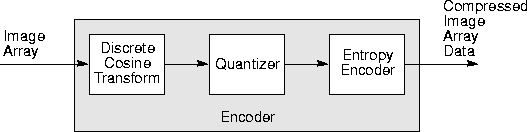

# Writing Image Files                                                   

{:.no_toc}

Dscribes ImageN\'s codec system for writing image data files.

* Contents
{:toc}


## 13.1 Introduction

The JAI codec system supports a variety of image formats for writing
an image to a file or to an `OutputStream` for further manipulation.
For writing an image to a file, the `FileStore` operation (see
[Section 13.2, \"Writing to a File](../encode)\") writes
an image to a specified file in the specified format. For encoding an
image to an `OutputStream`, the `Encode` operation (see [Section 13.3,
\"Writing to an Output Stream](../encode)\") writes an
image to a given `OutputStream` in a specified format using the
encoding parameters supplied via the `ImageEncodeParam` operation
parameter.

## 13.2 Writing to a File

The `FileStore` operation writes an image to a given file in a
specified format using the specified encoding parameters. This
operation is much simpler than the encoders described in the remainder
of this chapter.

The `FileStore` operation takes one rendered source image and three
parameters:

| Parameter | Type | Description |
| --------- | ---- | ----------- |
| filename  | String            | The path of the file to write to. |
| format    | String            | The format of the file. |
| param     | ImageEncodeParam  | The encoding parameters. |

The `filename` parameter must be supplied or the operation will not be
performed. Also, the specified file path must be writable.

The `format` parameter defaults to `tiff` if no value is provided.
[Table 13-1](#table-13-1) lists the recognized JAI file
formats.

***Table 13-1* ImageN Writable File Formats** <a name="table-13-1"></a>

| File Format | Description |
| ----------- | ----------- |
| BMP         | Microsoft Windows bitmap image file |
| JPEG        | A file format developed by the Joint Photographic Experts Group |
| PNG         | Portable Network Graphics |
| PNM         | Portable aNy Map file format. Includes PBM, PGM, and PPM |
| TIFF        | Tag Image File Format |

The `param` parameter must either be null or an instance of an
`ImageEncodeParam` subclass appropriate to the format.

[Listing 13-1](#listing-13-1) shows a code sample
demonstrating the use of both the `Encode` and `FileStore` operations.


## 13.3 Writing to an Output Stream

The `Encode` operation writes an image to a given `OutputStream` in a
specified format using the encoding parameters supplied via the
`ImageEncodeParam` operation parameter.

The `Encode` operation takes one rendered source image and three
parameters:

| Parameter | Type | Description |
| --------- | ---- | ----------- |
| stream    | OutputStream     | The OutputStream to write to. |
| format    | String           | The format of the created file. |
| param     | ImageEncodeParam | The encoding parameters. |

The `param` parameter must either be null or an instance of an
`ImageEncodeParam` subclass appropriate to the specified image format.
The image encode parameter depends on the type of image file to be
encoded. This parameter contains all of the information about the file
type that the encoder needs to create the file. For example, the BMP
format requires two parameter values, as described in the
`BMPEncodeParam` class:

-   Version number - One of three values: `VERSION_2`, `VERSION_3`, or
    `VERSION_4`.

-   Data layout - One of two values: `TOP_DOWN` or `BOTTOM_UP`.

These parameters are described in detail in [Section 13.4, \"Writing
BMP Image Files](#132-writing-bmp-image-files).\"

[Listing 13-1](#listing-13-1) shows a code sample
demonstrating the use of both the `Encode` and `FileStore` operations.

***Listing 13-1*  Writing an OutputStream and a File** <a name="listing-13-1"></a>

``java
// Define the source and destination file names.
String inputFile = /images/FarmHouse.tif
String outputFile = /images/FarmHouse.bmp

// Load the input image.
RenderedOp src = JAI.create("fileload", inputFile);

// Encode the file as a BMP image.
FileOutputStream stream =
    new FileOutputStream(outputFile);
JAI.create("encode", src, stream, BMP, null);

// Store the image in the BMP format.
JAI.create("filestore", src, outputFile, BMP, null);
``

13.4 Writing BMP Image Files
-------------------------------------------------

As described above, the encoding of BMP images requires the
specification of two parameters: version and data layout. By default,
these values are:

-   Version - VERSION\_3


-   Data layout - pixels are stored in bottom-up order

The JAI BMP encoder does not support compression of BMP image files.


### 13.4.1 BMP Version

JAI currently reads and writes Version2, Version3, and some of the
Version 4 images. The BMP version number is read and specified with
`getVersion` and `setVersion` methods in the `BMPEncodeParam` class.
The BMP version parameters are as follows:

| Parameter | Description |
| --------- | ----------- |
| VERSION\_2 | Specifies BMP Version 2 |
| VERSION\_3 | Specifies BMP Version 3 |
| VERSION\_4 | Specifies BMP Version 4 |

If not specifically set, `VERSION_3` is the default version.

**API:** `org.eclipse.imagen.media.codec.BMPEncodeParam`

* `void setVersion(int versionNumber)`
* `int getVersion()`

### 13.4.2 BMP Data Layout

The scan lines in the BMP bitmap are stored from the bottom up. This
means that the first byte in the array represents the pixels in the
lower-left corner of the bitmap, and the last byte represents the
pixels in the upper-right corner.

The in-memory layout of the image data to be encoded is specified with
`getDataLayout` and `setDataLayout` methods in the `BMPEncodeParam`
class.

**API:** `org.eclipse.imagen.media.codec.BMPEncodeParam`

* `void setTopDown(boolean topDown)`
* `sets the data layout to be top down.`

### 13.4.3 Example Code

[Listing 13-2](#listing-13-2) shows a code sample for encoding
a BMP image.

***Listing 13-2*  Encoding a BMP Image** <a name="listing-13-2"></a>

```java
OutputStream os = new FileOutputStream(fileToWriteTo);
BMPEncodeParam param = new BMPEncodeParam();
ImageEncoder enc = ImageCodec.createImageEncoder("BMP", os,
                                                 param);
enc.encode(op);
os.close();
```

## 13.5 Writing JPEG Image Files

The JPEG standard was developed by a working group, known as the Joint
Photographic Experts Group (JPEG). The JPEG image data compression
standard handles grayscale and color images of varying resolution and
size.

JPEG compression identifies and discards \"extra\" data that is beyond
what the human eye can see. Since it discards data, the JPEG
compression algorithm is considered \"lossy.\" This means that once an
image has been compressed and then decompressed, it will not be
identical to the original image. In most cases, the difference between
the original and compressed version of the image is indistinguishable.

An advantage of JPEG compression is the ability to select the quality
when compressing the image. The lower the quality, the smaller the
image file size, but the more different it will appear than the
original.

[Table 13-2](#table-13-2) lists the JPEG encode parameters
that may be set and the default values. The remaining sections
describe these settings and how to change them.


***Table 13-2*  JPEG Encode Parameters** <a name="table-13-2"></a>


| Parameter | Description | Default Value |
| --------- | ----------- | ------------- |
| writeJFIFHeader | Controls whether the encoder writes a JFIF header using the APP0 marker. See [Section 13.5.1, \"JFIF Header]#1351=jfif-header).\" | True |
| qTabSlot\[0\],\[1\],\[2\] | Quantization tables. See [Section 13.5.3, \"Quantization Table](#1352-quantization-table).\" | 0 for Y channel, 1 for Cb and Cr channels |
| qTab\[0\],\[1\],\[2\] | Quantization table contents. See [Section 13.5.3, \"Quantization Table](#1353-quantization-table).\" | Null for all three channels |
| qTabSet\[0\],\[1\],\[2\] | Quantization table usage. See [Section 13.5.3, \"Quantization Table](#1353-quantization-table).\"\ | False for all three channels |
| hSamp\[0\],\[1\],\[2\] | Horizontal subsampling. See [Section 13.5.4, \"Horizontal and Vertical Subsampling](#1354-horizontal-and-vertical-subsampling).\" | 1 for Y channel, 2 for Cb and Cr channels |
| vSamp\[0\],\[1\],\[2\] | Vertical subsampling. See [Section 13.5.4, \"Horizontal and Vertical Subsampling](#1354-horizontal-and-vertical-subsampling).\" | 1 for Y channel, 2 for Cb and Cr channels |
| qual | Quality setting. See [Section 13.5.5, \"Compression Quality](#1355-compression-quality).\" | 0.75F |
| rstInterval | Restart interval. See [Section 13.5.6, \"RestartlInterval](#1356-restart-interva;).\" | 0 |
| writeImageOnly | Controls whether encoder writes only the compressed image data. See  [Section 13.5.7, \"Writing an Abbreviated JPEG Stream](#1357-writing-an-abbreviated-jpeg-stream).\" | False |

### 13.5.1 JFIF Header

The JPEG File Interchange Format (JFIF) is a minimal file format that
enables JPEG bitstreams to be exchanged between a wide variety of
platforms and applications. This minimal format does not include any
of the advanced features found in the TIFF JPEG specification or any
application-specific file format. The sole purpose of this simplified
format is to allow the exchange of JPEG compressed images.

The JFIF features are:

-   Uses the JPEG baseline image compression algorithm

-   Uses JPEG interchange format compressed image representation

-   Compatible with most platforms (PC, Mac, or Unix)

-   Standard color space: one or three components. For three
    components, YC~b~C~r~ (CCIR 601-256 levels)

An APP0 marker is used to identify a JFIF file. The marker provides
information that is missing from the JPEG stream, such as version
number, *x* and *y* pixel density (dots per inch or dots per cm.),
pixel aspect ratio (derived from *x* and *y* pixel density), and
thumbnail. The `setWriteJFIFHeader` method controls whether the
encoder writes a JFIF header using the APP0 marker.``

**API:** `org.eclipse.imagen.media.codec.JPEGEncodeParam`

* `void setWriteJFIFHeader(boolean writeJFIF)`

### 13.5.2 JPEG DCT Compression Parameters

JAI uses the JPEG baseline DCT coding process, shown in [Figure
13-1](#figure-13-1).

<a name="figure-13-1"></a>

------------------------------------------------------------------------



------------------------------------------------------------------------

***Figure 13-1*  JPEG Baseline DCT Coding**

For encoding, the image array is divided into 8 x 8 pixel blocks and a
discrete cosine transform (DCT) is taken of each block, resulting in
an 8 x 8array of transform coefficients. The DCT is a mathematical
operation that takes the block of image samples as its input and
converts the information from the spatial domain to the frequency
domain. The 8 x 8 matrix input to the DCT represents brightness levels
at specific *x*, *y* coordinates. The resulting 8 x 8 matrix values
represent relative amounts of 64 spatial frequencies that make up the
spectrum of the input data.

The next stage in the encoder quantizes the transform coefficients by
dividing each DCT coefficient by a value from a quantization table.
The quantization operation discards the smaller-valued frequency
components, leaving only the larger-valued components.

After an image block has been quantized, it enters the entropy
encoder, which creates the actual JPEG bitstream. The entropy encoder
assigns a binary Huffman code to coefficient values. The length of
each code is chosen to be inversely proportional to the expected
probability of occurrence of a coefficient amplitude -
frequently-occurring coefficient values get short code words,
seldom-occurring coefficient values get long code words. The entropy
encoder uses two tables, one for the AC frequency components and one
for the DC frequency components.

The JPEG decoding process is essentially the inverse of the encoding
process. The compressed image array data stream passes through the
entropy encoder, which recreates the quantized coefficient values.
Then, the quantized coefficients are reconstructed by multiplication
with the quantizer table values. Finally, an inverse DCT is performed
and the reconstructed image array is produced.

The following are the parameters that may be specified for JPEG DCT
compression.


### 13.5.3 Quantization Table

The `setQTable` and `getQTable` methods are used to specify and
retrieve the quantization table that will be used in encoding a
particular band of the image. There are, by default, two quantizer
tables:

| Table | Band |
| ----- | ---- |
| 0     | Band 0 |
| 1     | All other bands |

The parameter `tableNum` is usually a value between 0 and 3. This
value indicates which of four quantization tables you are specifying.
Table 0 is designed to be used with the luminance band of eight-bit
YCC images. Table 1 is designed to be used with the chrominance bands
of eight-bit YCC images. The two tables can also be set individually
using the `setLumaQTable` (table 0) and `setChromaQTable` (table 1)
methods. Tables 2 and 3 are not normally used.

**API:** `org.eclipse.imagen.media.codec.JPEGEncodeParam`

* `void setQTable(int component, int tableNum, int[] qTable)`

* `int[] getQTable(int component)`

* `void setLumaQTable(int[] qTable)`

* `void setChromaQTable(int[] qTable)`

* `int getQTableSlot(int component)`

### 13.5.4 Horizontal and Vertical Subsampling

JPEG allows the image components to be subsampled to reduce their
resolution prior to encoding. This is typically done with YCC images,
where the two chroma components can be subsampled, usually by a factor
of two in both axes. This is possible due to the human visual
system\'s low sensitivity to color images relative to luminance (Y)
errors By default, the sampling factors for YCC input images are set
to {1, 2, 2} for both horizontal and vertical axes.

**API:** `org.eclipse.imagen.media.codec.JPEGEncodeParam`

* `void setHorizontalSubsampling(int component, int subsample)`
* `void setVerticalSubsampling(int component, int subsample)`
* `int getHorizontalSubsampling(int component)`
* `int getVerticalSubsampling(int component)`

### 13.5.5 Compression Quality

Compression quality specifies a factor that relates to the desired
tradeoff between image quality and the image data compression ratio.
The quality value is a `float` between 0.0 and 1.0. A setting of 1.0
produces the highest quality image at a lower compression ratio. A
setting of 0.0 produces the highest compression ratio, with a
sacrifice to image quality. The quality value is typically set to
0.75.

The compression quality value controls image quality and compression
ratio by determining a scale factor the encoder will use in creating
scaled versions of the quantization tables. Some guidelines:

| Quality Value | Meaning |
| ------------- | ------- |
| 1.0           | Highest quality, no compression |
| 0.75          | High quality, good compression ratio |
| 0.5           | Medium quality, medium compression ratio |
| 0.25          | Low quality, high compression ratio |


**Note:** The values stored in the quantization table also affect
image quality and compression ratio. See also [Section 13.5.3,
\"Quantization Table](#1353-quantization-table).\"

**API:** `org.eclipse.imagen.media.codec.JPEGEncodeParam`

* `void setQuality(float quality)`
* `float getQuality()`
* `boolean isQualitySet()`

### 13.5.6 Restart Interval

JPEG images use restart markers to define multiple strips or tiles.
The restart markers are inserted periodically into the image data to
delineate image segments known as *restart intervals*. To limit the
effect of bitstream errors to a single restart interval, JAI provides
methods to set the restart interval in JPEG Minimum Coded Units
(MCUs). The default is zero (no restart interval markers).

**API:** `org.eclipse.imagen.media.codec.JPEGEncodeParam`

* `void setRestartInterval(int restartInterval)`
* `int getRestartInterval()`

### 13.5.7 Writing an Abbreviated JPEG Stream

Normally, both the JPEG table data and compressed (or uncompressed)
image data is written to the output stream. However, it is possible to
write just the table data or just the image data. The
`setWriteTablesOnly` method instructs the encoder to write only the
table data to the output stream. The `setWriteImageOnly` method
instructs the encoder to write only the compressed image data to the
output stream.

**API:** `org.eclipse.imagen.media.codec.JPEGEncodeParam`

* `void setWriteTablesOnly(boolean tablesOnly)`
* `void setWriteImageOnly(boolean imageOnly)`

### 13.5.8 Example Code

[Listing 13-3](#listing-13-3) shows a code sample for encoding
a JPEG image.

***Listing 13-3*  Encoding a JPEG Image** <a name="listing-13-3"></a>

```java

```

13.6 Writing PNG Image Files
-------------------------------------------------

The Portable Network Graphics (PNG) format is a file standard for
compressed lossless bitmapped image files. A PNG file consists of an
eight-byte PNG *signature* followed by several *chunks*. The signature
identifies the file as a PNG file. The chunks provide additional
information about the image. The JAI codec architecture supports PNG
1.1 and provides control over several of the chunks as described in
this section.


### 13.6.1 PNG Image Layout

PNG images can be encoded in one of three pixel types, as defined by
the subclass of `PNGEncodeParam`, as follows:

| Pixel Type | Description |
| ---------- | ----------- |
| PNGEncodeParam.Palette | Also known as *indexed-color*, where each pixel is represented by a single sample that is an index into a supplied color palette. The org.eclipse.imagen.media.codec.PNGEncodeParam.Palette class supports the encoding of palette pixel images. |
| PNGEncodeParam.Gray | Each pixel is represented by a single sample that is a grayscale level. The org.eclipse.imagen.media.codec.PNGEncodeParam.Gray class supports the encoding of grayscale pixel images. |
| PNGEncodeParam.RGB | Also known as *truecolor*, where each pixel is represented by three samples: red, green, and blue. The org.eclipse.imagen.media.codec.PNGEncodeParam.RGB class supports the encoding of RGB pixel images. |

Optionally, grayscale and RGB pixels can also include an alpha sample
(see [Section 13.6.6.12, \"Transparency (tRNS
Chunk)](#136612-transparency)\").

A call to the `getDefaultEncodeParam` method returns an instance of:

- `PNGEncodeParam.Palette` for an image with an `IndexColorModel`.
- `PNGEncodeParam.Gray` for an image with only one or two bands.
- `PNGEncodeParam.RGB` for all other images.

This method provides no guarantee that the image can be successfully
encoded by the PNG encoder, since the encoder only performs a
superficial analysis of the image structure.

**API:** `org.eclipse.imagen.media.codec.PNGEncodeParam`

* `static PNGEncodeParam getDefaultEncodeParam(RenderedImage im)`

### 13.6.2 PNG Filtering

The PNG file definition allows the image data to be filtered before it
is compressed, which can improve the compressibility of the data. PNG
encoding supports five filtering algorithms, including \"none,\" which
indicates no filtering. The filtering algorithms are described below.

**[*Table 13-3* PNG Filtering Algorithms** <a name="table-13-3"></a>

| Parameter | Description |
| --------- | ----------- |
| PNG\_FILTER\_NONE | No filtering - the scanline is transmitted unaltered. |
| PNG\_FILTER\_SUB  | The filter transmits the difference between each byte and the value of the corresponding byte of the prior pixel. |
| PNG\_FILTER\_UP | Similar to the Sub filter, except that the pixel immediately above the current pixel, rather than just to its left, is used as the predictor. |
| PNG\_FILTER\_AVERAGE | The filter uses the average of the two neighboring pixels (left and above) to predict the value of a pixel. |
| PNG\_FILTER\_PAETH | The filter computes a simple linear function of the three neighboring pixels (left, above, upper left), then chooses as predictor the neighboring pixel closest to the computed value. |

The filtering can be different for each row of an image by using the
`filterRow` method. The method can be overridden to provide a custom
algorithm for choosing the filter type for a given row.

The `filterRow` method is supplied with the current and previous rows
of the image. For the first row of the image, or of an interlacing
pass, the previous row array will be filled with zeros as required by
the PNG specification.

The method is also supplied with five scratch arrays. These arrays may
be used within the method for any purpose. At method exit, the array
at the index given by the return value of the method should contain
the filtered data. The return value will also be used as the filter
type.

The default implementation of the method performs a trial encoding
with each of the filter types, and computes the sum of absolute values
of the differences between the raw bytes of the current row and the
predicted values. The index of the filter producing the smallest
result is returned.

As an example, to perform only \"sub\" filtering, this method could be
implemented (non-optimally) as follows:

```java
for (int i = bytesPerPixel; i < bytesPerRow + bytesPerPixel; i++)
{
     int curr = currRow[i] & 0xff;
     int left = currRow[i - bytesPerPixel] & 0xff;
     scratchRow[PNG_FILTER_SUB][i] = (byte)(curr - left);
}
return PNG_FILTER_SUB;
```

**API:** `org.eclipse.imagen.media.codec.PNGEncodeParam`

* `int filterRow(byte[] currRow, byte[] prevRow, 
           byte[][]  scratchRows, int bytesPerRow, int bytesPerPixel)`

### 13.6.3 Bit Depth

The PNG specification identifies the following bit depth restrictions
for each of the color types:

***Table 13-4* PNG Bit Depth Restrictions** <a name="table-13-4"></a>

| Color Type | Allowed Bit Depths | Description |
| ---------- | ------------------ | ----------- |
| 0          | 1, 2, 4, 8, 16     | Grayscale. Each pixel is a grayscale sample.
| 2          | 8, 16              | Truecolor (RGB) without alpha. Each pixel is an RGB triple. |
| 3          | 1, 2, 4, 8         | Indexed color (Palette). Each pixel is a palette index. |
| 4          | 8, 16              | Grayscale with alpha. Each pixel is a grayscale sample followed by an alpha sample. |
| 6          | 8, 16              | Truecolor (RGB) with alpha. Each pixel is an RGB triple followed by an alpha sample. |

The bit depth is specified by the `setBithDepth` method in the class
type.

**API:** `org.eclipse.imagen.media.codec.PNGEncodeParam.Palette`

* `void setBitDepth(int bitDepth)`

**API:** `org.eclipse.imagen.media.codec.PNGEncodeParam.Gray`

* `public void setBitDepth(int bitDepth)`

**API:** `org.eclipse.imagen.media.codec.PNGEncodeParam.RGB`

* `void setBitDepth(int bitDepth)`

### 13.6.4 Interlaced Data Order

The interlaced data order indicates the transmission order of the
image data. Two settings are currently allowed: no interlace and Adam7
interlace. With interlacing turned off, pixels are stored sequentially
from left to right, and scanlines sequentially from top to bottom.
Adam7 interlacing (named after its author, Adam M. Costello), consists
of seven distinct passes over the image; each pass transmits a subset
of the pixels in the image.

**API:** `org.eclipse.imagen.media.codec.PNGEncodeParam`

* `void setInterlacing(boolean useInterlacing)`
* `boolean getInterlacing()`


### 13.6.5 PLTE Chunk for Palette Images

The PLTE chunk provides the palette information palette or
indexed-color images. The PLTE chunk must be supplied for all palette
(color type 3) images and is optional for RGB (color type 2 and 6)
images.

The PLTE chunk contains from 1 to 256 palette entries, each a
three-byte series of the alternating red, green, and blue values, as
follows:

-   Red: one byte (0 = black, 255 = red)
-   Green: one byte (0 = black, 255 = green)
-   Blue: one byte (0 = black, 255 = blue)

The number of elements in the palette must be a multiple of 3, between
3 and 768 (3 x 256). The first entry in the palette is referenced by
pixel value 0, the second by pixel value 1, and so on.

For RGB (color type 2 and 6) images, the PLTE chunk, if included,
provides a suggested set of from 1 to 256 colors to which the RGB
image can be quantized in case the viewing system cannot display RGB
directly.

**API:** `org.eclipse.imagen.media.codec.PNGEncodeParam`

* `void setPalette(int[] rgb)`
* `int[] getPalette()`
* `void unsetPalette()`
* `boolean isPaletteSet()`

### 13.6.6 Ancillary Chunk Specifications

All ancillary PNG chunks are optional but are recommended. Most of the
PNG chunks can be specified prior to encoding the image by `set`
methods in the `PNGEncodeParam` class. The chunks that can be set and
the methods used to set them are described in the following
paragraphs.


#### 13.6.6.1 Background Color (bKGD Chunk)

Methods are provided to set and read the suggested background color,
which is encoded by the bKGD chunk.

For Palette (indexed color) images, the bKGD chunk contains a single
value, which is the palette index of the color to be used as the
background.

For Grayscale images, the bKGD chunk contains a single value, which is
the gray level to be used as the background. The range of values is 0
to 2^bitdepth^ - 1.

For RGB (truecolor) images, the bKGD chunk contains three values, one
each for red, green, and blue. Each value has the range of 0 to
2^bitdepth^ - 1.

**API:** `org.eclipse.imagen.media.codec.PNGEncodeParam.Palette`

* `void setBackgroundPaletteIndex(int index)`
* `int getBackgroundPaletteIndex()`

**API:** `org.eclipse.imagen.media.codec.PNGEncodeParam.Gray`

* `void setBackgroundGray(int gray)`
* `int getBackgroundGray()`

**API:** `org.eclipse.imagen.media.codec.PNGEncodeParam.RGB`

* `void setBackgroundRGB(int[] rgb)`

* `int[] getBackgroundRGB()`

#### 13.6.6.2 Chromaticity (cHRM Chunk)

Applications that need device-independent specification of colors in a
PNG file can specify the 1931 CIE (*x*,*y*) chromaticities of the red,
green, and blue primaries used in the image, and the referenced white
point.

The chromaticity parameter should be a `float` array of length 8
containing the white point *X* and *Y*, red *X* and *Y*, green *X* and
*Y*, and blue *X* and *Y* values in order.

**API:** `org.eclipse.imagen.media.codec.PNGEncodeParam`

* `void setChromaticity(float[] chromaticity)`

* `void setChromaticity(float whitePointX, float whitePointY, 
           float redX, float redY, float greenX, float greenY, 
           float  blueX, float blueY)`

* `float[] getChromaticity()`

#### 13.6.6.3 Gamma Correction (gAMA Chunk)

The gamma value specifies the relationship between the image samples
and the desired display output intensity as a power function:

   sample = light\_out ^gamma^

If the image\'s gamma value is unknown, the gAMA chunk should be
suppressed. The absence of the gAMA chunk indicates that the gamma is
unknown.

**API:** `org.eclipse.imagen.media.codec.PNGEncodeParam`

* `void setGamma(float gamma)`
* `float getGamma()`
* `void unsetGamma()`

#### 13.6.6.4 Palette Histogram (hIST Chunk)

The palette histogram is a value that gives the approximate usage
frequency of each color in the color palette. If the viewer is unable
to provide all the colors listed in the palette, the histogram may
help decide how to choose a subset of colors for display. The hIST
chunk is only valid with Palette images.

**API:** `org.eclipse.imagen.media.codec.PNGEncodeParam.Palette`

* `void setPaletteHistogram(int[] paletteHistogram)`

* `int[] getPaletteHistogram()`

* `void unsetPaletteHistogram()`

#### 13.6.6.5 Embedded ICC Profile Data (iCCP Chunk)

You can specify that RGB image samples conform to the color space
presented by the embedded International Color Consortium profile. The
color space of the ICC profile must be an RGB color space.

**API:** `org.eclipse.imagen.media.codec.PNGEncodeParam`

* void setICCProfileData(byte[] ICCProfileData)

* `byte[] getICCProfileData()`

* `void unsetICCProfileData()`

#### 13.6.6.6 Physical Pixel Dimensions (pHYS Chunk)

The intended pixel size or aspect ratio for display of the image may
be specified in the pHYS chunk. The physical pixel dimensions
information is presented as three integer values:

-   Pixels per unit, *x* axis

-   Pixels per unit, *y* axis

-   Unit specifier

The unit specifier may have one of two values:

:   0 = Unit is unknown\
    1 = Unit is meters

When the unit specifier is 0, the pHYS chunk defines pixel aspect
ratio only; the actual size of the pixels remains unspecified.

**API:** `org.eclipse.imagen.media.codec.PNGEncodeParam`

* `void setPhysicalDimension(int[] physicalDimension)`

* `void setPhysicalDimension(int xPixelsPerUnit, 
           int  yPixelsPerUnit, int unitSpecifier)`

* `int[] getPhysicalDimension()`

#### 13.6.6.7 Significant Bits (sBIT Chunk)

For PNG data that has been converted from a lower sample depth, the
significant bits information in the sBIT chunk stores the number of
significant bits in the original image. This value allows decoders to
recover the original data losslessly, even if the data had a sample
depth not directly supported by PNG.

The number of entries in the `significantBits` array must be equal to
the number of output bands in the image:

-   1 - for a grayscale image


-   2 - for a grayscale image with alpha


-   3 - for palette or RGB images


-   4 - for RGB images with alpha

**API:** `org.eclipse.imagen.media.codec.PNGEncodeParam.RGB`

* `void setSignificantBits(int[] significantBits)`
* `int[] getSignificantBits()`
* `void unsetSignificantBits()`

#### 13.6.6.8 Suggested Palette (sPLT Chunk)

A suggested palette may be specified when the display device is not
capable of displaying the full range of colors in the image. This
palette provides a recommended set of colors, with alpha and frequency
information, that can be used to construct a reduced palette to which
the image can be quantized.

The suggested palette, as defined by the `PNGSuggestedPaletteEntry`
class, consists of the following:

-   A palette name - a String that provides a convenient name for
    referring to the palette

-   A `sampleDepth` parameter - must be either 8 or 16

-   Red sample

-   Green sample

-   Blue sample

-   Alpha sample

-   Frequency - the value is proportional to the fraction of pixels in
    the image that are closest to that palette entry in RGBA space,
    before the image has been composited against any background

**API:** `org.eclipse.imagen.media.codec.PNGEncodeParam.Palette`

* `void setSuggestedPalette(PNGSuggestedPaletteEntry[] palette)`

* `PNGSuggestedPaletteEntry[] getSuggestedPalette()`

* `void unsetSuggestedPalette()`

#### 13.6.6.9 PNG Rendering Intent (sRGB Chunk)

If the PNG image includes an sRGB chunk, the image samples confirm to
the sRGB color space and should be displayed using the specified
rendering \"intent.\" The rendering intent specifies tradeoffs in
colorimetric accuracy. There are four rendering intents:

***Table 13-5* PNG Rendering Intent** <a name="table-13-5"></a>

| Parameter | Description |
| --------- | ----------- |
| INTENT\_PERCEPTUAL | The \"perceptual\" intent is for images that prefer good adaptation to the output device gamut at the expense of colorimetric accuracy, such as photographs. |
| INTENT\_RELATIVE | The \"relative colorimetric\" intent is for images that require color appearance matching. |
| INTENT\_SATURATION | The \"saturation\" intent is for images that prefer preservation of saturation at the expense of hue and lightness. |
| INTENT\_ABSOLUTE | The \"absolute colorimetric\" intent is for images that require absolute colorimetry. |

**API:** `org.eclipse.imagen.media.codec.PNGEncodeParam.RGB`

* `void setSRGBIntent(int SRGBIntent)`

* `int getSRGBIntent()`

* `void unsetSRGBIntent()`

#### 13.6.6.10 Textual Data (tEXt Chunk)

Textual data can be encoded along with the image in the tEXt chunk.
The information stored in this chunk can be an image description or
copyright notice. A keyword indicates what the text string contains.
The following keywords are defined:


`Title`
: A title or caption for the image

`Author`
: The name of the image\'s creator

`Description`
: A description of the image

`Copyright`
: A copyright notice

`Creation Time`
: The time the original image was created

`Software`
: The software used to create the image

`Disclaimer`
: A legal disclaimer

`Warning`
: A warning of the nature of the image content

`Source`
: The hardware device used to create the image

`Comment`
: Miscellaneous information

**API:** `org.eclipse.imagen.media.codec.PNGEncodeParam`

* `void setText(String[] text)`

* `String[] getText()`

* `void unsetText()`

#### 13.6.6.11 Image Modification Timestamp (tIME Chunk)

The tIME chunk provides information on the last time the image was
modified. The tIME information is a `Date` and the internal storage
format uses UTC regardless of how the `modificationTime` parameter was
created.

**API:** `org.eclipse.imagen.media.codec.PNGEncodeParam`

* `void setModificationTime(Date modificationTime)`
* `Date getModificationTime()`
* `void unsetModificationTime()`

#### 13.6.6.12 Transparency (tRNS Chunk)

The tRNS chunk specifies that the image uses simple transparency.
Simple transparency means either alpha values associated with palette
entries for Palette images, or a single transparent color, for
Grayscale and RGB images.

For Palette images, the tRNS chunk should contain a series of one-byte
alpha values, one for each RGB triple in the palette. Each entry
indicates that pixels of the corresponding palette index must be
treated as having the specified alpha value.

For grayscale images, the tRNS chunk should contain a single gray
level value, stored as an int. Pixels of the specified gray value are
treated as transparent. If the grayscale image has an alpha value,
setting the gray level causes the image\'s alpha channel to be
ignored.

For RGB images, the tRNS chunk should an RGB color value, stored as an
int. Pixels of the specified gray value are treated as transparent. If
the RGB image has an alpha value, setting the gray level causes the
image\'s alpha channel to be ignored.

**API:** `org.eclipse.imagen.media.codec.PNGEncodeParam.Palette`

* `void setPaletteTransparency(byte[] alpha)`

* `byte[] getPaletteTransparency()`

* `returns the alpha values associated with each palette entry.`

**API:** `org.eclipse.imagen.media.codec.PNGEncodeParam.Gray`

* `void setTransparentGray(int transparentGray)`

* `int getTransparentGray()`

**API:** `org.eclipse.imagen.media.codec.PNGEncodeParam.RGB`

* `void setTransparentRGB(int[] transparentRGB)`

* `int[] getTransparentRGB()`

#### 13.6.6.13 Compressed Text Data (zTXt Chunk)

Text data may be stored in the zTXt chunk, in addition to the text in
the tEXt chunk. The zTXt chunk is intended for storing large blocks of
text, since the text is compressed.

**API:** `org.eclipse.imagen.media.codec.PNGEncodeParam`

* `void setCompressedText(String[] text)`

* `String[] getCompressedText()`

* `void unsetCompressedText()`

#### 13.6.6.14 Private Chunks

Private chunks may be added to the output file. These private chunks
carry information that is not understood by most other applications.
Private chunks should be given names with lowercase second letters to
ensure that they do not conflict with any future public chunk
information. See the PNG specification for more information on chunk
naming conventions.

**API:** `org.eclipse.imagen.media.codec.PNGEncodeParam`

* `synchronized void addPrivateChunk(String type, byte[] data)`

* `synchronized int getNumPrivateChunks()`

* `synchronized String getPrivateChunkType(int index)`

* `synchronized void removeUnsafeToCopyPrivateChunks()`

* `synchronized void removeAllPrivateChunks()`

13.7 Writing PNM Image Files
-------------------------------------------------

The PNM format is one of the extensions of the PBM file format (PBM,
PGM, and PPM). The portable bitmap format is a
lowest-common-denominator monochrome file format. It was originally
designed to make it reasonable to mail bitmaps between different types
of machines. It now serves as the common language of a large family of
bitmap conversion filters.

The PNM format comes in six variants:

-   PBM ASCII - three-banded images

-   PBM raw - three-banded images

-   PGM ASCII - single-banded images

-   PGM raw - single-banded images

-   PPM ASCII - single-banded images

-   PPM raw - single-banded images

The parameter values, then are `RAW` and `ASCII`.

[Listing 13-4](#listing-13-4) shows a code sample for encoding
a PNM image.

***Listing 13-4*  Encoding a PNM Image** <a name="listing-13-4"><a/>

```java
// Create the OutputStream.
OutputStream out = new FileOutputStream(fileToWriteTo);

// Create the ParameterBlock.
PNMEncodeParam param = new PNMEncodeParam();
param.setRaw(true.equals("raw"));

//Create the PNM image encoder.
ImageEncoder encoder = ImageCodec.createImageEncoder("PNM",
                                                      out,
                                                      param);
```

**API:** `org.eclipse.imagen.media.codec.PNMEncodeParam`

* `void setRaw(boolean raw)`

* `boolean getRaw()`


## 13.8 Writing TIFF Image Files

The TIFF file format is a tag-based file format for storing and
interchanging raster images. TIFF files typically come from scanners,
frame grabbers, and paint- or photo-retouching programs.

By default, TIFF images in JAI are encoded without any compression and
are written out in strips rather than tiles. However, JAI does support
image compression, and the writing of tiled TIFF images.

### 13.8.1 TIFF Compression

JAI currently does not support compression of TIFF images.

### 13.8.2 TIFF Tiled Images

By default, the JAI encoder organizes TIFF images into strips. For
low- to medium-resolution images, this is adequate. However, for
high-resolution (large) images, the images can be accessed more
efficiently if the image is divided into roughly square tiles instead
of strips.

Writing of tiled TIFF images can be enabled by calling the
`setWriteTiled` method.

**API:** `org.eclipse.imagen.media.codec.TIFFEncodeParam`

* `void setWriteTiled(boolean writeTiled)`

* `boolean getWriteTiled()`
