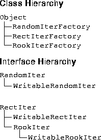
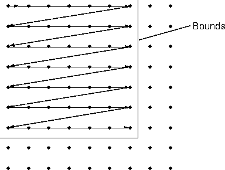
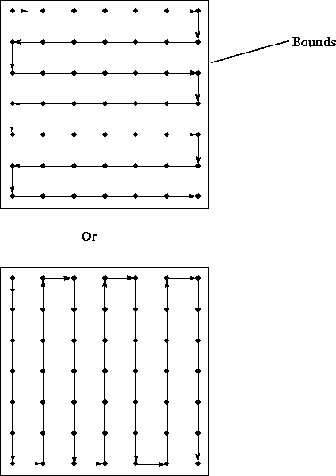

# Extending the API                                                     
{:.no_toc}

Describes how the ImageN API may be extended.

* Contents
{:toc}

## 14.1 Introduction

No image processing API can hope to capture the enormous variety of
operations that can be performed on a digital image. Although the ImageN
API supports a large number of imaging operations, it was designed
from the beginning to encourage programmers to write extensions rather
than manipulating image data directly. ImageN allows virtually *any*
image processing algorithm to be added to the API and used as if it
were a native part of the API.

The mechanism for adding functionality to the API can be presented at
multiple levels of encapsulation and complexity. This allows
programmers who wish to add simple things to the API to deal with
simple concepts, while more complex extensions have complete control
over their environment at the lowest levels of abstraction. The API
also supports a variety of programming styles, including an immediate
mode and a deferred mode of execution for different types of imaging
applications.


## 14.2 Package Naming Convention

All extensions to ImageN require the addition of new classes. All new
classes are grouped into packages as a convenient means of organizing
the new classes and separating the new classes from code libraries
provided by others.

All new packages are given a *product name*. A product name is the
accepted Java method of using your company\'s reversed Internet
address to name new packages. This product naming convention helps to
guarantee the uniqueness of package names. Supposing that your
company\'s Internet address is `WebStuff.COM` and you wish to create a
new package named `prewitt`. A good choice of package name would be

`com.webstuff.prewitt`

Or, to uniquely identify the package as part of ImageN.

`com.webstuff.imagen.prewitt`

The above new `prewitt` class files must now be placed into a
subdirectory that matches the product name, such as:

`com/webstuff/imagen/prewitt` *for Linux-based systems*

 or

`com\webstuff\imagen\prewithh` *for Windows systems*

The Java convention for class naming is to use initial caps for the
name, for multi-word class names use initial caps for each word. For example `AddOpImage`.

Vendors are encouraged to use unique product names (by means of the
Java programming language convention of reversed internet addresses)
to maximize the likelihood of a clean installation.

## 14.3 Writing New Operators

To extend the ImageN API by creating new operations, you will need to
write a new `OpImage` subclass. This may be done by subclassing one or
more existing utility classes to automate some of the details of the
operator you wish to implement. For most operators, you need only
supply a routine that is capable of producing an arbitrary rectangle
of output, given contiguous source data.

Once created, new operators may be made available to users
transparently and without user source code changes using the ImageN
registry mechanism. Existing applications may be tuned for new
hardware platforms by strategic insertion of new implementations of
existing operators.

To create a new operator, you need to create the following new
classes:

- A class that extends the `OpImage` class or any of its subclasses.
  This new class does the actual processing. See [Section 14.3.1,
  \"Extending the OpImage Class](#opimage).\"


-   A class that extends the `OperationDescriptor` class. This new
    class describes the operation such as name, parameter list, and so
    on. See [Section 14.3.2, \"Extending the OperationDescriptor
    Interface](#operationdescriptor).\"

-   If the operator will function in the Rendered mode only, a class
    that implements `java.awt.image.renderable.RenderedImageFactory`.

### 14.3.1 Extending the OpImage Class <a name="opimage"></a>

Every new operator being written must be a subclass of `OpImage` or
one of its subclasses. The `OpImage` class currently has the following
subclasses:

***Table 14-1* OpImage Subclasses** <a name="table-14-1"></a>

| Class | Description |
| ----- | ----------- |
| AreaOpImage | An abstract base class for image operators that require only a fixed rectangular source region around a source pixel in order to compute each destination pixel. |
| NullOpImage | Extends: PointOpImage <br/>A trivial OpImage subclass that simply transmits its source unchanged. Potentially useful when an interface requires an OpImage but another sort of RenderedImage (such as a TiledImage) is to be used. |
| PointOpImage | An abstract base class for image operators that require only a single source pixel in order to compute each destination pixel. |
| ScaleOpImage | Extends: WarpOpImage <br/> An abstract base class for scale-like operations that require rectilinear backwards mapping and padding by the resampling filter dimensions. |
| SourcelessOpImage | An abstract base class for image operators that have no image sources. |
| StatisticsOpImage | An abstract base class for image operators that compute statistics on a given region of an image, and with a given sampling rate. |
| UntiledOpImage | A general class for single-source operations in which the values of all pixels in the source image contribute to the value of each pixel in the destination image. |
| WarpOpImage | A general implementation of image warping, and a superclass for other geometric image operations. |

All abstract methods defined in `OpImage` must be implemented by any
new `OpImage` subclass. Specifically, there are two fundamental
methods that must be implemented:

| Method | Description |
| ------ | ----------- |
| getTile | Gets a tile for reading. This method is called by the object that has the new operator name as its source with a rectangle as its parameter. The operation is responsible for returning a rectangle filled in with the correct values. |
| computeRect | Computes a rectangle of output, given Raster sources. The method is called by getTile to do the actual computation. The extension must override this method. |

First, you have to decide which of the `OpImage` subclasses to extend.
To write a new statistics operation, you would most likely extend the
`StatisticsOpImage` class. Each subclass has a specific purpose, as
described in [Table 14-1](../extension).

### 14.3.2 Extending the OperationDescriptor Interface <a name="operationdescriptor"></a>

Operations that are to be created using one of the `JAI.create`
methods must be defined in the `registryFile`, which is included in
the `jai_core.jar`. Each operation has an OperationDescriptor (denoted
as \"`odesc`\" in the `registryFile`), which provides a textual
description of the operation and specifies the number and type of its
sources and parameters. The OperationDescriptor also specifies whether
the operation supports rendered mode, renderable mode, or both.

[Listing 14-1](#listing-14-1) shows a sample of the
`registryFile` contents. Note that this is not the entire
`registryFile`, only a small sample showing two operators (absolute
and addconst).

***Listing 14-1* registryFile Example** <a name="listing-14-1"></a>

```
odesc   org.eclipse.imagen.operator.AbsoluteDescriptor     absolute
odesc   org.eclipse.imagen.operator.AddConstDescriptor     addconst

rif org.eclipse.imagen.media.opimage.AbsoluteCRIF
               org.eclipse.imagen.media   absolute   sunabsoluterif
rif org.eclipse.imagen.media.mlib.MlibAbsoluteRIF
               org.eclipse.imagen.media   absolute   mlibabsoluterif
rif org.eclipse.imagen.media.opimage.AddConstCRIF
               org.eclipse.imagen.media   addconst   sunaddconstrif
rif org.eclipse.imagen.media.mlib.MlibAddConstRIF
               org.eclipse.imagen.media   addconst   mlibaddconstrif

crif    org.eclipse.imagen.media.opimage.AbsoluteCRIF      absolute
crif    org.eclipse.imagen.media.opimage.AddConstCRIF      addconst
```

All high-level operation names in ImageN (such as `Rotate`, `Convolve`,
and `AddConst`) are mapped to instances of `RenderedImageFactory`
(RIF) and/or `ContextualRenderedImageFactory` (CRIF) that are capable
of instantiating `OpImage` chains to perform the named operation. The
RIF is for rendered mode operations only; the CRIF is for operations
that can handle renderable mode or both rendered and renderable modes.

To avoid the problems associated with directly editing the
`registryFile` and then repackaging it, you can register
OperationDescriptors and RIFs and CRIFs using the OperationRegistry\'s
`registerOperationDescription`, and `registerRIF` and `registerCRIF`
methods. The only drawback to this method of registration is that the
new operator will not be automatically reloaded every time a JAI
program is executed., since the operation is not actually present in
the `registryFile`. This means that to use the new operation, the
operation will always have to be invoked beforehand.``

To temporarily register a new operation:

1. **Register the operation name**.

   The high-level operation name, called an *operation descriptor*,
   is registered by calling the `registerOperationByName()` method or
   the `registerOperationDescriptor()` method. The operation
   descriptor name must be unique.
    
   Once an operation descriptor is registered, it may be obtained by
  name by calling the `getOperationDescriptor()` method.

2. **Register the set of rendered image factory objects.**

   The rendered image factory (RIF) is registered using the
   `registerRIF` method. Each RIF is registered with a specific
   operation name and is given a product name. Similar methods exist
   for registering a contextual image factory (CRIF).

The `OperationDescriptor` interface provides a comprehensive
description of a specific image operation. All of the information
regarding the operation, such as the operation name, version, input,
and property, should be listed. Any conditions placed on the
operation, such as its input format and legal parameter range, should
also be included, and the methods to enforce these conditions should
be implemented. A set of `PropertyGenerator`s may be specified to be
used as a basis for the operation\'s property management.

Each family of the image operation in ImageN must have a descriptor that
implements this interface. The following basic resource data must be
provided:

-   GlobalName - a global operation name that is visible to all and is
    the same in all `Locale`s

-   LocalName - a localized operation name that may be used as a
    synonym for the global operation name

-   Vendor - the name of the vendor (company name) defining this
    operation

-   Description - a brief description of this operation

-   DocURL - a URL where additional documentation on this operation
    may be found (the javadoc for the operation)

-   Version - the version of the operation

-   arg0Desc, arg1Desc, etc. - descriptions of the arguments. There
    must be a property for each argument.

-   hint0Desc, hint1Desc, etc. - descriptions of the rendering hints.
    There must be a property for each hint.

Additional information about the operation must be provided when
appropriate. It is also good idea to provide a detailed description of
the operation\'s functionality in the class comment. When all of the
above data is provided, the operation can be added to an
`OperationRegistry`.

[Listing 14-2](#listing-14-2) shows an example of an
operation descriptor for the Clamp operation. Note that the descriptor
also contains descriptions of the two required operation parameters,
but no hints as these aren\'t required for the operation.

***Listing 14-2* Operation Descriptor for Clamp Operation** <a name="listing-14-2"></a>

```java
public class ClampDescriptor extends OperationDescriptorImpl {
/**
* The resource strings that provide the general documentation
* and specify the parameter list for this operation.
*/
private static final String[][] resources = {
    {"GlobalName",  "Clamp"},
    {"LocalName",   "Clamp"},
    {"Vendor",      "com.sun.org.eclipse.imagen"},
    {"Description", "Clamps the pixel values of a rendered image"},
    {"DocURL",      "ImageN Project](https://projects.eclipse.org/projects/technology.imagen/jaiapi/org.eclipse.imagen.operator.ClampDescriptor.html"},
    {"Version",     "Beta")},
    {"arg0Desc",    "The lower boundary for each band."},
    {"arg1Desc",    "The upper boundary for each band."}
};
```

As described in [Section 3.3, \"Processing
Graphs](../programming-environ),\" JAI has two image
modes: Rendered and Renderable. An operation supporting the Rendered
mode takes `RenderedImages` as its sources, can only be used in a
Rendered op chain, and produces a `RenderedImage`. An operation
supporting the Renderable mode takes `RenderableImage`s as its
sources, can only be used in a Renderable op chain, and produces a
`RenderableImage`. Therefore, the class types of the sources and the
destination of an operation are different between the two modes, but
the parameters must be the same for both modes.

All operations must support the rendered mode and implement those
methods that supply the information for this mode. Those operations
that support the renderable mode must specify this feature using the
`isRenderableSupported` method and implement those methods that supply
the additional information for the Renderable mode.

[Table 14-2](#table-14-2) lists the Rendered mode
methods. [Table 14-3](#table-14-3) lists the Renderable
mode methods. [Table 14-4](../extension) lists the methods
relative to operation parameters.

***Table 14-2* Rendered Mode Methods** <a name="table-14-2"></a>

| Method | Description |
| ------ | ----------- |
| isRenderedSupported | Returns true if the operation supports the Rendered image mode. This must be true for all operations. |
| isImmediate | Returns true if the operation should be rendered immediately during the call to JAI.create; that is, the operation is placed in immediate mode. |
| getSourceClasses | Returns an array of Classes that describe the types of sources required by this operation in the Rendered image mode. |
| getDestClass | Returns a Class that describes the type of destination this operation produces in the Rendered image mode. |
| validateArguments | Returns true if this operation is capable of handling the input rendered source(s) and/or parameter(s) specified in the ParameterBlock. |


***Table 14-3*  Renderable Mode Methods** <a name="table-14-3"></a>

| Method | Description |
| ------ | ----------- |
| isRenderableSupported | Returns true if the operation supports the Renderable image mode.
| getRenderableSourceClasses | Returns an array of Classes that describe the types of sources required by this operation in the Renderable image mode. |
| getRenderableDestClass | Returns a Class that describes the type of destination this operation produces in the Renderable image mode. |
| validateRenderableArguments | Returns true if this operation is capable of handling the input Renderable source(s) and/or parameter(s) specified in the ParameterBlock. |

***Table 14-4* Parameter Methods** <a name="table-14-4"></a>

| Method | Description |
| ------ | ----------- |
| getNumParameters | Returns the number of parameters (not including the sources) required by this operation. |
| getParamClasses | Returns an array of Classes that describe the types of parameters required by this operation. |
| getParamNames | Returns an array of Strings that are the localized parameter names of this operation. |
| getParamDefaults | Returns an array of Objects that define the default values of the parameters for this operation. |
| getParamDefaultValue | Returns the default value of a specified parameter. |
| getParamMinValue | Returns the minimum legal value of a specified numeric parameter for this operation. |
| getParamMaxValue | Returns the maximum legal value of a specified numeric parameter for this operation. |

**API:** `org.eclipse.imagen.OperationRegistry`

* `void registerOperationDescriptor(OperationDescriptor odesc,  String operationName)`
* `void registerOperationByName(String odescClassName, String  operationName)`
* `void unregisterOperationDescriptor(String operationName)`
* `void registerRIF(String operationName, String productName,  RenderedImageFactory RIF)`
* `void registerRIFByClassName(String operationName,  String  productName, String RIFClassName)`

## 14.4 Iterators

Iterators are provided to help the programmer who writes extensions to
the JAI API and does not want to use any of the existing API methods
for traversing pixels. Iterators define the manner in which the source
image pixels are traversed for processing. Iterators may be used both
in the implementation of `computeRect` methods or `getTile` methods of
OpImage subclasses, and for ad-hoc pixel-by-pixel image manipulation.

Iterators provide a mechanism for avoiding the need to cobble sources,
as well as to abstract away the details of source pixel formatting. An
iterator is instantiated to iterate over a specified rectangular area
of a source `RenderedImage` or `Raster`. The iterator returns pixel
values in `int`, `float`, or `double` format, automatically promoting
integral values smaller than 32 bits to `int` when reading, and
performing the corresponding packing when writing.

ImageN offers three different types of iterator, which should cover
nearly all of a programmer\'s needs. However, extenders may wish to
build others for more specialized needs.

The most basic iterator is `RectIter`, which provides the ability to
move one line or pixel at a time to the right or downwards, and to
step forward in the list of bands. `RookIter` offers slightly more
functionality than `RectIter`, allowing leftward and upward movement
and backwards motion through the set of bands. Both `RectIter` and
`RookIter` allow jumping to an arbitrary line or pixel, and reading
and writing of a random band of the current pixel. The `RookIter` also
allows jumping back to the first line or pixel, and to the last line
or pixel.

`RandomIter` allows an unrelated set of samples to be read by
specifying their *x* and *y* coordinates and band offset. The
`RandomIter` will generally be slower than either the `RectIter` or
`RookIter`, but remains useful for its ability to hide pixel formats
and tile boundaries.

[Figure 14-1](#figure-14-1) shows the Iterator package
hierarchy. The classes are described in the following paragraphs.

### 14.4.1 RectIter

The `RectIter` interface represents an iterator for traversing a
read-only image in top-to-bottom, left-to-right order ([Figure
14-2](#figure-14-2)). The RectIter traversal will
generally be the fastest style of iterator, since it does not need to
perform bounds checks against the top or left edges of tiles. The
`WritableRectIter` interface traverses a read/write image in the same
manner as the RectIter.

The iterator is initialized with a particular rectangle as its bounds.
The initialization takes place in a factory method (the
`RectIterFactory` class) and is not a part of the iterator interface
itself. Once initialized, the iterator may be reset to its initial
state by means of the `startLines()`, `startPixels()`, and
`startBands()` methods. Its position may be advanced using the
`nextLine()`, `jumpLines()`, `nextPixel()`, `jumpPixels()`, and
`nextBand()` methods.

<a name="figure-14-1"></a>

------------------------------------------------------------------------



------------------------------------------------------------------------

***Figure 14-1* Iterator Hierarchy**

<a name="figure-14-2"></a>

------------------------------------------------------------------------



------------------------------------------------------------------------

***Figure 14-2*  RectIter Traversal Pattern**

The `WritableRookIter` interface adds the ability to alter the source
pixel values using the various `setSample()` and `setPixel()` methods.

An instance of `RectIter` may be obtained by means of the
`RectIterFactory.create()` method, which returns an opaque object
implementing this interface.

**API:** `org.eclipse.imagen.iterator.RectIterFactory`

* `static RectIter create(RenderedImage im, Rectangle bounds)`
* `static RectIter create(Raster ras, Rectangle bounds)`
* `static WritableRectIter createWritable(WritableRenderedImage im, Rectangle bounds)`
* `static WritableRectIter createWritable(WritableRaster ras, Rectangle bounds)`

**API:** `org.eclipse.imagen.iterator.RectIter`

* `void startLines()`
* `void startPixels()`
* `void startBands()`
* `void nextLine()`
* `void jumpLines(int num)`
* `void nextPixel()`
* `void jumpPixels(int num)`
* `void nextBand()`

### 14.4.2 RookIter

The `RookIter` interface represents an iterator for traversing a
read-only image using arbitrary up-down and left-right moves ([Figure
14-3](../extension) shows two of the possibilities for
traversing the pixels). The RookIter traversal will generally be
somewhat slower than a corresponding instance of `RectIter`, since it
must perform bounds checks against the top and left edges of tiles in
addition to their bottom and right edges. The `WritableRookIter`
interface traverses a read/write image in the same manner as the
RookIter.

An instance of RookIter may be obtained by means of the
`RookIterFactory.create()` or `RookIterFactory.createWritable()`
methods, which return an opaque object implementing this interface.
The iterator is initialized with a particular rectangle as its bounds.
This initialization takes place in a factory method (the
`RookIterFactory` class) and is not a part of the iterator interface
itself.

Once initialized, the iterator may be reset to its initial state by
means of the `startLines()`, `startPixels()`, and `startBands()`
methods. As with `RectIter`, its position may be advanced using the
`nextLine()`, `jumpLines()`, `nextPixel()`, `jumpPixels()`, and
`nextBand()` methods.

<a name="figure-14-3"></a>

------------------------------------------------------------------------



------------------------------------------------------------------------

***Figure 14-3*  RookIter Traversal Patterns**

**API:** `org.eclipse.imagen.media.iterator.RookIterFactory`

* `static RookIter create(RenderedImage im, Rectangle bounds)`
* `static RookIter create(Raster ras, Rectangle bounds)`
* `static WritableRookIter createWritable(WritableRenderedImage im, Rectangle bounds)`
* `static WritableRookIter createWritable(WritableRaster ras, Rectangle bounds)`

### 14.4.3 RandomIter

The `RandomIter` interface represents an iterator that allows random
access to any sample within its bounding rectangle. The flexibility
afforded by this class will generally exact a corresponding price in
speed and setup overhead.

The iterator is initialized with a particular rectangle as its bounds.
This initialization takes place in a factory method (the
`RandomIterFactory` class) and is not a part of the iterator interface
itself. An instance of `RandomIter` may be obtained by means of the
`RandomIterFactory.create()` method, which returns an opaque object
implementing this interface.

The `getSample()`, `getSampleFloat()`, and `getSampleDouble()` methods
are provided to allow read-only access to the source data. The
`getPixel()` methods allow retrieval of all bands simultaneously.

**API:** `org.eclipse.imagen.iterator.RandomIterFactory`

* `static RandomIter create(RenderedImage im, Rectangle bounds)`
* `static RandomIter create(Raster ras, Rectangle bounds)`
* `static WritableRandomIter createWritable(WritableRenderedImage im, Rectangle bounds)`
* `static WritableRandomIter createWritable(WritableRaster ras, Rectangle bounds)`

### 14.4.4 Example RectIter

[Listing 14-3](#listing-14-3) shows an example of the
construction of a new `RectIter`.

***Listing 14-3*  Example RectIter** <a name="listing-14-3"></a>

```java`
% relative-include RectIterTest.java %}
```

14.5 Writing New Image Decoders and Encoders
-----------------------------------------------------------------

The `sample` directory contains an example of how to create a new
image codec. The example is of a PNM codec, but can be used as a basis
for creating any codec. The PNM codec consists of three files:

| File Name | Description |
| --------- | ----------- |
| SamplePNMCodec.java | Defines a subclass of ImageCodec for handling the PNM family of image files. |
| SamplePNMImageDecoder.java |  Defines an ImageDecoder for the PNM family of image files. Necessary for reading PNM files. |
| SamplePNMImageEncoder.java | Defines an ImageEncoder for the PNM family of image files. Necessary for writing PNM files. |

### 14.5.1 Image Codecs

**Note:** The codec classes are provided for the developer as a
convenience for file IO. These classes are not part of the official
Java Advanced Imaging API and are subject to change as a result of the
near future File IO extension API. Until the File IO extension API is
defined, these classes and functions will be supported for ImageN use.

The `ImageCodec` class allows the creation of image decoders and
encoders. Instances of `ImageCodec` may be registered by name. The
`registerCodec` method associates an `ImageCodec` with the given name.
Any codec previously associated with the name is discarded. Once a
codec has been registered, the name associated with it may be used as
the `name` parameter in the `createImageEncoder` and
`createImageDecoder` methods.

The `ImageCodec` class maintains a registry of `FormatRecognizer`
objects that examine an `InputStream` and determine whether it adheres
to the format handled by a particular `ImageCodec`. A
`FormatRecognizer` is added to the registry with the
`registerFormatRecognizer` method. The unregisterFormatRecognizer
method removes a previously registered `FormatRecognizer` from the
registry.

The `getCodec` method returns the `ImageCodec` associated with a given
name. If no codec is registered with the given name, `null` is
returned.``

**API:** `org.eclipse.imagen.media.codec.ImageCodec`

* `static ImageEncoder createImageEncoder(String name, OutputStream dst, ImageEncodeParam param)`
* `static ImageEncoder createImageEncoder(String name, OutputStream dst)`
* `static ImageDecoder createImageDecoder(String name, InputStream  src, ImageDecodeParam param)`
* `static ImageDecoder createImageDecoder(String name, InputStream  src)`
* `static void registerCodec(String name, ImageCodec codec)`
* `static void unregisterCodec(String name)`
* `static ImageCodec getCodec(String name)`

