# Geometric Image Manipulation
{:.no_toc}

This chapter describes the basics of ImageN\'s geometric image
manipulation functions. The geometric image manipulation operators are
all part of the `javax.media.operator` package.

* Contents
{:toc}

# 8.1 Introduction

The ImageN geometric image manipulation functions are:

-   Geometric transformation (`Translate`, `Scale`, `Rotate`, and
    `Affine`)

-   Perspective transformation (`PerspectiveTransform`)

-   Transposing (`Transpose`)

-   Shearing (`Shear`)

-   Warping (`Warp`, `WarpAffine`, `WarpPerspective`,
    `WarpPolynomial`, `WarpGeneralPolynomial`, `WarpQuadratic`, and
    `WarpOpImage`)

Most of these geometric functions require an interpolation argument,
so this chapter begins with a discussion of interpolation.

# 8.2 Interpolation <a name="Interpolation"></a>

Several geometric image operations, such as `Affine`, `Rotate`,
`Scale`, `Shear`, `Translate`, and `Warp`, use a geometric
transformation to compute the coordinate of a source image point for
each destination image pixel. In most cases, the destination pixel
does not lie at a source pixel location, but rather lands somewhere
between neighboring pixels. The estimated value of each pixel is set
in a process called interpolation or *image resampling*.

Resampling is the action of computing a pixel value at a possibly
non-integral position of an image. The image defines pixel values at
integer lattice points, and it is up to the resampler to produce a
reasonable value for positions not falling on the lattice. A number of
techniques are used in practice, the most common being the following:

-   Nearest-neighbor, which simply takes the value of the closest
    lattice point

-   Bilinear, which interpolates linearly between the four closest
    lattice points

-   Bicubic, which applies a piecewise polynomial function to a 4 x 4
    neighborhood of nearby points

The area over which a resampling function needs to be computed is
referred to as its *support*; thus the standard resampling functions
have supports of 1, 4, and 16 pixels respectively. Mathematically, the
ideal resampling function for a band-limited image (one containing no
energy above a given frequency) is the sinc function, equal to
sin(x)/x. This has practical limitations, in particular its infinite
support, which lead to the use of the standard approximations
described above.

In interpolation, each pixel in a destination image is located with
integer coordinates at a distinct point *D* in the image plane. The
geometric transform *T* identifies each destination pixel with a
corresponding point *S* in the source image. Thus, *D* is the point
that *T* maps to *S*. In general, *S* doesn\'t correspond to a single
source pixel; that is, it doesn\'t have integer coordinates.
Therefore, the value assigned to the pixel *D* must be computed as an
interpolated combination of the pixel values closest to *S* in the
source image.

For most geometric transformations, you must specify the interpolation
method to be used in calculating destination pixel values. [Table
8-1](#table-8-1) lists the names used to call the
interpolation methods.

***Table 8-1* Interpolation Types** <a name="table 8-1"></a>

| Name | Description |
|------|-------------|
| INTERP\_NEAREST    | Nearest-neighbor interpolation. Assigns to point D in the destination image the value of the pixel nearest S in the source image. See [Section 8.2.1](#821-nearest-neighbor-interpolation) |
| INTERP\_BILINEAR   | Bilinear interpolation. Assigns to Point D in the destination a value that is a bilinear function of the four pixels nearest S in the source image. See [Section 8.2.2](#822-bilinear-interpolation) |
| INTERP\_BICUBIC    | Bicubic interpolation. Assigns to point D in the destination image a value that is a bicubic function of the 16 pixels nearest S in the source image. See [Section 8.2.3](823-bicubic-interpolation) |
| INTERP\_BICUBIC2   | Bicubic2 interpolation. Similar to Bicubic, but uses a different polynomial function. See [Section 8.2.4](824-bicubic2-interpolation) |

Occasionally, these four options do not provide sufficient quality for
a specific operation and a more general form of interpolation is
called for. The more general form of interpolation, called *table
interpolation* uses tables to store the interpolation kernels. See
[Section 8.2.5, \"Table
Interpolation](#822-table-interpolation).\"

Other interpolation functions may be required to solve problems other
than the resampling of band-limited image data. When shrinking an
image, it is common to use a function that combines area averaging
with resampling to remove undesirable high frequencies as part of the
interpolation process. Other application areas may use interpolation
functions that operate under other assumptions about image data, such
as taking the maximum value of a 2 x 2 neighborhood. The
`Interpolation` class provides a framework in which a variety of
interpolation schemes may be expressed.

Many Interpolations are separable, that is, they may be equivalently
rewritten as a horizontal interpolation followed by a vertical one (or
vice versa). In practice, some precision may be lost by the rounding
and truncation that takes place between the passes. The
`Interpolation` class assumes separability and implements all vertical
interpolation methods in terms of corresponding horizontal methods,
and defines `isSeparable` to return true. A subclass may override
these methods to provide distinct implementations of horizontal and
vertical interpolation. Some subclasses may implement the
two-dimensional interpolation methods directly, yielding more precise
results, while others may implement these using a two-pass approach.

When interpolations that require padding the source such as Bilinear
or Bicubic interpolation are specified, the boundary of the source
image needs to be extended such that it has the extra pixels needed to
compute all the destination pixels. This extension is performed via
the `BorderExtender` class. The type of border extension can be
specified as a `RenderingHint` to the `JAI.create` method. If no
border extension type is provided, a default extension of
`BorderExtender.BORDER_COPY` will be used to perform the extension.
See [Section 3.7.3, \"Rendering
Hints](../programming-environ).\"

[Listing 8-1](#listing-8-1) shows a code sample for
a `rotate` operation. First, the type of interpolation is specified
(`INTERP_NEAREST` in this example) using the `Interpolation.create`
method. Next, a parameter block is created and the interpolation
method is added to the parameter block, as are all the other
parameters required by the operation. Finally, a `rotate` operation is
created with the specified parameter block.

***Listing 8-1*  Example Using Nearest-neighbor Interpolation** <a name="listing-8-1"></a>

```java
// Specify the interpolation method to be used
interp = Interpolation.create(Interpolation.INTERP_NEAREST);

// Create the parameter block and add the interpolation to it
ParameterBlock pb = new ParameterBlock();
pb.addSource(im);         // The source image
pb.add(0.0F);             // The x origin to rotate about
pb.add(0.0F);             // The y origin to rotate about
pb.add(theta);            // The rotation angle in radians
pb.add(interp);           // The interpolation method

// Create the rotation operation and include the parameter
// block
RenderedOp op JAI.create("rotate", pb, null);
```

The `Interpolation` class provides methods for the most common cases
of 2 x 1, 1 x 2, 4 x 1, 1 x 4, 2 x 2, and 4 x 4 input grids, some of
which are shown in [Figure 8-1](#figure-8-1).
These methods are defined in the superclass (`Interpolation`) to
package their arguments into arrays and forward the call to the array
versions, to simplify implementation. These methods should be called
only on `Interpolation` objects with the correct width and height. In
other words, an implementor of an `Interpolation` subclass may
implement `interpolateH(int s0, int s1, int xfrac)`, assuming that the
interpolation width is in fact equal to 2, and does not need to
enforce this constraint.

<a name="figure-8-1"></a>

------------------------------------------------------------------------

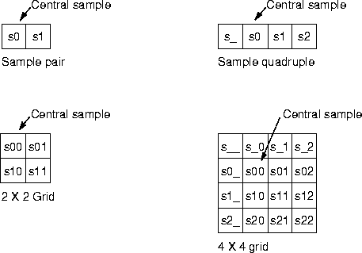

------------------------------------------------------------------------

***Figure 8-1*  Interpolation Samples**

Another possible source of inefficiency is the specification of the
subsample position. When interpolating integral image data, ImageN uses a
fixed-point subsample position specification, that is, a number
between 0 and (2n - 1) for some small value of *n*. The value of *n*
in the horizontal and vertical directions may be obtained by calling
the `getSubsampleBitsH` and `getSubsampleBitsV` methods. In general,
code that makes use of an externally-provided `Interpolation` object
must query that object to determine its desired positional precision.

For `float` and `double` images, ImageN uses a `float` between 0.0F and
1.0F (not including 1.0F) as a positional specifier in the interest of
greater accuracy.

**API:** `org.eclipse.imagen.Interpolation`

* `static Interpolation getInstance(int type)`
* `int interpolate(int[][] samples, int xfrac, int yfrac)`
* `float interpolate(float[][] samples, float xfrac, float yfrac)`
* `double interpolate(double[][] samples, float xfrac, 
           float  yfrac)`
* `int interpolate(int s00, int s01, int s10, int s11, int xfrac, 
           int yfrac)`
* `float interpolate(float s00, float s01, float s10, float s11, 
           float xfrac, float yfrac)`
* `double interpolate(double s00, double s01, double s10, double 
           s11, float xfrac, float yfrac)`
* `int interpolate(int s__, int s_0, int s_1, int s_2, int s0_, 
           int  s00, int s01, int s02, int s1_, int s10, int s11, 
           int  s12, int s2_, int s20, int s21, int s22, int xfrac, 
           int  yfrac)`

* `float interpolate(float s__, float s_0, float s_1, float s_2, 
           float s0_, float s00, float s01, float s02, float s1_, 
           float  s10, float s11, float s12, float s2_, float s20, 
           float  s21, float s22, float xfrac, float yfrac)`

* `abstract int getSubsampleBitsH()`
* `int getSubsampleBitsV()`

### 8.2.1 Nearest-neighbor Interpolation  <a name="NearestNeighbor"></a>

Nearest-neighbor interpolation, also known as zero-order
interpolation, is the fastest interpolation method, though it can
produce image artifacts called *jaggies* or *aliasing error*. Jaggies
are image artifacts in which the straight edges of objects appear to
be rough or jagged.

Nearest-neighbor interpolation simply assigns to point *D* in the
destination image the value of the pixel nearest *S* in the source
image.

Neighborhoods of sizes 2 x 1, 1 x 2, 2 x 2, 4 x 1, 1 x 4, 4 x 4, N x
1, and 1 x N, that is, all the `interpolate()` methods defined in the
`Interpolation` class, are supported in the interest of simplifying
code that handles a number of types of interpolation. In each case,
the central sample is returned and the rest are ignored.

**API:** `org.eclipse.imagen.InterpolationNearest`

* `InterpolationNearest()`

### 8.2.2 Bilinear Interpolation <a name="BilinearInterpolation"></a>

Bilinear interpolation, also known as first-order interpolation,
linearly interpolates pixels along each row of the source image, then
interpolates along the columns. Bilinear interpolation assigns to
Point *D* in the destination a value that is a bilinear function of
the four pixels nearest *S* in the source image.

Bilinear interpolation results in an improvement in image quality over
nearest-neighbor interpolation, but may still result in
less-than-desirable smoothing effects.

Bilinear interpolation requires a neighborhood extending one pixel to
the right and below the central sample. If the subsample position is
given by (*u*, *v*), the resampled pixel value will be:

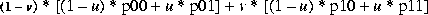

**API:** `org.eclipse.imagen.InterpolationBilnear`

* `InterpolationBilinear(int subsampleBits)`
* `InterpolationBilinear()`

### 8.2.3 Bicubic Interpolation <a name="BicubicInterpolation"></a>

Bicubic interpolation reduces resampling artifacts even further by
using the 16 nearest neighbors in the interpolation and by using
bicubic waveforms rather than the linear waveforms used in bilinear
interpolation. Bicubic interpolation preserves the fine detail present
in the source image at the expense of the additional time it takes to
perform the interpolation.

The bicubic interpolation routine assigns to point *D* in the
destination image a value that is a bicubic function of the 16 pixels
nearest *S* in the source image.

Bicubic interpolation performs interpolation using the following
piecewise cubic polynomial:

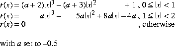

Bicubic interpolation requires a neighborhood extending one sample to
the left of and above the central sample, and two samples to the right
of and below the central sample.

**API:** `org.eclipse.imagen.InterpolationBicubic`

* `InterpolationBicubic(int subsampleBits)`

### 8.2.4 Bicubic2 Interpolation <a name="Bicubic2Interpolation"></a>

Bicubic2 interpolation is basically the same as bicubic interpolation,
but uses a different polynomial function. Bicubic2 interpolation uses
the following piecewise cubic polynomial:

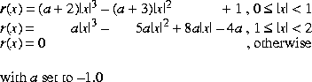

Bicubic interpolation requires a neighborhood extending one sample to
the left of and above the central sample, and two samples to the right
of and below the central sample.

**API:** `org.eclipse.imagen.InterpolationBicubic2`

* `InterpolationBicubic2(int subsampleBits)`

### 8.2.5 Table Interpolation <a name="TableInterpolation"></a>

The previous-described types of interpolation, nearest-neighbor,
bilinear, bicubic, and bicubic2, base the interpolation values on a
relatively few pixels: one (nearest-neighbor), four (bilinear), or 16
(bicubic and bicubic2). Occasionally, these options don\'t provide
sufficient quality for a specific operation and a general form of
interpolation is called for. Table interpolation uses tables to store
the interpolation kernels. The set of subpixel positions is broken up
into a fixed number of \"bins\" and a distinct kernel is used for each
bin. The number of bins must be a power of two.

An `InterpolationTable` defines a separable interpolation, with a
separate set of kernels for the horizontal and vertical dimensions.
The number of bins within each kernel may vary between the two
dimensions. The horizontal and vertical kernels may be unique or the
same. That is, you can either construct two separate kernels or use
the same kernel for both the horizontal and vertical interpolation.

The kernels are stored in both floating- and fixed-point form. The
fixed point representation has a user-specified fractional precision.
You must specify an appropriate level of precision that will not cause
overflow when accumulating the results of a convolution against a set
of source pixels, using 32-bit integer arithmetic.

To use table interpolation, create an `InterpolationTable` with either
identical horizontal and vertical resampling kernels or with different
horizontal and vertical resampling kernels. The table forms the
kernels used for the interpolation.

During a table interpolation operation, the key value of the
resampling kernel, generally the center value, is laid over the source
image pixel to be processed. The other kernel values lie over
neighboring pixels much like a conventional M x N kernel operation.
Each source image pixel that is covered by the kernel is then
multiplied by the kernel value that lies over it. The multiplication
products are then summed together and this sum becomes the pixel value
in the destination.

To save memory space and computation time, the table interpolation
operation does not use a conventional M x N kernel. Instead, the
operation uses separate horizontal and vertical vector arrays
(essentially, M x 1 and N x 1) to calculate the same values that a M x
N kernel would calculate. The vector arrays allow you to provide fewer
data elements for the kernel values. This is particularly significant
for large tables with many subsamples.

The basic format for the `InterpolationTable` constructor is:

         InterpolationTable(int leftPadding, int topPadding, int width,
                            int height, int subsampleBitsH,
                            int subsampleBitsV, int precisionBits,
                            float[] dataH, float[] dataV)

The parameters to the constructor are described in the following
paragraphs.


#### 8.2.5.1 Padding

The `leftPadding` and `topPadding` parameters define the location of
the central sample or key value, relative to the left and top of the
horizontal and vertical kernels, respectively. These parameters
actually define the number of samples to the left of or above the
central sample, as shown in [Figure
8-2](#figure-8-2).


<a name="figure-8-2"></a>

------------------------------------------------------------------------

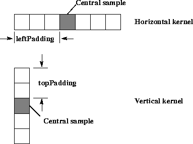

------------------------------------------------------------------------

***Figure 8-2*  Table Interpolation Padding**

#### 8.2.5.2 Width and Height

The `width` and `height` parameters define the size of the horizontal
and vertical kernels, respectively. These parameters specify the
number of data elements in each subsample of the kernel. The
horizontal and vertical tables can have different kernel sizes. For
the two examples shown in [Figure
8-2](#figure-8-2), the `width` parameter would be
7, the `height` parameter would be 5.

The `getWidth` and `getHeight` methods return the number of samples
required for horizontal and vertical resampling, respectively.


#### 8.2.5.3 Subsample Bits

The `subsampleBitsH` and `subsampleBitsV` parameters define the number
of bins used to describe the horizontal and vertical subpixel
positions, respectively. The number of bins must be a power of two, so
the values are integers expressed as the log~2~ of the number of
horizontal or vertical subsample positions, respectively. The value
`subsampleBitsH` = 1 defines two subsamples per horizontal sample,
`subsampleBitsH` = 2 defines four subsamples per sample, and so on.

For each subsample, you must define separate kernel data. Typically,
the kernel values for each subsample are weighted according to the
subsample location\'s proximity to the pixels used in the calculation.
The closer a pixel is to the subsample location, the more weight it
carries in the kernel.

[Figure 8-3](#figure-8-3) shows how the
interpolation tables are used to determine which kernel applies to a
particular subsample location. The figure shows a subsample of 4 in
both the horizontal and vertical directions.

Typically, the kernel values for each subsample are weighted according
to the subsample location\'s proximity to the pixels used in the
calculation. The closer a pixel is to the subsample location, the more
weight it carries in the kernel.

<a name="figure-8-3"></a>

------------------------------------------------------------------------

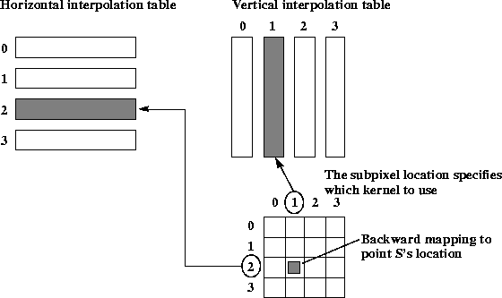

------------------------------------------------------------------------


***Figure 8-3*  Table Interpolation Backwards Mapping**


#### 8.2.5.4 Precision

The `precisionBits` parameter defines the number of fractional bits to
be used when resampling integral sample values. The same precision
value is used for both horizontal and vertical resampling. It is
important to choose an appropriate level of precision that will not
cause overflow when accumulating the results of a convolution against
a set of source pixels, using 32-bit integer arithmetic.


#### 8.2.5.5 Kernel Data

The kernel data for each table is an array of floating point numbers.
The `dataH` and `dataV` parameters specify the floating-point data
values for the horizontal and vertical kernels, respectively. The
number of data elements in the kernel is:

:   `width` x 2^subsampleBitsH^ for `dataH`
    
:   `height` x 2^subsampleBitsV^ for `dataV`

For a two-element kernel size with eight subsample bins
(`subsampleBits` = 4), you need to define an array of 16 floating
point values. The first two values define the kernel for the first
subsample, the second two values define the kernel for the second
subsample, and so on. For example:

------------------------------------------------------------------------

         float[] kernelData = {1.0,    0.0,
                               0.875,  0.125,    // 7/8,  1/8
                               0.75,   0.25,     // 6/8,  2/8
                               0.625,  0.375,    // 5/8,  3/8
                               0.5,    0.5,      // 4/8,  4/8
                               0.375,  0.625,    // 3/8,  5/8
                               0.25,   0.75,     // 2/8,  6/8
                               0.125,  0.875 };  // 1/8,  7/8

------------------------------------------------------------------------

The above example creates a bilinear interpolation table with eight
subsamples. The kernel values indicate how much influence the source
image pixels will have on the destination value. A kernel value of 1
indicates that a source pixel completely determines the value of the
destination pixel. A kernel value of 0 indicates that the source pixel
has no influence on the destination value.

To preserve the source image\'s intensity in the destination image,
the sum of the data values in each interpolation kernel should equal
one. If the kernel values sum to greater than one, the destination
image\'s intensity will be increased. Conversely, if the kernel values
sum to less than one, the destination image\'s intensity will be
decreased.

If a value of `null` is given for `dataV`, the `dataH` table data is
used for vertical interpolation as well, and the `topPadding`,
`height`, and `subsampleBitsV` parameters are ignored.

**API:** `org.eclipse.imagen.InterpolationTable`

* `InterpolationTable(int padding, int width, int subsampleBits, int precisionBits, float[] data)`
* `InterpolationTable(int padding, int width, int subsampleBits, 
       int precisionBits, double[] data)`
* `InterpolationTable(int padding, int width, int subsampleBits, 
       int precisionBits, int[] data)`
* `InterpolationTable(int leftPadding, int topPadding, int width, 
       int height, int subsampleBitsH, int subsampleBitsV, 
       int  precisionBits, float[] dataH, float[] dataV)`
* `InterpolationTable(int leftPadding, int topPadding, int width, 
       int height, int subsampleBitsH, int subsampleBitsV, 
       int  precisionBits, double[] dataH, double[] dataV)`
* `InterpolationTable(int leftPadding, int topPadding, int width, 
       int height, int subsampleBitsH, int subsampleBitsV, 
       int  precisionBits, int[] dataH, int[] dataV)`

#### 8.2.5.6 Additional Interpolation Table-related Methods

The `InterpolationTable` class provides several methods for retrieving
an interpolation table\'s kernel data values, subsample size, and
precision.

**API:** `org.eclipse.imagen.InterpolationTable`

* `int getSubsampleBitsH()`
* `int getSubsampleBitsV()`
* `int getPrecisionBits()`
* `int getLeftPadding()`
* `int getTopPadding()`
* `int getWidth()`
* `int getHeight()`
* `int[] getHorizontalTableData()`
* `int[] getVerticalTableData()`
* `float[] getHorizontalTableDataFloat()`
* `float[] getVerticalTableDataFloat()`
* `double[] getHorizontalTableDataDouble()`
* `double[] getVerticalTableDataDouble()`

# 8.3 Geometric Transformation <a name="GeometricTransformation"></a>

Geometric transformations provide the ability to reposition pixels
within an image. Pixels may be relocated from their (*x*,*y*) spatial
coordinates in the source image to new coordinates in the destination.
Geometric transformations are used, for example, to move (translate),
rotate, and scale the geometry of an image. A general type of
geometric transformation, warp, is discussed later in this chapter
(see [Section 8.7, \"Warping](../geom-image-manip)\").

Geometric transformations are used to register multiple images,
correct geometric distortions introduced in the image acquisition
process, or to add visual effects. The geometric transformation
operations discussed here include:

-   Translation (`Translate`) - moves an image up, down, left, or
    right


-   Scaling (`Scale`) - enlarges or shrinks an image


-   Rotation (`Rotate`) - rotates an image about a given point


-   Affine (`Affine`) - includes translation, scaling, and rotation in
    one operation

All transformation operations are performed by moving pixel values
from their original spatial coordinates to new coordinates in the
destination image. Every pixel in the source image is passed through
this transformation, creating a geometrically-transformed output pixel
location. Each pixel of the source image is transformed, pixel by
pixel, to its new location in the destination image.

With a very few exceptions, all transformations result in some output
pixel locations being missed because no input pixels were transformed
there. The missed locations will be devoid of any pixel values and
result in a black hole in the destination image. To overcome this
problem, intermediate pixel values are estimated through interpolation
(See [\"Interpolation\" on page
249](../geom-image-manip)). One of four `interpolation`
methods may be selected:

| interpolation Methods | Description |
| --------------------- + ----------- | 
| INTERP\_NEAREST |Use nearest-neighbor interpolation |
| INTERP\_BILINEAR | Use bilinear interpolation |
| INTERP\_BICUBIC | Use bicubic interpolation |
| INTERP\_BICUBIC2 | Use bicubic2 interpolation (uses a different polynomial function) |

### 8.3.1 Translation Transformation <a name="TranslationTransformation"></a>

Image translation is the spatial shifting of an image up, down, left,
or right. The relationships between the source and destination image
coordinates are given by the following equation:


:   where:

    :   *x*~D~ and *y*~D~ are the integer pixel coordinates of the
        destination image
        
    :   *t*~x~ and *t*~y~ are the translation values
        
    :   *x*\'S and *y*\'S denote the source image point from which the
        pixel estimate is computed.

Translation is often used to register multiple images geometrically.
The translation is often carried out to align the images before
performing a combination operation, such as image addition,
subtraction, division, or compositing.

<a name="figure-8-4"></a>

------------------------------------------------------------------------

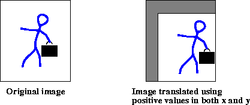

------------------------------------------------------------------------

***Figure 8-4*  Translate Operation**

The `translate` operation takes one rendered or renderable source
image and three parameters:

| Parameters | Type | Description |
| ---------- | ---- | ----------- |
| xTrans     | Float | The displacement in the *x* direction. The default value is 0.0F. |
| yTrans     | Float | The displacement in the *y* direction. The default value is 0.0F. |
| interpolation | Interpolation | The interpolation method for resampling. One of INTERP\_NEAREST, INTERP\_BILINEAR, INTERP\_BICUBIC, or INTERP\_BICUBIC2. The default value is null. |

The `xTrans` parameter corresponds to *t*~x~ and the `yTrans`
parameter corresponds to *t*~y~ in [equation
8.1](../geom-image-manip). If `xTrans` is positive, the
translation is to the right; if negative, to the left. If `yTrans` is
positive, the translation is down; if negative, upward. If both
`xTrans` and `yTrans` are integral, the operation simply *wraps* its
source image to change the image\'s position in the coordinate plane.

When interpolations that require padding the source such as bilinear
or bicubic interpolation are specified, the boundary of the source
image needs to be extended such that it has the extra pixels needed to
compute all the destination pixels. This extension is performed via
the `BorderExtender` class. The type of border extension can be
specified as a `RenderingHint` to the `JAI.create` method. If no
border extension type is provided, a default extension of
`BorderExtender.BORDER_COPY` will be used to perform the extension.
See [Section 3.7.3, \"Rendering
Hints](../programming-environ).\"

[Listing 8-2](#listing-8-2) shows a code sample for
a translate operation using nearest-neighbor interpolation.

***Listing 8-2*  Example Translate Operation** <a name="listing-8-2"></a>

```java
// Create a ParameterBlock and specify the source and
// parameters.
ParameterBlock pb = new ParameterBlock();
     pb.addSource(im);                   // The source image
     pb.add((float)Math.max(-mx, 0));    // The x translation
     pb.add((float)Math.max(-my, 0));    // The y translation
     pb.add(new InterpolationNearest()); // The interpolation

// Create the translate operation
im = JAI.create("translate", pb, null);
```

### 8.3.2 Scaling Transformation <a name="ScalingTransformation"></a>

Scaling, also known as *minification* and *magnification*, enlarges or
shrinks an image. An *x*-value defines the amount of scaling in the
*x* direction, and a *y*-value defines the amount of scaling in the
*y* direction. The `Scale` operation both translates and resizes.

Scaling is often used to geometrically register multiple images prior
to performing a combination operation, such as image addition,
subtraction, division, or compositing. Scaling can also be used to
correct geometric distortions introduced in the image acquisition
process, although the `Affine` operation ([\"Affine Transformation\"
on page 272](../geom-image-manip)) would be more suitable
for this.

For each pixel (*x*, *y*) of the destination, the source value at the
fractional subpixel position is constructed by means of an
`Interpolation` object and written to the destination.

:   

The `scale` operation takes one rendered or renderable source image
and five parameters:

| Parameters | Type | Description |
| ---------- | ---- | ----------- |
| xScale | Float | The *x* scale factor. |
| yScale | Float | The *y* scale factor. |
| xTrans | Float | The *x* translation. |
| xTrans | Float | The *y* translation. |
| interpolation | Interpolation | The interpolation method for resampling. One of INTERP\_NEAREST, INTERP\_BILINEAR, INTERP\_BICUBIC, or INTERP\_BICUBIC2. |

When applying scale factors (`xScale` and `yScale`) to a source image
with width of `src_width` and height of `src_height`, the resulting
image is defined to have the following dimensions:

```java
         dst_width = src_width * xScale
         dst_height = src_height * yScale
```

Scale factors greater than 1.0 magnify the image; less than 1.0 minify
the image. The `xTrans` parameter corresponds to *t*~x~ and the
`yTrans` parameter corresponds to *t*~y~ in [equation
8.1](geom-image-manip). If `xTrans` is positive, the
translation is to the right; if negative, to the left. If `yTrans` is
positive, the translation is down; if negative, upward.

<a name="figure-8-5"></a>

------------------------------------------------------------------------

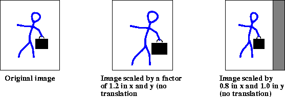

------------------------------------------------------------------------

***Figure 8-5*  Scale Operation**

When interpolations that require padding the source such as Bilinear
or Bicubic interpolation are specified, the boundary of the source
image needs to be extended such that it has the extra pixels needed to
compute all the destination pixels. This extension is performed via
the `BorderExtender` class. The type of border extension can be
specified as a `RenderingHint` to the `JAI.create` method. See
[Section 3.7.3, \"Rendering
Hints](../programming-environ).\"

If no Border Extension is specified, the source will not be extended.
The scaled image size is still calculated according to the equation
specified above. However since there isn\'t enough source to compute
all the destination pixels, only that subset of the destination
image\'s pixels that can be computed will be written in the
destination. The rest of the destination will not be written.

[Listing 8-3](#listing-8-3) shows a code sample for
a `Scale` operation using a scale factor of 1.2 and nearest-neighbor
interpolation.

***Listing 8-3*  Example Scale Operation** <a name="listing-831"></a>

```java
// Create a ParameterBlock and specify the source and
// parameters
ParameterBlock pb = new ParameterBlock();
     pb.addSource(im);                   // The source image
     pb.add(1.2);                        // The xScale
     pb.add(1.2);                        // The yScale
     pb.add(0.0F);                       // The x translation
     pb.add(0.0F);                       // The y translation
     pb.add(new InterpolationNearest()); // The interpolation

// Create the scale operation
im = JAI.create("scale", pb, null);
```

### 8.3.3 Rotation Transformation <a name="RotationTransformation"></a>

The `rotate` operation rotates an image about a given point by a given
angle. Specified *x* and *y* values define the coordinate of the
source image about which to rotate the image and a rotation angle in
*radians* defines the angle of rotation about the rotation point. If
no rotation point is specified, a default of (0,0) is assumed.

A negative rotation value rotates the image counter-clockwise, while a
positive rotation value rotates the image clockwise.

<a name="figure-8-6"></a>

------------------------------------------------------------------------


------------------------------------------------------------------------

***Figure 8-6*  Rotate Operation**

The `rotate` operation takes one rendered or renderable source image
and four parameters:

| Parameters | Type | Description |
| ---------- | ---- | ----------- |
| xOrigin | Float | The *x* origin to rotate about. |
| yOrigin | Float | The *y* origin to rotate about. |
| angle | Float | The rotation angle in radians. |
| interpolation | Interpolation | The interpolation method for resampling. One of INTERP\_NEAREST, INTERP\_BILINEAR, INTERP\_BICUBIC, or INTERP\_BICUBIC2. |

When interpolations that require padding the source such as Bilinear
or Bicubic interpolation are specified, the boundary of the source
image needs to be extended such that it has the extra pixels needed to
compute all the destination pixels. This extension is performed via
the `BorderExtender` class. The type of border extension can be
specified as a `RenderingHint` to the `JAI.create` method. If no
border extension type is provided, a default extension of
`BorderExtender.BORDER_COPY` will be used to perform the extension.
See [Section 3.7.3, \"Rendering
Hints](../programming-environ).\"

[Listing 8-4](#listing-8-4) shows a code sample for
a `Rotate` operation for a rotation angle of 45 degrees. Since the
rotation angle must be specified in radians, the example first
converts 45 degrees to radians.

***Listing 8-4*  Example Rotate Operation** <a name="listing-8-4"></a>

```java
// Create the rotation angle (45 degrees) and convert to
// radians.
int value = 45;
float angle = (float)(value * (Math.PI/180.0F));

// Create a ParameterBlock and specify the source and
// parameters
ParameterBlock pb = new ParameterBlock();
     pb.addSource(im);                   // The source image
     pb.add(0.0F);                       // The x origin
     pb.add(0.0F);                       // The y origin
     pb.add(angle);                      // The rotation angle
     pb.add(new InterpolationNearest()); // The interpolation

// Create the rotate operation
im = JAI.create("Rotate", pb, null);
```

### 8.3.4 Affine Transformation <a name="AffineTransformation"></a>

An *affine transform* is a transformation of an image in which
straight lines remain straight and parallel lines remain parallel, but
the distance between lines and the angles between lines may change.
Affine transformations include translation, scaling, and rotation.

Although there are separate ImageN operations to handle translation,
scaling, and rotation, the `Affine` operation can perform any of these
transformations or any combination, such as scale and rotate.

The `Affine` operation performs (possibly filtered) affine mapping
between a source and a destination image. For each pixel (*x*, *y*) of
the destination, the source value at the fractional subpixel position
(*x*\', *y*\') is constructed by means of an `Interpolation` object
and written to the destination.

The `affine` operation takes one rendered or renderable source image
and two parameters:

| Parameters | Type | Description |
| ---------- | ---- | ----------- |
| transform | AffineTransform | The affine transform matrix. |
| interpolation | Interpolation     The interpolation method for resampling. One of INTERP\_NEAREST, INTERP\_BILINEAR, INTERP\_BICUBIC, or INTERP\_BICUBIC2. |

The mapping between the destination pixel (*x*, *y*) and the source
position (*x*\', *y*\') is given by:


:   where *m* is a 3 x 2 transform matrix that inverts the matrix
    supplied as the `transform` argument.

The six elements of the transform matrix are `m00`, `m01`, `m02`,
`m10`, `m11`, and `m12`. The constructor looks like this:

         AffineTransform tr = new AffineTransform(m00, m10,
                                                  m01, m11,
                                                  m02, m12);

These six elements affect the transformation as follows:

  ---------------------------------------------------------------------
  Element   Description
  ------------------- -------------------------------------------------
  m00      The *x* coordinate scale element

  m10      The *y* coordinate shear element

  m01      The *x* coordinate shear element

  m11      The *y* coordinate scale element

  m02      The *x* coordinate translate element

  m12      The *y* coordinate translate element
  ---------------------------------------------------------------------

  : 

The following matrix will translate an image 100 pixels to the right
and 200 pixels down:

```java
AffineTransform tr = new AffineTransform(1.0,
                                         0.0,
                                         0.0,
                                         1.0,
                                         100.0,
                                         200.0);
```

The following matrix will zoom an image by a factor of 2 in both the
*x* and *y* directions:

```java
AffineTransform tr = new AffineTransform(2.0,
                                         0.0,
                                         0.0,
                                         2.0,
                                         0.0,
                                         0.0);
```

<a name="figure-8-7"></a>

------------------------------------------------------------------------

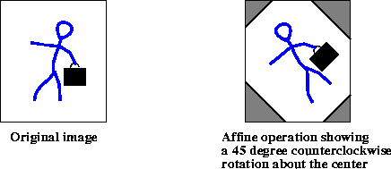

------------------------------------------------------------------------

***Figure 8-7*  Affine Operation**

When interpolations that require padding the source such as Bilinear
or Bicubic interpolation are specified, the boundary of the source
image needs to be extended such that it has the extra pixels needed to
compute all the destination pixels. This extension is performed via
the `BorderExtender` class. The type of border extension can be
specified as a `RenderingHint` to the `JAI.create` method. If no
border extension type is provided, a default extension of
`BorderExtender.BORDER_COPY` will be used to perform the extension.
See [Section 3.7.3, \"Rendering
Hints](../programming-environ).\"

[Listing 8-5](#listing-8-5) shows a code sample for
an `Affine` operation that performs a 45 degree counterclockwise
rotation.

***Listing 8-5*  Example Affine Transform Operation** <a name="listing-8-5"></a>

```java
// Load the image.
String filename = "images/Trees.gif";
PlanarImage im = (PlanarImage)JAI.create("fileload",
                                          filename);

// Create the affine transform matrix.
AffineTransform tr = new AffineTransform(0.707107,
                                        -0.707106,
                                         0.707106,
                                         0.707106,
                                         0.0,
                                         0.0);

// Specify the type of interpolation.
Interpolation interp = new InterpolationNearest();

// Create the affine operation.
PlanarImage im2 = (PlanarImage)JAI.create("affine", im, tr,
                                           interp);
```
**API:** `java.awt.geom.AffineTransform 

* `static AffineTransform getTranslateInstance(double tx,  double  ty)`
* `static AffineTransform getRotateInstance(double theta)`
* `static AffineTransform getRotateInstance(double theta, double  x, double y)`
* `static AffineTransform getScaleInstance(double sx, double sy)`
* `static AffineTransform getShearInstance(double shx, double shy)`

# 8.4 Perspective Transformation <a name="PerspectiveTransformation"></a>

Perspective distortions in images are sometimes introduced when the
camera is at an angle to the subject. For an example, think of a
camera in an aircraft above the earth. If the camera is aimed straight
down, the resulting image will be a flat perspective image; that is,
no distortion. All objects in the image appear in correct size
relative to one another. However, if the camera is angled toward the
earth horizon, perspective distortion is introduced. Objects closer to
the camera appear larger than same-sized objects farther away from the
camera. Perspective distortion has reduced the scale of the objects
farthest away.

Perspective distortion can be corrected by applying a *perspective
transform*. The perspective transform maps an arbitrary quadrilateral
into another arbitrary quadrilateral, while preserving the
straightness of lines. Unlike an affine transformation, the
parallelism of lines in the source is not necessarily preserved in the
output.

The perspective transform is represented by a 3 x 3 matrix that
transforms homogenous source coordinates (*x*, *y*, 1) into
destination coordinates (*x*\', *y*\', *w*). To convert back into
non-homogenous coordinates, *x*\' and *y*\' are divided by *w*.

:   

The perspective transform is used with the perspective warp operation.
See [Section 8.7.7, \"Perspective
Warp](geom-image-manip).\"

**API:** `org.eclipse.imagen.PerspectiveTransform`

* `PerspectiveTransform(float m00, float m01, float m02, 
           float  m10, float m11, float m12, float m20, float m21, 
           float  m22)`
* `PerspectiveTransform(float[] flatmatrix)`
* `PerspectiveTransform(float[][] matrix)`
* `PerspectiveTransform(double m00, double m01, double m02, 
           double  m10, double m11, double m12, double m20, double m21, 
           double m22)`
* `PerspectiveTransform(double[] flatmatrix)`
* `PerspectiveTransform(double[][] matrix)`
* `PerspectiveTransform(AffineTransform transform)`

### 8.4.1 Performing the Transform

The `PerspectiveTransform` class contains methods that perform the
perspective transform on a specified point, an array of point objects,
an array of floating point coordinates, or an array of double
precision coordinates.


### 8.4.2 Mapping a Quadrilateral

The `PerspectiveTransform` class contains methods that may be used to
create a perspective transform that can be used to map a unit square
to or from an arbitrary quadrilateral and to map an arbitrary
quadrilateral onto another arbitrary quadrilateral. The
`getSquareToQuad` methods map the unit square onto an arbitrary
quadrilateral:

```
    (0, 0) → (*x*0, *y*0)\
    (1, 0) → (*x*1, *y*1)\
    (1, 1) → (*x*2, *y*2)\
    (0, 1) → (*x*3, *y*3)
```

The `getQuadToSquare` methods map an arbitrary quadrilateral onto the unit square:

```
    (*x*0, *y*0) → (0, 0)\
    (*x*1, *y*1) → (1, 0)\
    (*x*2, *y*2) → (1, 1)\
    (x3, *y*3) → (0, 1)
```

The `getQuadToQuad` methods map an arbitrary quadrilateral onto
another arbitrary quadrilateral:

```
    (*x*0, *y*0) → (*x*0p, *y*0p)\
    (*x*1, *y*1) → (*x*1p, *y*1p)\
    (*x*2, *y*2) → (*x*2p, *y*2p)\
    (*x*3, *y*3) → (*x*3p, *y*3p)
```

**API:** `org.eclipse.imagen.PerspectiveTransform`

* `static PerspectiveTransform getSquareToQuad(double x0, 
           double  y0, double x1, double y1, double x2, double y2, 
           double x3, double y3)`
* `static PerspectiveTransform getSquareToQuad(float x0, float y0, 
           float x1, float y1, float x2, float y2, float x3, float y3)`
* `static PerspectiveTransform getQuadToSquare(double x0, 
           double  y0, double x1, double y1, double x2, double y2, 
           double x3, double y3)`
* `static PerspectiveTransform getQuadToSquare(float x0, float y0, 
           float x1, float y1, float x2, float y2, float x3, float y3)`
* `static PerspectiveTransform getQuadToQuad(double x0, double y0, 
           double x1, double y1, double x2, double y2, double x3, 
           double y3, double x0p, double y0p, double x1p, double y1p, 
           double x2p, double y2p, double x3p, double y3p)`
* `static PerspectiveTransform getQuadToQuad(float x0, float y0, 
           float x1, float y1, float x2, float y2, float x3, float y3, 
           float x0p, float y0p, float x1p, float y1p, float x2p, 
           float  y2p, float x3p, float y3p)`

### 8.4.3 Mapping Triangles

The `PerspectiveTransform` class contains methods that may be used to
create a perspective transform that can be used to map one arbitrary
triangle to another arbitrary triangle. This is done with one of the
`getTriToTri` methods

**API:** `org.eclipse.imagen.PerspectiveTransform`

* `static AffineTransform getTriToTri(double x0, double y0, double 
       x1, double y1, double x2, double y2)`
* `static AffineTransform getTriToTri(float x0, float y0, float 
       x1, float y1, float x2, float y2)`

### 8.4.4 Inverse Perspective Transform

The `PerspectiveTransform` class contains methods to perform an
inverse perspective transform. One of the `inverseTransform` methods
inverse transforms a specified Point2D to another Point2D. Another
`inverseTransform` method inverse transforms an array of
double-precision coordinates.

**API:** `org.eclipse.imagen.PerspectiveTransform`

* `Point2D inverseTransform(Point2D ptSrc, Point2D ptDst)`
* `inverseTransform(double[] srcPts, int srcOff, double[] dstPts, int dstOff, int numPts)`

### 8.4.5 Creating the Adjoint of the Current Transform

The `PerspectiveTransform` class contains a method for creating a new
PerspectiveTransform that is the adjoint of the current transform. The
adjoint is defined as the matrix of cofactors, which in turn are the
determinants of the submatrices defined by removing the row and column
of each element from the original matrix in turn.

The adjoint is a scalar multiple of the inverse matrix. Because points
to be transformed are converted into homogeneous coordinates, where
scalar factors are irrelevant, the adjoint may be used in place of the
true inverse. Since it is unnecessary to normalize the adjoint, it is
both faster to compute and more numerically stable than the true
inverse.

**API:** `org.eclipse.imagen.PerspectiveTransform`

* `public PerspectiveTransform createAdjoint()`

# 8.5 Transposing <a name="Transposing"></a>

The `Transpose` operation is a combination of flipping and rotating.
With a `Transpose` operation, you can (see [Figure
8-8](../geom-image-manip)):

-   Flip an image vertically across an imaginary horizontal axis that
    runs through the center of the image (`FLIP_VERTICAL`).


-   Flip an image horizontally across an imaginary vertical axis that
    runs through the center of the image (`FLIP_HORIZONTAL`).


-   Flip an image across its main diagonal axis, which runs from the
    upper left to the lower right corner (`FLIP_DIAGONAL`).


-   Flip an image across its main anti-diagonal axis, which runs from
    the upper right to the lower left corner (`FLIP_ANTIDIAGONAL`).


-   Rotate an image counterclockwise about its center by 90, 180, or
    270 degrees (`ROTATE_90`, `ROTATE_180`, `ROTATE_270`).

The `transpose` operation takes one rendered or renderable source
image and one parameter:

| Parameters | Type | Description |
| ---------- | ---- | ----------- |
| type | Integer | The type of flip operation to be performed. One of FLIP\_VERTICAL, FLIP\_HORIZONTAL, FLIP\_DIAGONAL, FLIP\_ANTIDIAGONAL, ROTATE\_90, ROTATE\_180, or ROTATE\_270 |

<a name="figure-8-7"></a>

------------------------------------------------------------------------

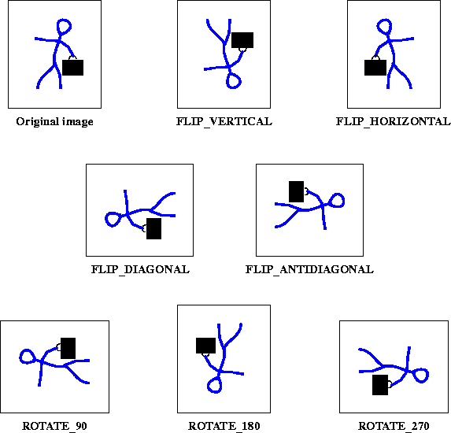

------------------------------------------------------------------------

***Figure 8-8*  Transpose Operations**

[Listing 8-6](#listing-8-6) shows sample code for
creating a `Transpose` operation. The example performs a horizontal
flip on the source image and creates the destination image `im2`.

***Listing 8-6*  Example Transpose Operation** <a name="listing-8-6"></a>

```java
// Create a pattern image.
ParameterBlock pb = new ParameterBlock();
pb.add(image);
PlanarImage im0 = (PlanarImage)JAI.create("awtImage", pb);

// Transpose type : 0=FLIP_VERTICAL
//                : 1=FLIP_HORIZONTAL
//                : 2=FLIP_DIAGONAL
//                : 3=FLIP_ANTIDIAGONAL
//                : 4=ROTATE_90
//                : 5=ROTATE_180
//                : 6=ROTATE_270
int type = 1;

// Create the Transpose operation.
PlanarImage im2 = (PlanarImage)JAI.create("transpose", im0,
                                          type);
```

# 8.6 Shearing <a name="Shearing"></a>

Shearing can be visualized by thinking of an image superimposed onto a
flexible rubber sheet. If you hold the sides of the sheet and move
them up and down in opposite directions, the image will undergo a
spatial stretching known as shearing. The `shear` operation shears an
image either horizontally or vertically.

<a name="figure-8-9"></a>

------------------------------------------------------------------------

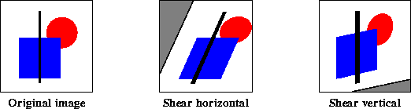

------------------------------------------------------------------------

***Figure 8-9*  Shearing Operations**

For each pixel (*x*, *y*) of the destination, the source value at the
fractional subpixel position (*x*\', *y*\') is constructed by means of
an `Interpolation` object and written to the destination (see
[\"Interpolation\" on page 249](../geom-image-manip)).

The `shear` operation takes one rendered source image and five
parameters:

| Parameters | Type | Description |
| ---------- | ---- | ----------- |
| shear | Float | The shear value. |
| shearDir | Integer | The shear direction: SHEAR\_HORIZONTAL or SHEAR\_VERTICAL |
| xTrans | Float | The *x* translation. |
| yTrans | Float | The *y* translation. |
| interpolation | Interpolation | The interpolation method for resampling. One of INTERP\_NEAREST, INTERP\_BILINEAR, INTERP\_BICUBIC, or INTERP\_BICUBIC2. |

For a `shearDir` parameter of `SHEAR_HORIZONTAL`:

:   

For a `shearDir` parameter of `SHEAR_VERTICAL`:

:   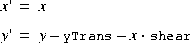

When interpolations that require padding the source such as Bilinear
or Bicubic interpolation are specified, the boundary of the source
image needs to be extended such that it has the extra pixels needed to
compute all the destination pixels. This extension is performed via
the `BorderExtender` class. The type of border extension can be
specified as a `RenderingHint` to the `JAI.create` method. If no
border extension type is provided, a default extension of
`BorderExtender.BORDER_COPY` will be used to perform the extension.
See [Section 3.7.3, \"Rendering
Hints](programming-environ).\"

[Listing 8-7](#listing-8-7) shows a code sample for a `Shear` operation.

***Listing 8-7*  Example Shear Operation** <a name="listing-8-7"></a>

```java
// Load the image.
String filename = "images/Picketfence.gif";
PlanarImage im0 = (PlanarImage)JAI.create("fileload",
                                          filename);

imagePanel1 = new ScrollingImagePanel(im0, 512, 512);

// Specify the type of interpolation.
Interpolation interp = new InterpolationNearest();

// Set the shear direction:
//     0 = SHEAR_HORIZONTAL
//     1 = SHEAR_VERTICAL
int shear_dir = 1;

// Set the shear value and the x and y translation values.
float shear_amt = 0.7F;
float x_trans = 50.0F;
float y_trans = 100.0F;

// Create the Shear operation.
PlanarImage im2 = (PlanarImage)JAI.create("shear",
                                           im0,
                                           shear_amt,
                                           shear_dir,
                                           x_trans,
                                           y_trans,
                                           interp);

// Display the image.
imagePanel2 = new ScrollingImagePanel(im2, 512, 512);
add(imagePanel2);
pack();
show();
```

# 8.7 Warping <a name="Warping"></a>

The linear geometric transformations described in [Section 8.3,
\"Geometric Transformation](../geom-image-manip),\" cannot
introduce curvature in the mapping process. Image warping is a type of
geometric transformation that introduces curvature into the mapping
process. The introduction of curvature is important when an image has
been distorted through lens aberrations and other non-linear
processes.

Warping transformations, also known as *rubber sheet* transformations,
can arbitrarily stretch the image about defined points. This type of
operation provides a nonlinear transformation between source and
destination coordinates.

ImageN provides a transformation class, `Warp`, that is used for
non-linear image coordinate transformation. As in the `Interpolation`
class (see [Section 8.2,
\"Interpolation](../geom-image-manip)\"), pixel positions
in the `Warp` class are represented using fixed-point coordinates,
yielding subpixel accuracy but still allowing the use of integer
arithmetic. The degree of precision is set by means of the
`getSubSampleBitsH` (horizontal) and `getSubSampleBitsV` (vertical)
parameters to the `warpRect` method.

The key method of this class is `warpRect`, which provides the
locations of the pixels in source space that map to a given
rectangular output region. The output region is specified using normal
integer (full pixel) coordinates. The source positions returned by the
method are specified in fixed-point, subpixel coordinates.

ImageN supports seven warping functions:

-   Polynomial warp - a polynomial-based description of an image warp
    (`WarpPolynomial`).


-   General polynomial warp - a general polynomial-based description
    of an image warp (`WarpGeneralPolynomial`).


-   Grid warp - a regular grid-based description of an image warp
    (`WarpGrid`).


-   Quadratic warp - a quadratic-based description of an image warp
    (`WarpQuadratic`).


-   Cubic warp - a cubic-based description of an image warp
    (`WarpCubic`).


-   Perspective warp - a perspective (projective) warp
    (`WarpPerspective`).


-   Affine warp - affine-based warp (`WarpAffine`).


**API:** `org.eclipse.imagen.Warp`

* `int[] warpRect(int x, int y, int width, int height, 
       int  subsampleBitsH, int subsampleBitsV, int[] destRect)`
* `float[] warpRect(int x, int y, int width, int height, 
       float[]  destRect)`
* `int[] warpPoint(int x, int y, int subsampleBitsH, 
       int  subsampleBitsV, int[] destRect)`
* `float[] warpPoint(int x, int y, float[] destRect)`
* `int[] warpSparseRect(int x, int y, int width, int height, 
       int  periodX, int periodY, int subsampleBitsH, 
       int  subsampleBitsV, int[] destRect)`
* `abstract float[] warpSparseRect(int x, int y, int width, 
       int  height, int periodX, int periodY, float[] destRect)`

Rectangle mapDestRect(Rectangle destRect)

### 8.7.1 Performing a Warp Operation

The `Warp` operation performs general warping on an image. The `warp`
operation takes one rendered source image and two parameters:

| Parameters | Type | Description |
| ---------- | ---- | ----------- |
| warp | Warp | The warp object. One of [WarpAffine]{#WarpAffine} [WarpGrid]{#WarpGrid} [WarpPerspective]{#WarpPerspective} [WarpPolynomial]{#WarpPolynomial} [WarpQuadratic]{#WarpQuadratic} [WarpOpImage]{#WarpOpImage}
| interpolation | Interpolation | The interpolation method for resampling. One of INTERP\_NEAREST, INTERP\_BILINEAR, INTERP\_BICUBIC, or INTERP\_BICUBIC2. |

To create a warp operation:

1. Create the warp object, which specifies the type of warp operation.
   The warp object will be one of the following:

   | Object | Description |
   | ------ | ----------- |
   | WarpAffine | An affine-based image warp. See [Affine Waap](#AffineWaap). |
   | WarpCubic | A cubic-based image warp. See [Cubic Warp](#CubicWarp). |
   | WarpGeneralPolynomial | A polynomial-based image warp for polynomials of a higher degree. See [General  Polynomial Warp](#GeneralPolynomialWarp. |
   | WarpGrid | A grid-based image warp where the image may be warped in pieces. See [Gridl Warp](#GridlWarp). |
   | WarpPerspective | A perspective or projective image warp. See [Perspective Warp](#PerspectiveWarp). |
   | WarpPolynomial | A polynomial-based description of an image warp. See [Polynomial Warp](#PolynomialWarp) |
   | WarpQuadratic | A quadratic-based description of an image warp. See [Quadratic Warp)(#QuadraticWarp). |

2. Create the `ParameterBlock` object and add the source image and the
necessary parameters to it. The `Warp` operation takes two parameters:

   | Parameters | Description |
   | ---------- | ----------- +
   | warp | The Warp object. One of WarpAffine, WarpCubic, WarpGeneralPolynomial, WarpGrid, WarpPerspective, WarpPolynomial, or WarpQuadratic.
   | interpolation | The interpolation method for resampling. One of INTERP\_NEAREST, INTERP\_BILINEAR, INTERP\_BICUBIC, or INTERP\_BICUBIC2. |

   When interpolations that require padding the source such as
   Bilinear or Bicubic interpolation are specified, the boundary of
   the source image needs to be extended such that it has the extra
   pixels needed to compute all the destination pixels. This
   extension is performed via the `BorderExtender` class. The type of
   border extension can be specified as a `RenderingHint` to the
   `JAI.create` method. If no border extension type is provided, a
   default extension of `BorderExtender.BORDER_COPY` will be used to
   perform the extension. See [Section 3.7.3, \"Rendering
   Hints\"](../programming-environ).

3. Create the warp operation with the `JAI.create` method.

   [Listing 8-8](#listing-8-8) shows a sample code for
a simple second-order warp operation.

***Listing 8-8*  Example of a Second-order Warp** <a name="listing-8-7"></a>

```java
// Create WarpPolynomial object for a polynomial warp
// operation.
WarpPolynomial warp;
     float[] coeffs = { 1.0F, 0.0F, 0.0F, 0.0F, 1.0F, 0.0F };

// Create the ParameterBlock and add the parameters to it.
ParameterBlock pb = new ParameterBlock();
     pb.addSource(srcImage);
     pb.add(warp);
     pb.add(new InterpolationNearest());

// Create the warp operation.
dstImage = JAI.create("warp", pb);
```

### 8.7.2 Polynomial Warp <a name="PolynomialWarp"></a>

The `WarpPolynomial` class provides a polynomial-based description of
an image warp. The mapping is defined by two bivariate polynomial
functions *X*(*x*, *y*) and *Y*(*x*, *y*) that define the source *x*
and *y* positions that map to a given destination (*x*, *y*) pixel
coordinate.

The functions *X*(*x*, *y*) and *Y*(*x*, *y*) have the form:


The `WarpPolynomial` constructor takes a `coeffs` parameter that must
contain a number of coefficients of the form (*n* + 1)(*n* + 2) for
some *n*, where *n* is the degree power of the polynomial. The
coefficients appear in the following order:

:   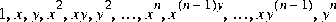

with the coefficients of the polynomial defining the source *x*
coordinates appearing before those defining the *y* coordinates.

The source (*x*, *y*) coordinate is pre-scaled by the factors
`preScaleX` and `preScaleY` prior to the evaluation of the polynomial.
The result of the polynomial evaluations are scaled by `postScaleX`
and `postScaleY` to produce the destination pixel coordinates. This
process allows for better precision of the results.

The number of points needed to control the alignment of the image
relates directly to the order of warp. Three control points constitute
a first-order warp. Six points constitute a second-order warp. The
number of points required for each degree of warp are as follows:

| Degree of Warp | Number of Points |
| -------------- | ---------------- |
| 1              | 3  |
| 2              | 6  |
| 3              | 10 |
| 4              | 15 |
| 5              | 21 |
| 6              | 28 |
| 7              | 36 |

**API:** `org.eclipse.imagen.WarpPolynomial`

* `WarpPolynomial(float[] coeffs)`

* `WarpPolynomial(float[] coeffs, float preScaleX, float 
       preScaleY, float postScaleX, float postScaleY)`
* `float[] getCoeffs()`
* `int getDegree()`
* `static WarpPolynomial createWarp(float[] sourceCoords, 
       int  sourceOffset, float[] destCoords, int destOffset, 
       int  numCoords, float preScaleX, float preScaleY, 
       float  postScaleX, float postScaleY, int degree)`

### 8.7.3 General Polynomial Warp <a name="GeneralPolynomialWarp"></a>

The `WarpGeneralPolynomial` class provides a concrete implementation
of `WarpPolynomial` for polynomials of a higher degree.

The mapping is defined by two bivariate polynomial functions *X*(*x*,
*y*) and *Y*(*x*, *y*) that define the source *X* and *Y* positions
that map to a given destination (*x*, *y*) pixel coordinate.

The functions *X*(*x*, *y*) and *Y*(*x*, *y*) have the form:


The `xCoeffs` and `yCoeffs` parameters must contain the same number of
coefficients of the form (*n* + 1)(*n* + 2)/2 for some *n*, where *n*
is the non-negative degree power of the polynomial. The coefficients,
in order, are associated with the terms:

:   1, x, y, x^2^, x\*y, y^2^, \..., x^n^, x^(n -\ 1)^\*y, \...,
    x\*y^(n -\ 1)^, y^n^

and coefficients of value 0 can not be omitted.

The destination pixel coordinates (the arguments to the X() and Y()
functions) are given in normal integral pixel coordinates, while the
output of the functions is given in fixed-point, subpixel coordinates
with a number of fractional bits specified by the `subsampleBitsH` and
`subsampleBitsV` parameters.

**API:** `org.eclipse.imagen.WarpGeneralPolynomial`

* `WarpGeneralPolynomial(float[] xCoeffs, float[] yCoeffs)`
* `WarpGeneralPolynomial(float[] xCoeffs, float[] yCoeffs, 
       float  preScaleX,  float  preScaleY, float postScaleX, 
       float  postScaleY)`
* `float[] warpSparseRect(int x, int y, int width, int height, 
       int  periodX, int periodY, float[] destRect)`

### 8.7.4 Grid Warp <a name="GridlWarp"></a>

If polynomial warping is impractical, the image may be warped in
pieces using grid warping, also known as *control grid interpolation*.
In the most common implementation of grid warping, specified input
control points form a grid of contiguous, horizontally-oriented
rectangles in the output image. The mapping from destination pixels to
source positions is described by bilinear interpolation between a
rectilinear grid of points with known mappings.

Given a destination pixel coordinate (*x*, *y*) that lies within a
cell having corners at (*x*0, *y*0), (*x*1, *y*0), (*x*0, *y*1), and
(*x*1, *y*1), with source coordinates defined at each respective
corner equal to (*sx*0, *sy*0), (*sx*1, *sy*1), (*sx*2, *sy*2), and
(*sx*3, *sy*3), the source position (*sx*, *sy*) that maps onto (*x*,
*y*) is given by the following equations:


The source *x* and *y* values are interpolated horizontally along the
top and bottom edges of the grid cell, and the results are
interpolated vertically, as shown in [Figure
8-10](../geom-image-manip).

<a name="figure-8-10"></a>

------------------------------------------------------------------------

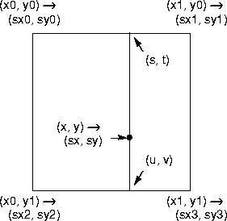

------------------------------------------------------------------------

***Figure 8-10*  Warp Grid**

The grid is defined by a set of equal-sized cells starting at
(`xStart`, `yStart`). The width of each cell is defined by the `xStep`
parameter and the height is defined by the `yStep` parameter. There
are `xNumCells` cells horizontally and `yNumCells` cells vertically.

The degree of warping within each cell is defined by the values in the
`warpPositions` parameter. This parameter must contain the following
values:

:   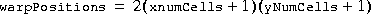

These values alternately contain the source *x* and *y* coordinates
that map to the upper-left corner of each cell in the destination
image. The cells are enumerated in row-major order, that is, all the
grid points along a row are enumerated first, then the gird points for
the next row are enumerated, and so on.

For example, if `xNumCells` is 2 and `yNumCells` is 1, the order of
the data in the table would be as follows:

         x00, y00, x10, y10, x20, y20, x01, y01, x11, y11, x21, y21

for a total of 2(2 + 1)(1 + 1) = 12 elements.

**API:** `org.eclipse.imagen.WarpGrid`

* `WarpGrid(int xStart, int xStep, int xNumCells, int yStart, 
           int  yStep, int yNumCells, float[] warpPositions)`
* `WarpGrid(Warp master, int xStart, int xStep, int xNumCells, 
       int  yStart, int yStep, int yNumCells)`
* `float[] warpSparseRect(int x, int y, int width, int height, 
       int  periodX, int periodY, float[] destRect)`

### 8.7.5 Quadratic Warp <a name="QuadraticlWarp"></a>

The `WarpQuadratic` class provides a quadratic-based description of an
image warp. The source position (*x*\', *y*\') of a point (*x*, *y*)
is given by the following quadratic bivariate polynomial:


**API:** `org.eclipse.imagen.WarpQuadratic`

* `WarpQuadratic(float[] xCoeffs, float[] yCoeffs, 
       float  preScaleX, float preScaleY, float postScaleX, 
       float  postScaleY)`
* `WarpQuadratic(float[] xCoeffs, float[] yCoeffs)`
* `float[] warpSparseRect(int x, int y, int width, int height, 
       int  periodX, int periodY, float[] destRect)`

### 8.7.6 Cubic Warp <a name="CubicWarp"></a>

The `WarpCubic` class performs a cubic-based image warp. The source
position (*x*\', *y*\') of a point (*x*, *y*) is given by the
following cubic polynomial:


**API:** `org.eclipse.imagen.WarpCubic`

* `WarpCubic(float[] xCoeffs, float[] yCoeffs, float preScaleX, float preScaleY, float postScaleX, float postScaleY)`
* `WarpCubic(float[] xCoeffs, float[] yCoeffs)`
* `float[] warpSparseRect(int x, int y, int width, int height, int  periodX, int periodY, float[] destRect)`

### 8.7.7 Perspective Warp <a name="#WarpPerspective"></a>

Perspective distortions in images caused by camera-to-target viewing
angle can be restored through perspective warping. Perspective
distortion appears as the reduction in scale of an object that recedes
from the foreground into the background of the image.

The `WarpPerspective` class provides a perspective (projective) warp.
The transform is specified as a mapping from destination space to
source space. In other words, it is the inverse of the normal
specification of a perspective image transformation. See [Section 8.4,
\"Perspective Transformation](../geom-image-manip),\" for
a description of the `PerspectiveTransform` class.

**API:** `org.eclipse.imagen.WarpPerspective`

* `WarpPerspective(PerspectiveTransform transform)`
* `PerspectiveTransform getTransform()`
* `int[] warpSparseRect(int x, int y, int width, int height, 
       int  periodX, int periodY, float[] destRect)`

### 8.7.8 Affine Warp <a name="WarpAffine"></a>

The `WarpAffine` class provides an affine-based warp. The transform is
specified as a mapping from destination space to source space. In
other words, it is the inverse of the normal specification of an
affine image transformation.

The source position (*x*\', *y*\') of a point (*x*, *y*) is given by
the quadratic bivariate polynomial:


[Listing 8-9](#listing-8-9) shows a code sample for
an affine-based warp operation.

***Listing 8-9*  Example Affine Warp** <a name="listing-8-9"></a>

```java
// Create the transform parameter (WarpAffine).
double m00 = 0.8;
double m10 = 0.3;
double m01 = -0.7;
double m11 = 1.4;
double m02 = 230.3;
double m12 = -115.7;
AffineTransform transform = new AffineTransform(m00, m10,
                                                m01, m11,
                                                m02, m12);
Warp warp = new WarpAffine(transform);

// Create the interpolation parameter.
Interpolation interp = new InterpolationNearest(8);

// Create the ParameterBlock.
ParameterBlock pb = new ParameterBlock();
pb.addSource(src);
pb.add(warp);
pb.add(interp);

// Create the warp operation.
return (RenderedImage)JAI.create("warp", pb);
```

**API:** `org.eclipse.imagen.WarpAffine`

* `public WarpAffine(float[] xCoeffs, float[] yCoeffs, 
       float  preScaleX, float  preScaleY, float postScaleX, 
       float  postScaleY)`
* `WarpAffine(float[] xCoeffs, float[] yCoeffs)`
* `public WarpAffine(AffineTransform transform, float preScaleX, 
       float preScaleY, float postScaleX, float postScaleY)`
* `WarpAffine(AffineTransform transform)`
* `AffineTransform getTransform()`
* `float[] warpSparseRect(int x, int y, int width, int height, 
       int  periodX, int periodY, float[] destRect)`
* `Rectangle mapDestRect(Rectangle destRect)`

