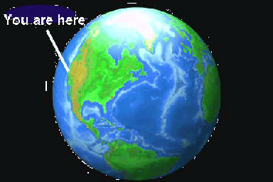
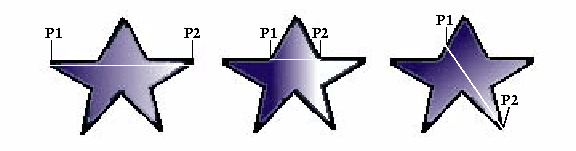

  -----------------------------------------
    C H A P T E R10
  -----------------------------------------

# Graphics Rendering                                                    

**T**HIS chapter describes the JAI presentation of rendering shapes,
text, and images.

10.1 Introduction
--------------------------------------

JAI provides classes that support drawing operations beyond the
`Graphics2D` class. Three different types of graphics rendering are
offered: simple 2D graphics, renderable graphics, and tiled image
graphics. These are described in more detail in the sections that
follow.

------------------------------------------------------------------------

------------------------------------------------------------------------

***Figure 10-1*  Simple Text and Line Added to
an Image**

### 10.1.1 Simple 2D Graphics

The `Graphics2D` class extends the even simpler `Graphics` class to
provide more control over geometry, coordinate transformations, color
management, and text layout. `Graphics2D` is the fundamental class for
rendering two-dimensional shapes, text and images. `Graphics2D`
supports geometric rendering by providing a mechanism for rendering
virtually any geometric shape, draw styled lines of any width, and
fill geometric shapes with virtually any texture.

The `BufferedImage.createGraphics` method creates a `Graphics2D`
object, which can then be used to draw into this `BufferedImage`.

Geometric shapes are provided through implementations of the `Shape`
interface, such as `Polygon`, `Rectangle`, `CubicCurve2D`, and
`QuadCurve2D`. Fill and pen styles are provided through
implementations of the `Paint` and `Stroke` interfaces. For example,
the `Paint` interface supports `Color`, `GradientPaint`, and
`TexturePaint`. The `Stroke` interface supports `BasicStroke`, which
defines a set of attributes for the outlines of graphics primitives.

Text is added to graphics using the `Font` class, which represents
character fonts. A `Font` is defined by a collections of `Glyphs`,
which in turn are defined by individual `Shapes`. Since text is
represented by glyphs, text strings can also be stroked and filled
like other geometric objects.

### 10.1.2 Renderable Graphics

The `RenderableGraphics` class is an implementation of `Graphics2D`
with `RenderableImage` semantics. This means that content may be drawn
into the image using the `Graphics2D` interface and later be turned
into `RenderedImages` with different resolutions and characteristics.

The `RenderableGraphics` class allows you to store a sequence of
drawing commands and \"replay\" them at an arbitrary output
resolution. By serializing an instance of `RenderableGraphics`, you
create a kind of metafile for storing the graphical content.

The methods in the `RenderableGraphics` class override the methods in
the `java.awt.Graphics` and `java.awt.Graphics2D` classes. This means
that you can use the methods in `RenderableGraphics` to set your fonts
and colors, to create the graphics shapes and text, define a clipping
path, and so on.

The only method unique to `RenderableGraphics` is the
`createRendering` method, which creates a `RenderedImage` that
represents a rendering of the image using a given `RenderContext`.
This is the most general way to obtain a rendering of a
`RenderableImage`.

10.2 A Review of Graphics Rendering
--------------------------------------------------------

To render a graphic object, you set up the `Graphics2D` context and
pass the graphic object to one of the `Graphics2D` rendering methods.
Before rendering the graphic object, you first need to set certain
state attributes that define how the `Graphics2D` context displays the
graphics. For example, you specify:

-   The stroke width

-   How strokes are joined

-   A clipping path to limit the area that is rendered

-   Define colors and patterns to fill shapes with

`Graphics2D` defines several methods that add or change attributes in
the graphics context. Most of these methods take an object that
represents a particular attribute, such as a `Paint` or `Stroke`
object.

### 10.2.1 Overview of the Rendering Process

When a graphic object is rendered, the geometry, image, and attribute
information are combined to calculate which pixel values must be
changed on the display.

The rendering process for a `Shape` is described into the following
four steps:

Rendering text is similar to rendering a `Shape`, since the text is
rendered as glyphs and each glyph is a `Shape`. However, you still
must specify what `Font` to use for the text and get the appropriate
glyphs from the `Font` before rendering. The attributes are described
in more detail in the following sections.

### 10.2.2 Stroke Attributes

The `Graphics2D` `Stroke` attribute defines the characteristics of
strokes. The `BasicStroke` object is used to define the stroke
attributes for a `Graphics2D` context. `BasicStroke` defines
characteristics such as line width, endcap style, segment join style,
and pattern (solid or dashing). To change the `Stroke` attribute in
the `Graphics2D` context, you call the `setStroke` method.

#### 10.2.2.1 Line Width

The line width is specified in *points* (there are 72 points to the
inch). To set the stroke width, create a `BasicStroke` object with the
desired width and call `setStroke`. The following example sets the
stroke width to 12 points.

         wideStroke = new BasicStroke(12.0);

         g2.setStroke(wideStroke);

#### 10.2.2.2 Endcap Style

[Table 10-1](../graphics) lists the endcap style
attributes.

+-----------------------+-----------------------+-----------------------+
| [Appearance]{#51850}  | [Attribute]{#51852}   | [Description]{#51854} |
+=======================+=======================+=======================+
| []{#51856}            | [CAP\_BUTT]{#51858}\  | [Ends unclosed        |
|                       |                       | subpaths with no      |
| -------------------   |                       | added                 |
|                       |                       | decoration.]{#51860}\ |
|                  |                       |                       |
|                       |                       |                       |
| -------------------   |                       |                       |
|                       |                       |                       |
| \                     |                       |                       |
+-----------------------+-----------------------+-----------------------+
| []{#51862}            | [CAP\_ROUND]{#51864}\ | [Ends unclosed        |
|                       |                       | subpaths with a round |
| -------------------   |                       | end cap that has a    |
|                       |                       | radius equal to half  |
|                  |                       | width.]{#51866}\      |
|                       |                       |                       |
| -------------------   |                       |                       |
|                       |                       |                       |
| \                     |                       |                       |
+-----------------------+-----------------------+-----------------------+
| []{#51868}            | [CAP\_SQUARED]{#51870 | [Ends unclosed        |
|                       | }\                    | subpaths with a       |
| -------------------   |                       | square projection     |
|                       |                       | that extends beyond   |
|                  |                       | segment to a distance |
|                       |                       | equal to half the     |
| -------------------   |                       | line width.]{#51872}\ |
|                       |                       |                       |
| \                     |                       |                       |
+-----------------------+-----------------------+-----------------------+

:  **[*Table 10-1*  Endcap Styles]{#51844}**

To set the endcap style, create a `BasicStroke` object with the
desired attribute. The following example sets the stroke width to 12
points and endcap style is set to `CAP_ROUND`.

         wideStroke = new BasicStroke(12.0, BasicStroke.CAP_ROUND);

         g2.setStroke(roundStroke);

#### 10.2.2.3 Join Style

[Table 10-2](../graphics) lists the join style attributes.
These attributes affect the appearance of line junctions.

+-----------------------+-----------------------+-----------------------+
| [Appearance]{#51909}  | [Attribute]{#51911}   | [Description]{#51913} |
+=======================+=======================+=======================+
| []{#51915}            | [JOIN\_BEVEL]{#51917} | [Joins path segments  |
|                       | \                     | by connecting the     |
| -------------------   |                       | outer corners of      |
|                       |                       | their wide outlines   |
|                  |                       | segment.]{#51944}\    |
|                       |                       |                       |
| -------------------   |                       |                       |
|                       |                       |                       |
| \                     |                       |                       |
+-----------------------+-----------------------+-----------------------+
| []{#51921}            | [JOIN\_ROUND]{#51923} | [Joins path segments  |
|                       | \                     | by rounding off the   |
| -------------------   |                       | corner at a radius of |
|                       |                       | half the line         |
|                  |                       |                       |
|                       |                       |                       |
| -------------------   |                       |                       |
|                       |                       |                       |
| \                     |                       |                       |
+-----------------------+-----------------------+-----------------------+
| []{#51927}            | [JOIN\_MITER]{#51929} | [Joins path segments  |
|                       | \                     | by extending their    |
| -------------------   |                       | outside edges until   |
|                       |                       | they meet.]{#51985}\  |
|                  |                       |                       |
|                       |                       |                       |
| -------------------   |                       |                       |
|                       |                       |                       |
| \                     |                       |                       |
+-----------------------+-----------------------+-----------------------+

:  **[*Table 10-2*  Join Styles]{#51903}**

To set the join style, create a `BasicStroke` object with the desired
attribute. The following example sets the stroke width to 12 points,
an endcap style of `CAP_ROUND`, and a join style of `JOIN_ROUND`.

         wideStroke = new BasicStroke(12.0, BasicStroke.CAP_ROUND,

                                      BasicStroke.JOIN_ROUND);

         g2.setStroke(roundStroke);

#### 10.2.2.4 Stroke Style

The stroke style is defined by two parameters:

-   `dash` - an array that represents the dashing pattern. Alternating
    elements in the array represent the dash size and the size of the
    space between dashes. Element 0 represents the first dash, element
    1 represents the first space.

-   `dash_phase` - an offset that defines where the dashing pattern
    starts.

[Listing 10-1](../graphics) shows a code sample in which
two different dashing patterns are created. In the first pattern, the
size of the dashes and the space between them is constant. The second
pattern uses a six-element array to define the dashing pattern. The
two dash patterns are shown in [Figure 10-2](../graphics).

**[]{#52134}**

***Listing 10-1*  Example Stroke Styles**

------------------------------------------------------------------------

         // Define the first dashed line.
         float dash1[] = {10.0f};
         BasicStroke bs = new BasicStroke(5.0f, BasicStroke.CAP_BUTT,
                              BasicStroke.JOIN_MITER, 10.0f, dash1, 0.0f);

         g2.setStroke(bs);
         Line2D line = new Line2D.Float(20.0f, 10.0f, 100.0f, 10.0f);
         g2.draw(line);

         // Define the second dashed line.
         float[] dash2 = {6.0f, 4.0f, 2.0f, 4.0f, 2.0f, 4.0f};
         bs = new BasicStroke(5.0f, BasicStroke.CAP_BUTT,
                              BasicStroke.JOIN_MITER, 10.0f, dash2, 0.0f);
         g2.setStroke(bs);
         g2.draw(line);

------------------------------------------------------------------------

------------------------------------------------------------------------

------------------------------------------------------------------------

***Figure 10-2*  Example Stroke Styles**

#### 10.2.2.5 Fill Styles

The `Paint` attribute in the `Graphics2D` context defines the fill
color or pattern used when text and `Shape`s are rendered.

##### Filling a Shape with a Gradient

The `GradientPaint` class allows a shape to be filled with a gradient
of one color to another. When creating a `GradientPaint` object, you
specify a beginning position and color, and an ending position and
color. The fill color changes proportionally from one color to the
other along the line connecting the two positions, as shown in [Figure
10-3](../graphics).

In all three stars, the gradient line extends from point P1 to point
P2. In the middle star, all of the points along the gradient line
extending to the left of P1 take the beginning color and the points to
the right of P2 take the ending color.

------------------------------------------------------------------------

------------------------------------------------------------------------

***Figure 10-3*  Filling a Shape with a
Gradient**

To fill a shape with a gradient of one color to another:

[Listing 10-2](../graphics) shows sample code in which a
rectangle is filled with a blue-green gradient.

**[]{#52145}**

***Listing 10-2*  Example Filling a Rectangle
with a Gradient**

------------------------------------------------------------------------

         GradientPaint gp = new GradientPaint(50.0f, 50.0f, Color.blue,
                                              50.0f, 250.0f, Color.green);
         g2.setPaint(gp);
         g2.fillRect(50, 50, 200, 200);

------------------------------------------------------------------------

##### Filling a Shape with a Texture

The `TexturePaint` class allows you to fill a shape with a repeating
pattern. When you create a `TexturePaint`, you specify a
`BufferedImage` to use as the pattern. You also pass the constructor a
rectangle to define the repetition frequency of the pattern.

To fill a shape with a texture:

[Listing 10-3](../graphics) shows sample code in which a
shape is filled with texture.

**[]{#52179}**

***Listing 10-3*  Example Filling a Shape with
Texture**

------------------------------------------------------------------------

         // Create a buffered image texture patch of size 5 X 5.
         BufferedImage bi = new BufferedImage(5, 5,
                                BufferedImage.TYPE_INT_RGB);
         Graphics2D big bi.createGraphics();

         // Render into the BufferedImage graphics to create the texture.
         big.setColor(Color.green);
         big.fillRect(0, 0, 5, 5);
         big.setColor(Color.lightGray);
         big.fillOval(0, 0, 5, 5);

         // Create a texture paint from the buffered image.
         Rectangle r = new Rectangle(0, 0, 5, 5);
         TexturePaint tp = new
             TexturePaint(bi, r, TexturePaint.NEAREST_NEIGHBOR);

         // Add the texture paint to the graphics context.
         g2.setPaint(tp);

         // Create and render a rectangle filled with the texture.
         g2.fillRect(0, 0, 200, 200);
         }

------------------------------------------------------------------------

### 10.2.3 Rendering Graphics Primitives

The `Graphics2D` class provides methods for creating `Shape`s and
`Text`, and for rendering `Images`. [Table
10-3](../graphics) lists these methods.

  ---------------------------------------------------------------------------------------------------------------------------------------------------
  [Method]{#52238}                 [Description]{#52240}
  -------------------------------- ------------------------------------------------------------------------------------------------------------------
  [draw]{#52242}\                  [Strokes the outline of a Shape using the Stroke and Paint settings of the current Graphics2D context.]{#52262}\

  [fill]{#52246}\                  [Fills the interior of a Shape using the Paint settings of the Graphics2D context.]{#52269}\

  [drawString]{#52250}\            [Renders the specified text string using the Paint setting of the Graphics2D context.]{#52252}\

  [drawImage]{#52254}\             [Renders the specified Image.]{#52256}\

  [drawRenderableImage]{#52286}\   [Renders the specified RenderableImage.]{#52288}\

  [drawRenderedImage]{#52282}\     [Renders the specified RenderedImage.]{#52284}\
  ---------------------------------------------------------------------------------------------------------------------------------------------------

  :  **[*Table 10-3*  Graphics Primitives
  Methods]{#52234}**

#### 10.2.3.1 Drawing a Shape

The `Graphics2D.draw` method is used to render the outline of any
`Shape`. The `Graphics2D` class also inherits draw methods from the
`Graphics` class, such as `drawLine`, `drawRect`, `drawRoundRect`,
`drawOval`, `drawArc`, `drawPolyline`, `drawPolygon`, and
`draw3DRect`.

When a `Shape` is drawn, its path is stroked with the `Stroke` object
in the `Graphics2D` context. (See [Section 10.2.2, \"Stroke
Attributes](../graphics),\" for more information.) By
setting an appropriate `BasicStroke` object in the `Graphics2D`
context, you can draw lines of any width or pattern. The `BasicStroke`
object also defines the line\'s endcap and join attributes.

To render a `Shape`\'s outline:

[Listing 10-4](../graphics) shows a code example in which
a `GeneralPath` object is used to define a star and a `BasicStroke`
object is added to the `Graphics2D` context to define the star\'s line
width and join attributes.

**[]{#52316}**

***Listing 10-4*  Example Drawing a Shape**

------------------------------------------------------------------------

         public void paint(Graphics g) {
            Graphics2D g2 = (Graphics2D) g;

            // Create and set the stroke.
            g2.setStroke(new BasicStroke(4.0f));

            // Create a star using a general path object.
            GeneralPath p new GeneralPath(GeneralPath.NON_ZERO);
            p.moveTo(- 100.0f, - 25.0f);
            p.lineTo(+ 100.0f, - 25.0f);
            p.lineTo(- 50.0f, + 100.0f);
            p.lineTo(+ 0.0f, - 100.0f);
            p.lineTo(+ 50.0f, + 100.0f);
            p.closePath();

            // Translate the origin towards the center of the canvas.
            g2.translate(100.0f, 100.0f);

            // Render the star's path.
            g2.draw(p);
         }

------------------------------------------------------------------------

#### 10.2.3.2 Filling a Shape

The `Graphics2D.fill` method is used to fill any `Shape`. When a
`Shape` is filled, the area within its path is rendered with the
`Paint` object in the Graphics2D context: a `Color`, `TexturePaint`,
or `GradientPaint`.

The `Graphics2D` class also inherits fill methods from the `Graphics`
class, such as `fillRect`, `fill3DRect`, `fillRoundRect`, `FillOval`,
`fillArc`, `fillPolygon`, and `clearRect`.

To fill a `Shape`:

[Listing 10-5](../graphics) shows a code example in which
the `setColor` method is called to define a green fill for a
`Rectangle2D`.

**[]{#52394}**

***Listing 10-5*  Example Filling a Shape**

------------------------------------------------------------------------

         Public void paint(Graphics g) {
            Graphics2D g2 = (Graphics2D) g;

            g2.setpaint(Color.green);
            Rectangle2D r2 = new Rectangle2D.float(25, 25, 150, 150);

            g2.fill(r2);
         }

------------------------------------------------------------------------

#### 10.2.3.3 Rendering Text

The entire subject of fonts and text layout is too extensive to try to
describe here. In this section, we\'ll give a brief overview of the
`Graphics2D.drawString` method, which is used to render a text string.

There are two basic variations on the `drawString` method. Two methods
takes a `String` for an argument and two methods take an
`AttributedCharacterIterator`. If the argument is a `String`, the
current `Font` in the `Graphics2D` context is used to convert the
characters in the `String` into a set of glyphs with whatever basic
layout and shaping algorithms the font implements. If the argument is
an `AttributedCharacterIterator`, the iterator is asked to convert
itself to a `TextLayout` using its embedded font attributes. The
`TextLayout` implements more sophisticated glyph layout algorithms
that perform Unicode I-directional layout adjustments automatically
for multiple fonts of differing writing directions.

A third method used to render text is the `Graphics2D.drawGlyphVector`
method, which takes a `GlyphVector` as an argument. The `GlyphVector`
object contains the appropriate font-specific glyph codes with
explicit coordinates for the position of each glyph.

The character outlines are filled with the `Paint` object in the
Graphics2D context.

10.3 Graphics2D Example
--------------------------------------------

[Listing 10-6](../graphics) shows a code sample for a
Graphics2D example.

**[]{#51518}**

***Listing 10-6*  Graphics2D Example**

------------------------------------------------------------------------

         // Read a RenderedImage and convert it to a BufferedImage.
         imagePath = new String("./images/sample.jpg");
         Image ai = loadAWTImage(imagePath, this);
         RenderedImage ri = JAI.create("awtimage", ai);
         BufferedImage bi = getBufferedImage(ri);
         RenderedImage targetImage = null;
         targetImage = new BufferedImage(bi.getWidth(),
                                         bi.getHeight(),
                                         bi.getType());

         // Create a Graphics2D object to draw into the BufferedImage.
         Graphics2D g2d = targetImage.createGraphics();

------------------------------------------------------------------------

10.4 Adding Graphics and Text to an Image
--------------------------------------------------------------

The `java.awt.Graphics2D` class enables you to draw lines, geometric
shapes, images, and text. These objects can then be \"painted\" over a
`TiledImage`.

------------------------------------------------------------------------

\

\

