

*Programming in Java Advanced Imaging*

\

[]{#47227}

  ----------------------------------------
    C H A P T E R7
  ----------------------------------------

[]{#47285}

+----------------------------------------------------------------------:+
| -------------------------------------------------------------------   |
|                                                                       |
| Image Enhancement                                                     |
+-----------------------------------------------------------------------+

> \
> \
> \
>
> **T**HIS chapter describes the basics of improving the visual
> appearance of images through enhancement operations.
>
> []{#50856}
>
> 7.1 Introduction
> -------------------------------------
>
> The JAI API image enhancement operations include:
>
> -   Adding borders
>
> <!-- -->
>
> -   Cropping an image
>
> <!-- -->
>
> -   Amplitude rescaling
>
> <!-- -->
>
> -   Histogram equalization
>
> <!-- -->
>
> -   Lookup table modification
>
> <!-- -->
>
> -   Convolution filtering
>
> <!-- -->
>
> -   Median filtering
>
> <!-- -->
>
> -   Frequency domain processing
>
> <!-- -->
>
> -   Pixel point processing
>
> <!-- -->
>
> -   Thresholding (binary contrast enhancement)
>
> []{#68364}
>
> 7.2 Adding Borders to Images
> -------------------------------------------------
>
> JAI provides two different ways of adding a border to an image. These
> two ways are described in the following paragraphs.
>
> []{#68604}
>
> ### 7.2.1 The Border Operation
>
> The `Border` operation allows you to add a simple filled border around
> a source image. The border extends the source image\'s boundaries by a
> specified number of pixels.The amount of extension may be specified
> separately for the top, bottom, and left and right sides. The
> following types of border fill may be specified:
>
> -   Zero fill - the border area is extended with zeros
>     (`BORDER_ZERO_FILL`).
>
> <!-- -->
>
> -   Constant fill - the border area is extended with a specified
>     constant value (`BORDER_CONST_FILL`). An array of constants must
>     be supplied. The array must have at least one element, in which
>     case this same constant is applied to all destination image bands.
>     Or, it may have a different constant entry for each corresponding
>     band. For all other border types, this `constants` parameter may
>     be `null`.
>
> <!-- -->
>
> -   Extend - the border area is created by copying the edge and corner
>     pixels (`BORDER_COPY`).
>
> <!-- -->
>
> -   Reflection - the border area is created by reflection of the
>     image\'s outer edge (`BORDER_REFLECT`).
>
> <!-- -->
>
> -   Wrap - the border area is extended by \"wrapping\" the image plane
>     toroidally, that is, joining opposite edges of the image
>     (`BORDER_WRAP`).
>
> []{#68385}
>
> ------------------------------------------------------------------------
>
> 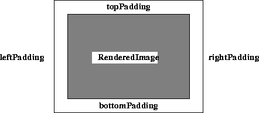
>
> ------------------------------------------------------------------------
>
> []{#68386}
>
> ***Figure 7-1*  Image Borders**
>
> The image layout (tile width, height, and offsets; `SampleModel` and
> `ColorModel`) is copied from the source. The `Border` operation takes
> one rendered source image and six parameters:
>
>   ------------------------------------------------------------------------------------------------------------------------------------------------------------------------------------------------
>   [Parameters]{#68390}   [Type]{#68392}       [Description]{#68394}
>   ---------------------- -------------------- ----------------------------------------------------------------------------------------------------------------------------------------------------
>   [leftPad]{#68396}\     [Integer]{#68398}\   [The image\'s left padding.]{#68400}\
>
>   [rightPad]{#68402}\    [Integer]{#68404}\   [The image\'s right padding.]{#68406}\
>
>   [topPad]{#68408}\      [Integer]{#68410}\   [The image\'s top padding.]{#68412}\
>
>   [bottomPad]{#68414}\   [Integer]{#68416}\   [The image\'s bottom padding.]{#68418}\
>
>   [type]{#68420}\        [Integer]{#68422}\   [The border type. One of BORDER\_ZERO, BORDER\_CONST\_FILL, BORDER\_COPY, BORDER\_REFLECT, or BORDER\_WRAP. The default is BORDER\_ZERO.]{#68424}\
>
>   [constant]{#68426}\    [double]{#68428}\    [The constants used by the BORDER\_CONST\_FILL.]{#68430}\
>   ------------------------------------------------------------------------------------------------------------------------------------------------------------------------------------------------
>
>   : 
>
> []{#68606}
>
> ### 7.2.2 Extending the Edge of an Image
>
> Some area operations, such as convolve, scale, and rotate, benefit
> from the addition of an extended border around the source image. The
> extended border comes into play when the convolution kernel overlaps
> the source image as the key value is scanned over it.
>
> A `BorderExtender` may be applied to an operation using a suitable
> hint. The hints are defined in [Table
> 7-1](Image-enhance.doc.html#68640).
>
>   --------------------------------------------------------------------------------------------------------------------------------------------------------------------------------------------------------------------------------------------------------------------------------------------------------------------------------------------------------------------------------------
>   [Name]{#68644}                      [Description]{#68646}
>   ----------------------------------- --------------------------------------------------------------------------------------------------------------------------------------------------------------------------------------------------------------------------------------------------------------------------------------------------------------------------------------------------
>   [BorderExtenderZero]{#68648}\       [Extends an image\'s border by filling all pixels outside the image bounds with zeros. See]{#68650} [Section 7.2.2.1, \"BorderExtenderZero](Image-enhance.doc.html#72409).\"\
>
>   [BorderExtenderConstant]{#70811}\   [Extends an image\'s border by filling all pixels outside the image bounds with constant values. See]{#70813} [Section 7.2.2.2, \"BorderExtenderConstant](Image-enhance.doc.html#72000).\"\
>
>   [BorderExtenderCopy]{#68652}\       [Extends an image\'s border by filling all pixels outside the image bounds with copies of the edge pixels. Useful as a way of padding source images prior to area or geometric operations, such as convolution, scaling, or rotation. See]{#68697} [Section 7.2.2.3, \"BorderExtenderCopy](Image-enhance.doc.html#72770).\"\
>
>   [BorderExtenderWrap]{#68656}\       [Extends an image\'s border by filling all pixels outside the image bounds with copies of the whole image. This form of extension is appropriate for data that is inherently periodic, such as the Fourier transform of an image, or a wallpaper pattern. See]{#68658} [Section 7.2.2.4, \"BorderExtenderWrap](Image-enhance.doc.html#73128).\"\
>
>   [BorderExtenderReflect]{#68660}\    [Extends an image\'s border by filling all pixels outside the image bounds with copies of the whole image. This form of extension avoids discontinuities around the edges of the image. See]{#68662} [Section 7.2.2.5, \"BorderExtenderReflect](Image-enhance.doc.html#73456).\"\
>   --------------------------------------------------------------------------------------------------------------------------------------------------------------------------------------------------------------------------------------------------------------------------------------------------------------------------------------------------------------------------------------
>
>   :  **[*Table 7-1*  BorderExtender
>   Hints]{#68640}**
>
> The `BorderExtender` class is the superclass for four classes that
> extend a `WritableRaster` with additional pixel data taken from a
> `PlanarImage`. Instances of `BorderExtender` are used by the
> `PlanarImage.getExtendedData` and `PlanarImage.copyExtendedData`
> methods.
>
> The `PlanarImage.getExtendedData` method returns a copy of an
> arbitrary rectangular region of the image in a `Raster`. The portion
> of the rectangle of interest outside the bounds of the image will be
> computed by calling the given `BorderExtender`. If the region falls
> entirely within the image, the extender will not be used. Thus it is
> possible to use a `null` value for the `extender` parameter when it is
> known that no actual extension will be required. The returned `Raster`
> should be considered non-writable. The `copyExtendedData` method
> should be used if the returned `Raster` is to be modified.
>
> The `PlanarImage.copyExtendedData` method copies an arbitrary
> rectangular region of the `RenderedImage` into a caller-supplied
> `WritableRaster`. The portion of the supplied `WritableRaster` that
> lies outside the bounds of the image is computed by calling the given
> `BorderExtender`. The supplied `WritableRaster` must have a
> `SampleModel` that is compatible with that of the image.
>
> Each instance of `BorderExtender` has an `extend` method that takes a
> `WritableRaster` and a `PlanarImage`. The portion of the raster that
> intersects the bounds of the image will already contain a copy of the
> image data. The remaining area is to be filled in according to the
> policy of the `BorderImage` subclass. The subclasses are described in
> [Table 7-1](Image-enhance.doc.html#68640).
>
> +-----------------------------------+-----------------------------------+
> |            | -------------------------------   |
> |                                   |                                   |
> |                                   | **API:**                          |
> |                                   | `javax.media.jai.Planarimage`     |
> |                                   |                                   |
> |                                   | -------------------------------   |
> +-----------------------------------+-----------------------------------+
>
>     Raster getExtendedData(Rectangle region, 
>            BorderExtender  extender)
>
> :   returns a copy of an arbitrary rectangular region of this image in
>     a Raster.
>     *Parameters*:
>     `region`
>     The region of the image to be returned.
>     `extender`
>     An instance of `BorderExtender`, used only if the region exceeds
>     the image bounds.
>
> <!-- -->
>
>     void copyExtendedData(WritableRaster dest, 
>            BorderExtender  extender)
>
> :   copies an arbitrary rectangular region of the `RenderedImage` into
>     a caller-supplied `WritableRaster`.
>     *Parameters*:
>     `dest`
>     A `WritableRaster` to hold the returned portion of the image.
>     `extender`
>     An instance of `BorderExtender`.
>
> +-----------------------------------+-----------------------------------+
> |            | -------------------------------   |
> |                                   |                                   |
> |                                   | **API:**                          |
> |                                   | `javax.media.jai.BorderExtender`  |
> |                                   |                                   |
> |                                   | -------------------------------   |
> +-----------------------------------+-----------------------------------+
>
>     static BorderExtender createInstance(int extenderType)
>
> :   returns an instance of `BorderExtender` that implements a given
>     extension policy. The policies understood by this method are:
>       ---------------------------------------------------------------------------------------------------------------------------------------------------------------------------------------------------------------------------------------------------------------------------------------------------------------------------------
>       [Policy]{#68880}             [Description]{#68882}
>       ---------------------------- ----------------------------------------------------------------------------------------------------------------------------------------------------------------------------------------------------------------------------------------------------------------------------------------------------
>       [BORDER\_ZERO]{#68884}\      [Set sample values to zero.]{#68886}\
>
>       [BORDER\_COPY]{#68888}\      [Set sample values to copies of the nearest valid pixel. For example, pixels to the left of the valid rectangle will take on the value of the valid edge pixel in the same row. Pixels both above and to the left of the valid rectangle will take on the value of the upper-left pixel.]{#68890}\
>
>       [BORDER\_REFLECT]{#68892}\   [The output image is defined as if mirrors were placed along the edges of the source image. Thus if the left edge of the valid rectangle lies at *x* = 10, pixel (9, *y*) will be a copy of pixel (10, *y*); pixel (6, *y*) will be a copy of pixel (13, *y*).]{#68918}\
>
>       [BORDER\_WRAP]{#68896}\      [The source image is tiled repeatedly in the plane.]{#68938}\
>       ---------------------------------------------------------------------------------------------------------------------------------------------------------------------------------------------------------------------------------------------------------------------------------------------------------------------------------
>
>       : 
>
> <!-- -->
>
>     abstract void extend(WritableRaster raster, PlanarImage im)
>
> :   fills in the portions of a given `Raster` that lie outside the
>     bounds of a given `PlanarImage` with data derived from that
>     `PlanarImage`.
>
> []{#72409}
>
> #### 7.2.2.1 BorderExtenderZero
>
> The `BorderExtenderZero` class is a subclass of `BorderExtender` that
> implements border extension by filling all pixels outside of the image
> bounds with zeros. For example, [Figure
> 7-2](Image-enhance.doc.html#73911) shows the result of using
> `BorderExtenderZero` to extend an image by adding two extra rows to
> the top and bottom and two extra columns on the left and right sides.
>
> []{#73910}
>
> ------------------------------------------------------------------------
>
> 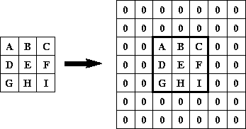
>
> ------------------------------------------------------------------------
>
> []{#73911}
>
> ***Figure 7-2*  BorderExtenderZero Example**
>
> +-----------------------------------+-----------------------------------+
> |            | -------------------------------   |
> |                                   |                                   |
> |                                   | **API:**                          |
> |                                   | `javax.media.jai.BorderExtenderZe |
> |                                   | ro`                               |
> |                                   |                                   |
> |                                   | -------------------------------   |
> +-----------------------------------+-----------------------------------+
>
>     final void extend(WritableRaster raster, PlanarImage im)
>
> :   fills in the portions of a given `Raster` that lie outside the
>     bounds of a given `PlanarImage` with zeros. The portion of Raster
>     that lies within `im.getBounds` is not altered.
>
> []{#72000}
>
> #### 7.2.2.2 BorderExtenderConstant
>
> The `BorderExtenderConstant` class is a subclass of `BorderExtender`
> that implements border extension by filling all pixels outside of the
> image bounds with constant values. For example, [Figure
> 7-3](Image-enhance.doc.html#74089) shows the result of using
> `BorderExtenderConstant` to extend an image by adding two extra rows
> to the top and bottom and two extra columns on the left and right
> sides.
>
> In the figure, X is the constant fill value. The set of constants is
> clamped to the range and precision of the data type of the `Raster`
> being filled. The number of constants used is given by the number of
> bands of the `Raster`. If the `Raster` has *b* bands, and there are
> *c* constants, constants 0 through *b* - 1 are used when *b*
>  *c*. If *b* \> *c*, zeros are used to
> fill out the constants array.
>
> []{#74088}
>
> ------------------------------------------------------------------------
>
> 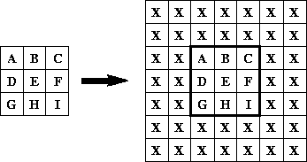
>
> ------------------------------------------------------------------------
>
> []{#74089}
>
> ***Figure 7-3*  BorderExtenderConstant
> Example**
>
> +-----------------------------------+-----------------------------------+
> |            | -------------------------------   |
> |                                   |                                   |
> |                                   | **API:**                          |
> |                                   | `javax.media.jai.BorderExtenderCo |
> |                                   | nstant`                           |
> |                                   |                                   |
> |                                   | -------------------------------   |
> +-----------------------------------+-----------------------------------+
>
>     BorderExtenderConstant(double[] constants)
>
> :   constructs an instance of `BorderExtenderConstant` with a given
>     set of constants. The constants are specified as an array of
>     `double`s.
>
> <!-- -->
>
>     final void extend(WritableRaster raster, PlanarImage im)
>
> :   fills in the portions of a given `Raster` that lie outside the
>     bounds of a given `PlanarImage` with constant values. The portion
>     of `Raster` that lies within `im.getBounds` is not altered.
>
> []{#72770}
>
> #### 7.2.2.3 BorderExtenderCopy
>
> The `BorderExtenderCopy` class is a subclass of `BorderExtender` that
> implements border extension by filling all pixels outside of the image
> bounds with copies of the edge pixels. For example, [Figure
> 7-4](Image-enhance.doc.html#74281) shows the result of using
> `BorderExtenderCopy` to extend an image by adding two extra rows to
> the top and bottom and two extra columns on the left and right sides.
>
> Although this type of extension is not particularly visually
> appealing, it is useful as a way of padding source images prior to
> area or geometric operations, such as convolution, scaling, or
> rotation.
>
> []{#74280}
>
> ------------------------------------------------------------------------
>
> 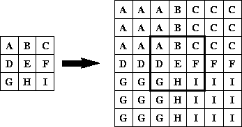
>
> ------------------------------------------------------------------------
>
> []{#74281}
>
> ***Figure 7-4*  BorderExtenderCopy Example**
>
> +-----------------------------------+-----------------------------------+
> |            | -------------------------------   |
> |                                   |                                   |
> |                                   | **API:**                          |
> |                                   | `javax.media.jai.BorderExtenderCo |
> |                                   | py`                               |
> |                                   |                                   |
> |                                   | -------------------------------   |
> +-----------------------------------+-----------------------------------+
>
>     final void extend(WritableRaster raster, PlanarImage im)
>
> :   fills in the portions of a given `Raster` that lie outside the
>     bounds of a given `PlanarImage` with copies of the edge pixels of
>     the image. The portion of `Raster` that lies within `im.getBounds`
>     is not altered.
>
> []{#73128}
>
> #### 7.2.2.4 BorderExtenderWrap
>
> The `BorderExtenderWrap` class is a subclass of `BorderExtender` that
> implements border extension by filling all pixels outside of the image
> bounds with copies of the whole image. For example, [Figure
> 7-5](Image-enhance.doc.html#74469) shows the result of using
> `BorderExtenderWrap` to extend an image by adding two extra rows to
> the top and bottom and two extra columns on the left and right sides.
>
> This form of extension is appropriate for data that is inherently
> periodic, such as the Fourier transform of an image or a wallpaper
> pattern.
>
> []{#74468}
>
> ------------------------------------------------------------------------
>
> 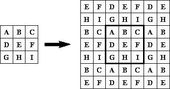
>
> ------------------------------------------------------------------------
>
> []{#74469}
>
> ***Figure 7-5*  BorderExtenderWrap Example**
>
> +-----------------------------------+-----------------------------------+
> |            | -------------------------------   |
> |                                   |                                   |
> |                                   | **API:**                          |
> |                                   | `javax.media.jai.BorderExtenderWr |
> |                                   | ap`                               |
> |                                   |                                   |
> |                                   | -------------------------------   |
> +-----------------------------------+-----------------------------------+
>
>     final void extend(WritableRaster raster, PlanarImage im)
>
> :   Fills in the portions of a given `Raster` that lie outside the
>     bounds of a given `PlanarImage` with copies of the entire image.
>     The portion of `Raster` that lies within `im.getBounds` is not
>     altered.
>
> []{#73456}
>
> #### 7.2.2.5 BorderExtenderReflect
>
> The `BorderExtenderReflect` class is a subclass of `BorderExtender`
> that implements border extension by filling all pixels outside the
> image bounds with reflected copies of the whole image. For example,
> [Figure 7-6](Image-enhance.doc.html#74693) shows the result of using
> `BorderExtenderReflect` to extend an image by adding two extra rows to
> the top and bottom and one extra column on the left and right sides.
>
> This form of extension avoids discontinuities around the edges of the
> image.
>
> []{#74688}
>
> ------------------------------------------------------------------------
>
> 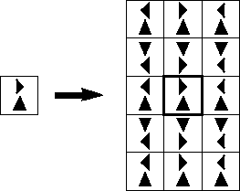
>
> ------------------------------------------------------------------------
>
> []{#74693}
>
> ***Figure 7-6*  BorderExtenderReflect
> Example**
>
> +-----------------------------------+-----------------------------------+
> |            | -------------------------------   |
> |                                   |                                   |
> |                                   | **API:**                          |
> |                                   | `javax.media.jai.BorderExtenderRe |
> |                                   | flect`                            |
> |                                   |                                   |
> |                                   | -------------------------------   |
> +-----------------------------------+-----------------------------------+
>
>     final void extend(WritableRaster raster, PlanarImage im)
>
> :   Fills in the portions of a given `Raster` that lie outside the
>     bounds of a given `PlanarImage` with suitably reflected copies of
>     the entire image. The portion of `Raster` that lies within
>     `im.getBounds` is not altered.
>
> []{#73080}
>
> 7.3 Cropping an Image
> ------------------------------------------
>
> The `Crop` operation crops a rendered or renderable image to a
> specified rectangular area. The *x*, *y*, width, and height values are
> clipped to the source image\'s bounding box. These values are rounded
> to type `int` for rendered images.
>
> The `Crop` operation takes one rendered or renderable source image and
> four parameters. None of the parameters have default values; all must
> be supplied.
>
>   -----------------------------------------------------------------------------------
>   [Parameter]{#76471}   [Type]{#76473}     [Description]{#76475}
>   --------------------- ------------------ ------------------------------------------
>   [x]{#76477}\          [Float]{#76479}\   [The *x* origin for each band.]{#76481}\
>
>   [y]{#76483}\          [Float]{#76485}\   [The *y* origin for each band.]{#76487}\
>
>   [width]{#76489}\      [Float]{#76491}\   [The width for each band.]{#76493}\
>
>   [height]{#76495}\     [Float]{#76497}\   [The height for each band.]{#76499}\
>   -----------------------------------------------------------------------------------
>
>   : 
>
> []{#76505}
>
> ------------------------------------------------------------------------
>
> 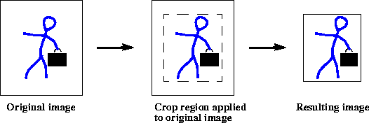
>
> ------------------------------------------------------------------------
>
> []{#76506}
>
> ***Figure 7-7*  Crop Operation**
>
> []{#76502}
>
> 7.4 Amplitude Rescaling
> --------------------------------------------
>
> Amplitude rescaling provides a linear amplitude transformation of
> input pixel values to output pixel values. Amplitude rescaling can be
> used to enhance images that have insufficient contrast between the
> lightest and darkest values, such as caused by underexposure or
> overexposure of the original image.
>
> The full dynamic range of one band of an eight-bit image is 0 to 255.
> An underexposed image may only contain pixel values from 10 to 180,
> resulting in an image that does not fully use the dynamic range of the
> display. Such an image can be greatly improved by linearly stretching
> the contrast range; mapping the lowest values to 0 and the highest
> values to 255.
>
> The `rescale` operation takes a rendered or renderable source image
> and maps the pixel values of the image from one range to another range
> by multiplying each pixel value by one of a set of constants and then
> adding another constant to the result of the multiplication. If the
> number of constants supplied is less than the number of bands of the
> destination, the constant from entry 0 is applied to all the bands.
> Otherwise, a constant from a different entry is applied to each band.
> There must be at least one entry in each of the constants and offsets
> arrays.
>
> The pixel values of the destination image are defined by the following
> pseudocode:
>
>          constant = (constants.length < dstNumBands) ?
>                      constants[0] : constants[b];
>          offset = (offsets.length < dstNumBands) ?
>                    offsets[0] : offsets[b];
>          
>          dst[x][y][b] = src[x][y][b]*constant + offset;
>
> The pixel arithmetic is performed using the data type of the
> destination image. By default, the destination will have the same data
> type as the source image unless an `ImageLayout` containing a
> `SampleModel` with a different data type is supplied as a rendering
> hint.
>
> The values of the lowest and highest pixel amplitudes must be known.
> This information can be acquired through the `Extrema` operation (see
> [Section 9.3, \"Finding the Extrema of an
> Image](Analysis.doc.html#54907)\").
>
> The following equations show the relationships between the extrema and
> the scale and offset factors.
>
> []{#59303}
>
> []{#59312}
>
> :   where *max*(*b*) and *min*(*b*) are the largest and smallest pixel
>     values in the band, respectively.
>
> The `rescale` operation takes one rendered or renderable source image
> and two parameters:
>
>   ----------------------------------------------------------------------------------------------
>   [Parameter]{#61691}    [Type]{#61693}      [Description]{#61695}
>   ---------------------- ------------------- ---------------------------------------------------
>   [constants]{#61697}\   [double]{#61699}\   [The per-band constants to multiply by.]{#61701}\
>
>   [offsets]{#61703}\     [double]{#61705}\   [The per-band offsets to be added.]{#61707}\
>   ----------------------------------------------------------------------------------------------
>
>   : 
>
> []{#70862}
>
> 7.5 Histogram Equalization
> -----------------------------------------------
>
> An image histogram is an analytic tool used to measure the amplitude
> distribution of pixels within an image. For example, a histogram can
> be used to provide a count of the number of pixels at amplitude 0, the
> number at amplitude 1, and so on. By analyzing the distribution of
> pixel amplitudes, you can gain some information about the visual
> appearance of an image. A high-contrast image contains a wide
> distribution of pixel counts covering the entire amplitude range. A
> low contrast image has most of the pixel amplitudes congregated in a
> relatively narrow range.
>
> See [Section 9.4, \"Histogram Generation](Analysis.doc.html#54836),\"
> for information on how to generate a histogram for an image. The next
> two sections describe JAI operations that use an image histogram to
> enhance an image\'s appearance.
>
> []{#70864}
>
> ### 7.5.1 Piecewise Linear Mapping
>
> The `Piecewise` operation performs a piecewise linear mapping of an
> image\'s pixel values. The piecewise linear mapping is described by a
> set of breakpoints that are provided as an array of the form:
>
>          float breakPoints[N][2][numBreakPoints]
>
> :   where the value of *N* may be either unity or the number of bands
>     in the source image.
>
> If *N* is unity, the same set of breakpoints will be applied to all
> bands in the image. The abscissas of the supplied breakpoints must be
> monotonically increasing.
>
> The pixel values of the destination image are defined by the following
> pseudocode:
>
>          if(src[x][y][b] < breakPoints[b][0][0])
>              dst[x][y][b] = breakPoints[b][1][0]);
>          } else if(src[x][y][b] > breakPoints[b][0][numBreakPoints-1]) {
>              dst[x][y][b] = breakPoints[b][1][numBreakPoints-1]);
>          } else {
>              int i = 0;
>              while(breakPoints[b][0][i+1] < src[x][y][b]) {
>                  i++;
>              }
>              dst[x][y][b] = breakPoints[b][1][i] +
>                              (src[x][y][b] - breakPoints[b][0][i])*
>                              (breakPoints[b][1][i+1] - breakPoints[b][1][i])/
>                              (breakPoints[b][0][i+1] - breakPoints[b][0][i]);
>
> The `Piecewise` operation takes one rendered or renderable source
> image and one parameter:
>
>   ------------------------------------------------------------------------------
>   [Parameter]{#71037}      [Type]{#71039}     [Description]{#71041}
>   ------------------------ ------------------ ----------------------------------
>   [breakPoints]{#71043}\   [Float]{#71045}\   [The breakpoint array.]{#71047}\
>
>   ------------------------------------------------------------------------------
>
>   : 
>
> [Listing 7-1](Image-enhance.doc.html#74848) shows a code sample of a
> `Piecewise` operation, showing only the construction of the
> piecewise-mapped image and the operation. The generation of the source
> image, fmt, is not shown.
>
> **[]{#74848}**
>
> ***Listing 7-1*  Example Piecewise Operation**
>
> ------------------------------------------------------------------------
>
>          // Create a piecewise-mapped image emphasizing low values.
>          float[][][] bp = new float[numBands][2][];
>          for(int b = 0; b < numBands; b++) {
>              bp[b][0] = new float[] {0.0F, 32.0F, 64.0F, 255.0F};
>              bp[b][1] = new float[] {0.0F, 64.0F, 112.0F, 255.0F};
>          }
>
>          // Create the Piecewise operation.
>          RenderedOp pw = JAI.create("piecewise", fmt, bp);
>
> ------------------------------------------------------------------------
>
> []{#71727}
>
> ### 7.5.2 Histogram Matching
>
> It is sometimes desirable to transform an image so that its histogram
> matches that of a specified functional form. The `MatchCDF` operation
> performs a piecewise linear mapping of the pixel values of an image
> such that the cumulative distribution function (CDF) of the
> destination image matches as closely as possible a specified
> cumulative distribution function.
>
> The CDF of an image is its area-normalized threshold area function.
> The desired CDF for the `MatchCDF` operation is described by an array
> of the form:
>
>          float CDF[numBands][numBins[b]]
>
> :   where `numBins` denotes the number of bins in the histogram of the
>     source image for band *b*.
>
> Each element in the array `CDF[b]` must be non-negative, the array
> must represent a non-decreasing sequence, and the last element of the
> array must be 1.0F. The source image must have a `Histogram` object
> available via its `getProperty` method.
>
> The `MatchCDF` operation takes one rendered or renderable source image
> and one parameter:
>
>   ---------------------------------------------------------------------------------------------------
>   [Parameter]{#71456}   [Type]{#71458}     [Description]{#71460}
>   --------------------- ------------------ ----------------------------------------------------------
>   [CDF]{#71462}\        [Float]{#71464}\   [The desired cumulative distribution function.]{#71466}\
>
>   ---------------------------------------------------------------------------------------------------
>
>   : 
>
> The operation requires that the image histogram be available.
>
> [Listing 7-2](Image-enhance.doc.html#74900) shows a code sample of a
> `MatchCDF` operation, showing only the histogram operation,
> construction of two different CDFs, and the operations that use them.
>
> **[]{#74900}**
>
> ***Listing 7-2*  Example MatchCDF Operation**
>
> ------------------------------------------------------------------------
>
>          // Retrieves a histogram for the image.
>          private static Histogram getHistogram(RenderedOp img,
>                                               int binCount) {
>
>              // Get the band count.
>              int numBands = img.getSampleModel().getNumBands();
>
>              // Allocate histogram memory.
>              int[] numBins = new int[numBands];
>              double[] lowValue = new double[numBands];
>              double[] highValue = new double[numBands];
>              for(int i = 0; i < numBands; i++) {
>                  numBins[i] = binCount;
>                  lowValue[i] = 0.0;
>                  highValue[i] = 255.0;
>              }
>
>              // Create the Histogram object.
>              Histogram hist = new Histogram(numBins, lowValue, highValue);
>
>              // Set the ROI to the entire image.
>              ROIShape roi = new ROIShape(img.getBounds());
>
>              // Create the histogram op.
>              RenderedOp histImage =
>                  JAI.create("histogram", img,
>                              hist, roi, new Integer(1), new Integer(1));
>
>              // Retrieve the histogram.
>              hist = (Histogram)histImage.getProperty("histogram");
>
>              return hist;
>          }
>
>          // Create an equalization CDF.
>          float[][] CDFeq = new float[numBands][];
>          for(int b = 0; b < numBands; b++) {
>              CDFeq[b] = new float[binCount];
>              for(int i = 0; i < binCount; i++) {
>                  CDFeq[b][i] = (float)(i+1)/(float)binCount;
>              }
>          }
>
>          // Create a normalization CDF.
>          double[] mean = new double[] {128.0, 128.0, 128.0};
>          double[] stDev = new double[] {64.0, 64.0, 64.0};
>          float[][] CDFnorm = new float[numBands][];
>          for(int b = 0; b < numBands; b++) {
>              CDFnorm[b] = new float[binCount];
>              double mu = mean[b];
>              double twoSigmaSquared = 2.0*stDev[b]*stDev[b];
>              CDFnorm[b][0] =
>                  (float)Math.exp(-mu*mu/twoSigmaSquared);
>              for(int i = 1; i < binCount; i++) {
>                  double deviation = i - mu;
>                  CDFnorm[b][i] = CDFnorm[b][i-1] +
>                     (float)Math.exp(-deviation*deviation/twoSigmaSquared);
>              }
>          }
>          for(int b = 0; b < numBands; b++) {
>              double CDFnormLast = CDFnorm[b][binCount-1];
>             for(int i = 0; i < binCount; i++) {
>                 CDFnorm[b][i] /= CDFnormLast;
>             }
>          }
>
>          // Create a histogram-equalized image.
>          RenderedOp eq = JAI.create("matchcdf", fmt, CDFeq);
>
>          // Create a histogram-normalized image.
>          RenderedOp nm = JAI.create("matchcdf", fmt, CDFnorm);
>
> ------------------------------------------------------------------------
>
> []{#71424}
>
> 7.6 Lookup Table Modification
> --------------------------------------------------
>
> The lookup table modification provides a non-linear amplitude
> transformation. Non-linear amplitude transformation is useful if you
> have a non-linear amplitude response difference between the sensor
> that captures the image data and the display.
>
> The lookup table modification mechanism allows you to arbitrarily
> convert between the source image byte, short, or integer pixel value
> and one or more output values. The output value can be a byte, short,
> integer, float, or double image pixel.
>
> The input pixel value acts as an address to the lookup table inputs,
> as shown in [Figure 7-8](Image-enhance.doc.html#51273). Each location
> in the lookup table stores the desired output value for that
> particular address.
>
> []{#51271}
>
> ------------------------------------------------------------------------
>
> 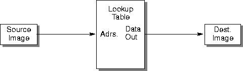
>
> ------------------------------------------------------------------------
>
> []{#51273}
>
> ***Figure 7-8*  Lookup Table**
>
> The lookup table is first loaded with the necessary data. [Table
> 7-2](Image-enhance.doc.html#51279) shows a partial listing of an
> example lookup table. In this example, the input values range from 0
> to 255. The output values provide a scaled square root transformation
> between the input and output, according to the following equation:
>
> :   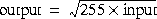
>       ------------------------------------
>       [Input]{#51283}   [Output]{#51285}
>       ----------------- ------------------
>       [0]{#51287}\      [0]{#51289}\
>
>       [1]{#51291}\      [16]{#51293}\
>
>       [2]{#51295}\      [23]{#51297}\
>
>       [3]{#51299}\      [28]{#51301}\
>
>       [.]{#51303}\      [.]{#51305}\
>
>       [253]{#51307}\    [254]{#51309}\
>
>       [254]{#51332}\    [255]{#51334}\
>
>       [255]{#51336}\    [255]{#51338}\
>       ------------------------------------
>
>       :  **[*Table 7-2*  Example Lookup
>       Table]{#51279}**
>
> This example provides a non-linear amplitude transformation between
> input and output pixel values, in which the smaller input amplitude
> values are amplified and the larger input values are attenuated. Other
> types of lookup values can be used to solve nearly any non-linear
> amplitude scaling problem.
>
> []{#51408}
>
> ### 7.6.1 Creating the Lookup Table
>
> The `LookupTableJAI` object represents a single- or multi-banded table
> or a color cube of any supported data types. A single- or multi-banded
> source image of integer data types is passed through the table and
> transformed into a single- or multi-banded destination image of both
> integral and float or double data types.
>
> The `LookupTableJAI` object is used for the `ErrorDiffusion`
> operation, where it describes a color map, and the `Lookup` operation,
> where it describes the lookup table. For the `Lookup` operation, the
> table data may cover only a subrange of the legal range of the input
> data type. The subrange is selected by means of an offset parameter
> that is to be subtracted from the input value before indexing into the
> table array.
>
> The procedures for constructing a lookup table vary slightly,
> depending on whether the input image is single-banded or multi-banded.
> For a single-band input image, you construct a single lookup table.
> For a multi-band image, you construct a single lookup table with
> entries for each band.
>
> []{#56774}
>
> #### 7.6.1.1 Creating a Single-band Lookup Table
>
> The single-banded lookup table contains data for a single channel or
> image component. To create a lookup table for a single-band input
> image, use one of the single-band constructors. The constructors take
> up to three parameters:
>
> -   A pointer to the data to be stored in the table. The data may be
>     of type `Byte`, `Short`, `UShort`, `Int`, `Float`, or `Double`.
>
> <!-- -->
>
> -   The offset. The offset selects the lookup table subrange. The
>     offset value is subtracted from the input value before indexing
>     into the table array.
>
> <!-- -->
>
> -   A boolean flag that indicates whether Short data is of type Short
>     or UShort.
>
> [Listing 7-3](Image-enhance.doc.html#69572) shows an example of the
> construction of a single-band byte lookup table.
>
> **[]{#69572}**
>
> ***Listing 7-3*  Example Single-band Lookup
> Table**
>
> ------------------------------------------------------------------------
>
>          byte[] tableData = new byte[0x10000];
>          for (int i = 0; i < 0x10000; i++) {
>          tableData[i] = (byte)(i >> 8);
>          }
>          
>          // Create a LookupTableJAI object to be used with the
>          // "lookup" operator.
>          LookupTableJAI table = new LookupTableJAI(tableData);
>
> ------------------------------------------------------------------------
>
> +-----------------------------------+-----------------------------------+
> |            | -------------------------------   |
> |                                   |                                   |
> |                                   | **API:**                          |
> |                                   | `javax.media.jai.LookupTableJAI`  |
> |                                   |                                   |
> |                                   | -------------------------------   |
> +-----------------------------------+-----------------------------------+
>
>     LookupTableJAI(byte[] data)
>
> :   constructs a single-banded byte lookup table with an index offset
>     of 0.
>       --------------- -------- -----------------------------
>       *Parameters*:   `data`   The single-banded byte data
>       --------------- -------- -----------------------------
>
>       : 
>
> <!-- -->
>
>     LookupTableJAI(byte[] data, int offset)
>
> :   constructs a single-banded byte lookup table with an index offset.
>     *Parameters*:
>     `data`
>     The single-banded byte data
>     `offset`
>     The offset
>
> <!-- -->
>
>     LookupTableJAI(short[] data, boolean isUShort)
>
> :   constructs a single-banded short or unsigned short lookup table
>     with an index offset of 0.
>     *Parameters*:
>     `data`
>     The single-banded short data
>     `isUShort`
>     True if the data type is `DataBuffer.TYPE_USHORT`; false if the
>     data type is `DataBuffer.TYPE_SHORT`.
>
> <!-- -->
>
>     LookupTableJAI(short[] data, int offset, boolean isUShort)
>
> :   constructs a single-banded short or unsigned short lookup table
>     with an index offset.
>     *Parameters*:
>     `data`
>     The single-banded short data
>     `offset`
>     The offset
>     `isUShort`
>     True if the data type is `DataBuffer.TYPE_USHORT`; false if the
>     data type is `DataBuffer.TYPE_SHORT`.
>
> <!-- -->
>
>     LookupTableJAI(int[] data)
>
> :   constructs a single-banded int lookup table with an index offset
>       --------------- -------- ----------------------------
>       *Parameters*:   `data`   The single-banded int data
>       --------------- -------- ----------------------------
>
>       : 
>
> <!-- -->
>
>     LookupTableJAI(int[] data, int offset)
>
> :   constructs a single-banded int lookup table with an index offset
>     *Parameters*:
>     `data`
>     The single-banded int data
>     `offset`
>     The offset
>
> <!-- -->
>
>     LookupTableJAI(float[] data)
>
> :   constructs a single-banded float lookup table with an index offset
>     of 0
>       --------------- -------- ------------------------------
>       *Parameters*:   `data`   The single-banded float data
>       --------------- -------- ------------------------------
>
>       : 
>
> <!-- -->
>
>     LookupTableJAI(float[] data, int offset)
>
> :   constructs a single-banded float lookup table with an index offset
>     *Parameters*:
>     `data`
>     The single-banded float data
>     `offset`
>     The offset
>
> <!-- -->
>
>     LookupTableJAI(double[] data)
>
> :   constructs a single-banded double lookup table with an index
>     offset of 0
>       --------------- -------- -------------------------------
>       *Parameters*:   `data`   The single-banded double data
>       --------------- -------- -------------------------------
>
>       : 
>
> <!-- -->
>
>     LookupTableJAI(double[] data, int offset)
>
> :   constructs a single-banded double lookup table with an index
>     offset
>     *Parameters*:
>     `data`
>     The single-banded double data
>     `offset`
>     The offset
>
> []{#56722}
>
> #### 7.6.1.2 Creating a Multi-band Lookup Table
>
> The multi-band lookup table contains data for more than one channels
> or image components, such as separate arrays for R, G, and B. To
> create a lookup table for a multi-band input image, use one of the
> multi-band constructors. Like the single-band constructors, the
> multi-band constructors take up to three parameters:
>
> -   A pointer to the data to be stored in the table. The data may be
>     of type Byte, Short, UShort, Int, Float, or Double.
>
> <!-- -->
>
> -   The offset. The offset selects the lookup table subrange. The
>     offset value is subtracted from the input value before indexing
>     into the table array. The constructors allow you to specify one
>     offset for all of the bands or separate offsets for each band.
>
> <!-- -->
>
> -   A boolean flag that indicates whether Short data is of type Short
>     or UShort.
>
> [Listing 7-4](Image-enhance.doc.html#69599) shows an example of the
> construction of a multi-banded byte lookup table.
>
> **[]{#69599}**
>
> ***Listing 7-4*  Example Multi-band Lookup
> Table**
>
> ------------------------------------------------------------------------
>
>          // Create the table data.
>          byte[][] tableData = new byte[3][0x10000];
>          for (int i = 0; i < 0x10000; i++) {
>          tableData[0][i] = (byte)(i >> 8); // this may be different
>          tableData[1][i] = (byte)(i >> 8); // for each band
>          tableData[2][i] = (byte)(i >> 8);
>          }
>
>          // Create a LookupTableJAI object to be used with the
>          // "lookup" operator.
>          LookupTableJAI table = new LookupTableJAI(tableData);
>
> ------------------------------------------------------------------------
>
> +-----------------------------------+-----------------------------------+
> |            | -------------------------------   |
> |                                   |                                   |
> |                                   | **API:**                          |
> |                                   | `javax.media.jai.LookupTableJAI`  |
> |                                   |                                   |
> |                                   | -------------------------------   |
> +-----------------------------------+-----------------------------------+
>
>     LookupTableJAI(byte[][] data)
>
> :   constructs a multi-banded byte lookup table with an index offset
>     for each band of 0.
>       --------------- -------- --------------------------------------------------------
>       *Parameters*:   `data`   The multi-banded byte data in \[band\]\[index\] format
>       --------------- -------- --------------------------------------------------------
>
>       : 
>
> <!-- -->
>
>     LookupTableJAI(byte[][] data, int offset)
>
> :   constructs a multi-banded byte lookup table where all bands have
>     the same index offset.
>     *Parameters*:
>     `data`
>     The multi-banded byte data in \[band\]\[index\] format
>     `offset`
>     The common offset for all bands
>
> <!-- -->
>
>     LookupTableJAI(byte[][] data, int[] offsets)
>
> :   constructs a multi-banded byte lookup table where each band has a
>     different index offset.
>     *Parameters*:
>     `data`
>     The multi-banded byte data in \[band\]\[index\] format
>     `offsets`
>     The offsets for the bands
>
> <!-- -->
>
>     LookupTableJAI(short[][] data, boolean isUShort)
>
> :   constructs a multi-banded short or unsigned short lookup table.
>     The index offset for each band is 0
>     *Parameters*:
>     `data`
>     The multi-banded short data in \[band\]\[index\] format.
>     `isUShort`
>     True if the data type is `DataBuffer.TYPE_USHORT`; false if the
>     data type is `DataBuffer.TYPE_SHORT`.
>
> <!-- -->
>
>     LookupTableJAI(short[][] data, int offset, boolean isUShort)
>
> :   constructs a multi-banded short or unsigned short lookup table
>     where all bands have the same index offset
>     *Parameters*:
>     `data`
>     The multi-banded short data in \[band\]\[index\] format
>     `offset`
>     The common offset for all bands
>     `isUShort`
>     True if the data type is `DataBuffer.TYPE_USHORT`; false if the
>     data type is `DataBuffer.TYPE_SHORT`.
>
> <!-- -->
>
>     LookupTableJAI(short[][] data, int[] offsets, boolean isUShort)
>
> :   constructs a multi-banded short or unsigned short lookup table
>     where each band has a different index offset
>     *Parameters*:
>     `data`
>     The multi-banded short data in \[band\]\[index\] format
>     `offset`
>     The offsets for the bands
>     `isUShort`
>     True if the data type is `DataBuffer.TYPE_USHORT`; false if the
>     data type is `DataBuffer.TYPE_SHORT`.
>
> <!-- -->
>
>     LookupTableJAI(int[][] data)
>
> :   constructs a multi-banded int lookup table. The index offset for
>     each band is 0
>       --------------- -------- -------------------------------------------------------
>       *Parameters*:   `data`   The multi-banded int data in \[band\]\[index\] format
>       --------------- -------- -------------------------------------------------------
>
>       : 
>
> <!-- -->
>
>     LookupTableJAI(int[][] data, int offset)
>
> :   constructs a multi-banded int lookup table where all bands have
>     the same index offset
>     *Parameters*:
>     `data`
>     The multi-banded int data in \[band\]\[index\] format
>     `offset`
>     The common offset for all bands
>
> <!-- -->
>
>     LookupTableJAI(int[][] data, int[] offsets)
>
> :   constructs a multi-banded int lookup table where each band has a
>     different index offset
>     *Parameters*:
>     `data`
>     The multi-banded int data in \[band\]\[index\] format
>     `offset`
>     The offsets for the bands
>
> <!-- -->
>
>     LookupTableJAI(float[][] data)
>
> :   constructs a multi-banded float lookup table. The index offset for
>     each band is 0
>       --------------- -------- ---------------------------------------------------------
>       *Parameters*:   `data`   The multi-banded float data in \[band\]\[index\] format
>       --------------- -------- ---------------------------------------------------------
>
>       : 
>
> <!-- -->
>
>     LookupTableJAI(float[][] data, int offset)
>
> :   constructs a multi-banded float lookup table where all bands have
>     the same index offset
>     *Parameters*:
>     `data`
>     The multi-banded float data in \[band\]\[index\] format
>     `offset`
>     The common offset for all bands
>
> <!-- -->
>
>     LookupTableJAI(float[][] data, int[] offsets)
>
> :   constructs a multi-banded float lookup table where each band has a
>     different index offset
>     *Parameters*:
>     `data`
>     The multi-banded float data in \[band\]\[index\] format
>     `offset`
>     The offsets for the bands
>
> <!-- -->
>
>     LookupTableJAI(double[][] data)
>
> :   constructs a multi-banded double lookup table. The index offset
>     for each band is 0
>       --------------- -------- ----------------------------------------------------------
>       *Parameters*:   `data`   The multi-banded double data in \[band\]\[index\] format
>       --------------- -------- ----------------------------------------------------------
>
>       : 
>
> <!-- -->
>
>     LookupTableJAI(double[][] data, int offset)
>
> :   constructs a multi-banded double lookup table where all bands have
>     the same index offset
>     *Parameters*:
>     `data`
>     The multi-banded double data in \[band\]\[index\] format
>     `offset`
>     The common offset for all bands
>
> <!-- -->
>
>     LookupTableJAI(double[][] data, int[] offsets)
>
> :   constructs a multi-banded double lookup table where each band has
>     a different index offset
>     *Parameters*:
>     `data`
>     The multi-banded double data in \[band\]\[index\] format
>     `offsets`
>     The offsets for the bands
>
> []{#62701}
>
> #### 7.6.1.3 Creating a Color-cube Lookup Table
>
> Dithering operations that use a color cube are considerably faster
> than those that use a generic lookup table. However, the color cube
> provides less control over the exact contents of the lookup table.
>
> The `ColorCube` class is a subclass of `LookupTableJAI` and represents
> a color cube lookup table. You create a colorcube using one of the
> `ColorCube.createColorCube` methods. Rather than specifying the data
> to be loaded into the lookup table, you provide an array of
> `dimensions`. The `dimensions` parameter specifies the size (or number
> of levels) of each band of the image.
>
> Although a color cube implies three dimensions, that is not always the
> case. The color cube has the same number of `dimensions` as the image
> has bands. For example, a monochrome image requires only one
> `dimension` parameter.
>
> The values in the `dimensions` parameter are signed. A positive value
> indicates that the corresponding color ramp increases. A negative
> value indicates that the ramp decreases.
>
> JAI provides two predefined color cubes, which can be used for the
> ordered dither operation (see [Section 6.6.1, \"Ordered
> Dither](Image-manipulation.doc.html#56241)\"):
>
>   -------------------------------------------------------------------------------------------------------------------------------------------------------------------------------------------------------------------------------------------------------------------------------------------------------------------------------------------------------------------------------------------
>   [ColorCube]{#64972}    [Description]{#64974}
>   ---------------------- --------------------------------------------------------------------------------------------------------------------------------------------------------------------------------------------------------------------------------------------------------------------------------------------------------------------------------------------------------------------
>   [BYTE\_496]{#64977}\   [A ColorCube with dimensions 4:9:6, useful for dithering RGB images into 216 colors. The offset of this ColorCube is 38. This color cube dithers blue values in the source image to one of 4 blue levels, green values to one of 9 green levels, and red values to one of 6 red levels. This is the default color cube for the ordered dither operation.]{#64979}\
>
>   [BYTE\_855]{#64982}\   [A ColorCube with dimensions 8:5:5, useful for dithering YC~b~C~r~ images into 200 colors. The offset of this ColorCube is 54. This color cube dithers blue values in the source image to one of 8 blue levels, green values to one of 5 green levels, and red values to one of 5 red levels.]{#64984}\
>   -------------------------------------------------------------------------------------------------------------------------------------------------------------------------------------------------------------------------------------------------------------------------------------------------------------------------------------------------------------------------------------------
>
>   : 
>
> These color cubes are specified by the `colorMap` parameter that is
> required by the `OrderedDither` operation.
>
> +-----------------------------------+-----------------------------------+
> |            | -------------------------------   |
> |                                   |                                   |
> |                                   | **API:**                          |
> |                                   | `javax.media.jai.ColorCube`       |
> |                                   |                                   |
> |                                   | -------------------------------   |
> +-----------------------------------+-----------------------------------+
>
>     static ColorCube createColorCube(int dataType, int offset, 
>            int[] dimensions)
>
> :   creates a multi-banded `ColorCube` of a specified data type.
>     *Parameters*:
>     `dataType`
>     The data type of the `ColorCube`. One of `DataBuffer.TYPE_BYTE`,
>     `DataBuffer.TYPE_SHORT`, `DataBuffer.TYPE_USHORT`,
>     `DataBuffer.TYPE_INT`, `DataBuffer.TYPE_FLOAT`, or
>     `DataBuffer.TYPE_DOUBLE`.
>     `offset`
>     The common offset for all bands.
>     `dimensions`
>     The signed dimensions for each band.
>
> <!-- -->
>
>     static ColorCube createColorCube(int dataType, 
>            int[]  dimensions)
>
> :   create a multi-banded `ColorCube` of a specified data type with
>     zero offset for all bands.
>     *Parameters*:
>     `dataType`
>     The data type of the `ColorCube`. One of `DataBuffer.TYPE_BYTE`,
>     `DataBuffer.TYPE_SHORT`, `DataBuffer.TYPE_USHORT`,
>     `DataBuffer.TYPE_INT`, `DataBuffer.TYPE_FLOAT`, or
>     `DataBuffer.TYPE_DOUBLE`.
>     `dimensions`
>     The signed dimensions for each band.
>
> <!-- -->
>
>     static ColorCube createColorCubeByte(int[] dimensions)
>
> :   constructs a multi-banded byte `ColorCube`.
>       --------------- -------------- --------------------------------------------------------
>       *Parameters*:   `dimensions`   A list of signed sizes of each side of the color cube.
>       --------------- -------------- --------------------------------------------------------
>
>       : 
>
> <!-- -->
>
>     static ColorCube createColorCubeByte(int offset, 
>            int[]  dimensions)
>
> :   constructs a multi-banded byte ColorCube with an index offset
>     common to all bands.
>     *Parameters*:
>     `offset`
>     The common offset for all bands.
>     `dimensions`
>     A list of signed sizes of each side of the color cube.
>
> <!-- -->
>
>     static ColorCube createColorCubeShort(int[] dimensions)
>
> :   constructs a multi-banded short `ColorCube`.
>
> <!-- -->
>
>     static ColorCube createColorCubeShort(int offset, 
>            int[]  dimensions)
>
> :   constructs a multi-banded short `ColorCube` with an index offset
>     common to all bands.
>
> <!-- -->
>
>     static ColorCube createColorCubeUShort(int[] dimensions)
>
> :   constructs a multi-banded unsigned short `ColorCube`.
>
> <!-- -->
>
>     static ColorCube createColorCubeUShort(int offset, 
>            int[]  dimensions)
>
> :   constructs a multi-banded unsigned short `ColorCube` with an index
>     offset common to all bands.
>
> <!-- -->
>
>     static ColorCube createColorCubeInt(int[] dimensions)
>
> :   constructs a multi-banded int `ColorCube`.
>
> <!-- -->
>
>     static ColorCube createColorCubeInt(int offset, 
>            int[]  dimensions)
>
> :   constructs a multi-banded int `ColorCube` with an index offset
>     common to all bands.
>
> <!-- -->
>
>     static ColorCube createColorCubeFloat(int[] dimensions)
>
> :   constructs a multi-banded float `ColorCube`.
>
> <!-- -->
>
>     static ColorCube createColorCubeFloat(int offset, 
>            int[]  dimensions)
>
> :   constructs a multi-banded float ColorCube with an index offset
>     common to all bands.
>
> <!-- -->
>
>     static ColorCube createColorCubeDouble(int[] dimensions)
>
> :   constructs a multi-banded double `ColorCube` with an index offset
>     common to all bands.
>
> <!-- -->
>
>     static ColorCube createColorCubeDouble(int offset, 
>            int[]  dimensions)
>
> :   constructs a multi-banded double `ColorCube` with an index offset
>     common to all bands.
>
> []{#56300}
>
> ### 7.6.2 Performing the Lookup
>
> The `lookup` operation performs a general table lookup on a rendered
> or renderable image. The destination image is obtained by passing the
> source image through the lookup table. The source image may be single-
> or multi-banded of data types `byte`, `ushort`, `short`, or `int`. The
> lookup table may be single- or multi-banded of any JAI-supported data
> types.
>
> The destination image must have the same data type as the lookup
> table, and its number of bands is determined based on the number of
> bands of the source and the table. If the source is single-banded, the
> destination has the same number of bands as the lookup table;
> otherwise, the destination has the same number of bands as the source.
>
> If either the source or the table is single-banded and the other one
> is multi-banded, the single band is applied to every band of the
> multi-banded object. If both are multi-banded, their corresponding
> bands are matched up.
>
> The table may have a set of offset values, one for each band. This
> value is subtracted from the source pixel values before indexing into
> the table data array.
>
> It is the user\'s responsibility to make certain the lookup table
> supplied is suitable for the source image. Specifically, the table
> data must cover the entire range of the source data. Otherwise, the
> result of this operation is undefined.
>
> By the nature of this operation, the destination may have a different
> number of bands and/or data type from the source. The `SampleModel` of
> the destination is created in accordance with the actual lookup table
> used in a specific case.
>
> There are three specific cases of table lookup that determine the
> pixel values of the destination image:
>
> -   If the source image is single-banded and the lookup table is
>     single- or multi-banded, the destination image has the same number
>     of bands as the lookup table:
>
> <!-- -->
>
>               for (int h = 0; h < dstHeight; h++) {
>                   for (int w = 0; w < dstWidth; w++) {
>                       for (int b = 0; b < dstNumBands; b++) {
>                           dst[h][w][b] = table[b][src[h][w][0] - offsets[b]]
>                       }
>                   }
>               }
>          
>
> -   If the source image is multi-banded and the lookup table is
>     single-banded, the destination image has the same number of bands
>     as the source image:
>
> <!-- -->
>
>               for (int h = 0; h < dstHeight; h++) {
>                   for (int w = 0; w < dstWidth; w++) {
>                       for (int b = 0; b < dstNumBands; b++) {
>                           dst[h][w][b] = table[0][src[h][w][b] - offsets[0]]
>                      }
>                    }
>               }
>          
>
> -   If the source image is multi-banded and the lookup table is
>     multi-banded, with the same number of bands as the source image,
>     the destination image will have the same number of bands as the
>     source image:
>
> <!-- -->
>
>               for (int h = 0; h < dstHeight; h++) {
>                   for (int w = 0; w < dstWidth; w++) {
>                       for (int b = 0; b < dstNumBands; b++) {
>                           dst[h][w][b] = table[b][src[h][w][b] - offsets[b]]
>                       }
>                   }
>               }
>
> The `lookup` operation takes one rendered or renderable source image
> and one parameter:
>
>   -------------------------------------------------------------------------------------------------------------------------
>   [Parameter]{#61187}   [Type]{#61189}              [Description]{#61191}
>   --------------------- --------------------------- -----------------------------------------------------------------------
>   [table]{#61193}\      [LookupTableJAI]{#61195}\   [The lookup table through which the source image is passed.]{#61197}\
>
>   -------------------------------------------------------------------------------------------------------------------------
>
>   : 
>
> See [Section 7.6.1, \"Creating the Lookup
> Table](Image-enhance.doc.html#51408)\" for more information.
>
> For a complete example of the `Lookup` operation, see [Listing A-1 on
> page 417](Examples.doc.html#73865).
>
> []{#64998}
>
> ### 7.6.3 Other Lookup Table Operations
>
> []{#52351}
>
> #### 7.6.3.1 Reading the Table Data
>
> Several methods are available to read the current contents of the
> lookup table. The choice of method depends on the data format: byte,
> short, integer, floating-point, or double floating-point.
>
> +-----------------------------------+-----------------------------------+
> |            | -------------------------------   |
> |                                   |                                   |
> |                                   | **API:**                          |
> |                                   | `javax.media.jai.LookupTableJAI`  |
> |                                   |                                   |
> |                                   | -------------------------------   |
> +-----------------------------------+-----------------------------------+
>
>     java.awt.image.DataBuffer getData()
>
> :   returns the table data as a `DataBuffer`.
>
> <!-- -->
>
>     byte[][] getByteData()
>
> :   returns the byte table data in array format.
>
> <!-- -->
>
>     byte[] getByteData(int band)
>
> :   returns the byte table data of a specific band in array format.
>
> <!-- -->
>
>     short[][] getShortData()
>
> :   returns the short table data in array format.
>
> <!-- -->
>
>     short[] getShortData(int band)
>
> :   returns the short table data of a specific band in array format.
>
> <!-- -->
>
>     int[][] getIntData()
>
> :   returns the integer table data in array format.
>
> <!-- -->
>
>     int[] getIntData(int band)
>
> :   returns the integer table data of a specific band in array format.
>
> <!-- -->
>
>     float[][] getFloatData()
>
> :   returns the float table data in array format.
>
> <!-- -->
>
>     float[] getFloatData(int band)
>
> :   returns the float table data of a specific band in array format.
>
> <!-- -->
>
>     double[][] getDoubleData()
>
> :   returns the double table data in array format.
>
> <!-- -->
>
>     double[] getDoubleData(int band)
>
> :   returns the double table data of a specific band in array format.
>
> []{#57653}
>
> #### 7.6.3.2 Reading the Table Offsets
>
> There are three methods for reading the offset values within the
> current lookup table.
>
> +-----------------------------------+-----------------------------------+
> |            | -------------------------------   |
> |                                   |                                   |
> |                                   | **API:**                          |
> |                                   | `javax.media.jai.LookupTableJAI`  |
> |                                   |                                   |
> |                                   | -------------------------------   |
> +-----------------------------------+-----------------------------------+
>
>     int[] getOffsets()
>
> :   returns the index offsets of entry 0 for all bands.
>
> <!-- -->
>
>     int getOffset()
>
> :   returns the index offset of entry 0 for the default band.
>
> <!-- -->
>
>     int getOffset(int band)
>
> :   returns the index offset of entry 0 for a specific band.
>       --------------- -------- ------------------
>       *Parameters*:   `band`   The band to read
>       --------------- -------- ------------------
>
>       : 
>
> []{#57714}
>
> #### 7.6.3.3 Reading the Number of Bands
>
> A single method is used to read the number of bands in the lookup
> table.
>
> +-----------------------------------+-----------------------------------+
> |            | -------------------------------   |
> |                                   |                                   |
> |                                   | **API:**                          |
> |                                   | `javax.media.jai.LookupTableJAI`  |
> |                                   |                                   |
> |                                   | -------------------------------   |
> +-----------------------------------+-----------------------------------+
>
>     int getNumBands()
>
> :   returns the number of bands of the table.
>
> []{#57734}
>
> #### 7.6.3.4 Reading the Number of Entries Per Band
>
> A single method is used to read the number of entries per band in the
> lookup table.
>
> +-----------------------------------+-----------------------------------+
> |            | -------------------------------   |
> |                                   |                                   |
> |                                   | **API:**                          |
> |                                   | `javax.media.jai.LookupTableJAI`  |
> |                                   |                                   |
> |                                   | -------------------------------   |
> +-----------------------------------+-----------------------------------+
>
>     int getNumEntries()
>
> :   returns the number of entries per band of the table.
>
> []{#57754}
>
> #### 7.6.3.5 Reading the Data Type
>
> A single method is used to read the data type of the lookup table.
>
> +-----------------------------------+-----------------------------------+
> |            | -------------------------------   |
> |                                   |                                   |
> |                                   | **API:**                          |
> |                                   | `javax.media.jai.LookupTableJAI`  |
> |                                   |                                   |
> |                                   | -------------------------------   |
> +-----------------------------------+-----------------------------------+
>
>     int getDataType()
>
> :   returns the data type of the table data.
>
> []{#57774}
>
> #### 7.6.3.6 Reading the Destination Bands and SampleModel
>
> +-----------------------------------+-----------------------------------+
> |            | -------------------------------   |
> |                                   |                                   |
> |                                   | **API:**                          |
> |                                   | `javax.media.jai.LookupTableJAI`  |
> |                                   |                                   |
> |                                   | -------------------------------   |
> +-----------------------------------+-----------------------------------+
>
>     int getDestNumBands(int sourceNumBands)
>
> :   returns the number of bands of the destination image, based on the
>     number of bands of the source image and lookup table.
>       --------------- ------------------- ------------------------------------------
>       *Parameters*:   `sourceNum-Bands`   The number of bands of the source image.
>       --------------- ------------------- ------------------------------------------
>
>       : 
>
> <!-- -->
>
>     java.awt.image.SampleModel 
>            getDestSampleModel(java.awt.image.SampleModel 
>            srcSampleModel)
>
> :   returns a `SampleModel` suitable for holding the output of a
>     lookup operation on the source data described by a given
>     `SampleModel` with this table. The width and height of the
>     destination `SampleModel` are the same as that of the source. This
>     method returns null if the source `SampleModel` has a non-integral
>     data type.
>       --------------- ------------------- ----------------------------------------
>       *Parameters*:   `srcSample-Model`   The `SampleModel` of the source image.
>       --------------- ------------------- ----------------------------------------
>
>       : 
>
> <!-- -->
>
>     java.awt.image.SampleModel 
>            getDestSampleModel(java.awt.image.SampleModel 
>            srcSampleModel, int width, int height)
>
> :   returns a `SampleModel` suitable for holding the output of a
>     lookup operation on the source data described by a given
>     `SampleModel` with this table. This method will return null if the
>     source `SampleModel` has a non-integral data type.
>     *Parameters*:
>     `srcSample-Model`
>     The `SampleModel` of the source image.
>     `width`
>     The width of the destination `SampleModel`.
>     `height`
>     The height of the destination `SampleModel`.
>
> []{#51172}
>
> 7.7 Convolution Filtering
> ----------------------------------------------
>
> Convolution filtering is often used to reduce the effects of noise in
> images or to sharpen the detail in blurred images. Convolution
> filtering is a form of *spatial filtering* that computes each output
> sample by multiplying elements of a kernel with the samples
> surrounding a particular source sample.
>
> Convolution filtering operates on a group of input pixels surrounding
> a center pixel. The adjoining pixels provide important information
> about brightness trends in the area of the pixel being processed.
>
> Convolution filtering moves across the source image, pixel by pixel,
> placing resulting pixels into the destination image. The resulting
> brightness of each source pixel depends on the group of pixels
> surrounding the source pixel. Using the brightness information of the
> source pixel\'s neighbors, the convolution process calculates the
> spatial frequency activity in the area, making it possible to filter
> the brightness based on the spatial frequency of the area.
>
> Convolution filtering uses a *convolve kernel*, containing an array of
> convolution coefficient values, called *key elements*, as shown in
> [Figure 7-9](Image-enhance.doc.html#52989). The array is not
> restricted to any particular size, and does not even have to be
> square. The kernel can be 1 x 1, 3 x 3, 5 x 5, `M` x `N, `and so on. A
> larger kernel size affords a more precise filtering operation by
> increasing the number of neighboring pixels used in the calculation.
> However, the kernel cannot be bigger in any dimension than the image
> data. Also, the larger the kernel, the more computations that are
> required to be performed. For example, given a 640 x 480 image and a 3
> x 3 kernel, the convolve operation requires over five million total
> multiplications and additions.
>
> The convolution filtering operation computes each output sample by
> multiplying the key elements of the kernel with the samples
> surrounding a particular source pixel. For each destination pixel, the
> kernel is rotated 180 degrees and its key element is placed over the
> source pixel corresponding with the destination pixel. The key
> elements are multiplied with the source pixels under them, and the
> resulting products are summed together to produce the destination
> sample value.
>
> The selection of the weights for the key elements determines the
> nature of the filtering action, such as *high-pass* or *low-pass*. If
> the values of the key elements are the reciprocal of the number of key
> elements in the kernel (for example, 1/9 for a 3 x 3 kernel), the
> result is a conventional low-pass averaging process. If the weights
> are altered, certain pixels in the kernel will have an increased or
> decreased influence in the average. [Figure
> 7-10](Image-enhance.doc.html#53832) shows three example convolve
> filters, low-pass, high-pass, and Laplacian.
>
> []{#52987}
>
> ------------------------------------------------------------------------
>
> 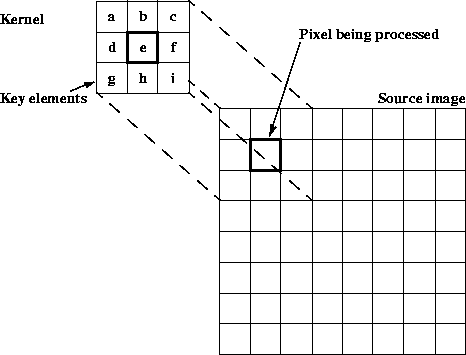
>
> ------------------------------------------------------------------------
>
> []{#52989}
>
> ***Figure 7-9*  Convolve Kernel**
>
> []{#53830}
>
> ------------------------------------------------------------------------
>
> 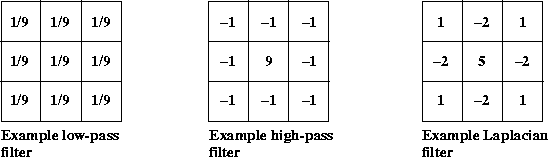
>
> ------------------------------------------------------------------------
>
> []{#53832}
>
> ***Figure 7-10*  Convolve Filter Samples**
>
> The low-pass filter, also known as a *box filter*, attenuates the
> high-spatial frequency components of an image and has little affect on
> the low-frequency components. The effect of passing an image through a
> low-pass filter is a slight blurring. This is caused by attenuating
> the sharp brightness transitions between edges and makes the image
> appear to have less detail. See also [Section 7.7.2, \"Box
> Filter](Image-enhance.doc.html#59705).\"
>
> The high-pass filter has the opposite effect of the low-pass filter,
> accentuating the high-frequency components and offering little affect
> on the low-frequency components. The effect of passing an image
> through a high-pass filter is a sharper image with increased detail in
> the areas of brightness transition.
>
> The Laplacian filter is another image detail sharpening filter that
> works well for noise-free images. This filter subtracts the brightness
> values of the four neighboring pixels from the central pixel. The
> result of applying this filter is to reduce the gray level to zero.
>
> []{#53067}
>
> ### 7.7.1 Performing the Convolve Operation
>
> The following example code shows a `convolve` operation on a single
> sample `dst[x][y]`, which assumes that the kernel is of size `M` x `N`
> and has already been rotated through 180 degrees. The kernel\'s key
> element is located at position (`xKey`, `yKey`).
>
>          dst[x][y] = 0;
>              for (int i = -xOrigin; i < -xOrigin + width; i++) {
>              for (int j = -yOrigin; j < -yOrigin + height; j++) {
>                dst[x][y] += src[x + i][y + j]*kernel[xOrigin + i][yOrigin + j];
>               }
>          }
>
> Convolution, or any neighborhood operation, leaves a band of pixels
> around the edges undefined. For example, for a 3 x 3 kernel, only four
> kernel elements and four source pixels contribute to the destination
> pixel located at (0,0). Such pixels are not included in the
> destination image. A border extension may be added via the
> `BorderExtender` class. The type of border extension can be specified
> as a `RenderingHint` to the `JAI.create` method. If no border
> extension type is provided, a default extension of
> `BorderExtender.BORDER_COPY` will be used to perform the extension.
> See [Section 3.7.3, \"Rendering
> Hints](Programming-environ.doc.html#55991).\"
>
> The `convolve` operation takes one rendered source image and one
> parameter:
>
>   ------------------------------------------------------------------------------------------------------------------------------------------------------------------
>   [Parameter]{#69382}   [Type]{#69384}         [Description]{#69386}
>   --------------------- ---------------------- ---------------------------------------------------------------------------------------------------------------------
>   [kernel]{#69388}\     [KernelJAI]{#69390}\   [The convolution kernel. See]{#69394} [Section 6.9, \"Constructing a Kernel](Image-manipulation.doc.html#70882).\"\
>
>   ------------------------------------------------------------------------------------------------------------------------------------------------------------------
>
>   : 
>
> The default `kernel` is `null`.
>
> [Listing 7-5](Image-enhance.doc.html#69630) shows a code sample for a
> `Convolve` operation.
>
> **[]{#69630}**
>
> ***Listing 7-5*  Example Convolve Operation**
>
> ------------------------------------------------------------------------
>
>          // Create the kernel.
>          kernel = new KernelJAI
>          float[] = {  0.0F, -1.0F,  0.0F,
>                      -1.0F,  5.0F, -1.0F,
>                       0.0F, -1.0F,  0.0F };
>
>          // Create the convolve operation.
>          im1 = JAI.create("convolve", im, kernel);
>
> ------------------------------------------------------------------------
>
> []{#59705}
>
> ### 7.7.2 Box Filter
>
> The `BoxFilter` operation is a special case of convolve operation in
> which each source pixel contributes the same weight to the destination
> pixel. The box filter operation determines the intensity of a pixel in
> an image by averaging the source pixels within a rectangular area
> around the pixel. The pixel values of the destination image are
> defined by the following pseudocode:
>
>          int count = width * height; // # of pixels in the box
>          for (int b = 0; b < numBands; b++) {
>               int total = 0;
>               for (int j = -yKey; j < -yKey + height; j++) {
>                    for (int i = -xKey; i < -xKey + width; i++) {
>                        total += src[x+i][y+j][b];
>                     }
>                }
>               dst[x][y][b] = (total + count/2) / count; // round
>          }
>
> The `BoxFilter` operation uses a low-pass filter that passes (leaves
> untouched) the low spatial frequency components of the image and
> attenuates the high-frequency components. In an area of the image that
> has constant brightness, the brightness values are passed untouched.
> When the filter passes over an area of sharp black to white
> transitions, the brightness range is greatly attenuated.
>
> Convolution, like any neighborhood operation, leaves a band of pixels
> around the edges undefined. For example, for a 3 x 3 kernel, only four
> kernel elements and four source pixels contribute to the convolution
> pixel at the corners of the source image. Pixels that do not allow the
> full kernel to be applied to the source are not included in the
> destination image. A `Border` operation (see [Section 7.2, \"Adding
> Borders to Images](Image-enhance.doc.html#68364)\") may be used to add
> an appropriate border to the source image to avoid shrinkage of the
> image boundaries.
>
> The kernel may not be bigger in any dimension than the image data.
>
> The `BoxFilter` operation takes one rendered source image and four
> parameters:
>
>   --------------------------------------------------------------------------------------------
>   [Parameter]{#61238}   [Type]{#61240}       [Description]{#61242}
>   --------------------- -------------------- -------------------------------------------------
>   [width]{#76667}\      [Integer]{#76669}\   [The width of the box.]{#76671}\
>
>   [height]{#76673}\     [Integer]{#76675}\   [The height of the box.]{#76677}\
>
>   [xKey]{#61244}\       [Integer]{#61246}\   [The *x* position of the key element.]{#61248}\
>
>   [yKey]{#61250}\       [Integer]{#61252}\   [The *y* position of the key element.]{#61254}\
>   --------------------------------------------------------------------------------------------
>
>   : 
>
> The `width` parameter is required. The remaining parameters may be
> `null` and, if not supplied, default to the following values:
>
> :   
>
>     ------------------------------------------------------------------------
>
>     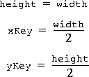
>
>     ------------------------------------------------------------------------
>
> [Listing 7-6](Image-enhance.doc.html#69683) shows a code sample for a
> `BoxFilter` operation.
>
> **[]{#69683}**
>
> ***Listing 7-6*  Example BoxFilter Operation**
>
> ------------------------------------------------------------------------
>
>          // Read the arguments.
>          String fileName = args.length > 0 ? args[0] : DEFAULT_FILE;
>          int width = args.length > 1 ?
>              Integer.decode(args[1]).intValue() : DEFAULT_SIZE;
>          int height = args.length > 2 ?
>              Integer.decode(args[2]).intValue() : width;
>
>          new BoxFilterExample(fileName, width, height);
>          }
>
>          public BoxFilterExample(String fileName, int width, int height)
>
>          // Load the image.
>          RenderedOp src =  JAI.create("fileload", fileName);
>
>          // Create the BoxFilter operation.
>          RenderedOp dst = JAI.create("boxfilter", src,
>                                      width, height,
>                                      width/2, height/2);
>
> ------------------------------------------------------------------------
>
> []{#66803}
>
> 7.8 Median Filtering
> -----------------------------------------
>
> A median filter is used to remove impulse noise spikes from an image
> and thus smoothing the image. Impulse noise spikes appear as bright or
> dark pixels randomly distributed throughout the image. Noise spikes
> are normally significantly brighter or darker than their neighboring
> pixels and can easily be found by comparing the median value of a
> group of input pixels.
>
> The median filter is a neighborhood-based ranking filter in which the
> pixels in the neighborhood are ranked in the order of their levels.
> The median value of the group is then stored in the output pixel. The
> resulting image is then free of pixel brightnesses that are at the
> extremes in each input group of pixels.
>
> The noise-reducing effect that the median filter has on an image
> depends on two related things: the spatial extent of the neighborhood
> (the mask) and the number of pixels involved in the computation. The
> `MedianFilter` operation supports three different mask shapes, a
> square, a plus, and an X-shape, as shown in [Figure
> 7-11](Image-enhance.doc.html#66848).
>
> []{#66845}
>
> ------------------------------------------------------------------------
>
> 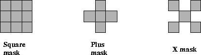
>
> ------------------------------------------------------------------------
>
> []{#66848}
>
> ***Figure 7-11*  Median Filter Masks**
>
> The `MedianFilter` operation may also be used to compute the
> *separable median* of a 3 x 3 or 5 x 5 region of pixels. The separable
> median is defined as the median of the medians of each row. For
> example, if the pixel values in a 3 x 3 window are as follows:
>
> []{#66871}
>
> ------------------------------------------------------------------------
>
> 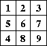
>
> ------------------------------------------------------------------------
>
> the overall (non-separable) median value is 5, while the separable
> median is equal to the median of the three row medians: median(1, 2,
> 3) = 2, median(5, 6, 7) = 6, and median(4, 8, 9) = 8, yielding an
> overall median of 6. The separable median may be obtained by
> specifying a mask of type `MEDIAN_MASK_SQUARE_SEPARABLE`.
>
> The `MedianFilter` operation takes one rendered source image and two
> parameters:
>
>   ----------------------------------------------------------------------------------------------------------------------------------------------------
>   [Parameter]{#66877}    [Type]{#66879}       [Default]{#66881}   [Description]{#66883}
>   ---------------------- -------------------- ------------------- ------------------------------------------------------------------------------------
>   [maskShape]{#66885}\   [Integer]{#66887}\   [MASK\_\            [The shape of the mask to be used for Median Filtering]{#66891}\
>                                               SQUARE]{#66889}\    
>
>   [maskSize]{#66893}\    [Integer]{#66895}\   [3]{#66897}\        [The size (width and height) of the mask to be used in Median Filtering.]{#66899}\
>   ----------------------------------------------------------------------------------------------------------------------------------------------------
>
>   : 
>
> The `maskShape` parameter is one of the following:
>
>   ----------------------------------------------------------------------------------------------------------------
>   [maskShape]{#66904}               [Description]{#66906}
>   --------------------------------- ------------------------------------------------------------------------------
>   [MEDIAN\_MASK\_SQUARE]{#66909}\   [A square-shaped mask. The default.]{#66911}\
>
>   [MEDIAN\_MASK\_PLUS]{#66914}\     [A plus-shaped mask.]{#66916}\
>
>   [MEDIAN\_MASK\_X]{#66919}\        [An X-shaped mask.]{#66921}\
>
>   [MEDIAN\_MASK\_SQUARE\_\          [A separable square mask, used for the separable median operation.]{#66925}\
>   SEPARABLE]{#66923}\               
>   ----------------------------------------------------------------------------------------------------------------
>
>   : 
>
> The `maskSize` parameter must be 1 (1 x 1) or greater. The default
> value, if one is not provided, is 3 (3 x 3). For large masks, the
> noise reduction effect of more pixels used in the computation of the
> median value reaches a point of diminishing returns. Typical mask
> sizes are 3 x 3 and 5 x 5.
>
> []{#59829}
>
> 7.9 Frequency Domain Processing
> ----------------------------------------------------
>
> Images contain spatial details that are seen as brightness
> transitions, cycling from dark to light and back to dark. The rate at
> which the transitions occur in an image represent the image\'s
> *spatial frequency*.
>
> An image\'s spatial frequency can be measured horizontally,
> vertically, or at any diagonal in between. An image contains many
> spatial frequencies that, when combined in the correct magnitude and
> phase, form the complex details of the image.
>
> A *frequency transform* decomposes an image from its spatial domain
> form of brightness into a frequency domain form of fundamental
> frequency components. Each frequency component contains a magnitude
> and phase value. An *inverse frequency transform* converts an image
> from its frequency form back to its spatial form.
>
> []{#65663}
>
> ### 7.9.1 Fourier Transform
>
> JAI supports the most common type of frequency transform, the
> *discrete Fourier transform* and its inverse, the inverse discrete
> Fourier transform. The discrete Fourier transform of an image is a
> two-dimensional process. The result of the transform is a
> two-dimensional array of values, each having two parts: real and
> imaginary. Each value represents a distinct spatial frequency
> component. The frequency-transform image has as many values as there
> are pixels in the source image.
>
> The real portion of the values can be displayed as an image, visually
> showing the frequency components of the source image. The result is in
> \"wrap around\" order, with the zero-frequency point (also known as
> \"DC\" for direct current) at the upper left corner and the high
> frequencies at the center.
>
> []{#64002}
>
> #### 7.9.1.1 Discrete Fourier Transform
>
> The `DFT` (discrete Fourier transform) operation computes the discrete
> Fourier transform of an image. A negative exponential is used as the
> basis function for the transform. The operation supports
> real-to-complex, complex-to-complex, and complex-to-real transforms. A
> complex image must have an even number of bands, with the even bands
> (0, 2, etc.) representing the real parts and the odd bands (1, 3,
> etc.) the imaginary parts of each complex pixel.
>
> If an underlying fast Fourier transform (FFT) implementation is used
> that requires that the image dimensions be powers of 2, the width and
> height may each be increased to the power of 2 greater than or equal
> to the original width and height, respectively.
>
> The `dft` operation takes one rendered or renderable source image and
> two parameters.
>
>   ----------------------------------------------------------------------------------------------------------------------------------------------------------------------------------------------------
>   [Parameter]{#64052}      [Type]{#64054}       [Description]{#64056}
>   ------------------------ -------------------- ------------------------------------------------------------------------------------------------------------------------------------------------------
>   [scalingType]{#64058}\   [Integer]{#64060}\   [The type of scaling to perform. One of DFTDescriptor.SCALING\_NONE, DFTDescriptor.SCALING\_UNITARY, or DFTDescriptor.SCALING\_DIMENSIONS.]{#64062}\
>
>   [dataNature]{#70169}\    [Integer]{#70171}\   [The nature of the data. One of DFTDescriptor.REAL\_TO\_COMPLEX, DFTDescriptor.COMPLEX\_TO\_COMPLEX, or]{#70173}\
>                                                 [DFTDescriptor.COMPLEX\_TO\_REAL.]{#70208}\
>   ----------------------------------------------------------------------------------------------------------------------------------------------------------------------------------------------------
>
>   : 
>
> The default parameters for this operation are `SCALING_NONE` and
> `REAL_TO_COMPLEX`.
>
> The `scalingType` parameter defines how the image dimensions may be
> scaled, as follows:
>
>   ----------------------------------------------------------------------------------------------------------------------------------------------
>   [scalingType]{#64767}                          [Description]{#64769}
>   ---------------------------------------------- -----------------------------------------------------------------------------------------------
>   [DFTDescriptor.SCALING\_NONE]{#64772}\         [The transform is not to be scaled (the default).]{#64774}\
>
>   [DFTDescriptor.SCALING\_UNITARY]{#64777}\      [The transform is to be scaled by the square root of the product of its dimensions.]{#64779}\
>
>   [DFTDescriptor.SCALING\_DIMENSIONS]{#64782}\   [The transform is to be scaled by the product of its dimensions.]{#64784}\
>   ----------------------------------------------------------------------------------------------------------------------------------------------
>
>   : 
>
> The `dataNature` parameter specifies the nature of the source and
> destination data, as follows.
>
>   -----------------------------------------------------------------------------------------------------------------------
>   [dataNature]{#76420}                            [Description]{#76422}
>   ----------------------------------------------- -----------------------------------------------------------------------
>   [DFTDescriptor.REAL\_TO\_COMPLEX]{#76425}\      [The source data are real and the destination data complex.]{#76427}\
>
>   [DFTDescriptor.COMPLEX\_TO\_COMPLEX]{#76430}\   [The source and destination data are both complex.]{#76432}\
>
>   [DFTDescriptor.COMPLEX\_TO\_REAL]{#76435}\      [The source data are complex and the destination data real.]{#76437}\
>   -----------------------------------------------------------------------------------------------------------------------
>
>   : 
>
> If the source data are complex, the number of bands in the source
> image must be a multiple of 2. The number of bands in the destination
> must match that which would be expected given the number of bands in
> the source image and the specified nature of the source and
> destination data. If the source image is real, the number of bands in
> the destination will be twice that in the source. If the destination
> image is real, the number of bands in the destination will be half
> that in the source. Otherwise the number of bands in the source and
> destination must be equal.
>
> The `DFT` operation defines a `PropertyGenerator` that sets the
> `COMPLEX` property of the image to `FALSE` if the `dataNature`
> parameter is `COMPLEX_TO_REAL` and to `TRUE` if the `dataNature`
> parameter is `REAL_TO_COMPLEX` or `COMPLEX_TO_COMPLEX`. The value of
> this property may be retrieved by calling the getProperty() method
> with `COMPLEX` as the property name.
>
> [Listing 7-7](Image-enhance.doc.html#70321) shows a code sample for a
> `DFT` operation.
>
> **[]{#70321}**
>
> ***Listing 7-7*  Example DFT Operation**
>
> ------------------------------------------------------------------------
>
>          // Create the ParameterBlock.
>          ParameterBlock pb = new ParameterBlock();
>          pb.addSource(src)
>          pb.add(DFTDescriptor.SCALING_NONE);
>          pb.add(DFTDescriptor.REAL_TO_COMPLEX);
>
>          // Create the DFT operation.
>          PlanarImage dft = (PlanarImage)JAI.create("dft", pb, null);
>
>          // Get the DFT image information.
>          int width = dft.getWidth();
>          int height = dft.getHeight();
>          int numBands = dft.getSampleModel().getNumBands();
>          int dataType = dft.getSampleModel().getDataType();
>
>          // Calculate the cutoff "frequencies" from the threshold.
>          threshold /= 200.0F;
>          int minX = (int)(width*threshold);
>          int maxX = width - 1 - minX;
>          int minY = (int)(height*threshold);
>          int maxY = height - 1 - minY;
>
>          // Retrieve the DFT data.
>          Raster dftData = dft.getData();
>          double[] real =
>               dftData.getSamples(0, 0, width, height, 0, (double[])null);
>          double[] imag =
>               dftData.getSamples(0, 0, width, height, 1, (double[])null);
>
>          double[] HR = new double[real.length];
>          double[] HI = new double[imag.length];
>          double[] LR = new double[real.length];
>          double[] LI = new double[imag.length];
>
> ------------------------------------------------------------------------
>
> []{#59922}
>
> #### 7.9.1.2 Inverse Discrete Fourier Transform
>
> The `IDFT` (inverse discrete Fourier transform) operation computes the
> inverse discrete Fourier transform of an image. A positive exponential
> is used as the basis function for the transform. The operation
> supports real-to-complex, complex-to-complex, and complex-to-real
> transforms. A complex image must have an even number of bands, with
> the even bands (0, 2, etc.) representing the real parts and the odd
> bands (1, 3, etc.) the imaginary parts of each complex pixel.
>
> If an underlying fast Fourier transform (FFT) implementation is used
> that requires that the image dimensions be powers of 2, the width and
> height may each be increased to the power of 2 greater than or equal
> to the original width and height, respectively.
>
> The `IDFT` operation takes one rendered or renderable source image and
> two parameters.
>
>   ----------------------------------------------------------------------------------------------------------------------------------------------------------------------------------------------------
>   [Parameter]{#64139}      [Type]{#64141}       [Description]{#64143}
>   ------------------------ -------------------- ------------------------------------------------------------------------------------------------------------------------------------------------------
>   [scalingType]{#64145}\   [Integer]{#64147}\   [The type of scaling to perform. One of DFTDescriptor.SCALING\_NONE, DFTDescriptor.SCALING\_UNITARY, or DFTDescriptor.SCALING\_DIMENSIONS.]{#64149}\
>
>   [dataNature]{#70383}\    [Integer]{#70385}\   [The nature of the data. One of DFTDescriptor.REAL\_TO\_COMPLEX, DFTDescriptor.COMPLEX\_TO\_COMPLEX, or]{#70387}\
>                                                 [DFTDescriptor.COMPLEX\_TO\_REAL.]{#70388}\
>   ----------------------------------------------------------------------------------------------------------------------------------------------------------------------------------------------------
>
>   : 
>
> The default parameters for this operation are `SCALING_DIMENSIONS` and
> `COMPLEX_TO_REAL`.
>
> The `scalingType` parameter defines how the image dimensions may be
> scaled, as follows:
>
>   ----------------------------------------------------------------------------------------------------------------------------------------------
>   [scalingType]{#64684}                          [Description]{#64686}
>   ---------------------------------------------- -----------------------------------------------------------------------------------------------
>   [DFTDescriptor.SCALING\_NONE]{#64688}\         [The transform is not to be scaled.]{#64690}\
>
>   [DFTDescriptor.SCALING\_UNITARY]{#64692}\      [The transform is to be scaled by the square root of the product of its dimensions.]{#64694}\
>
>   [DFTDescriptor.SCALING\_DIMENSIONS]{#64696}\   [The transform is to be scaled by the product of its dimensions (the default).]{#64698}\
>   ----------------------------------------------------------------------------------------------------------------------------------------------
>
>   : 
>
> The `dataNature` parameter specifies the nature of the source and
> destination data, as follows.
>
>   -----------------------------------------------------------------------------------------------------------------------
>   [dataNature]{#76394}                            [Description]{#76396}
>   ----------------------------------------------- -----------------------------------------------------------------------
>   [DFTDescriptor.REAL\_TO\_COMPLEX]{#76399}\      [The source data are real and the destination data complex.]{#76401}\
>
>   [DFTDescriptor.COMPLEX\_TO\_COMPLEX]{#76404}\   [The source and destination data are both complex.]{#76406}\
>
>   [DFTDescriptor.COMPLEX\_TO\_REAL]{#76409}\      [The source data are complex and the destination data real.]{#76411}\
>   -----------------------------------------------------------------------------------------------------------------------
>
>   : 
>
> If the source data are complex, the number of bands in the source
> image must be a multiple of 2. The number of bands in the destination
> must match that which would be expected given the number of bands in
> the source image and the specified nature of the source and
> destination data. If the source image is real, the number of bands in
> the destination will be twice that in the source. If the destination
> image is real, the number of bands in the destination will be half
> that in the source. Otherwise the number of bands in the source and
> destination must be equal.
>
> The `IDFT` operation defines a `PropertyGenerator` that sets the
> `COMPLEX` property of the image to `FALSE` if the `dataNature`
> parameter is `COMPLEX_TO_REAL` and to `TRUE` if the `dataNature`
> parameter is `REAL_TO_COMPLEX` or `COMPLEX_TO_COMPLEX`. The value of
> this property may be retrieved by calling the getProperty() method
> with `COMPLEX` as the property name.
>
> []{#65675}
>
> ### 7.9.2 Cosine Transform
>
> The discrete cosine transform (DCT) is similar to the discrete Fourier
> transform (see [Section 7.9.1.1, \"Discrete Fourier
> Transform](Image-enhance.doc.html#64002)\"). However, the DCT is
> better at compactly representing very small images. Like the discrete
> Fourier transform (DFT), the DCT also has an inverse operation, the
> *inverse discrete cosine transform* (IDCT).
>
> []{#65622}
>
> #### 7.9.2.1 Discrete Cosine Transform (DCT)
>
> The `DCT` operation computes the even discrete cosine transform of an
> image. Each band of the destination image is derived by performing a
> two-dimensional DCT on the corresponding band of the source image.
>
> The `DCT` operation takes one rendered or renderable source image and
> no parameters.
>
> [Listing 7-8](Image-enhance.doc.html#69770) shows a code sample for a
> DCT operation.
>
> **[]{#69770}**
>
> ***Listing 7-8*  Example DCT Operation**
>
> ------------------------------------------------------------------------
>
>          // Load the source image.
>          RenderedImage src = (RenderedImage)JAI.create("fileload",
>                              fileName);
>
>          // Calculate a DCT image from the source image.
>          ParameterBlock pb = (new ParameterBlock()).addSource(src);
>          PlanarImage dct = JAI.create("dct", pb, null);
>
>          // Get the DCT image data.
>          int width = dct.getWidth();
>          int height = dct.getHeight();
>          int numBands = dct.getSampleModel().getNumBands();
>          int dataType = dct.getSampleModel().getDataType();
>          double[] dctData =
>              dct.getData().getPixels(0, 0, width, height,
>                                     (double[])null);
>          double[] pixels = new double[dctData.length];
>
> ------------------------------------------------------------------------
>
> []{#65632}
>
> #### 7.9.2.2 Inverse Discrete Cosine Transform (IDCT)
>
> The `IDCT` operation computes the inverse even discrete cosine
> transform of an image. Each band of the destination image is derived
> by performing a two-dimensional inverse DCT on the corresponding band
> of the source image.
>
> The `IDCT` operation takes one rendered or renderable source image and
> no parameters.
>
> [Listing 7-9](Image-enhance.doc.html#69814) shows a code sample for an
> operation that first takes the discrete cosine transform of an image,
> then computes the inverse discrete cosine transform.
>
> **[]{#69814}**
>
> ***Listing 7-9*  Example IDCT Operation**
>
> ------------------------------------------------------------------------
>
>          // Calculate a DCT image from the source image.
>          System.out.println("Creating DCT of source image ...");
>          ParameterBlock pb = (new ParameterBlock()).addSource(src);
>          PlanarImage dct = JAI.create("dct", pb, null);
>
>          // Calculate an IDCT image from the DCT image.
>          System.out.println("Creating IDCT of DCT of source image ...");
>          pb = (new ParameterBlock()).addSource(dct);
>          PlanarImage idct = JAI.create("idct", pb, null);
>
>          // Create display image for inverse DCT of DCT of source image.
>          System.out.println("Creating display image for IDCT of DCT");
>          pixels = idct.getData().getPixels(0, 0, width, height,
>                                            (double[])pixels);
>          BufferedImage bi = createBI(colorImage, width, height, pixels);
>
> ------------------------------------------------------------------------
>
> []{#66700}
>
> ### 7.9.3 Magnitude Enhancement
>
> The `magnitude` operation computes the magnitude of each pixel of a
> complex image. The source image must have an even number of bands,
> with the even bands (0, 2, etc.) representing the real parts and the
> odd bands (1, 3, etc.) the imaginary parts of each complex pixel. The
> destination image has at most half the number of bands of the source
> image with each sample in a pixel representing the magnitude of the
> corresponding complex source sample.
>
> The magnitude values of the destination image are defined by the
> following pseudocode:
>
>          dstPixel[x][y][b] = sqrt(src[x][y][2b]2 + src[x][y][2b + 1]2)
>
> :   where the number of bands *b* varies from zero to one less than
>     the number of bands in the destination image.
>
> For integral image data types, the result is rounded and clamped as
> needed.
>
> The `magnitude` operation takes one rendered or renderable source
> image containing complex data and no parameters.
>
> [Listing 7-10](Image-enhance.doc.html#69889) shows a code sample for a
> `magnitude` operation.
>
> **[]{#69889}**
>
> ***Listing 7-10*  Example Magnitude
> Operation**
>
> ------------------------------------------------------------------------
>
>          // Calculate a DFT image from the source image.
>          pb = new ParameterBlock();
>          pb.addSource(src).add(DFTDescriptor.SCALING_NONE);
>          PlanarImage dft = JAI.create("dft", pb, null);
>
>          // Create the ParameterBlock specifying the source image.
>          pb = new ParameterBlock();
>          pb.addSource(dft);
>
>          // Calculate the magnitude.
>          PlanarImage magnitude = JAI.create("magnitude", pb, null);
>
> ------------------------------------------------------------------------
>
> []{#66728}
>
> ### 7.9.4 Magnitude-squared Enhancement
>
> The `MagnitudeSquared` operation computes the squared magnitude of
> each pixel of a complex image. The source image must have an even
> number of bands, with the even bands (0, 2, etc.) representing the
> real parts and the odd bands (1, 3, etc.) the imaginary parts of each
> complex pixel. The destination image has at most half the number of
> bands of the source image with each sample in a pixel representing the
> magnitude of the corresponding complex source sample.
>
> The squared magnitude values of the destination image are defined by
> the following pseudocode:
>
>          dstPixel[x][y][b] = src[x][y][2b]2 + src[x][y][2b + 1]2
>
> :   where the number of bands *b* varies from zero to one less than
>     the number of bands in the destination image.
>
> For integral image data types, the result is rounded and clamped as
> needed.
>
> The `MagnitudeSquared` operation takes one rendered or renderable
> source image containing complex data and no parameters.
>
> []{#66739}
>
> ### 7.9.5 Phase Enhancement
>
> The `Phase` operation computes the phase angle of each pixel of a
> complex image. The source image must have an even number of bands,
> with the even bands (0, 2, etc.) representing the real parts and the
> odd bands (1, 3, etc.) the imaginary parts of each complex pixel. The
> destination image has at most half the number of bands of the source
> image with each sample in a pixel representing the phase angle of the
> corresponding complex source sample.
>
> The angle values of the destination image are defined by the following
> pseudocode:
>
>          dst[x][y][b] = atan2(src[x][y][2b + 1], src[x][y][2b])
>
> :   where the number of bands *b* varies from zero to one less than
>     the number of bands in the destination image.
>
> For integral image data types, the result is rounded and scaled so the
> \"natural\" arctangent range from \[-,
> ) is remapped into the range \[0, MAXVALUE).
> The result for floating point image data types is the value returned
> by the `atan2()` method.
>
> The `phase` operation takes one rendered or renderable source image
> containing complex data and no parameters.
>
> []{#66360}
>
> ### 7.9.6 Complex Conjugate
>
> The `Conjugate` operation computes the complex conjugate of a complex
> image. The operation negates the imaginary components of a rendered or
> renderable source image containing complex data. The source image must
> contain an even number of bands with the even-indexed bands (0, 2,
> etc.) representing the real and the odd-indexed bands (1, 3, etc.) the
> imaginary parts of each pixel. The destination image similarly
> contains an even number of bands with the same interpretation and with
> contents defined by:
>
>          dst[x][y][2*k]   =  src[x][y][2*k];
>          dst[x][y][2*k+1] = -src[x][y][2*k+1];
>
> :   where the index *k* varies from zero to one less than the number
>     of complex components in the destination image.
>
> The `Conjugate` operation takes one rendered or renderable source
> image containing complex data and no parameters.
>
> []{#66438}
>
> ### 7.9.7 Periodic Shift
>
> The `PeriodicShift` operation computes the periodic translation of an
> image. The destination image of the `PeriodicShift` operation is the
> infinite periodic extension of the source image with horizontal and
> vertical periods equal to the image width and height, respectively,
> shifted by a specified amount along each axis and clipped to the
> bounds of the source image. Thus for each band *b* the destination
> image sample at location (*x*,*y*) is defined by:
>
>          if(x < width - shiftX) {
>              if(y < height - shiftY) {
>                  dst[x][y][b] = src[x + shiftX][y + shiftY][b];
>              } else {
>                  dst[x][y][b] = src[x + shiftX][y - height + shiftY][b];
>              }
>          } else {
>              if(y < height - shiftY) {
>                  dst[x][y][b] = src[x - width + shiftX][y + shiftY][b];
>              } else {
>                  dst[x][y][b] = src[x - width + shiftX][y - height +
>                                                         shiftY][b];
>              }
>          }
>
> :   where `shiftX` and `shiftY` denote the translation factors along
>     the *x* and *y* axes, respectively.
>
> The `PeriodicShift` operation takes one rendered or renderable source
> image and two parameters.
>
>   ----------------------------------------------------------------------------------------------
>   [Parameter]{#67392}   [Type]{#67394}       [Description]{#67396}
>   --------------------- -------------------- ---------------------------------------------------
>   [shiftX]{#67398}\     [Integer]{#67400}\   [The displacement in the *x* direction.]{#67402}\
>
>   [shiftY]{#67404}\     [Integer]{#67406}\   [The displacement in the *y* direction.]{#67408}\
>   ----------------------------------------------------------------------------------------------
>
>   : 
>
> []{#67381}
>
> ### 7.9.8 Polar to Complex
>
> The `PolarToComplex` operation computes a complex image from a
> magnitude and a phase image. The operation creates an image with
> complex-valued pixels from two images, the respective pixel values of
> which represent the magnitude (modulus) and phase of the corresponding
> complex pixel in the destination image.
>
> The source images should have the same number of bands. The first
> source image contains the magnitude values and the second source image
> the phase values. The destination will have twice as many bands with
> the even-indexed bands (0, 2, etc.) representing the real and the
> odd-indexed bands (1, 3, etc.) the imaginary parts of each pixel.
>
> The pixel values of the destination image are defined for a given
> complex sample by the following pseudocode:
>
>          dst[x][y][2*b]   = src0[x][y][b]*Math.cos(src1[x][y][b])
>          dst[x][y][2*b+1] = src0[x][y][b]*Math.sin(src1[x][y][b])
>
> :   where the index *b* varies from zero to one less than the number
>     of bands in the source images.
>
> For phase images with integral data type, it is assumed that the
> actual phase angle is scaled from the range \[-`PI`, `PI`\] to the
> range \[0, `MAX_VALUE`\] where `MAX_VALUE` is the maximum value of the
> data type in question.
>
> The `PolarToComplex` operation takes two rendered or renderable source
> images and no parameters.
>
> []{#67438}
>
> ### 7.9.9 Images Based on a Functional Description
>
> The `ImageFunction` operation generates an image from a functional
> description. This operation permits the creation of images on the
> basis of a functional specification, which is provided by an object
> that is an instance of a class that implements the
> `javax.media.jai.ImageFunction` interface. In other words, to use this
> operation, a class containing the functional information must be
> created and this class must implement the `ImageFunction` interface.
>
> The `ImageFunction` interface merely defines the minimal set of
> methods required to represent such a function. The actual
> implementation of a class implementing this interface is left to the
> programmer.
>
> For example, if the function you wanted to generate was the negative
> exponential
>
>              exp(-|x| - |y|)
>
> The `javax.media.jai.ImageFunction` implementation would return the
> following values:
>
> -   `isComplex()` would return false
>
> <!-- -->
>
> -   `getNumElements()` would return 1
>
> <!-- -->
>
> -   `float[] real = new real[width*height];getElements(x, y, width, height, real, null);`
>
> and the implementation would initialize the array `real` such that
>
>          real[j*width + i] = exp(-|x + i| - |y + j|)
>
> or, equivalently
>
>          real[k] = exp(-|x + (k % width)]| - |y + (k / width)|)
>
> :   where 0  k \< width\*height.
>
> The (*x*,*y*) coordinates passed to the `ImageFunction.getElements()`
> methods are derived by applying an optional translation and scaling to
> the image *x* and *y* coordinates. The image *x* and *y* coordinates
> as usual depend on the values of the minimum *x* and *y* coordinates
> of the image, which need not be zero.
>
> Specifically, the function coordinates passed to `getElements()` are
> calculated from the image coordinates as:
>
>          functionX = xScale*imageX + xTrans;
>          functionY = yScale*imageY + yTrans;
>
> The number of bands in the destination image will be equal to the
> value returned by the `ImageFunction.getNumElements()` method unless
> the `ImageFunction.isComplex()` method returns `true`, in which case
> it will be twice that. The data type of the destination image is
> determined by the `SampleModel` specified by an `ImageLayout` object
> provided via a hint. If no layout hint is provided, the data type will
> default to single-precision floating point.
>
> The double precision floating point form of the `getElements()` method
> will be invoked if and only if the data type is specified to be
> `double`. For all other data types the single precision form of
> `getElements()` will be invoked and the destination sample values will
> be clamped to the data type of the image.
>
> The `ImageFunction` operation takes seven parameters.
>
>   -----------------------------------------------------------------------------------------
>   [Parameter]{#67738}   [Type]{#67740}             [Description]{#67742}
>   --------------------- -------------------------- ----------------------------------------
>   [function]{#67744}\   [ImageFunction]{#67746}\   [The functional description.]{#67748}\
>
>   [width]{#67750}\      [Integer]{#67752}\         [The image width.]{#67754}\
>
>   [height]{#67756}\     [Integer]{#67797}\         [The image height.]{#67760}\
>
>   [xScale]{#67762}\     [Float]{#67799}\           [The *x* scale factor.]{#67766}\
>
>   [yScale]{#67768}\     [Float]{#67803}\           [The *y* scale factor.]{#67772}\
>
>   [xTrans]{#67774}\     [Float]{#67805}\           [The *x* translation.]{#67778}\
>
>   [yTrans]{#67780}\     [Float]{#67807}\           [The *y* translation.]{#67784}\
>   -----------------------------------------------------------------------------------------
>
>   : 
>
> The image width and height are provided explicitly as parameters.
> These values override the width and height specified by an
> `ImageLayout` if such is provided.
>
> +-----------------------------------+-----------------------------------+
> |            | -------------------------------   |
> |                                   |                                   |
> |                                   | **API:**                          |
> |                                   | `javax.media.jai.ImageFunction`   |
> |                                   |                                   |
> |                                   | -------------------------------   |
> +-----------------------------------+-----------------------------------+
>
>     boolean isComplex();
>
> :   returns whether or not each value\'s elements are complex.
>
> <!-- -->
>
>     int getNumElements();
>
> :   returns the number of elements per value at each position.
>
> <!-- -->
>
>     void getElements(float startX, float startY, float deltaX, 
>            float deltaY, int countX, int countY, int element, 
>            float[]  real, float[] imag);
>
> :   returns all values of a given element for a specified set of
>     coordinates.
>     *Parameters*:
>     `startX`
>     The *x* coordinate of the upper left location to evaluate.
>     `startY`
>     The *y* coordinate of the upper left location to evaluate.
>     `deltaX`
>     The horizontal increment.
>     `deltaY`
>     The vertical increment.
>     `countX`
>     The number of points in the horizontal direction.
>     `countY`
>     The number of points in the vertical direction.
>     `element`
>     The element.
>     `real`
>     A pre-allocated float array of length at least `countX`\*`countY`
>     in which the real parts of all elements will be returned.
>     `imag`
>     A pre-allocated float array of length at least `countX`\*`countY`
>     in which the imaginary parts of all elements will be returned; may
>     be null for real data, i.e., when `isComplex()` returns false.
>
> <!-- -->
>
>     void getElements(double startX, double startY, double deltaX, 
>            double deltaY, int countX, int countY, int element, 
>            double[]  real, double[] imag);
>
> :   returns all values of a given element for a specified set of
>     coordinates.
>
> []{#60152}
>
> 7.10 Single-image Pixel Point Processing
> -------------------------------------------------------------
>
> Pixel point operations are the most basic, yet necessary image
> processing operations. The pixel point operations are primarily
> contrast enhancement operations that alter the gray levels of an
> image\'s pixels. One-by-one, the gray level of each pixel in the
> source image is modified to a new value, usually by a mathematical
> relationship.
>
> JAI supports the following single-image pixel point operations:
>
> -   Pixel inverting (`Invert`)
>
> <!-- -->
>
> -   Logarithmic enhancement (`Log`)
>
> []{#64866}
>
> ### 7.10.1 Pixel Inverting
>
> The `Invert` operation inverts the pixel values of an image. For
> source images with signed data types, the pixel values of the
> destination image are defined by the following pseudocode:
>
>          dst[x][y][b] = -src[x][y][b]
>
> For unsigned data types, the destination values are defined by the
> following pseudocode:
>
>          dst[x][y][b] = MAX_VALUE - src[x][y][b]
>
> :   where `MAX_VALUE` is the maximum value supported by the system of
>     the data type of the source pixel.
>
> The `Invert` operation takes one rendered or renderable source image
> and no parameters.
>
> [Figure 7-12](Image-enhance.doc.html#76289) shows a simple example of
> an `Invert` operation.
>
> []{#76288}
>
> ------------------------------------------------------------------------
>
> 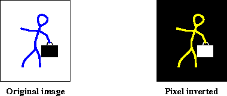
>
> ------------------------------------------------------------------------
>
> []{#76289}
>
> ***Figure 7-12*  Pixel Inverting**
>
> []{#60051}
>
> ### 7.10.2 Logarithmic Enhancement
>
> Occasionally, it is desirable to quantize an image on a logarithmic
> scale rather than a linear scale. The human eye has a logarithmic
> intensity response but some images are digitized by equipment that
> quantizes the samples on a linear scale. To make the image better for
> use by a human observer, these images may be made to have a
> logarithmic response by the `Log` operation.
>
> The `Log` operation takes the logarithm of the pixel values of the
> source image. The pixel values of the destination image are defined by
> the following pseudocode:
>
>          dst[x][y][b] = java.lang.Math.log(src[x][y][b])
>
> For integral image data types, the result is rounded and clamped as
> needed. For all integral data types, the log of 0 is set to 0. For
> signed integral data types (`short` and `int`), the log of a negative
> pixel value is set to -1. For all floating point data types (`float`
> and `double`), the log of 0 is set to -`Infinity`, and the log of a
> negative pixel value is set to `NaN`.
>
> The `Log` operation takes one rendered or renderable source image and
> no parameters.
>
> [Listing 7-11](Image-enhance.doc.html#69925) shows a code sample for a
> `Log` operation.
>
> **[]{#69925}**
>
> ***Listing 7-11*  Example Log Operation**
>
> ------------------------------------------------------------------------
>
>          // Create the ParameterBlock specifying the source image.
>          pb = new ParameterBlock();
>          pb.addSource(image);
>
>          // Create the Log operation.
>          RenderedImage dst = JAI.create("log", pb);
>
> ------------------------------------------------------------------------
>
> []{#60966}
>
> 7.11 Dual Image Pixel Point Processing
> -----------------------------------------------------------
>
> The previous section described pixel point operations for single
> images. This section deals with pixel point processing on two images,
> also known as *dual-image point processing*. Dual-image point
> processing maps two pixel brightnesses, one from each image, to an
> output image.
>
> JAI supports the following dual-image pixel point operations:
>
> -   Overlay images (`Overlay` operation)
>
> <!-- -->
>
> -   Image compositing (`Composite` operation)
>
> []{#60992}
>
> ### 7.11.1 Overlay Images
>
> The `Overlay` operation takes two rendered or renderable source
> images, and overlays the second source image on top of the first
> source image. Usually, the images are identical scenes, but may have
> been acquired at different times through different spectral filters.
>
> The two source images must have the same data type and number of
> bands. However, their `SampleModel` types may differ. The destination
> image will always have the same bounding rectangle as the first source
> image, that is, the image on the bottom, and the same data type and
> number of bands as the two source images. If the two source images
> don\'t intersect, the destination will be the same as the first
> source.
>
> The `Overlay` operation is defined by the following pseudocode:
>
>          if (srcs[1] contains the point (x, y)) {
>              dst[x][y][b] = srcs[1][x][y][b];
>          } else {
>              dst[x][y][b] = srcs[0][x][y][b];
>          }
>
> The `Overlay` operation takes two rendered or renderable source images
> and no parameters.
>
> []{#61005}
>
> ### 7.11.2 Image Compositing
>
> The `Composite` operation merges unrelated objects from two images.
> The result is a new image that didn\'t exist before. The `Composite`
> operation combines two images based on their alpha values at each
> pixel. This is done on a per-band basis, and the source images are
> expected to have the same number of bands and the same data type. The
> destination image has the same data type as the two sources, but one
> extra band than the source images, which represents the result alpha
> channel.
>
> The destination pixel values may be viewed as representing a
> fractional pixel coverage or transparency factor. Specifically, the
> `Composite` operation implements the Porter-Duff \"over\"
> rule[^1^](#61010), in which the output color of a pixel with source
> value and alpha tuples (*A*, *a*) and (*B*, *b*) is given by:
>
> :   *a*\**A* + (1 - *a*)\*(*b*\**B*)
>
> The output alpha value is given by:
>
> :   *a* + (1 - *a*)\**b*
>
> For premultiplied sources tuples (*a*\**A*, *a*) and (*b*\**B*, *b*),
> the premultiplied output value is simply:
>
> :   (*a*\**A*) + (1 - *a*)\*(*b*\**B*)
>
> The color channels of the two source images are supplied via `source1`
> and `source2`. The two sources must either both be pre-multiplied by
> alpha or not. Alpha channel should not be included in `source1` and
> `source2`.
>
> The `Composite` operation takes two rendered or renderable source
> images and four parameters:
>
>   -----------------------------------------------------------------------------------------------------------------------------------------------------------------------------------------------------------------------------------------------------------------------------------------------------------------------------------------------------
>   [Parameter]{#61126}             [Type]{#61128}           [Description]{#61130}
>   ------------------------------- ------------------------ --------------------------------------------------------------------------------------------------------------------------------------------------------------------------------------------------------------------------------------------------------------------------------------------
>   [source1Alpha]{#61132}\         [PlanarImage]{#61134}\   [An alpha image to override the alpha for the first source.]{#61136}\
>
>   [source2Alpha]{#61138}\         [PlanarImage]{#61140}\   [An alpha image to override the alpha for the second source.]{#61142}\
>
>   [alphaPremultiplied]{#61144}\   [Boolean]{#61146}\       [True if alpha has been premultiplied to both sources and the destination.]{#61148}\
>
>   [destAlpha]{#61150}\            [Integer]{#61152}\       [Indicates if the destination image should include an extra alpha channel, and if so, whether it should be the first or last band. One of: CompositeDescriptor.DESTINATION\_ALPHA\_FIRST CompositeDescriptor.DESTINATION\_ALPHA\_LAST CompositeDescriptor.NO\_DESTINATION\_ALPHA]{#76916}\
>   -----------------------------------------------------------------------------------------------------------------------------------------------------------------------------------------------------------------------------------------------------------------------------------------------------------------------------------------------------
>
>   : 
>
> The alpha channel of the first source images must be supplied via the
> `source1Alpha` parameter. This parameter may not be null. The alpha
> channel of the second source image may be supplied via the
> `source2Alpha` parameter. This parameter may be null, in which case
> the second source is considered completely opaque. The alpha images
> should be single-banded, and have the same data type as the source
> image.
>
> The `alphaPremultiplied` parameter indicates whether or not the
> supplied alpha image is premultiplied to both the source images.
>
> The destination image is the combination of the two source images. It
> has the color channels and one additional alpha channel (the band
> index depends on the `alphaFirst` parameter). Whether the alpha value
> is pre-multiplied to the color channels also depends on the value of
> `alphaPremultiplied` (pre-multiplied if true).
>
> [Listing 7-12](Image-enhance.doc.html#69950) shows a code sample for a
> composite operation.
>
> **[]{#69950}**
>
> ***Listing 7-12*  Example Composite
> Operation**
>
> ------------------------------------------------------------------------
>
>          // Get the first image.
>          pb = new ParameterBlock();
>          pb.add(s1);
>          RenderedImage src1 = (RenderedImage)JAI.create("jpeg", pb);
>
>          // Get the second image
>          pb = new ParameterBlock();
>          pb.add(s2);
>          RenderedImage src2 = (RenderedImage)JAI.create("jpeg", pb);
>
>          // Create the ParameterBlock
>          pb = new ParameterBlock();
>          pb.addSource(src1);
>          pb.addSource(src2);
>          pb.add(new Boolean(false));
>          pb.add(new Boolean(false));
>
>          // Create the composite operation.
>          RenderedImage dst = (RenderedImage)JAI.create("composite", pb);
>
> ------------------------------------------------------------------------
>
> []{#63249}
>
> 7.12 Thresholding
> --------------------------------------
>
> Thresholding, also known as *binary contrast enhancement*, provides a
> simple means of defining the boundaries of objects that appear on a
> contrasting background. The `Threshold` operation takes one rendered
> image, and maps all the pixels of this image whose values fall within
> a specified range to a specified constant. The range is specified by a
> low value and a high value.
>
> The pixel values of the destination image are defined by the following
> pseudocode:
>
>          lowVal = (low.length < dstNumBands) ?
>                    low[0] : low[b];
>          highVal = (high.length < dstNumBands) ?
>                     high[0] : high[b];
>          const = (constants.length < dstNumBands) ?
>                   constants[0] : constants[b];
>          
>          if (src[x][y][b] >= lowVal && src[x][y][b] <= highVal) {
>              dst[x][y][b] = const;
>          } else {
>              dst[x][y][b] = src[x][y][b];
>          }
>
> The `Threshold` operation takes one rendered or renderable source
> image and three parameters:
>
>   --------------------------------------------------------------------------------------------------
>   [Parameters]{#76955}   [Type]{#76957}          [Description]{#76959}
>   ---------------------- ----------------------- ---------------------------------------------------
>   [low]{#76961}\         [double\[\]]{#76963}\   [The low value.]{#76965}\
>
>   [high]{#76967}\        [double\[\]]{#76969}\   [The high value]{#76971}\
>
>   [constants]{#76973}\   [double\[\]]{#76975}\   [The constant the pixels are mapped to.]{#76977}\
>   --------------------------------------------------------------------------------------------------
>
>   : 
>
> If the number of elements supplied via the `high`, `low`, and
> `constants` arrays are less than the number of bands of the source
> image, the element from entry 0 is applied to all the bands.
> Otherwise, the element from a different entry is applied to its
> corresponding band.
>
> The `low` parameter defines the lower bound for the `threshold`
> operation for each band of the image. The operation will affect only
> values greater than or equal to `low[0]` in band 0, only values
> greater than or equal to `low[1]` in band 1, and so on. The `high`
> parameter defines the upper bound for the `threshold` operation for
> each band of the image.
>
> A common way to arrive at the optimal values for the `low` and `high`
> parameters is to perform an `extrema` operation on the image (see
> [Section 9.3, \"Finding the Extrema of an
> Image](Analysis.doc.html#54907)\").
>
> [Listing 7-13](Image-enhance.doc.html#69988) shows a code sample for a
> `threshold` operation in which the three parameters are passed as
> arguments to the operation.
>
> **[]{#69988}**
>
> ***Listing 7-13*  Example Threshold
> Operation**
>
> ------------------------------------------------------------------------
>
>          // Set up the operation parameters.
>          PlanarImage src, dst;
>          Integer [] low, high, map;
>          int bands;
>
>          low  = new Integer[bands];
>          high = new Integer[bands];
>          map  = new Integer[bands];
>
>          for (int i = 0; i < bands; i++) {
>             low[i]  = new Integer(args[1]);
>             high[i] = new Integer(args[2]);
>             map[i]  = new Integer(args[3]);
>          }
>
>          // Create the threshold operation.
>          pb = new ParameterBlock();
>          pb.addSource(src);
>          pb.add(low);
>          pb.add(high);
>          pb.add(map);
>          RenderedImage dst = JAI.create("threshold", pb);
>
> ------------------------------------------------------------------------
>
> ------------------------------------------------------------------------
>
> \
>
> 
> 
> 
>
> *Programming in Java Advanced Imaging*
>
> \
> ^1^ [See *Computer Graphics*, July 1984 pp. 253-259.]{#61010}
>
> ##### [Copyright](copyright.html) © 1999, Sun Microsystems, Inc. All rights reserved.
