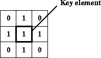

# Image Manipulation
{:.no_toc}

Chapter describes the basics of manipulating images to
prepare them for further processing.

* Contents
{:toc}

6.1 Introduction
-------------------------------------

The ImageN image manipulation objects and methods are used to enhance and
geometrically modify images and to extract information from images.
Image manipulation includes:

-   Region of interest (ROI) control
-   Relational operators
-   Logical operators
-   Arithmetic operators
-   Dithering
-   Clamping pixel values
-   Band copy

6.2 Region of Interest Control
---------------------------------------------------

Typically, any image enhancement operation takes place over the entire
image. While the image enhancement operation may improve portions of
an image, other portions of the image may lose detail. You usually
want some way of limiting the enhancement operation to specific
regions of the image.

To restrict the image enhancement operations to specific regions of an
image, a region-of-interest mask is created. A region of interest
(ROI) is conceptually a mask of true or false values. The ROI mask
controls which source image pixels are to be processed and which
destination pixels are to be recorded.

ImageN supports two different types of ROI mask: a Boolean mask and a
threshold value. The `ROIShape` class uses a Boolean mask, which
allows operations to be performed quickly and with compact storage.
The `ROI` class allows the specification of a threshold value; pixel
values greater than or equal to the threshold value are included in
the ROI. Pixel values less than the threshold are excluded.

The region of interest is usually defined using a `ROIShape`, which
stores its area using the `java.awt.Shape` classes. These classes
define an area as a geometrical description of its outline. The `ROI`
class stores an area as a single-banded image.

An ROI can be attached to an image as a property. See [Chapter 11,
\"Image Properties](../properties).\"


### 6.2.1 The ROI Class

The `ROI` class stores an area as a grayscale (single-banded) image.
This class represents region information in image form, and can thus
be used as a fallback where a `Shape` representation is unavailable.
Inclusion and exclusion of pixels is defined by a threshold value.
Source pixel values greater than or equal to the threshold value
indicate inclusion in the ROI and are processed. Pixel values less
than the threshold value are excluded from processing.

Where possible, subclasses such as `ROIShape` are used since they
provide a more compact means of storage for large regions.

The `getAsShape()` method may be called optimistically on any instance
of `ROI`. However, it may return null to indicate that a `Shape`
representation of the `ROI` is not available. In this case,
`getAsImage()` should be called as a fallback.


**API:** `org.eclipse.imagen.ROI`

* `ROI(RenderedImage im)`
* `ROI(RenderedImage im, int threshold)`
* `Shape getAsShape()`
* `PlanarImage getAsImage()`
* `int getThreshold()`
* `void setThreshold(int threshold)`

#### 6.2.1.1 Determining the ROI Bounds

The `getBounds` methods in the `ROI` class read the bounds of the
`ROI`, as either a `Rectangle` or a `Rectangle2D`.


**API:** `org.eclipse.imagen.ROI`

* `Rectangle getBounds()`
* `Rectangle2D getBounds2D()`

#### 6.2.1.2 Determining if an Area Lies Within or Intersects the ROI

The `contains` methods in the `ROI` class test whether a given point
or rectangular region lie within the `ROI`. The `intersects` methods
test whether a given rectangular region intersect with the `ROI`.


**API:** `org.eclipse.imagen.ROI`

* `boolean contains(Point p)`
* `boolean contains(Point2D p)`
* `boolean contains(int x, int y)`
* `boolean contains(double x, double y)`
* `boolean contains(Rectangle rect)`
* `boolean contains(Rectangle2D r)`
* `boolean contains(int x, int y, int w, int h)`
* `boolean contains(double x, double y, double w, double h)`
* `boolean intersects(Rectangle rect)`
* `boolean intersects(Rectangle2D r)`
* `boolean intersects(int x, int y, int w, int h)`
* `boolean intersects(double x, double y, double w, double h)`

#### 6.2.1.3 Creating a New ROI from an Existing ROI

Several methods allow the creation of a new `ROI` from an existing
`ROI`. The `add` method adds another ROI to an existing one, creating
a new ROI.


**API:** `org.eclipse.imagen.ROI`

* `ROI add(ROI im)`
* `ROI subtract(ROI im)`
* `ROI intersect(ROI im)`
* `ROI exclusiveOr(ROI im)`
* `ROI transform(AffineTransform at)`
* `ROI performImageOp(RenderedImageFactory RIF, ParameterBlock 
           paramBlock, int sourceIndex, Hashtable renderHints, 
           Hashtable renderHintsObserved)`
* `ROI performImageOp(RenderedImageFactory RIF, ParameterBlock 
           paramBlock, int sourceIndex)`
* `ROI performImageOp(String name, ParameterBlock paramBlock, 
           int  sourceIndex, Hashtable renderHints, 
           Hashtable  renderHintsObserved)`
* `ROI performImageOp(String name, ParameterBlock paramBlock, 
           int  sourceIndex)`
* `Shape getAsShape()`
* `PlanarImage getAsImage()`

### 6.2.2 The ROIShape Class

The `ROIShape` class is used to store a region of interest within an
image as an instance of a `java.awt.Shape`. Such regions are binary by
definition. Using a `Shape` representation allows Boolean operations
to be performed quickly and with compact storage. If a
`PropertyGenerator` responsible for generating the `ROI` property of a
particular `OperationDescriptor` (such as a `warp`) cannot reasonably
produce an `ROIShape` representing the region, it should call the
`getAsImage()` method on its sources and produce its output `ROI` in
image form.

**API:** `org.eclipse.imagen.ROIShape`

* `ROIShape(Shape s)`
* `ROIShape(Area a)`

#### 6.2.2.1 Determining the ROI Bounds

The following methods in the `ROIShape` class read the bounds of the
`ROI`.

**API:** `org.eclipse.imagen.ROIShape`

* `Rectangle getBounds()`
* `Rectangle2D getBounds2D()`

#### 6.2.2.2 Determining if an Area Lies Within or Intersects the ROIShape

The `ROIShape.contains` method is used to determine if a given pixel
lies within the region of interest. The `ROIShape.intersects` method
is used to determine if a rectangular region of the image intersects
the ROI.``

**API:** `org.eclipse.imagen.ROIShape`

* `boolean contains(Point p)`
* `boolean contains(Point2D p)`
* `boolean contains(int x, int y)`
* `boolean contains(double x, double y)`
* `boolean contains(Rectangle rect)`
* `boolean contains(Rectangle2D r)`
* `boolean contains(int x, int y, int w, int h)`
* `boolean contains(double x, double y, double w, double h)`
* `boolean intersects(Rectangle rect)`
* `boolean intersects(Rectangle2D r)`
* `boolean intersects(int x, int y, int w, int h)`
* `boolean intersects(double x, double y, double w, double h)`

#### 6.2.2.3 Creating a New ROIShape from an Existing ROIShape

Several methods allow the creation of a new `ROIShape` from the old
`ROIShape`.

**API:** `org.eclipse.imagen.ROIShape`

* `ROI add(ROI im)`
* `ROI subtract(ROI im)`
* `ROI intersect(ROI im)`
* `ROI exclusiveOr(ROI im)`
* `ROI transform(AffineTransform at)`
* `Shape getAsShape()`
* `PlanarImage getAsImage()`

6.3 Relational Operators
---------------------------------------------

Given two source images and a destination image, the ImageN relational
operators allow you to:

-   Find the larger of the pixels in the two source images and store
    the results in the destination (`Max`).


-   Find the smaller of the pixels in the two source images and store
    the results in the destination (`Min`).

The relational operators require that both source images and the
destination image have the same data type and number of bands. The
sizes of the two images (height and width), however, need not be the
same.

When determining the maximum and minimum pixels in the two images, ImageN
performs a band-by-band comparison.

------------------------------------------------------------------------

**Note:** Don\'t confuse the relational Min and Max operators with the
Extrema operation (see [Section 9.3, \"Finding the Extrema of an
Image](../analysis)\"), which finds the image-wise minimum
and maximum pixel values for each band of an image.

------------------------------------------------------------------------


### 6.3.1 Finding the Maximum Values of Two Images

The `max` operation takes two rendered images, and for every pair of
pixels, one from each source image of the corresponding position and
band, finds the maximum pixel value.

The two source images may have different numbers of bands and data
types. By default, the destination image bound is the intersection of
the two source image bounds. If the two source images don\'t
intersect, the destination will have a width and a height of 0. The
number of bands of the destination image is the same as the least
number of bands of the source images, and the data type is the biggest
data type of the source images.

The pixel values of the destination image are defined by the following
pseudocode:

         if (srcs[0][x][y][b] srcs[1][x][y][b]) {
             dst[x][y][b] = srcs[0][x][y][b];
         } else {
             dst[x][y][b] = srcs[1][x][y][b];
         }

The `max` operation takes two source images and no parameters.
[Listing 6-1](../image-manipulation) shows a partial code
sample of computing the pixelwise maximum value of two images in the
rendered mode.

***Listing 6-1*  Finding the Maximum Value of Two Images** <a name="listing6-1"></a>

```java
// Create two constant images
RenderedOp im0 = JAI.create("constant", param1);
RenderedOp im1 = JAI.create("constant", param2);

// Find the maximum value of the two images
RenderedOp im2 = JAI.create("max", im0, im1);
```

### 6.3.2 Finding the Minimum Values of Two Images

The `min` operation takes two rendered images, and for every pair of
pixels, one from each source image of the corresponding position and
band, finds the minimum pixel value.

The two source images may have different numbers of bands and data
types. By default, the destination image bound is the intersection of
the two source image bounds. If the two source images don\'t
intersect, the destination will have a width and a height of 0. The
number of bands of the destination image is the same as the least
number of bands of the source images, and the data type is the biggest
data type of the source images.

The pixel values of the destination image are defined by the following
pseudocode:

```
if (srcs[0][x][y][b] < srcs[1][x][y][b]) {
    dst[x][y][b] = srcs[0][x][y][b];
} else {
    dst[x][y][b] = srcs[1][x][y][b];
}
```

The `min` operation takes two rendered source images and no
parameters. [Listing 6-2](../image-manipulation) shows a
partial code sample of computing the pixelwise minimum value of two
images in the renderable mode.

***Listing 6-2*  Finding the Minimum Value of Two Images** <a name="listing6-2"></a>

```java
// Set up the parameter block and add the two source images to it
ParameterBlock pb = new ParameterBlock();
pb.add(im0);
pb.add(im1);

// Find the maximum value of the two images
RenderableOp im2 = JAI.createRenderable("min", pb, hints);
```

6.4 Logical Operators
------------------------------------------

ImageN supports *monadic*, *dyadic*, and *unary* logical operators. The
monadic logical operations include pixel-by-pixel AND, OR, and XOR
operations between a source image and a constant to produce a
destination image. The dyadic logical operations include
pixel-by-pixel AND, OR, and XOR operations between two source images
to produce a destination image. The unary logical operation is a NOT
operation (complement image) on each pixel of a source image on a
per-band basis.

ImageN supports the following logical operations:

-   Take the bitwise AND of the two source images and store the
    results in the destination (`And`)


-   Take the bitwise AND of a source image and one of a set of
    per-band constants (`AndConst`)


-   Take the bitwise OR of the two source images and store the results
    in the destination (`Or`)


-   Take the bitwise OR of a source image and one of a set of per-band
    constants (`OrConst`)


-   Take the bitwise XOR (exclusiveOR) of the two source images and
    store the results in the destination (`Xor`)


-   Take the bitwise XOR of a source image and one of a set of
    per-band constants (`XorConst`)


-   Take the bitwise NOT of a source image on each pixel on a per-band
    basis (`Not`)

As with the relational operators, the logical operations require that
both source images and the destination image have the same data type
and number of bands. The sizes of the two images (height and width),
however, need not be the same.


### 6.4.1 ANDing Two Images

The `And` operation takes two rendered or renderable source images,
and performs a bit-wise logical AND on every pair of pixels, one from
each source image, of the corresponding position and band.

Both source images must have integral data types. The two data types
may be different.

Unless altered by an `ImageLayout` hint, the destination image bound
is the intersection of the two source image bounds. If the two sources
don\'t intersect, the destination will have a width and height of 0.
The number of bands of the destination image is equal to the lesser
number of bands of the source images, and the data type is the
smallest data type with sufficient range to cover the range of both
source data types.

The following matrix defines the logical `And` operation.

| src0 | src1 | result |
|------|------|--------|
| 0    | 0    | 0 |
| 0    | 1    | 0 |
| 1    | 0    | 0 |
| 1    | 1    | 1 |

The destination pixel values are defined by the following pseudocode:

         dst[x][y][b] = srcs[0][x][y][b] & srcs[1][x][y][b];

The `And` operation takes two rendered or renderable source images and
no parameters.

[Listing 6-3](../image-manipulation) shows a partial code
sample of using the `And` operation to AND two images together.

***Listing 6-3*  ANDing Two Images** <a name="listing6-3"></a>


```java
// Set up the parameter block and add the two source images to it.
ParameterBlock pb = new ParameterBlock();
pb.addSource(im0);          // The first image
pb.addSource(im1);          // The second image

// AND the two images together.
RenderableOp op = JAI.createRenderable("and", pb, hints);
```


### 6.4.2 ANDing an Image with a Constant

The `AndConst` operation takes one rendered or renderable image and an
array of integer constants, and performs a bit-wise logical AND
between every pixel in the same band of the source and the constant
from the corresponding array entry. If the number of constants
supplied is less than the number of bands of the destination, then the
constant from entry 0 is applied to all the bands. Otherwise, a
constant from a different entry is applied to each band.

The source image must have an integral data type. By default, the
destination image bound, data type, and number of bands are the same
as the source image.

The following matrix defines the logical `AndConst` operation:

| src | const | result |
|------|------|--------|
|  0   | 0    | 0 |
|  0   | 1    | 0 |
|  1   | 0    | 0 |
|  1   | 1    | 1 |

The destination pixel values are defined by the following pseudocode:

```
if (constants.length < dstNumBands) {
    dst[x][y][b] = srcs[x][y][b] & constants[0];
} else {
    dst[x][y][b] = srcs[x][y][b] & constants[b];
}
```

The `AndConst` operation takes one rendered or renderable source image
and one parameter:

| Parameter | Type | Description |
|-----------|------|-------------|
| constants | int  | The per-band constants to logically AND with. |

[Listing 6-4](../image-manipulation) shows a partial code
sample of using the `AndConst` operation to AND a source image with a
defined constant of value 1.2.

***Listing 6-4*  ANDing an Image with a Constant** <a name="listing6-4"></a>

```java
// Set up the parameter block with the source and a constant
// value.
ParameterBlock pb = new ParameterBlock();
pb.addSource(im);       // im as the source image
pb.add(1.2f);     // The constant

// AND the image with the constant.
RenderableOp op = JAI.createRenderable("andconst", pb, hints);
```

### 6.4.3 ORing Two Images

The `Or` operation takes two rendered or renderable images, and
performs a bit-wise logical OR on every pair of pixels, one from each
source image of the corresponding position and band.

Both source images must have integral data types. The two data types
may be different.

Unless altered by an `ImageLayout` hint, the destination image bound
is the intersection of the two source image bounds. If the two sources
don\'t intersect, the destination will have a width and height of 0.
The number of bands of the destination image is equal to the lesser
number of bands of the source images, and the data type is the
smallest data type with sufficient range to cover the range of both
source data types.

The following matrix defines the logical `OR` operation:

| src0 | src1 | result |
|------|------|--------|
|  0   |  0   |  0 |
|  0   |  1   |  1 |
|  1   |  0   |  1 |
|  1   |  1   |  1 |

The destination pixel values are defined by the following pseudocode:

```
dst[x][y][b] = srcs[0][x][y][b] | srcs[1][x][y][b];
```

The `Or` operation takes two rendered or renderable source images and
no parameters.

[Listing 6-5](../image-manipulation) shows a partial code
sample of using the `or` operation to OR two images.

***Listing 6-5*  ORing Two Images** <a name="listing6-5"></a>

```java
// Read the first image.
pb = new ParameterBlock();
pb.addSource(file1);
RenderedOp src1 = JAI.create("stream", pb);

// Read the second image.
pb = new ParameterBlock();
pb.addSource(file2);
RenderedImage src2 = JAI.create("stream", pb);

// OR the two images.
RenderedOp dst = JAI.create("or", src1, src2);
```


### 6.4.4 ORing an Image with a Constant

The `OrConst` operation takes one rendered or renderable image and an
array of integer constants, and performs a bit-wise logical OR between
every pixel in the same band of the source image and the constant from
the corresponding array entry. If the number of constants supplied is
less than the number of bands of the destination, the constant from
entry 0 is applied to all the bands. Otherwise, a constant from a
different entry is applied to each band.

The source image must have an integral data type. By default, the
destination image bound, data type, and number of bands are the same
as the source image.

The following matrix defines the logical `OrConst` operation:

| src | const | result |
|------|------|--------|
|  0   | 0    |  0 |
|  0   | 1    |  1 |
|  1   | 0    |  1 |
|  1   | 1    |  1 |

The destination pixel values are defined by the following pseudocode:

```
if (constants.length < dstNumBands) {
    dst[x][y][b] = src[x][y][b] | constants[0];
} else {
    dst[x][y][b] = src[x][y][b] | constants[b];
}
```
The `OrConst` operation takes one rendered or renderable source image
and one parameter:

| Parameter | Type | Description |
|-----------|------|-------------|
| constants | int  | The per-band constants to logically OR with. |


### 6.4.5 XORing Two Images

The `Xor` operation takes two rendered or renderable images, and
performs a bit-wise logical XOR on every pair of pixels, one from each
source image of the corresponding position and band.

Both source images must have integral data types. The two data types
may be different.

Unless altered by an `ImageLayout` hint, the destination image bound
is the intersection of the two source image bounds. If the two source
images don\'t intersect, the destination will have a width and height
of 0. The number of bands of the destination image is equal to the
lesser number of bands of the source images, and the data type is the
smallest data type with sufficient range to cover the range of both
source data types.

The following matrix defines the `Xor` operation:

| src0 | src1 | result |
|------|------|--------|
|  0   |  0   |  0 |
|  0   |  1   |  1 |
|  1   |  0   |  1 |
|  1   |  1   |  0 |

The destination pixel values are defined by the following pseudocode:

```
         dst[x][y][b] = srcs[0][x][y][b] ^ srcs[0][x][y][b];
```

The `Xor` operation takes one rendered or renderable source image and
no parameters.


### 6.4.6 XORing an Image with a Constant

The `XorConst` operation takes one rendered or renderable image and an
array of integer constants, and performs a bit-wise logical OR between
every pixel in the same band of the source and the constant from the
corresponding array entry. If the number of constants supplied is less
than the number of bands of the destination, the constant from entry 0
is applied to all the bands. Otherwise, a constant from a different
entry is applied to each band.

The source image must have an integral data type. By default, the
destination image bound, data type, and number of bands are the same
as the source image.

The following matrix defines the logical `XorConst` operation:

| src | const | result |
|-----|-------|--------|
|  0  |  0    |  0 |
|  0  |  1    |  1 |
|  1  |  0    |  1 |
|  1  |  1    |  0 |

The destination pixel values are defined by the following pseudocode:

```
if (constants.length < dstNumBands) {
    dst[x][y][b] = src[x][y][b] ^ constants[0];
} else {
    dst[x][y][b] = src[x][y][b] ^ constants[b];
}
```

The `XorConst` operation takes one rendered or renderable source image
and one parameter:

| Parameter | Type | Description |
|-----------|------|-------------|
| constant  | int  | The constant to logically XOR with. |


### 6.4.7 Taking the Bitwise NOT of an Image

The `Not` operation takes one rendered or renderable image, and
performs a bit-wise logical NOT on every pixel from every band of the
source image. This operation, also known as a *complement* operation,
creates an image that is somewhat like a photographic negative.

The `Not` operation looks at the values in the source image as binary
values and changes all the 1\'s in those values to 0\'s, and all the
0\'s to 1\'s. The operation then writes the one\'s complement version
of the source image to the destination.

The source image must have an integral data type. By default, the
destination image bound, data type, and number of bands are the same
as the source image.

The following matrix defines the logical NOT operation.

| src | result |
|-----|--------|
|  1  |  0     |
|  0  |  1     |

The pixel values of the destination image are defined by the following
pseudocode:

```
         dst[x][y][b] = ~(src[x][y][b])
```

The `Not` operation takes one rendered or renderable source image and
no parameters.

[Listing 6-6](../image-manipulation) shows a partial code
sample of using the `Not` operation.

***Listing 6-6*  Taking the NOT of an Image** <a name="listing6-6"></a>

```java
// Read the source image.
pb = new ParameterBlock();
pb.addSource(file);
RenderedOp src = JAI.create("stream", pb);

// Create the Not operation.
RenderedOp dst = JAI.create("Not", src);
```

6.5 Arithmetic Operators
---------------------------------------------

ImageN supports both *monadic* and *dyadic* arithmetic operators. The
monadic arithmetic operations include per-band addition, subtraction,
division, and multiplication operations between a source image and a
constant to produce a destination image. The dyadic arithmetic
operations include per-band addition, subtraction, division, and
multiplication operations between two source images to produce a
destination image.

The ImageN arithmetic operators allow you to:

-   Add two source images and store the results in a destination image
    (`Add`)


-   Add a constant value to the pixels in a source image and store the
    results in a destination image (`AddConst`)


-   Add a collection of images and store the results in a destination
    image (`AddCollection`)


-   Add a an array of double constants to a collection of rendered
    images (`AddConstToCollection`)


-   Subtract one source image from an other and store the results in a
    destination image (`Subtract`)


-   Subtract a constant value from the pixels in a source image and
    store the results in a destination image (`SubtractConst`)


-   Divide one source image into an other and store the results in a
    destination image (`Divide`)


-   Divide two source images of complex data and store the results in
    a destination image (`DivideComplex`)


-   Divide a source image by a constant value (`DivideByConst`)


-   Divide a source image into a constant value (`DivideIntoConst`)


-   Multiply two source images and store the results in a destination
    image (`Multiply`)


-   Multiply a source image by a constant value (`MultiplyConst)`


-   Multiply two images representing complex data (`MultiplyComplex`)


-   Find the absolute value of pixels in a source image and store the
    results in a destination image (`Absolute`)


-   Take the exponent of an image and store the results in a
    destination image (`Exp`)

As with the relational and logical operators, the arithmetic
operations require that both source images and the destination image
have the same data type and number of bands. The sizes of the two
images (height and width), however, need not be the same.

When ImageN adds two images, it takes the value at location 0,0 in one
source image, adds it to the value at location 0,0 in the second
source image, and writes the sum at location 0,0 in the destination
image. It then does the same for all other points in the images.
Subtraction, multiplication, and division are handled similarly.

Arithmetic operations on multi-band images are performed on
corresponding bands in the source images. That is, band 0 of the first
image is added to band 0 of the second image, and so on.


### 6.5.1 Adding Two Source Images

The `Add` operation takes two rendered or renderable source images,
and adds every pair of pixels, one from each source image of the
corresponding position and band. The two source images may have
different numbers of bands and data types. By default, the destination
image bounds are the intersection of the two source image bounds. If
the sources don\'t intersect, the destination will have a width and
height of 0.

The default number of bands of the destination image is equal to the
smallest number of bands of the sources, and the data type is the
smallest data type with sufficient range to cover the range of both
source data types (not necessarily the range of their sums).

As a special case, if one of the source images has *N* bands (where
*N* is greater than one), the other source has one band, and an
`ImageLayout` hint is provided containing a destination `SampleModel`
with *K* bands (1 \< *K* ≤ *N*), then the
single band of the one1-banded source is added to each of the first
*K* bands of the *N*-band source.

The destination pixel values are defined by the following pseudocode:

```
dst[x][y][dstBand] = clamp(srcs[0][x][y][src0Band] +
                           srcs[1][x][y][src1Band]);
```

If the result of the addition underflows or overflows the minimum or
maximum value supported by the destination image, the value will be
clamped to the minimum or maximum value, respectively.

The `Add` operation two rendered or renderable source images and no
parameters.

[Listing 6-7](../image-manipulation) shows a partial code
sample of using the `Add` operation to add two images.

***Listing 6-7*  Adding Two Images** <a name="listing6-7"></a>

```java
// Read the two images.
pb = new ParameterBlock();
pb.addSource(s1);
RenderedImage src1 = (RenderedImage)JAI.create("stream", pb);

pb = new ParameterBlock();
pb.addSource(s2);
RenderedImage src2 = (RenderedImage)JAI.create("stream", pb);

// Create the ParameterBlock for the operation
pb = new ParameterBlock();
pb.addSource(src1);
pb.addSource(src2);

// Create the Add operation.
RenderedImage dst = (RenderedImage)JAI.create("add", pb);
```

### 6.5.2 Adding a Constant Value to an Image

The `AddConst` operation adds one of a set of constant values to every
pixel value of a source image on a per-band basis:

```
if (constants.length < dstNumBands) {
    dst[x][y][b] = src[x][y][b] + constants[0];
else {
    dst[x][y][b] = src[x][y][b] + constants[b]
```

The `AddConst` operation takes one rendered or renderable source image
and one parameter:

| Parameter | Type | Description |
|-----------|------|-------------|
| constants | double | The per-band constants to be added. |

The set of `constants` must contain one entry for each band of the
source image. If the number of constants supplied is less than the
number of bands of the destination image, the constant from entry 0 is
applied to all the bands. Otherwise, a constant from a different entry
is applied to each band.

By default, the destination image bound, data type, and number of
bands are the same as the source image.

If the result of the addition underflows or overflows the minimum or
maximum value supported by the destination image, the value will be
clamped to the minimum or maximum value, respectively.

[Listing 6-8](../image-manipulation) shows a partial code
sample of using the `AddConst` operation.

***Listing 6-8*  Adding a Constant to an Image** <a name="listing6-8"></a>

```java
// Create the constant values.
RenderedImage im1, im2;
ParameterBlock pb;
double k0, k1, k2;

pb = new ParameterBlock();
pb.addSource(im1);
double[] constants = new double[3]; // or however many bands
                                    // in im1
constants[0] = k0;
constants[1] = k1;
constants[2] = k2;
pb.add(constants);

// Construct the AddConst operation.
RenderedImage addConstImage = JAI.create("addconst", pb, null);
```

### 6.5.3 Adding a Collection of Images

The `AddCollection` operation takes a collection of rendered images
and adds every set of pixels, one from each source image of the
corresponding position and band.

There\'s no restriction on the actual class type used to represent the
source collection, but each element of the collection must be of the
class `RenderedImages`. The number of images in the collection may
vary from two to *n*, and is only limited by memory size. The source
images may have different number of bands and data types.

By default, the destination image bound is the intersection of all the
source image bounds. If any of the two sources don\'t intersect, the
destination will have a width and a height of 0. The number of bands
of the destination image is the same as the least number of bands of
all the sources, and the data type is the biggest data type of all the
sources.

The destination pixel values are calculated as:

```
         dst[x][y][b] = 0;
         for (int i = 0; i < numSources; i++) {
             dst[x][y][b] += srcs[i][x][y][b];
         }
```

If the result of the operation underflows or overflows the minimum or
maximum value supported by the destination data type, the value will
be clamped to the minimum or maximum value, respectively.

The `AddCollection` operation takes a collection of source images and
no parameters.


### 6.5.4 Adding Constants to a Collection of Rendered Images

The `AddConstToCollection` operation takes a collection of rendered
images and an array of double constants, and for each rendered image
in the collection adds a constant to every pixel of its corresponding
band.

The operation will attempt to store the result images in the same
collection class as that of the source images. If a new instance of
the source collection class can not be created, the operation will
store the result images in a `java.util.Vector`. The output collection
will contain the same number of images as in the source collection.

The `AddConstToCollection` operation takes a collection of rendered
images and one parameter.

  ----------------------------------------------------------------------------------
  [Parameter]{#69967}    [Type]{#69969}      [Description]{#69975}
  ---------------------- ------------------- ---------------------------------------
  constants   double   The constants to be added.

  ----------------------------------------------------------------------------------

  : 

If the number of constants supplied is less than the number of bands
of the source image, the same constant from entry 0 is applied to all
the bands. Otherwise, a constant from a different entry is applied to
each band.


### 6.5.5 Subtracting Two Source Images

The `Subtract` operation takes two rendered or renderable images, and
for every pair of pixels, one from each source image of the
corresponding position and band, subtracts the pixel from the second
source from the pixel from the first source.

The two source images may have different numbers of bands and data
types. By default, the destination image bounds are the intersection
of the two source image bounds. If the sources don\'t intersect, the
destination will have a width and height of 0.

The default number of bands of the destination image is equal to the
smallest number of bands of the source images, and the data type is
the smallest data type with sufficient range to cover the range of
both source data types (not necessarily the range of their sums).

As a special case, if one of the source images has *N* bands (where
*N* is greater than one), the other source has one band, and an
`ImageLayout` hint is provided containing a destination `SampleModel`
with *K* bands (1 \< *K* ≤ *N*), then the
single band of the one-banded source is subtracted from or into each
of the first *K* bands of the *N*-band source.

The destination pixel values are defined by the following pseudocode:

```
dst[x][y][dstBand] = clamp(srcs[0][x][y][src0Band] -
                           srcs[1][x][y][src1Band]);
```

If the result of the subtraction underflows or overflows the minimum
or maximum value supported by the destination image, the value will be
clamped to the minimum or maximum value respectively.

The `Subtract` operation takes two rendered or renderable source
images and no parameters.


### 6.5.6 Subtracting a Constant from an Image

The `Subtract`Const operation takes one rendered or renderable image
and an array of double constants, and subtracts every pixel of the
same band of the source from the constant from the corresponding array
entry. If the number of constants supplied is less than the number of
bands of the destination, the constant from entry 0 is applied to all
the bands. Otherwise, a constant from a different entry is applied to
each band.

By default, the destination image bound, data type, and number of
bands are the same as the source image.

The destination pixel values are defined by the following pseudocode:

```
if (constants.length < dstNumBands) {
    dst[x][y][b] = constants[0] - src[x][y][b];
} else {
    dst[x][y][b] = constants[b] - src[x][y][b];
}
```

The `Subtract`Const operation takes rendered or renderable source
image and one parameter:

| Parameter | Type | Description |
|-----------|------|-------------|
| constants | double | The per-band constants to be subtracted. |

If the result of the subtraction underflows or overflows the minimum
or maximum value supported by the destination image, the value will be
clamped to the minimum or maximum value respectively.


### 6.5.7 Subtracting an Image from a Constant

The `SubtractFromConst` operation takes one rendered or renderable
source image and an array of double constants, and subtracts a
constant from every pixel of its corresponding band of the source
image. If the number of constants supplied is less than the number of
bands of the destination, the constant from entry 0 is applied to all
the bands. Otherwise, a constant from a different entry is applied to
each band. By default, the destination image bounds, data type, and
number of bands are the same as the source image.

The destination pixel values are defined by the following pseudocode:

```
if (constants.length < dstNumBands) {
    dst[x][y][b] = src[x][y][b] - constants[0];
} else {
    dst[x][y][b] = src[x][y][b] - constants[b];
}
```

The `SubtractFrom`Const operation takes one rendered or renderable
source image and one parameter:

| Parameter | Type | Description |
|-----------|------|-------------|
| constants | double | The constants to be subtracted. |

If the result of the subtraction underflows or overflows the minimum
or maximum value supported by the destination image, the value will be
clamped to the minimum or maximum value respectively.


### 6.5.8 Dividing One Image by Another Image

The `Divide` operation takes two rendered or renderable images, and
for every pair of pixels, one from each source image of the
corresponding position and band, divides the pixel from the first
source by the pixel from the second source.

In case of division by 0, if the numerator is 0, the result is set to
0; otherwise, the result is set to the maximum value supported by the
destination data type.

The `Divide` operation does not require any parameters.

The two source images may have different number of bands and data
types. By default, the destination image bound is the intersection of
the two source image bounds. If the two sources don\'t intersect, the
destination will have a width and a height of 0. The default number of
bands of the destination image is the same as the least number of
bands of the source images, and the data type is the biggest data type
of the sources.

As a special case, if one of the source images has *N* bands (where
*N* is greater than one), the other source has one band, and an
`ImageLayout` hint is provided containing a destination `SampleModel`
with *K* bands (1 \< *K* ≤ *N*), then the
single band of the one-banded source will be divided by or into to
each of the first *K* bands of the *N*-band source.

If the result of the operation underflows or overflows the minimum or
maximum value supported by the destination data type, it will be
clamped to the minimum or maximum value respectively.

The `Divide` operation takes two rendered or renderable source images
and no parameters.


### 6.5.9 Dividing an Image by a Constant

The `DivideByConst` operation takes one rendered or renderable source
image and an array of double constants, and divides every pixel of the
same band of the source by the constant from the corresponding array
entry. If the number of constants supplied is less than the number of
bands of the destination, the constant from entry 0 is applied to all
the bands. Otherwise, a constant from a different entry is applied to
each band.

In case of division by 0, if the numerator is 0, the result is set to
0. Otherwise, the result is set to the maximum value supported by the
destination data type. By default, the destination image bound, data
type, and number of bands are the same as the source image.

The destination pixel values are defined by the following pseudocode:

```
if (constants.length < dstNumBands) {
    dst[x][y][b] = srcs[x][y][b]/constants[0];
} else {
    dst[x][y][b] = srcs[x][y][b]/constants[b];
}
```

The `DivideByConst` operation takes one rendered or renderable source
image and one parameter:

| Parameter | Type | Description |
|-----------|------|-------------|
| constants | double | The per-band constants to divide by. |

If the result of the division underflows or overflows the minimum or
maximum value supported by the destination image, the value will be
clamped to the minimum or maximum value, respectively.


### 6.5.10 Dividing an Image into a Constant

The `DivideIntoConst` operation takes one rendered or renderable image
and an array of double constants, and divides every pixel of the same
band of the source into the constant from the corresponding array
entry. If the number of constants supplied is less than the number of
bands of the destination, the constant from entry 0 is applied to all
the bands. Otherwise, a constant from a different entry is applied to
each band.

In case of division by 0, if the numerator is 0, the result is set to
0. Otherwise, the result is set to the maximum value supported by the
destination data type.

By default, the destination image bound, data type, and number of
bands are the same as the source image.

The destination pixel values are defined by the following pseudocode:

```
         if (constants.length < dstNumBands) {
             dst[x][y][b] = constants[0]/src[x][y][b];
         } else {
             dst[x][y][b] = constants[b]/src[x][y][b];
         }
```

The `DivideIntoConst` operation takes one rendered or renderable
source image and one parameter:

| Parameter | Type | Description |
|-----------|------|-------------|
| constants | double | The per-band constants to be divided into. |

If the result of the division underflows or overflows the minimum or
maximum value supported by the destination image, the value will be
clamped to the minimum or maximum value, respectively.


### 6.5.11 Dividing Complex Images

The `DivideComplex` operation divides two images representing complex
data. The source images must each contain an even number of bands with
the even-indexed bands (0, 2, etc.) representing the real and the
odd-indexed bands (1, 3, etc.) the imaginary parts of each pixel. The
destination image similarly contains an even number of bands with the
same interpretation and with contents defined by:

```
         a = src0[x][y][2k];
         b = src0[x][y][2k + 1];
         c = src1[x][y][2k];
         d = src1[x][y][2k + 1];
         
         dst[x][y][2k] = (a*c + b*d)/(c2 + d2)
         dst[x][y][2k + 1] = (b*c - a*d)/(c2 + d2)

```

Where 

With one exception, the number of bands of the destination image is
the same as the minimum of the number of bands of the two sources, and
the data type is the biggest data type of the sources. The exception
occurs when one of the source images has two bands, the other source
image has *N* = 2*K* bands where *K* is greater than one, and an
`ImageLayout` hint is provided containing a destination `SampleModel`
that specifies *M* = 2*L* bands for the destination image where *L* is
greater than one and L ≤ *K*. In this
special case if the first source has two bands, its single complex
component will be divided by each of the first *L* complex components
of the second source. If the second source has two bands, its single
complex component will divide each of the *L* complex components of
the first source.

If the result of the operation underflows or overflows the minimum or
/maximum value supported by the destination data type, it will be
clamped to the minimum or maximum value, respectively.

The `DivideComplex` operation takes two rendered or renderable source
images representing complex data and no parameters.


### 6.5.12 Multiplying Two Images

The `Multiply` operation takes two rendered or renderable images, and
multiplies every pair of pixels, one from each source image of the
corresponding position and band.

The two source images may have different number of bands and data
types. By default, the destination image bound is the intersection of
the two source image bounds. If the two source images don\'t
intersect, the destination will have a width and a height of 0.

The default number of bands of the destination image is the same as
the least number of bands of the source images, and the data type is
the biggest data type of the source images. A special case may occur
if one of the source images has *N* bands where *N* is greater than
one, the other source has one band, and an `ImageLayout` hint is
provided containing a destination `SampleModel`. If the `SampleModel`
hint specifies *K* bands for the destination image where *K* is
greater than one and *K* ≤ *N*, each of
the first *K* bands of the *N*-band source is multiplied by the single
band of the one-band source.

In the default case the destination pixel values are calculated as:

```java
for (int h = 0; h < dstHeight; h++) {
     for (int w = 0; w < dstWidth; w++) {
         for (int b = 0; b < dstNumBands; b++) {
              dst[h][w][b] = src1[h][w][b] * src2[h][w][b];
         }
     }
}
```

The `Multiply` operation takes two rendered or renderable source
images and no parameters.

If the result of the multiplication underflows or overflows the
minimum or maximum value supported by the destination image, the value
will be clamped to the minimum or maximum value, respectively.


### 6.5.13 Multiplying an Image by a Constant

The `MultiplyConst` operation takes one rendered or renderable image
and an array of double constants, and multiplies every pixel of the
same band of the source by the constant from the corresponding array
entry. If the number of constants supplied is less than the number of
bands of the destination, the constant from entry 0 is applied to all
the bands. Otherwise, a constant from a different entry is applied to
each band. By default, the destination image bound, data type, and
number of bands are the same as the source image.

The destination pixel values are calculated as:

```java
if (constants.length < dstNumBands) {
    dst[x][y][b] = srcs[x][y][b]*constants[0];
} else {
    dst[x][y][b] = srcs[x][y][b]*constants[b];
}
```

The `MultiplyConst` operation takes one rendered or renderable source
image and one parameter:

| Parameter | Type | Description |
|-----------|------|-------------|
| constants | double | The per-band constants to multiply by. |

If the result of the multiplication underflows or overflows the
minimum or maximum value supported by the destination image, the value
will be clamped to the minimum or maximum value respectively.


### 6.5.14 Multiplying Two Complex Images

The `MultiplyComplex` operation multiplies two images representing
complex data. The source images must each contain an even number of
bands, with the with the even-indexed bands (0, 2, etc.) representing
the real and the odd-indexed bands (1, 3, etc.) the imaginary parts of
each pixel. The destination image similarly contains an even number of
bands with the same interpretation and with contents defined by:

```java
a = src0[x][y][2k];
b = src0[x][y][2k + 1];
c = src1[x][y][2k];
d = src1[x][y][2k + 1];

dst[x][y][2k] = a*c - b*d;
dst[x][y][2k + 1] = a*d + b*c;
```

Where 

With one exception, the number of bands of the destination image is
the same as the minimum of the number of bands of the two source
images, and the data type is the biggest data type of the sources. The
exception occurs when one of the source images has two bands, the
other source image has *N* = 2*K* bands where *K* is greater than one,
and an `ImageLayout` hint is provided containing a destination
`SampleModel` that specifies *M* = 2*L* bands for the destination
image where *L* is greater than one and *L*
≤ *K*. In this special case each of the
first *L* complex components in the *N*-band source will be multiplied
by the single complex component in the one-band source.

If the result of the operation underflows or overflows the minimum or
maximum value supported by the destination data type, it will be
clamped to the minimum or maximum value, respectively.

The `MultiplyComplex` operation takes two rendered source images
representing complex data and no parameters.


### 6.5.15 Finding the Absolute Value of Pixels

Images with signed integer pixels have an asymmetrical range of values
from\
-32,768 to 32,767, which is not very useful for many imaging
operations. The `Absolute` operation takes a single rendered or
renderable source image, and computes the mathematical absolute value
of each pixel:

```java
if (src[x][y][b] < 0) {
    dst[x][y][b] = -src[x][y][b];
} else {
    dst[x][y][b] = src[x][y][b];
}
```

For signed integral data types, the smallest value of the data type
does not have a positive counterpart; such values will be left
unchanged. This behavior parallels that of the Java unary minus
operator.

The `Absolute` operation takes one rendered or renderable source image
and no parameters


### 6.5.16 Taking the Exponent of an Image

The `Exp` operation takes the exponential of the pixel values of an
image. The pixel values of the destination image are defined by the
following pseudocode:

```java
dst[x][y][b] = java.lang.Math.exp(src[x][y][b])
```

For integral image datatypes, the result will be rounded and clamped
as needed.

The `Exp` operation takes one rendered or renderable source image and
no parameters.

[Listing 6-9](../image-manipulation) shows a partial code
sample of using the `Exp` operation to take the exponent of an image.

***Listing 6-9*  Taking the Exponent of an Image** <a name="listing6-9"></a>

```java
// Create a ParameterBlock with the source image.
pb = new ParameterBlock();
pb.addSource(src);

// Perform the Exp operation
RenderedImage dst = JAI.create("exp", pb);
```

6.6 Dithering an Image
-------------------------------------------

The display of a 24-bit color image on an 8-bit frame buffer requires
an operation known as *dithering*. The dithering operation compresses
the three bands of an RGB image to a single-banded byte image.

The dithering operation uses a lookup table through which the source
image is passed to produce the destination image. The most-common use
for the dithering operation is to convert true-color (three-band byte)
images to pseudo-color (single-band byte) images.

ImageN offers two operations for dithering an image: ordered dither and
error-diffusion dither. The choice of dithering operation depends on
desired speed and image quality, as shown in [Table
6-1](../image-manipulation).

***Table 6-1*  Dithering Choices** <a name="table-6-1"></a>

| Dither Type | Relative Speed | Relative Quality |
|-------------|----------------|------------------|
| Ordered         | Medium     |     Medium |
| Error diffusion | Slowest    |     Best |

### 6.6.1 Ordered Dither

``The ordered dithering operation is somewhat faster than the
error-diffusion dither and produces a somewhat better destination
image quality than the error-diffusion dither. The `OrderedDither`
operation also differs from error-diffusion dither in that it
(`OrderedDither`) uses a color cube rather than a general lookup
table.

The `OrderedDither` operation performs color quantization by finding
the nearest color to each pixel in a supplied color cube lookup table
and \"shifting\" the resulting index value by a pseudo-random amount
determined by the values of a supplied *dither mask*.

The `OrderedDither` operation takes one rendered source image and two
parameters:

| Parameter | Type | Description |
|-----------|------|-------------|
| colorMap  |  ColorCube | The color cube. See Section 6.6.1.1 |
| ditherMask | KernelJAI | The dither mask. See Section 6.6.1.2 |

#### 6.6.1.1 Color Map Parameter

The `colorMap` parameter can be either one of the predefined
`ColorCubes`, or a custom color map can be created as a `ColorCube`
object. To create a custom color map, see [Section 7.6.1.3, \"Creating
a Color-cube Lookup Table](../image-enhance).\"

The predefined color maps are:

| colorMap | Description |
|----------|-------------|
| BYTE\_496 | A ColorCube with dimensions 4:9:6, useful for dithering RGB images into 216 colors. The offset of this ColorCube is 38. This color cube dithers blue values in the source image to one of four blue levels, green values to one of nine green levels, and red values to one of six red levels. This is the default color cube for the ordered dither operation. |
| BYTE\_855 | A ColorCube with dimensions 8:5:5, useful for dithering YCbCr images into 200 colors. The offset of this ColorCube is 54. This color cube dithers blue values in the source image to one of eight blue levels, green values to one of five green levels, and red values to one of five red levels. |

#### 6.6.1.2 Dither Mask Parameter

The dither mask is a three-dimensional array of floating point values,
the depth of which equals the number of bands in the image. The dither
mask is supplied as an array of `KernelJAI` objects. Each element of
the array is a `KernelJAI` object that represents the dither mask
matrix for the corresponding band. All `KernelJAI` objects in the
array must have the same dimensions and contain floating point values
greater than or equal to 0.0 and less than or equal to 1.0.

The `ditherMask` parameter may either be one of the predefined dither
masks or a custom mask may be created. To create a custom dither mask,
see [Section 6.9, \"Constructing a
Kernel](../image-manipulation).\"

The predefined dither masks are (see [Figure
6-1](../image-manipulation)):

| ditherMask | Description |
|------------|-------------|
| DITHER\_MASK\_441 | A 4 x 4 x 1 mask useful for dithering eight-bit grayscale images to one-bit images |
| DITHER\_MASK\_443 |  A 4 x 4 x 3 mask useful for dithering 24-bit color images to eight-bit pseudocolor images. This is the default dither mask for the OrderedDither operation. |

<a name="figure-6-1"></a>

------------------------------------------------------------------------


------------------------------------------------------------------------

***Figure 6-1*  Ordered Dither Masks**


#### 6.6.1.3 OrderedDither Example

[Listing 6-10](../image-manipulation) shows a partial code
sample of using the `OrderedDither` operation.

***Listing 6-10*  Ordered Dither Example** <a name="listing6-10"></a>

```java
// Create the color cube.
ColorCube colorMap =
    srcRescale.getSampleModel().getTransferType() ==
               DataBuffer.TYPE_BYTE ?
    ColorCube.BYTE_496 :
    ColorCube.createColorCube(dataType, 38, new int[] {4, 9, 6});

// Set the dither mask to the pre-defined 4x4x3 mask.
KernelJAI[] ditherMask = KernelJAI.DITHER_MASK_443;

// Create a new ParameterBlock.
ParameterBlock pb = new ParameterBlock();
pb.addSource(srcRescale).add(colorMap).add(ditherMask);

// Create a gray scale color model.
ColorSpace cs = ColorSpace.getInstance(ColorSpace.CS_GRAY);
int bits[] = new int[] {8};
ColorModel cm = new ComponentColorModel(cs, bits, false, false,
                                        Transparency.OPAQUE,
                                        DataBuffer.TYPE_BYTE);

// Create a tiled layout with the requested ColorModel.
layout = new ImageLayout();
layout.setTileWidth(TILE_WIDTH).setTileHeight(TILE_HEIGHT);
layout.setColorModel(cm);

// Create RenderingHints for the ImageLayout.
rh = new RenderingHints(JAI.KEY_IMAGE_LAYOUT, layout);

// Create the ordered dither OpImage.
PlanarImage image = (PlanarImage)JAI.create("ordereddither",
                                            pb, rh);
```

### 6.6.2 Error-diffusion Dither

The error-diffusion dithering operation produces the most accurate
destination image, but is more complex and thus takes longer than the
ordered dither.

The `ErrorDiffusion` operation performs color quantization by finding
the nearest color to each pixel in a supplied lookup table, called a
color map, and \"diffusing\" the color quantization error below and to
the right of the pixel.

The source image and the color map must have the same data type and
number of bands. Also, the color map must have the same offset in all
bands. The resulting image is single-banded.

The `ErrorDiffusion` operation takes one rendered source image and two
parameters:

| Parameter | Type | Description |
|-----------|------|-------------|
| colorMap | LookupTableJAI | The color map. A LookupTableJAI (see [Section 7.6.1, \"Creating the Lookup Table](../image-enhance) ") or a ColorCube (see [Section 6.6.1.1, \"Color Map Parameter](../image-manipulation)\").\ |
| errorKernel | KernelJAI | The error filter kernel. See [Section 6.6.2.1, \"Error Filter Kernel](../image-manipulation).\"\ |

#### 6.6.2.1 Error Filter Kernel

The `errorKernel` parameter can be one of three predefined error
filters or you can create your own. To create your own, see [Section
6.9, \"Constructing a Kernel](../image-manipulation).\"

The predefined kernels are (see [Figure
6-2](../image-manipulation)):

| errorKernel | Description |
|-------------|-------------|
| ERROR\_FILTER\_FLOYD\_STEINBERG | Based on the Floyd-Steinberg filter model (the default if none is specified). |
| ERROR\_FILTER\_JARVIS           | Based on the Jarvis-Judice-Ninke filter model. |
| ERROR\_FILTER\_STUCKI           | Based on the Stucki filter model |

The error filter kernel, also known as the *error distribution
filter*, diffuses the color quantization error below and to the right
of the pixel. The elements of the error filter kernel that are in the
same row and to the right of the key element or are in a row below
that of the key element must be between 0.0 and 1.0 and must sum to
approximately 1.0. The other elements of the error filter kernel are
ignored.

In operation, the filter is laid on top of the source image so that
its origin aligns with the pixel to be passed through the lookup
table. [Figure 6-3](../image-manipulation) shows an
example using the Floyd-Steinberg filter. The diffusion operation
then:

-   Sets the pixel at 0,2 to 214 + (5 x \[7/16\])

-   Sets the pixel at 1,0 to 128 + (5 x \[3/16\])

-   Sets the pixel at 1,1 to 255 + (5 x \[5/16\])

-   Sets the pixel at 1,2 to 104 + (5 x \[1/16\])

The filter is then moved to the next pixel and the process is
repeated. The result of this process is an averaging that produces a
smoother dithered image with little or no contouring.


<a name="figure-6-2"></a>

------------------------------------------------------------------------


------------------------------------------------------------------------

***Figure 6-2*  Error Diffusion Dither Filters**


<a name="figure-6-3"></a>

------------------------------------------------------------------------


------------------------------------------------------------------------

***Figure 6-3*  Error Diffusion Operation**


#### 6.6.2.2 ErrorDiffusion Example

[Listing 6-11](../image-manipulation) shows a partial code
sample of using the `ErrorDiffusion` operation.

***Listing 6-11*  Error Diffusion Example** <a name="listing6-11"></a>

```java
// Create a color map with the 4-9-6 color cube and the 
// Floyd-Steinberg error kernel.
ParameterBlock pb;
pb.addSource(src);
pb.add(ColorCube.BYTE_496);
pb.add(KernelJAI.ERROR_FILTER_FLOYD_STEINBERG);

// Perform the error diffusion operation.
dst = (PlanarImage)JAI.create("errordiffusion", pb, null);
```

6.7 Clamping Pixel Values
----------------------------------------------

The `clamp` operation restricts the range of pixel values for a source
image by constraining the range of pixels to defined \"low\" and
\"high\" values. The operation takes one rendered or renderable source
image, and sets all the pixels whose value is below a low value to
that low value and all the pixels whose value is above a high value to
that high value. The pixels whose value is between the low value and
the high value are left unchanged.

A different set of low and high values may be applied to each band of
the source image, or the same set of low and high values may be
applied to all bands of the source. If the number of low and high
values supplied is less than the number of bands of the source, the
values from entry 0 are applied to all the bands. Each low value must
be less than or equal to its corresponding high value.

The pixel values of the destination image are defined by the following
pseudocode:

```
lowVal = (low.length < dstNumBands) ?
         low[0] : low[b];
highVal = (high.length < dstNumBands) ?
          high[0] : high[b];

if (src[x][y][b] < lowVal) {
    dst[x][y][b] = lowVal;
} else if (src[x][y][b] highVal) {
    dst[x][y][b] = highVal;
} else {
    dst[x][y][b] = src[x][y][b];
}
```

The `clamp` operation takes one rendered or renderable source image
and two parameters:

  ----------------------------------------------------------------------------------------
  [Parameter]{#73429}   [Type]{#73431}      [Description]{#73433}
  --------------------- ------------------- ----------------------------------------------
  low        Double   The lower boundary for each band.

  high       Double   The upper boundary for each band.
  ----------------------------------------------------------------------------------------

  : 

[Listing 6-12](../image-manipulation) shows a partial code
sample of using the `Clamp` operation to clamp pixels values to
between 5 and 250.

***Listing 6-12*  Clamp Operation** <a name="listing6-12"></a>

```java
// Get the source image width, height, and SampleModel.
int w = src.getWidth();
int h = src.getHeight();
int b = src.getSampleModel().getNumBands();

// Set the low and high clamp values.
double[] low, high;

low  = new double[b];
high = new double[b];

for (int i=0; i<b; i++) {
     low[i]  = 5;               // The low clamp value
     high[i] = 250;             // The high clamp value
}

// Create the ParameterBlock with the source and parameters.
pb = new ParameterBlock();
pb.addSource(src);
pb.add(low);
pb.add(high);

// Perform the operation.
RenderedImage dst = JAI.create("clamp", pb);
```


6.8 Band Copying
-------------------------------------

The `BandSelect` operation chooses *N* bands from a rendered or
renderable source image and copies the pixel data of these bands to
the destination image in the order specified. The `bandIndices`
parameter specifies the source band indices, and its size
(*bandIndices.length*) determines the number of bands of the
destination image. The destination image may have ay number of bands,
and a particular band of the source image may be repeated in the
destination image by specifying it multiple times in the `bandIndices`
parameter.

Each of the `bandIndices` value should be a valid band index number of
the source image. For example, if the source only has two bands, 1 is
a valid band index, but 3 is not. The first band is numbered 0.

The destination pixel values are defined by the following pseudocode:

         dst[x][y][b] = src[x][y][bandIndices[b]];

The `bandselect` operation takes one rendered or renderable source
image and one parameter:

| Parameter | Type | Description |
|-----------|------|-------------|
| bandIndices | int\[\] | The indices of the selected bands of the image. |

[Listing 6-13](../image-manipulation) shows a partial code
sample of using the `BandSelect` operation.

***Listing 6-13*  BandSelect Operation** <a name="listing6-13"></a>

```java
// Set the indices of three bands of the image.
int[] bandIndices;
bandIndices = new int[3];
bandIndices[0] = 0;
bandIndices[1] = 2;
bandIndices[2] = 2;

// Construct the ParameterBlock.
pb = new ParameterBlock();
pb.addSource(src);
pb.add(bandIndices);

// Perform the operation
RenderedImage dst = (RenderedImage)JAI.create("bandSelect", pb);
```


6.9 Constructing a Kernel
----------------------------------------------

The `KernelJAI` class is an auxiliary class used with the convolve,
ordered dither, error diffusion dither, dilate, and erode operations.
A `KernelJAI` is characterized by its width, height, and key element
(origin) position. The key element is the element that is placed over
the current source pixel to perform convolution or error diffusion.

For the `OrderedDither` operation (see [Section 6.6.1, \"Ordered
Dither](../image-manipulation)\"), an array of `KernelJAI`
objects is actually required with there being one `KernelJAI` per band
of the image to be dithered. The location of the key element is in
fact irrelevant to the `OrderedDither` operation.

There are four constructors for creating a `KernelJAI`. The following
constructor constructs a `KernelJAI` object with the given parameters.


```java
KernelJAI(int width, int height, float[] data)
```

The `width` and `height` parameters determine the kernel size. The
`data` parameter is a pointer to the floating point values stored in a
data array. The key element is set to

:   

The following constructor constructs a `KernelJAI` object with the
given parameters.

```java
KernelJAI(int width, int height, int xOrigin, int yOrigin, float[] data)
```

The `xOrigin` and `yOrigin` parameters determine the key element\'s
origin.

The following constructor constructs a separable `KernelJAI` object
from two float arrays.

```java
KernelJAI(int width, int height, int xOrigin, int yOrigin,
      float[] dataH, float[] dataV)
```

The `dataH` and `dataV` parameters specify the float data for the
horizontal and vertical directions, respectively.

The following constructor constructs a `KernelJAI` object from a
`java.awt.image.Kernel` object.

```java
KernelJAI(java.awt.image.Kernel k)
```

[Listing 6-14](image-manipulation) shows a partial code
sample for creating a simple 3 x 3 kernel with the key element located
at coordinates 1,1, as shown in [Figure
6-4](../image-manipulation).

***Listing 6-14*  Constructing a KernelJAI** <a name="listing6-14"></a>

```java
kernel = new KernelJAI;
float[] kernelData = {
    0.0F,        1.0F,        0.0F,
    1.0F,        1.0F,        1.0F,
    0.0F,        1.0F,        0.0F
};
kernel = new KernelJAI(3, 3, 1, 1, kernelData);
```

<a name="figure-6-4"></a>

------------------------------------------------------------------------



------------------------------------------------------------------------


***Figure 6-4*  Example Kernel**

The Java Advanced Imaging API provides a shorthand method for creating
several commonly-used kernels, listed in [Table
6-2](../image-manipulation), which can simply be called by
name. These kernels and their use are described in more detail in
[Section 6.6.1, \"Ordered
Dither](../image-manipulation),\" [Section 6.6.2,
\"Error-diffusion Dither](../image-manipulation),\" and
[Section 9.5, \"Edge Detection](../analysis).\"

***Table 6-2* Named Kernels** <a name="table-6-2"></a>

| Kernel Name | Description and Use |
|-------------|----------------------|
| DITHER\_MASK\_441 | Ordered dither filter. A 4 x 4 x 1 mask useful for dithering 8-bit grayscale images to 1-bit images |
| DITHER\_MASK\_443 | Ordered dither filter. A 4 x 4 x 3 mask useful for dithering 24-bit color images to 8-bit pseudocolor images. |
| ERROR\_FILTER\_FLOYD\_STEINBERG   | Error diffusion filter, based on the Floyd-Steinberg model. |
| ERROR\_FILTER\_JARVIS             | Error diffusion filter, based on the Jarvis-Judice-Ninke model. |
| ERROR\_FILTER\_STUCKI             | Error diffusion filter, based on the Stucki model |
| GRADIENT\_MASK\_SOBEL\_HORIZONTAL | The horizontal gradient filter mask for the Gradient operation. |
| GRADIENT\_MASK\_SOBEL\_VERTICAL | The vertical gradient filter mask for the Gradient operation. |


The following code sample shows the format for creating a named
kernel:

```java
KernelJAI kernel = KernelJAI.ERROR_FILTER_FLOYD_STEINBERG;
```

**API:** `org.eclipse.imagen.KernelJAI`

* `public KernelJAI(int width, int height, int xOrigin, 
           int  yOrigin, float[] data)`

* `public KernelJAI(int width, int height, int xOrigin, 
           int  yOrigin, float[] dataH, float[] dataV)`

* `public KernelJAI(int width, int height, float[] data)`

* `public KernelJAI(Kernel k)`
