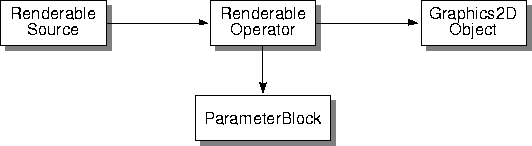
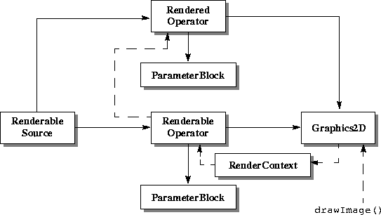

# Java AWT Imaging
{:.no_toc}

Digital imaging in Java has been supported since its first
release, through the **java.awt** and **java.awt.image** class
packages. The image-oriented part of these class packages is referred
to as *AWT Imaging* throughout this guide.

* Contents
{:toc}

## 2.1 Introduction

The Eclipse ImageN API supports three imaging models:

-   The producer/consumer (push) model - the basic AWT imaging model

-   The immediate mode model - an advanced AWT imaging model

-   The pipeline (pull) model - The ImageN model

[Table 2-1](#table-2-1) lists the interfaces and
classes for each of the three models.

**Table 2-1 Imaging Model Interfaces and Classes**

| AWT Push Model | Java 2D Immediate Mode Model  | Pull Model         |
| ---------------| ----------------------------- | ------------------ |
| Image          | BufferedImage                 | RenderableImage    |
| ImageProducer  | Raster                        | RenderableImageOp  |
| ImageConsumer  | BufferedImageOp               | RenderedOp         |
| ImageObserver  | RasterOp                      | RenderableOp       |
|                |                               | TiledImage         |

### 2.1.1 The AWT Push Model

The AWT push model, supported through the `java.awt` class package, is
a simple filter model of image producers and consumers for image
processing. An `Image` object is an abstraction that is not
manipulated directly; rather it is used to obtain a reference to
another object that implements the `ImageProducer` interface. Objects
that implement this interface are in turn attached to objects that
implement the ImageConsumer interface. Filter objects implement both
the producer and consumer interfaces and can thus serve as both a
source and sink of image data. Image data has associated with it a
ColorModel that describes the pixel layout within the image and the
interpretation of the data.

To process images in the push model, an Image object is obtained from
some source (for example, through the `Applet.getImage()` method). The
`Image.getSource()` method can then be used to get the `ImageProducer`
for that `Image`. A series of FilteredImageSource objects can then be
attached to the ImageProducer, with each filter being an ImageConsumer
of the previous image source. AWT Imaging defines a few simple filters
for image cropping and color channel manipulation.

The ultimate destination for a filtered image is an AWT `Image`
object, created by a call to, for example, `Component.createImage()`.
Once this consumer image has been created, it can by drawn upon the
screen by calling `Image.getGraphics()` to obtain a `Graphics` object
(such as a screen device), followed by `Graphics.drawImage()`.

AWT Imaging was largely designed to facilitate the display of images
in a browser environment. In this context, an image resides somewhere
on the network. There is no guarantee that the image will be available
when required, so the AWT model does not force image filtering or
display to completion. The model is entirely a *push* model. An
ImageConsumer can never ask for data; it must wait for the
ImageProducer to \"push\" the data to it. Similarly, an ImageConsumer
has no guarantee about when the data will be completely delivered; it
must wait for a call to its `ImageComplete()` method to know that it
has the complete image. An application can also instantiate an
ImageObserver object if it wishes to be notified about completion of
imaging operations.

AWT Imaging does not incorporate the idea of an image that is backed
by a persistent image store. While methods are provided to convert an
input memory array into an ImageProducer, or capture an output memory
array from an ImageProducer, there is no notion of a persistent image
object that can be reused. When data is wanted from an Image, the
programmer must retrieve a handle to the Image\'s ImageProducer to
obtain it.

The AWT imaging model is not amenable to the development of
high-performance image processing code. The push model, the lack of a
persistent image data object, the restricted model of an image filter,
and the relative paucity of image data formats are all severe
constraints. AWT Imaging also lacks a number of common concepts that
are often used in image processing, such as operations performed on a
region of interest in an image.

### 2.1.2 AWT Push Model Interfaces and Classes

The following are the Java interfaces and classes associated with the
AWT push model of imaging.

**Table 2-2 Push Model Imaging Interfaces**

| Interface | Description |
| --------- | ----------- |
| Image     | Extends: `Object`   The superclass of all classes that represent graphical images. |

**Table 2-3 Push Model Imaging Classes**

| Class | Description |
| --------- | ----------- |
| ColorModel          | An abstract class that encapsulates the methods for translating a pixel value to color components (e.g., red, green, blue) and an alpha component. |
| FilteredImageSource | An implementation of the ImageProducer interface which takes an existing image and a filter object and uses them to produce image data for a new filtered version of the original image. |
| ImageProducer       | The interface for objects that can produce the image data for Images. Each image contains an ImageProducer that is used to reconstruct the image whenever it is needed, for example, when a new size of the Image is scaled, or when the width or height of the Image is being requested. |
| ImageConsumer       | The interface for objects expressing interest in image data through the ImageProducer interfaces. When a consumer is added to an image producer, the producer delivers all of the data about the image using the method calls defined in this interface.
|  ImageObserver      | An asynchronous update interface for receiving notifications about Image information as the Image is constructed.
| --------- | ----------- |

## 2.2 The Immediate Mode Model

To alleviate some of the restrictions of the original AWT imaging
model and to provide a higher level of abstraction, a new
specification called the *Java 2D* API was developed. This new API
extends AWT\'s capabilities for both two-dimensional graphics and
imaging. In practice, the Java 2D package is now merged into the AWT
specification and is a part of the Java Core (and thus available in
all Java implementations). However, for purposes of discussion, the
distinction between Java 2D and the AWT is preserved in this chapter.

The Java 2D API specifies a set of classes that extend the Java AWT
classes to provide extensive support for both two-dimensional graphics
and imaging. The support for 2D graphics is fairly complete, but will
not be discussed further here.

For digital imaging, the Java 2D API retains to some extent the AWT
producer/consumer model but adds the concept of a memory-backed
persistent image data object, an extensible set of 2D image filters, a
wide variety of image data formats and color models, and a more
sophisticated representation of output devices. The Java 2D API also
introduces the notion of resolution-independent image rendering by the
introduction of the *Renderable* and *Rendered* interfaces, allowing
images to be pulled through a chain of filter operations, with the
image resolution selected through a rendering context.

The concepts of rendered and renderable images contained in the Java
2D API are essential to Eclipse ImageN. The next few sections explain these
concepts; complete information about the classes discussed can be
found in *The Java 2D API Specification* and the *Java 2D API White
Paper*.

### 2.2.1 Rendering Independence

Rendering independence for images is a poorly understood topic because
it is poorly named. The more general problem is \"resolution
independence,\" the ability to describe an image as you want it to
appear, but independent of any specific instance of it. Resolution is
but one feature of any such rendering. Others are the physical size,
output device type, color quality, tonal quality, and rendering speed.
A rendering-independent description is concerned with none of these.

In this document, the term *rendering-independent* is for the more
general concept instead of *resolution-independent*. The latter term
is used to specifically refer to independence from final display
resolution.

For a rendering-independent description of an image, two fundamental
elements are needed:

-   An unrendered source (sometimes called a *resolution-independent
    source*). For a still image, this is, conceptually, the viewfinder
    of an idealized camera trained on a real scene. It has no logical
    \"size.\" Rather, one knows what it looks like and can imagine
    projecting it onto any surface. Furthermore, the ideal camera has
    an ideal lens that is capable of infinite zooming. The
    characteristics of this image are that it is dimensional, has a
    native aspect ratio (that of the capture device), and may have
    properties that could be queried.

-   Operators for describing how to change the character of the image,
    independent of its final destination. It can be useful to think of
    this as a pipe of operations.

Together, the unrendered source and the operators specify the visual
character that the image should have when it is rendered. This
specification can then be associated with any device, display size, or
rendering quality. The primary power of rendering independence is that
the same visual description can be routed to any display context with
an optimal result.

### 2.2.2 Rendering-independent Imaging in Java AWT

The Java AWT API architecture integrates a model of rendering
independence with a parallel, device-dependent (rendered) model. The
rendering-independent portion of the architecture is a superset of,
rather than a replacement for, the traditional model of
device-dependent imaging.

The Java AWT API architecture supports context-dependent adaptation,
which is superior to full image production and processing.
Context-dependent adaptation is inherently more efficient and thus
also suited to network sources. Beyond efficiency, it is the mechanism
by which optimal image quality can be assured in any context.

The Java AWT API architecture is essentially synchronous is nature.
This has several advantages, such as a simplified programming model
and explicit controls on the type and order of results. However, the
synchronous nature of Java AWT has one distinct disadvantage in that
it is not well suited to notions of progressive rendering or network
resources. These issues are addressed in Eclipse ImageN.

### 2.2.3 The Renderable Layer vs. the Rendered Layer

The Java AWT API architecture provides for two integrated imaging
layers: renderable and rendered.

#### 2.2.3.1 Renderable Layer

The renderable layer is a rendering-independent layer. All the
interfaces and classes in the Java AWT API have `renderable` in their
names.

The renderable layer provides image sources that can be optimally
reused multiple times in different contexts, such as screen display or
printing. The renderable layer also provides imaging operators that
take rendering-independent parameters. These operators can be linked
to form *chains*. The layer is essentially synchronous in the sense
that it \"pulls\" the image through the chain whenever a rendering
(such as to a display or a file) is requested. That is, a request is
made at the sink end of the chain that is passed up the chain to the
source. Such requests are context-specific (such as device specific),
and the chain adapts to the context. Only the data required for the
context is produced.

#### 2.2.3.2 Rendered Layer

Image sources and operators in the parallel *Rendered layer* (the
interfaces and classes have `rendered` in their names) are
context-specific. A `RenderedImage` is an image that has been rendered
to fulfill the needs of the context. Rendered layer operators can also
be linked together to form chains. They take context-dependent
parameters. Like the Renderable layer, the Rendered layer implements a
synchronous \"pull\" model.

#### 2.2.3.3 Using the Layers

Structurally, the Renderable layer is lightweight. It does not
directly handle pixel processing. Rather, it makes use of operator
objects from the Rendered layer. This is possible because the operator
classes from the Rendered layer can implement an interface (the
`ContextualRenderedImageFactory` interface) that allows them to adapt
to different contexts.

Since the Rendered layer operators implement this interface, they
house specific operations in their entirety. That is, all the
intelligence required to function in both the Rendered and Renderable
layers is housed in a single class. This simplifies the task of
writing new operators and makes extension of the architecture
manageable.

[Figure 2-1](#figure-2-1) shows a renderable chain.
The chain has a sink attached (a Graphics2D object), but no pixels
flow through the chain yet.

------------------------------------------------------------------------

------------------------------------------------------------------------

***Figure 2-1*  A Renderable Chain**

You may use either the Renderable or Rendered layer to construct an
application. Many programmers will directly employ the Rendered layer,
but the Renderable layer provides advantages that greatly simplify
imaging tasks. For example, a chain of Renderable operators remains
editable. Parameters used to construct the chain can be modified
repeatedly. Doing so does not cause pixel value computation to occur.
Instead, the pixels are computed only when they are needed by a
specific rendition obtained from a `RenderableImage` by passing it
defined *render contexts*.

### 2.2.4 The Render Context

The renderable layer allows for the construction of a chain of
operators (`RenderableImageOps`) connected to a `RenderableImage`
source. The end of this chain represents a new `RenderableImage`
source. The implication of this is that `RenderableImageOps` must
implement the same interface as sources: `RenderableImageOp`
implements `RenderableImage`.

Such a source can be asked to provide various specific
`RenderedImage`s corresponding to a specific context. The required
size of the `RenderedImage` in the device space (the size in pixels)
must be specified. This information is provided in the form of an
affine transformation from the user space of the Renderable source to
the desired device space.

Other information can also be provided to the source (or chain) to
help it perform optimally for a specific context. A preference for
speed over image quality is an example. Such information is provided
in the form of an extensible hints table. It may also be useful to
provide a means to limit the request to a specific area of the image.

The architecture refers to these parameters collectively as a *render
context*. The parameters are housed in a `RenderContext` class. Render
contexts form a fundamental link between the Renderable and Rendered
layers. A `RenderableImage` source is given a `RenderContext` and, as
a result, produces a specific rendering, or `RenderedImage`. This is
accomplished by the Renderable chain instantiating a chain of Render
layer objects. That is, a chain of `RenderedImage`s corresponding to
the specific context, the `RenderedImage` object at the end of the
chain being returned to the user.

## 2.3 Renderable and Rendered Classes

Many users will be able to employ the Renderable layer, with the
advantages of its rendering-independent properties for most imaging
purposes. Doing so eliminates the need to deal directly with pixels,
greatly simplifying image manipulation. However, in many cases it is
either necessary or desirable to work with pixels and the Rendered
layer is used for this purpose.

The architecture of the provided classes is discussed in this section.
Extending the model by writing new operators or algorithms in the Java
2D API is discussed. Details of how the Rendered layer functions
internally within the Renderable layer are also covered.

### 2.3.1 The Renderable Layer

The renderable layer is primarily defined by the `RenderableImage`
interface. Any class implementing this interface is a renderable image
source, and is expected to adapt to `RenderContext`s.
`RenderableImage`s are referenced through a user-defined coordinate
system. One of the primary functions of the `RenderContext` is to
define the mapping between this user space and the specific device
space for the desired rendering.

A chain in this layer is a chain of `RenderableImage`s. Specifically,
it is a chain of `RenderableImageOp`s (a class that implements
`RenderableImage`), ultimately sourced by a `RenderableImage`.

There is only one `RenderableImageOp` class. It is a lightweight,
general purpose class that takes on the functionality of a specific
operation through a parameter provided at instantiation time. That
parameter is the name of a class that implements a
`ContextualRenderedImageFactory` (known as a CRIF, for short). Each
instantiation of `RenderableImageOp` derives its specific
functionality from the named class. In this way, the Renderable layer
is heavily dependent on the Rendered layer.

**Table 2-4 The Renderable Layer Interfaces and Classes**

| Type | Name | Description |
| ---- | ---- | ----- |
| Interface | RenderableImage | A common interface for rendering-independent images (a notion that
subsumes resolution independence). |
| Interface | ContextualRenderedImage-Factory | Extends: RenderedImageFactory Provides an interface for the functionality that may differ between
instances of RenderableImageOp. |
| Class | ParameterBlock | Extends: Object   Implements: Cloneable, Serializable   Encapsulates all the information about sources and parameters (expressed as base types or Objects) required by a RenderableImageOp and other future classes that manipulate chains of imaging operators. |
| Class | RenderableImageOp | Extends: Object   Implements: RenderableImage   Handles the renderable aspects of an operation with help from its associated instance of a ContextualRenderedImageFactory. |
| Class | RenderableImageProducer | Extends: Object   Implements: ImageProducer, Runnable   An adapter class that implements ImageProducer to allow the asynchronous production of a RenderableImage. |
| Class | RenderContext | Extends: Object   Implements: Cloneable   Encapsulates the information needed to produce a specific rendering  from a RenderableImage. |

The other block involved in the construction of `RenderableImageOp` is
a `ParameterBlock`. The `ParameterBlock` houses the source(s) for the
operation, plus parameters or other objects that the operator may
require. The parameters are rendering-independent versions of the
parameters that control the (Rendered) operator.

A Renderable chain is constructed by instantiating each successive
`RenderableImageOp`, passing in the last `RenderableImage` as the
source in the `ParameterBlock`. This chain can then be requested to
provide a number of renderings to specific device spaces through the
`getImage` method.

This chain, once constructed, remains editable. Both the parameters
for the specific operations in the chain and the very structure of the
chain can be changed. This is accomplished by the `setParameterBlock`
method, setting new controlling parameters and/or new sources. These
edits only affect future `RenderedImage`s derived from points in the
chain below the edits. `RenderedImage`s that were previously obtained
from the Renderable chain are immutable and completely independent
from the chain from which they were derived.

### 2.3.2 The Rendered Layer

The Rendered layer is designed to work in concert with the Renderable
layer. The Rendered layer is comprised of sources and operations for
device-specific representations of images or renderings. The Rendered
layer is primarily defined by the `RenderedImage` interface. Sources
such as `BufferedImage` implement this interface.

Operators in this layer are simply `RenderedImage`s that take other
`RenderedImage`s as sources. Chains, therefore, can be constructed in
much the same manner as those of the Renderable layer. A sequence of
`RenderedImage`s is instantiated, each taking the last `RenderedImage`
as a source.

In [Figure 2-2](#figure-2-2), when the user calls
`Graphics2D.drawImage()`, a render context is constructed and used to
call the `getImage()` method of the renderable operator. A rendered
operator to actually do the pixel processing is constructed and
attached to the source and sink of the renderable operator and is
passed a clone of the renderable operator\'s parameter block. Pixels
actually flow through the rendered operator to the Graphics2D. The
renderable operator chain remains available to produce more renderings
whenever its `getImage()` method is called.

------------------------------------------------------------------------

------------------------------------------------------------------------

**Figure 2-2 Deriving a Rendering from a Renderable Chain**

**Table 2-5 The Rendered Layer Interfaces and Classes**

| Type        | Name          | Description |
| ----------- | ------------- | ------------------ |
| Interface  | RenderedImage | A common interface for objects that contain or can produce image data in the form of Rasters. |
| Class      | BufferedImage | Extends: `Image`   Implements: `WritableRenderedImage`   A subclass that describes an Image with an accessible buffer of image data. |
| Class | WritableRenderedImage | Extends: `RenderedImage`   A common interface for objects that contain or can produce image data that can be modified and/or written over. |

A rendered image represents a virtual image with a coordinate system
that maps directly to pixels. A Rendered image does not have to have
image data associated with it, only that it be able to produce image
data when requested. The `BufferedImage` class, which is the Java 2D
API\'s implementation of `RenderedImage`, however, maintains a full
page buffer that can be accessed and written to. Data can be accessed
in a variety of ways, each with different properties.

## 2.4 Java Image Data Representation

In the Java AWT API, a sample is the most basic unit of image data.
Each pixel is composed of a set of samples. For an RGB pixel, there
are three samples; one each for red, green, and blue. All samples of
the same kind across all pixels in an image constitute a *band*. For
example, in an RGB image, all the red samples together make up a band.
Therefore, an RGB image contains three bands.

A three-color subtractive image contains three bands; one each for
cyan, magenta, and yellow (CMY). A four-color subtractive image
contains four bands; one each for cyan, magenta, yellow, and black
(CMYK).

**Table 2-6 Java 2D Image Data Classes**

| Type | Name | Extends | Description |
| ---- | ---- | ------- | ----- |
| Class | DataBuffer | Object | Wraps one or more data arrays. Each data array in the DataBuffer is referred to as a bank. |
| Class | Raster     | Object | Represents a rectanglular array of pixels and provides methods for retrieving image data. |
| Class | SampleModel | Object | Extracts samples of pixels in images. |
| Class | WriteableRaster | Raster | Provides methods for storing image data and inherits methods for retrieving image data from it\'s parent class Raster. |

The basic unit of image data storage is the `DataBuffer`. The
`DataBuffer` is a kind of raw storage that contains all of the samples
for the image data but does not maintain a notion of how those samples
can be put together as pixels. The information about how the samples
are put together as pixels is contained in a `SampleModel`. The
`SampleModel` class contains methods for deriving pixel data from a
`DataBuffer`. Together, a `DataBuffer` and a `SampleModel` constitute
a meaningful multi-pixel image storage unit called a `Raster`.

A `Raster` has methods that directly return pixel data for the image
data it contains. There are two basic types of `Raster`s:

-   `Raster` - a read-only object that has only accessors

-   `WritableRaster` - A writable object that has a variety of
    mutators

There are separate interfaces for dealing with each raster type. The
`RenderedImage` interface assumes that the data is read-only and does
not contain methods for writing a `Raster`. The
`WritableRenderedImage` interface assumes that the image data is
writeable and can be modified.

Data from a *tile* is returned in a `Raster` object. A tile is not a
class in the architecture; it is a concept. A tile is one of a set of
regular rectangular regions that span the image on a regular grid. In
the `RenderedImage` interface, there are several methods that relate
to tiles and a tile grid. These methods are used by the Eclipse ImageN API,
rather than the Java 2D API. In the Java 2D API, the implementation of
the `WritableRenderedImage` (`BufferedImage`) is defined to have a
single tile. This, the `getWritableTile` method will return all the
image data. Other methods that relate to tiling will return the
correct degenerative results.

`RenderedImage`s do not necessarily maintain a `Raster` internally.
Rather, they can return requested rectangles of image data in the form
of a (`Writable`)`Raster` (through the `getData`, `getRect`, and
`get`(`Writable`)`Tile` methods). This distinction allows
`RenderedImages` to be virtual images, producing data only when
needed. `RenderedImage`s do, however, have an associated
`SampleModel`, implying that data returned in `Raster`s from the same
image will always be written to the associated `DataBuffer` in the
same way.

The Java 2D `BufferedImage` also adds an associated `ColorModel`,
which is different from the `SampleModel`. The `ColorModel` determines
how the bands are interpreted in a colorimetric sense.

## 2.5 Introducing the Eclipse ImageN

Eclipse ImageN builds on the foundation of the Java 2D API to allow more
powerful and general imaging applications. ImageN adds the
following concepts:

-   Multi-tiled images

-   Deferred execution

-   Networked images

-   Image property management

-   Image operators with multiple sources

-   Three-dimensional image data

The combination of tiling and deferred execution allows for
considerable run-time optimization while maintaining a simple imaging
model for programmers. New operators may be added and the new
operators may participate as first-class objects in the deferred
execution model.

ImageN also provides for a considerable degree of compatibility
with the Java AWT and Java 2D imaging models. ImageN\'s operators can
work directly on Java 2D `BufferedImage` objects or any other image
objects that implement the `RenderedImage` interface. ImageN supports the
same rendering-independent model as the Java 2D API. using
device-independent coordinates. ImageN also supports Java 2D-style
drawing on both Rendered and Renderable images using the `Graphics`
interface.

ImageN does not make use of the image producer/consumer
interfaces introduced in Java AWT and carried forward into the Java 2D
API. Instead, ImageN requires that image sources participate in
the \"pull\" imaging model by responding to requests for arbitrary
areas, thus making it impossible to instantiate an `ImageProducer`
directly as a source. It is, however, possible to instantiate an
`ImageProducer` that makes ImageN image data available to older
AWT applications.

### 2.5.1 Similarities with the Java 2D API

Eclipse ImageN is heavily dependent on the abstractions defined in the
Java 2D API. In general, the entire mechanism for handling Renderable
and Rendered images, pixel samples, and data storage is carried over
into ImageN. Here are some of the major points of congruity between Java
2D and ImageN:

-   The `RenderableImage` and `RenderedImage` interfaces defined in
    the Java 2D API are used as a basis for higher-level abstractions.
    Further, ImageN allows you to create and manipulate directed acyclic
    graphs of objects implementing these interfaces.

-   The primary data object, the `TiledImage`, implements the
    `WritableRenderedImage` interface and can contain a regular tile
    grid of `Raster` objects. However, unlike the `BufferedImage` of
    the Java 2D API, `TiledImage` does not require that a `ColorModel`
    for photometric interpretation of its image data be present.

-   The operator objects are considerably more sophisticated than
    in the Java 2D API. The `OpImage`, the fundamental operator
    object, provides considerable support for extensibility to new
    operators beyone that in the Java 2D API. ImageN has a registry
    mechanism that automates the selection of operations on
    `RenderedImages`.

-   The Java 2D API `SampleModel`, `DataBuffer`, and `Raster` objects
    are carried over into ImageN without change, except that `double`s
    and `float`s are allows to be used as the fundamental data types
    of a `DataBuffer` in addition to the `byte`, `short`, and `int`
    data types.

### 2.5.2 Data Classes

Eclipse ImageN provides two data classes, which extend the Java 2D `DataBuffer` image data class.

**Table 2-7 Data Classes**

| Type  | Name             | Description                |
| ----- | ---------------- | -------------------------- |
| Class | DataBufferFloat  | Extends: `DataBuffer`   Stores data internally in float form. |
| Class | DataBufferDouble | Extends: `DataBuffer`   Stores data internally in double form. |

#### 2.5.2.1 The DataBufferFloat Class

**API:** `org.eclipse.imagen.DataBufferFloat`

* `DataBufferFloat(int size)`

* `DataBufferFloat(int size, int numBanks)`

* `DataBufferFloat(float[] dataArray, int size)`

* `DataBufferFloat(float[] dataArray, int size, int offset)`

* `DataBufferFloat(float[][] dataArray, int size)`

* `DataBufferFloat(float[][] dataArray, int size, int[] offsets)`

#### 2.5.2.2 The DataBufferDouble Class

**API:** `org.eclipse.imagen.DataBufferDouble`

* `DataBufferDouble(int size)`

* `DataBufferDouble(int size, int numBanks)`

* `DataBufferDouble(double[] dataArray, int size)`

* `DataBufferDouble(double[] dataArray, int size, int offset)`

* `DataBufferDouble(double[][] dataArray, int size)`

* *`DataBufferDouble(double[][] dataArray, int size, int[] offsets)`
