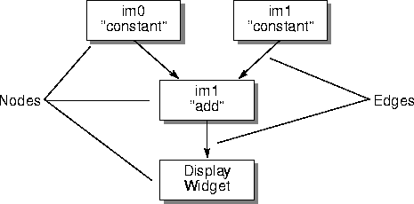
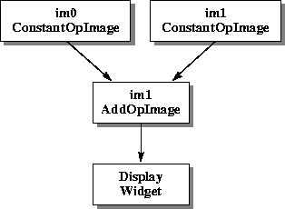
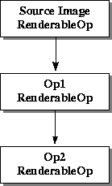
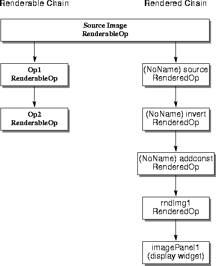

  ----------------------------------------
    C H A P T E R3
  ----------------------------------------

+----------------------------------------------------------------------:+
| -------------------------------------------------------------------   |
|                                                                       |
| Programming in Java Advanced Imaging                                  |
+-----------------------------------------------------------------------+

\
\
\

**T**HIS chapter describes how to get started programming with the
Java Advanced Imaging (JAI) API.

3.1 Introduction
-------------------------------------

An imaging operation within JAI is summarized in the following four
steps:

1\. Obtain the source image or images. Images may be obtained in one of
three ways (see [Chapter 4, \"Image Acquisition and
Display](../acquisition)\"):

2\. Define the imaging graph. This is a two part process:

3\. Evaluate the graph using one of three execution models:

4\. Process the result. There are four possible destinations:

3.2 An Overview of Graphs
----------------------------------------------

In JAI, any operation is defined as an object. An operator object is
instantiated with zero or more image sources and other parameters that
define the operation. Two or more operators may be strung together so
that the first operator becomes an image source to the next operator.
By linking one operator to another, we create an imaging *graph* or
*chain*.

In its simplest form, the imaging graph is a chain of operator objects
with one or more image sources at one end and an image *sinc* (or
\"user\") at the other end. The graph that is created is commonly
known as a *directed acyclic graph* (DAG), where each object is a
*node* in the graph and object references form the *edges* (see
[Figure 3-1](../programming-environ)).

------------------------------------------------------------------------

------------------------------------------------------------------------

***Figure 3-1*  An Example DAG**

Most APIs simply leave the DAG structure of images and operators
implicit. However, JAI makes the notion of a *processing graph*
explicit and allows such graphs to be considered as entities in their
own right. Rather than thinking only of performing a series of
operations in sequence, you can consider the graph structure produced
by the operations. The graph form makes it easier to visualize the
operations.

A directed acyclic graph is a graph containing no cycles. This means
that if there is a route from node A to node B then there should be no
way back. Normally, when creating a graph by instantiating new nodes
one at a time, cycles are easily avoided. However, when reconfiguring
a graph, you must be careful not to introduce cycles into the graph.

3.3 Processing Graphs
------------------------------------------

JAI extends rendering independence, which was introduced in the Java
2D API. With rendering independence, you have the ability to describe
an image as you want it to appear, independent of any specific
instance of it.

In most imaging APIs, the application must know the exact resolution
and size of the source image before it can begin any imaging
operations on the image. The application must also know the resolution
of the output device (computer monitor or color printer) and the color
and tonal quality of the original image. A rendering-independent
description is concerned with none of these. Rendering-independent
sources and operations permit operations to be specified in
resolution-independent coordinates.

Think of rendering independence a bit like how a PostScript file is
handled in a computer. To display a PostScript file on a monitor or to
print the file to a high-resolution phototypesetter, you don\'t need
to know the resolution of the output device. The PostScript file is
essentially rendering independent in that it displays properly no
matter what the resolution of the output device is.

JAI has a \"renderable\" mode in which it treats all image sources as
rendering independent. You can set up a graph (or chain) of renderable
operations without any concern for the source image resolution or
size; JAI takes care of the details of the operations.

JAI introduces two different types of graphs: rendered and renderable.

------------------------------------------------------------------------

**Note:** The following two sections, \"[Rendered
Graphs](../programming-environ)\" and \"[Renderable
Graphs](../programming-environ),\" are for advanced JAI
users. Most programmers will use JAI\'s Rendered mode and don\'t
really need to know about the Renderable mode.

------------------------------------------------------------------------

### 3.3.1 Rendered Graphs

Rendered graphs are the simplest form of rendering in JAI. Although
Renderable graphs have the advantage of rendering-independence,
eliminating the need to deal directly with pixels, Rendered graphs are
useful when it is necessary to work directly with the pixels.

A Rendered graph processes images in immediate mode. For any node in
the graph, the image source is considered to have been evaluated at
the moment it is instantiated and added to the graph. Or, put another
way, as a new operation is added to the chain, it appears to compute
its results immediately.

A Rendered graph is composed of Rendered object nodes. These nodes are
usually instances of the `RenderedOp` class, but could belong to any
subclass of `PlanarImage`, JAI\'s version of `RenderedImage`.

Image sources are objects that implement the `RenderedImage`
interface. These sources are specified as parameters in the
construction of new image objects.

Let\'s take a look at an example of a rendered graph in [Listing
3-1](../programming-environ). This example, which is a
code fragment rather than an entire class definition, creates two
constant images and then adds them together.

**[]{#61982}**

***Listing 3-1*  Rendered Chain Example**

------------------------------------------------------------------------

         import javax.jai.*;
         import javax.jai.widget.*;
         import java.awt.Frame;

         public class AddExample extends Frame {

              // ScrollingImagePanel is a utility widget that
              // contains a Graphics2D (i.e., is an image sink).
              ScrollingImagePanel imagePanel1;

              // For simplicity, we just do all the work in the
              // class constructor.
              public AddExample(ParameterBlock param1,
                                ParameterBlock param2) {

                   // Create a constant image
                   RenderedOp im0 = JAI.create("constant", param1);

                   // Create another constant image.
                   RenderedOp im1 = JAI.create("constant", param2);
                   // Add the two images together.

                   RenderedOp im2 = JAI.create("add", im0, im1);

                   // Display the original in a scrolling window
                   imagePanel1 = new ScrollingImagePanel(im2, 100, 100);

                   // Add the display widget to our frame.
                   add(imagePanel1);
              }
         }

------------------------------------------------------------------------

The first three lines of the example code specify which classes to
import. The classes prefixed with `javax.jai` are the Java Advanced
Imaging classes. The `java.awt` prefix specifies the core Java API
classes.

         import javax.jai.*;
         import javax.jai.widget.*;
         import java.awt.Frame;

The next line declares the name of the program and that it runs in a
`Frame`, a window with a title and border.

         public class AddExample extends Frame {

The next line of code creates a `ScrollingImagePanel`, which is the
ultimate destination of our image:

         ScrollingImagePanel imagePanel1;

Next, a `ParameterBlock` for each source image is defined. The
parameters specify the image height, width, origin, tile size, and so
on.

         public AddExample(ParameterBlock param1,
                           ParameterBlock param2) {

The next two lines define two operations that create the two
\"constant\" images that will be added together to create the
destination image (see [Section 4.7, \"Creating a Constant
Image](../acquisition)\").

         RenderedOp im0 = JAI.create("constant", param1);
         RenderedOp im1 = JAI.create("constant", param2);

Next, our example adds the two images together (see [Section 6.5.1,
\"Adding Two Source Images](../image-manipulation)\").

         RenderedOp im2 = JAI.create("add", im0, im1);

Finally, we display the destination image in a scrolling window and
add the display widget to our frame.

         imagePanel1 = new ScrollingImagePanel(im2, 100, 100);
         add(imagePanel1);

Once pixels start flowing, the graph will look like [Figure
3-2](../programming-environ). The display widget drives
the process. We mention this because the source images are not loaded
and no pixels are produced until the display widget actually requests
them.

------------------------------------------------------------------------

------------------------------------------------------------------------

***Figure 3-2*  Rendered Chain Example**

### 3.3.2 Renderable Graphs

A *renderable graph* is a graph that is not evaluated at the time it
is specified. The evaluation is deferred until there is a specific
request for a rendering. This is known as *deferred execution*;
evaluation is deferred until there is a specific request for
rendering.

In a renderable graph, if a source image should change before there is
a request for rendering, the changes will be reflected in the output.
This process can be thought of as a \"pull\" model, in which the
requestor pulls the image through the chain, which is the opposite of
the AWT imaging push model.

A renderable graph is made up of nodes implementing the
`RenderableImage` interface, which are usually instances of the
`RenderableOp` class. As the renderable graph is constructed, the
sources of each node are specified to form the graph topology. The
source of a renderable graph is a Renderable image object.

Let\'s take a look at an example of a renderable graph in [Listing
3-2](../programming-environ). This example reads a TIFF
file, inverts its pixel values, then adds a constant value to the
pixels. Once again, this example is a code fragment rather than an
entire class definition.

**[]{#62194}**

***Listing 3-2*  Renderable Chain Example**

------------------------------------------------------------------------

         // Get rendered source object from a TIFF source.
         // The ParameterBlock `pb0' contains the name
         // of the source (file, URL, etc.). The objects `hints0',
         // `hints1', and `hints2' contain rendering hints and are
         // assumed to be created outside of this code fragment.
         RenderedOp sourceImg = 
                   JAI.create("TIFF", pb0);

         // Derive the RenderableImage from the source RenderedImage.
         ParameterBlock pb = new ParameterBlock();
         pb.addSource(sourceImg);
         pb.add(null).add(null).add(null).add(null).add(null);

         // Create the Renderable operation.
         RenderableImage ren = JAI.createRenderable("renderable", pb);

         // Set up the parameter block for the first op.
         ParameterBlock pb1 = new ParameterBlock();
         pb1.addSource(ren);

         // Make first Op in Renderable chain an invert.
         RenderableOp Op1 = JAI.createRenderable("invert", pb1);

         // Set up the parameter block for the second Op.
         // The constant to be added is "2".
         ParameterBlock pb2 = new ParameterBlock();
         pb2.addSource(Op1);        // Op1 as the source
         pb2.add(2.0f);             // 2.0f as the constant

         // Make a second Op a constant add operation.
         RenderableOp Op2 = 
                   JAI.createRenderable("addconst", pb2);

         // Set up a rendering context.
         AffineTransform screenResolution = ...;
         RenderContext rc = new RenderContext(screenResolution);

         // Get a rendering.
         RenderedImage rndImg1 = Op2.createRendering(rc);

         // Display the rendering onscreen using screenResolution.
         imagePanel1 = new ScrollingImagePanel(rndImg1, 100, 100);

------------------------------------------------------------------------

In this example, the image source is a TIFF image. A TIFF `RenderedOp`
is created as a source for the subsequent operations:

         RenderedOp sourceImg = 
                   JAI.create("TIFF", pb0);

The rendered source image is then converted to a renderable image:

         ParameterBlock pb = new ParameterBlock();
         pb.addSource(sourceImg);
         pb.add(null).add(null).add(null).add(null).add(null);
         RenderableImage ren = JAI.createRenderable("renderable", pb);

Next, a `ParameterBlock` is set up for the first operation. The
parameter block contains sources for the operation and parameters or
other objects that the operator may require.

         ParameterBlock pb1 = new ParameterBlock();
         pb1.addSource(sourceImage);

An \"invert\" `RenderableOp` is then created with the TIFF image as
the source. The `invert` operation inverts the pixel values of the
source image and creates a `RenderableImage` as the result of applying
the operation to a tuple (source and parameters).

         RenderableOp Op1 = JAI.createRenderable("invert", pb1);

The next part of the code example sets up a `ParameterBlock` for the
next operation. The `ParameterBlock` defines the previous operation
(Op1) as the source of the next operation and sets a constant with a
value of 2.0, which will be used in the next \"add constant\"
operation.

         ParameterBlock pb2 = new ParameterBlock();
         pb2.addSource(Op1);        // Op1 as the source
         pb2.add(2.0f);             // 2.0f as the constant

The second operation (`Op2`) is an add constant (`addconst`), which
adds the constant value (2.0) to the pixel values of a source image on
a per-band basis. The `pb2` parameter is the `ParameterBlock` set up
in the previous step.

         RenderableOp Op2 = 
                   JAI.createRenderable("addconst", pb2);

After `Op2` is created, the renderable chain thus far is shown in
[Figure 3-3](../programming-environ).

------------------------------------------------------------------------

------------------------------------------------------------------------

***Figure 3-3*  Renderable Chain Example**

Next, a `RenderContext` is created using an `AffineTransform` that
will produce a screen-size rendering.

         AffineTransform screenResolution = ...;
         RenderContext rc = new RenderContext(screenResolution);

This rendering is created by calling the
`RenderableImage.createRendering` method on `Op2`. The
`createRendering` method does not actually compute any pixels, bit it
does instantiate a `RenderedOp` chain that will produce a rendering at
the appropriate pixel dimensions.

         RenderedImage rndImg1 = Op2.createRendering(rc);

The Renderable graph can be thought of as a *template* that, when
rendered, causes the instantiation of a parallel Rendered graph to
accomplish the actual processing. Now let\'s take a look at what
happens back up the rendering chain in our example:

-   When the `Op2.createRendering` method is called, it recursively
    calls the `Op1.createRendering` method with the `RenderContext`
    `rc` as the argument.

-   The `Op1` operation then calls the `sourceImg.getImage` method,
    again with `rc` as the argument. `sourceImg` creates a new
    `RenderedImage` to hold its source pixels at the required
    resolution and inserts it into the chain. It then returns a handle
    to this object to `Op1`.

-   `Op1` then uses the `OperationRegistry` to find a
    `ContextualRenderedImageFactory` (CRIF) that can perform the
    \"invert\" operation. The resulting `RenderedOp` object returned
    by the CRIF is inserted into the chain with the handle returned by
    `sourceImg` as its source.

-   The handle to the \"invert\" `RenderedImage` is returned to `Op2`,
    which repeats the process, creating an \"addconst\" `RenderedOp`,
    inserting it into the chain and returning a handle to `rndImg1`.

-   Finally, `rndImg1` is used in the call to the
    `ScrollingImagePanel` to display the result on the screen.

After the creation of the `ScrollingImagePanel`, the Renderable and
Rendered chains look like [Figure
3-4](../programming-environ).

------------------------------------------------------------------------

------------------------------------------------------------------------

***Figure 3-4*  Renderable and Rendered Graphs
after the getImage Call**

At this point in the chain, no pixels have been processed and no
`OpImages`, which actually calculate the results, have been created.
Only when the `ScrollingImagePanel` needs to put pixels on the screen
are the `OpImages` created and pixels pulled through the Rendered
chain, as done in the final line of code.

         imagePanel1 = new ScrollingImagePanel(rndImg1, 100, 100);

### 3.3.3 Reusing Graphs

Many times, it is more desirable to make changes to an existing graph
and reuse it than to create another nearly identical graph. Both
Rendered and Renderable graphs are editable, with certain limitations.

#### 3.3.3.1 Editing Rendered Graphs

Initially, a node in a Rendered graph is mutable; it may be assigned
new sources, which are considered to be evaluated as soon as they are
assigned, and its parameter values may be altered. However, once
rendering takes place at a node, it becomes frozen and its sources and
parameters cannot be changed.

A chain of Rendered nodes may be cloned without freezing any of its
nodes by means of the `RenderedOp.createInstance` method. Using the
`createInstance` method, a Rendered graph may be configured and reused
at will, as well as serialized and transmitted over a network.

The `RenderedOp` class provides several methods for reconfiguring a
Rendered node. The `setParameter` methods can be used to set the
node\'s parameters to a `byte`, `char`, `short`, `int`, `long`,
`float`, `double`, or an `Object`. The `setOperationName` method can
be used to change the operation name. The `setParameterBlock` method
can be used to change the nodes\'s `ParameterBlock`.

#### 3.3.3.2 Editing Renderable Graphs

Since Renderable graphs are not evaluated until there is a specific
request for a rendering, the nodes may be edited at any time. The main
concern with editing Renderable graphs is the introduction of cycles,
which must be avoided.

The `RenderableOp` class provides several methods for reconfiguring a
Renderable node. The `setParameter` methods can be used to set the
node\'s parameters to a `byte`, `char`, `short`, `int`, `long`,
`float`, `double`, or an `Object`. The `setParameterBlock` method can
be used to change the nodes\'s `ParameterBlock`. The `setProperty`
method can be used to change a node\'s local property. The `setSource`
method can be used to set one of the node\'s sources to an `Object`.

3.4 Remote Execution
-----------------------------------------

Up to this point, we have been talking about standalone image
processing. JAI also provides for client-server image processing
through what is called the *Remote Execution* model.

Remote execution is based on Java RMI (remote method invocation). Java
RMI allows Java code on a client to invoke method calls on objects
that reside on another computer without having to move those objects
to the client. The advantages of remote execution become obvious if
you think of several clients wanting to access the same objects on a
server. To learn more about remote method invocation, refer to one of
the books on Java described in [\"Related Documentation\" on page
xv](../Preface).

To do remote method invocation in JAI, a `RemoteImage` is set up on
the server and a `RenderedImage` chain is set up on the client. For
more information, see [Chapter 12, \"Client-Server
Imaging](../client-server).\"

3.5 Basic JAI API Classes
----------------------------------------------

JAI consists of several classes grouped into five packages:

-   `javax.media.jai` - contains the \"core\" JAI interfaces and
    classes

-   `javax.media.jai.iterator` - contains special iterator interfaces
    and classes, which are useful for writing extension operations

-   `javax.media.jai.operator` - contains classes that describe all of
    the image operators

-   `javax.media.jai.widget` - contains interfaces and classes for
    creating simple image canvases and scrolling windows for image
    display

Now, let\'s take a look at the most common classes in the JAI class
hierarchy.

### 3.5.1 The JAI Class

The `JAI` class cannot be instantiated; it is simply a placeholder for
static methods that provide a simple syntax for creating Renderable
and Rendered graphs. The majority of the methods in this class are
used to create a `RenderedImage`, taking an operation name, a
`ParameterBlock`, and `RenderingHints` as arguments. There is one
method to create a `RenderableImage`, taking an operation name, a
`ParameterBlock`, and `RenderingHints` as arguments.

There are several variations of the `create` method, all of which take
sources and parameters directly and construct a `ParameterBlock`
automatically.

### 3.5.2 The PlanarImage Class

The `PlanarImage` class is the main class for describing
two-dimensional images in JAI. `PlanarImage` implements the
`RenderedImage` interface from the Java 2D API. `TiledImage` and
`OpImage`, described later, are subclasses of `PlanarImage`.``

The `RenderedImage` interface describes a tiled, read-only image with
a pixel layout described by a `SampleModel` and a `DataBuffer`. Each
tile is a rectangle of identical dimensions, laid out on a regular
grid pattern. All tiles share a common `SampleModel`.

In addition to the capabilities offered by `RenderedImage`,
`PlanarImage` maintains source and sink connections between the nodes
of rendered graphs. Since graph nodes are connected bidirectionally,
the garbage collector requires assistance to detect when a portion of
a graph is no longer referenced from user code and may be discarded.
`PlanarImage` takes care of this by using the *Weak References API* of
Java 2.

Any `RenderedImage`s from outside the API are \"wrapped\" to produce
an instance of `PlanarImage`. This allows the API to make use of the
extra functionality of `PlanarImage` for all images.

### 3.5.3 The CollectionImage Class

`CollectionImage` is the abstract superclass for four classes
representing collections of `PlanarImage`s:

-   `ImageStack` - represents a set of two-dimensional images lying in
    a common three-dimensional space, such as CT scans or seismic
    volumes. The images need not lie parallel to one another.

-   `ImageSequence` - represents a sequence of images with associated
    time stamps and camera positions. This class can be used to
    represent video or time-lapse photography.

-   `ImagePyramid` - represents a series of images of progressively
    lesser resolution, each derived from the last by means of an
    imaging operator.

-   `ImageMIPMap` - represents a stack of images with a fixed
    operational relationship between adjacent slices.

### 3.5.4 The TiledImage Class

The `TiledImage` class represents images containing multiple tiles
arranged into a grid. The tiles form a regular grid, which may occupy
any rectangular region of the plane.

`TiledImage` implements the `WritableRenderedImage` interface from the
Java 2D API, as well as extending `PlanarImage`. A `TiledImage` allows
its tiles to be checked out for writing, after which their pixel data
may be accessed directly. `TiledImage` also has a `createGraphics`
method that allows its contents to be altered using Java 2D API
drawing calls.

A `TiledImage` contains a tile grid that is initially empty. As each
tile is requested, it is initialized with data from a `PlanarImage`
source. Once a tile has been initialized, its contents can be altered.
The source image may also be changed for all or part of the
`TiledImage` using its `set` methods. In particular, an arbitrary
region of interest (ROI) may be filled with data copied from a
`PlanarImage` source.

The `TiledImage` class includes a method that allows you to paint a
`Graphics2D` onto the `TiledImage`. This is useful for adding text,
lines, and other simple graphics objects to an image for annotating
the image. For more on the TiledImage class, see [Section 4.2.2,
\"Tiled Image](../acquisition).\"

### 3.5.5 The OpImage Class

The OpImage class is the parent class for all imaging operations, such
as:

-   `AreaOpImage` - for image operators that require only a fixed
    rectangular source region around a source pixel to compute each
    destination pixel

-   `PointOpImage` - for image operators that require only a single
    source pixel to compute each destination pixel

-   `SourcelessOpImage` - for image operators that have no image
    sources

-   `StatisticsOpImage` - for image operators that compute statistics
    on a given region of an image, and with a given sampling rate

-   `UntiledOpimage` - for single-source operations in which the
    values of all pixels in the source image contribute to the value
    of each pixel in the destination image

-   `WarpOpImage` - for image operators that perform an image warp

-   `ScaleOpImage` - for extension operators that perform image
    scaling requiring rectilinear backwards mapping and padding by the
    resampling filter dimensions``

The `OpImage` is able to determine what source areas are sufficient
for the computation of a given area of the destination by means of a
user-supplied `mapDestRect` method. For most operations, this method
as well as a suitable implementation of `getTile` is supplied by a
standard subclass of `OpImage`, such as `PointOpImage` or
`AreaOpImage`.

An `OpImage` is effectively a `PlanarImage` that is defined
computationally. In `PlanarImage`, the `getTile` method of
`RenderedImage` is left abstract, and `OpImage` subclasses override it
to perform their operation. Since it may be awkward to produce a tile
of output at a time, due to the fact that source tile boundaries may
need to be crossed, the `OpImage` class defines a `getTile` method to
cobble (copy) source data as needed and to call a user-supplied
`computeRect` method. This method then receives contiguous source
`Rasters` that are guaranteed to contain sufficient data to produce
the desired results. By calling `computeRect` on subareas of the
desired tile, `OpImage` is able to minimize the amount of data that
must be cobbled.

A second version of the `computeRect` method that is called with
uncobbled sources is available to extenders. This interface is useful
for operations that are implemented using *iterators* (see [Section
14.4, \"Iterators](../extension)\"), which abstract away
the notion of tile boundaries.

### 3.5.6 The RenderableOp Class

The `RenderableOp` class provides a lightweight representation of an
operation in the Renderable space (see [Section 3.3.2, \"Renderable
Graphs](../programming-environ)\"). `RenderableOp`s are
typically created using the `createRenderable` method of the `JAI`
class, and may be edited at will. `RenderableOp` implements the
`RenderableImage` interface, and so may be queried for its
rendering-independent dimensions.

When a `RenderableOp` is to be rendered, it makes use of the
`OperationRegistry` (described in [Chapter
14](../extension)) to locate an appropriate
`ContextualRenderedImageFactory` object to perform the conversion from
the Renderable space into a `RenderedImage`.

### 3.5.7 The RenderedOp Class

The `RenderedOp` is a lightweight object similar to `RenderableOp`
that stores an operation name, `ParameterBlock`, and `RenderingHints`,
and can be joined into a Rendered graph (see [Section 3.3.1,
\"Rendered Graphs](../programming-environ)\"). There are
two ways of producing a rendering of a `RenderedOp`:

-   Implicit - Any call to a `RenderedImage` method on a `RenderedOp`
    causes a rendering to be created. This rendering will usually
    consist of a chain of `OpImage`s with a similar geometry to the
    `RenderedOp` chain. It may have more or fewer nodes, however,
    since the rendering process may both collapse nodes together by
    recognizing patterns, and expand nodes by the use of the
    `RenderedImageFactory` interface. The `OperationRegistry`
    (described in [Chapter 14](../extension)) is used to
    guide the `RenderedImageFactory` selection process.

-   Explicit - A call to `createInstance` effectively clones the
    `RenderedOp` and its source `RenderedOp`s, resulting in an
    entirely new Rendered chain with the same non-`RenderedOp` sources
    (such as `TiledImage`s) as the original chain. The bottom node of
    the cloned chain is then returned to the caller. This node will
    then usually be implicitly rendered by calling `RenderedImage`
    methods on it.

`RenderedOp`s that have not been rendered may have their sources and
parameters altered. Sources are considered evaluated as soon as they
are connected to a `RenderedOp`.

3.6 JAI API Operators
------------------------------------------

The JAI API specifies a core set of image processing operators. These
operators provide a common ground for applications programmers, since
they can then make assumptions about what operators are guaranteed to
be present on all platforms.

The general categories of image processing operators supported
include:

-   [Point Operators](../programming-environ)

-   [Area Operators](../programming-environ)

-   [Geometric Operators](../programming-environ)

-   [Color Quantization Operators](../programming-environ)

-   [File Operators](../programming-environ)

-   [Frequency Operators](../programming-environ)

-   [Statistical Operators](../programming-environ)

-   [Edge Extraction Operators](../programming-environ)

-   [Miscellaneous Operators](../programming-environ)

The JAI API also supports abstractions for many common types of image
collections, such as time-sequential data and image pyramids. These
are intended to simplify operations on image collections and allow the
development of operators that work directly on these abstractions.

### 3.6.1 Point Operators

Point operators allow you to modify the way in which the image data
fills the available range of gray levels. This affects the image\'s
appearance when displayed. Point operations transform an input image
into an output image in such a way that each output pixel depends only
on the corresponding input pixel. Point operations do not modify the
spatial relationships within an image.

[Table 3-1](../programming-environ) lists the JAI point
operators.

  --------------------------------------------------------------------------------------------------------------------------------------------------------------------------------------------------------------------------------------------------------------------------------------------------------------------------------------------------------------------------------------------------
  [Operator]{#64596}               [Description]{#64598}                                                                                                                                                                                                                                                                                 [Reference]{#64600}
  -------------------------------- ----------------------------------------------------------------------------------------------------------------------------------------------------------------------------------------------------------------------------------------------------------------------------------------------------- -----------------------------------------------------------
  [Absolute]{#64602}\              [Takes one rendered or renderable source image, and computes the mathematical absolute value of each pixel.]{#64604}\                                                                                                                                                                                 []{#64609} [page 177](../image-manipulation)\

  [Add]{#64611}\                   [Takes two rendered or renderable source images, and adds every pair of pixels, one from each source image of the corresponding position and band.]{#64613}\                                                                                                                                          []{#64618} [page 166](../image-manipulation)\

  [AddCollection]{#64620}\         [Takes a collection of rendered source images, and adds every pair of pixels, one from each source image of the corresponding position and band.]{#64622}\                                                                                                                                            []{#64627} [page 168](../image-manipulation)\

  [AddConst]{#64629}\              [Takes a collection of rendered images and an array of double constants, and for each rendered image in the collection adds a constant to every pixel of its corresponding band.]{#64968}\                                                                                                            []{#64636} [page 167](../image-manipulation)\

  [AddConstToCollection]{#64638}   [Takes a collection of rendered images and an array of double constants, and for each rendered image in the collection adds a constant to every pixel of its corresponding band.]{#64978}\                                                                                                            []{#64645} [page 169](../image-manipulation)\

  [And]{#64647}\                   [Takes two rendered or renderable source images and performs a bit-wise logical AND on every pair of pixels, one from each source image, of the corresponding position and band.]{#64988}\                                                                                                            []{#64654} [page 158](../image-manipulation)\

  [AndConst]{#64656}\              [Takes one rendered or renderable source image and an array of integer constants, and performs a bit-wise logical AND between every pixel in the same band of the source and the constant from the corresponding array entry.]{#65000}\                                                               []{#64663} [page 159](../image-manipulation)\

  [BandCombine]{#64665}\           [Takes one rendered or renderable source image and computes a set of arbitrary linear combinations of the bands using a specified matrix.]{#65010}\                                                                                                                                                   []{#64672} [page 141](../color)\

  [BandSelect]{#64674}\            [Takes one rendered or renderable source image, chooses N bands from the image, and copies the pixel data of these bands to the destination image in the order specified.]{#65030}\                                                                                                                   []{#64681} [page 185](../image-manipulation)\

  [Clamp]{#64683}\                 [Takes one rendered or renderable source image and sets all the pixels whose value is below a low value to that low value and all the pixels whose value is above a high value to that high value. The pixels whose value is between the low value and the high value are left unchanged.]{#65036}\   []{#64690} [page 184](../image-manipulation)\

  [ColorConvert]{#64692}\          [Takes one rendered or renderable source image and performs a pixel-by-pixel color conversion of the data.]{#65046}\                                                                                                                                                                                  []{#64699} [page 140](../color)\

  [Composite]{#64701}\             [Takes two rendered or renderable source images and combines the two images based on their alpha values at each pixel.]{#65056}\                                                                                                                                                                      []{#64708} [page 243](../image-enhance)\

  [Constant]{#64710}\              [Takes one rendered or renderable source image and creates a multi-banded, tiled rendered image, where all the pixels from the same band have a constant value.]{#65062}\                                                                                                                             []{#64717} [page 123](../acquisition)\

  [Divide]{#64719}\                [Takes two rendered or renderable source images, and for every pair of pixels, one from each source image of the corresponding position and band, divides the pixel from the first source by the pixel from the second source.]{#65072}\                                                              []{#64726} [page 171](../image-manipulation)\

  [DivideByConst]{#64728}\         [Takes one rendered source image and divides the pixel values of the image by a constant.]{#65084}\                                                                                                                                                                                                   []{#64735} [page 172](../image-manipulation)\

  [DivideComplex]{#64737}\         [Takes two rendered or renderable source images representing complex data and divides them.]{#65094}\                                                                                                                                                                                                 []{#64744} [page 174](../image-manipulation)\

  [DivideIntoConst]{#64746}\       [Takes one rendered or renderable source image and an array of double constants, and divides every pixel of the same band of the source into the constant from the corresponding array entry.]{#65102}\                                                                                               []{#64753} [page 173](../image-manipulation)\

  [Exp]{#64755}\                   [Takes one rendered or renderable source image and computes the exponential of the pixel values.]{#65112}\                                                                                                                                                                                            []{#64762} [page 177](../image-manipulation)\

  [Invert]{#64764}\                [Takes one rendered or renderable source image and inverts the pixel values.]{#65122}\                                                                                                                                                                                                                []{#64771} [page 241](../image-enhance)\

  [Log]{#64773}\                   [Takes one rendered or renderable source image and computes the natural logarithm of the pixel values. The operation is done on a per-pixel, per-band basis. For integral data types, the result will be rounded and clamped as needed.]{#65128}\                                                     []{#64780} [page 241](../image-enhance)\

  [Lookup]{#64782}\                [Takes one rendered or renderable source image and a lookup table, and performs general table lookup by passing the source image through the table.]{#65138}\                                                                                                                                         []{#64789} [page 205](../image-enhance)\

  [MatchCDF]{#64791}\              [Takes one rendered or renderable source image and performs a piecewise linear mapping of the pixel values such that the Cumulative Distribution Function (CDF) of the destination image matches as closely as possible a specified Cumulative Distribution Function.]{#65148}\                       []{#64798} [page 203](../image-enhance)\

  [Max]{#64800}\                   [Takes two rendered or renderable source images, and for every pair of pixels, one from each source image of the corresponding position and band, finds the maximum pixel value.]{#65158}\                                                                                                            []{#64807} [page 156](../image-manipulation)\

  [Min]{#64809}\                   [Takes two rendered or renderable source images and for every pair of pixels, one from each source image of the corresponding position and band, finds the minimum pixel value.]{#64811}\                                                                                                             []{#64816} [page 157](../image-manipulation)\

  [Multiply]{#64818}\              [Takes two rendered or renderable source images, and multiplies every pair of pixels, one from each source image of the corresponding position and band.]{#65176}\                                                                                                                                    []{#64825} [page 174](../image-manipulation)\

  [MultiplyComplex]{#64827}\       [Takes two rendered source images representing complex data and multiplies the two images.]{#65186}\                                                                                                                                                                                                  []{#64834} [page 176](../image-manipulation)\

  [MultiplyConst]{#64836}\         [Takes one rendered or renderable source image and an array of double constants, and multiplies every pixel of the same band of the source by the constant from the corresponding array entry.]{#65196}\                                                                                              []{#64843} [page 175](../image-manipulation)\

  [Not]{#64845}\                   [Takes one rendered or renderable source image and performs a bit-wise logical NOT on every pixel from every band of the source image.]{#65208}\                                                                                                                                                      []{#64852} [page 164](../image-manipulation)\

  [Or]{#64854}\                    [Takes two rendered or renderable source images and performs bit-wise logical OR on every pair of pixels, one from each source image of the corresponding position and band.]{#64856}\                                                                                                                []{#64861} [page 160](../image-manipulation)\

  [OrConst]{#64863}\               [Takes one rendered or renderable source image and an array of integer constants, and performs a bit-wise logical OR between every pixel in the same band of the source and the constant from the corresponding array entry.]{#65226}\                                                                []{#64870} [page 161](../image-manipulation)\

  [Overlay]{#64872}\               [Takes two rendered or renderable source images and overlays the second source image on top of the first source image.]{#64874}\                                                                                                                                                                      []{#64879} [page 242](../image-enhance)\

  [Pattern]{#64881}\               [Takes a rendered source image and defines a tiled image consisting of a repeated pattern.]{#65240}\                                                                                                                                                                                                  []{#64888} [page 80](../acquisition)\

  [Piecewise]{#64890}\             [Takes one rendered or renderable source image and performs a piecewise linear mapping of the pixel values.]{#65252}\                                                                                                                                                                                 []{#64897} [page 202](../image-enhance)\

  [Rescale]{#64899}\               [Takes one rendered or renderable source image and maps the pixel values of an image from one range to another range by multiplying each pixel value by one of a set of constants and then adding another constant to the result of the multiplication.]{#65262}\                                     []{#64906} [page 200](../image-enhance)\

  [Subtract]{#64908}\              [Takes two rendered or renderable source images, and for every pair of pixels, one from each source image of the corresponding position and band, subtracts the pixel from the second source from the pixel from the first source.]{#65268}\                                                          []{#64915} [page 169](../image-manipulation)\

  [SubtractConst]{#64917}\         [Takes one rendered or renderable source image and an array of double constants, and subtracts a constant from every pixel of its corresponding band of the source.]{#65278}\                                                                                                                         []{#64924} [page 170](../image-manipulation)\

  [SubtractFromConst]{#64926}\     [Takes one rendered or renderable source image and an array of double constants, and subtracts every pixel of the same band of the source from the constant from the corresponding array entry.]{#65288}\                                                                                             []{#64933} [page 171](../image-manipulation)\

  [Threshold]{#64935}\             [Takes one rendered or renderable source image, and maps all the pixels of this image whose value falls within a specified range to a specified constant.]{#65294}\                                                                                                                                   []{#64942} [page 245](../image-enhance)\

  [Xor]{#64944}\                   [Takes two rendered or renderable source images, and performs a bit-wise logical XOR on every pair of pixels, one from each source image of the corresponding position and band.]{#64946}\                                                                                                            []{#64951} [page 162](../image-manipulation)\

  [XorConst]{#64953}\              [Takes one rendered or renderable source image and an array of integer constants, and performs a bit-wise logical XOR between every pixel in the same band of the source and the constant from the corresponding array entry.]{#65304}\                                                               []{#64960} [page 163](../image-manipulation)\
  --------------------------------------------------------------------------------------------------------------------------------------------------------------------------------------------------------------------------------------------------------------------------------------------------------------------------------------------------------------------------------------------------

  :  **[*Table 3-1*  Point
  Operators]{#64590}**

### 3.6.2 Area Operators

The area operators perform geometric transformations, which result in
the repositioning of pixels within an image. Using a mathematical
transformation, pixels are located from their *x* and *y* spatial
coordinates in the input image to new coordinates in the output image.

There are two basic types of area operations: linear and nonlinear.
Linear operations include translation, rotation, and scaling.
Non-linear operations, also known as *warping transformations*,
introduce curvatures and bends to the processed image.

[Table 3-2](../programming-environ) lists the JAI area
operators.

  -------------------------------------------------------------------------------------------------------------------------------------------------------------------------------------------------------------------------------------------------------------------------------------------
  [Operator]{#55487}       [Description]{#55489}                                                                                                                                                                                       [Reference]{#55491}
  ------------------------ ----------------------------------------------------------------------------------------------------------------------------------------------------------------------------------------------------------- ------------------------------------------------------
  [Border]{#55502}         [Takes one rendered source image and adds a border around it.]{#65314}\                                                                                                                                     []{#55509} [page 191](../image-enhance)\

  [BoxFilter]{#60860}      [Takes one rendered source image and determines the intensity of a pixel in the image by averaging the source pixels within a rectangular area around the pixel.]{#65324}\                                  []{#60867} [page 224](../image-enhance)\

  [Convolve]{#55511}       [Takes one rendered source image and performs a spatial operation that computes each output sample by multiplying elements of a kernel with the samples surrounding a particular source sample.]{#65330}\   []{#55518} [page 221](../image-enhance)\

  [Crop]{#61475}           [Takes one rendered or renderable source image and crops the image to a specified rectangular area.]{#65336}\                                                                                               []{#61479} [page 199](../image-enhance)\

  [MedianFilter]{#55538}   [Takes a rendered source image and passes it through a non-linear filter that is useful for removing isolated lines or pixels while preserving the overall appearance of the image.]{#65346}\               []{#55545} [page 226](../image-enhance)\
  -------------------------------------------------------------------------------------------------------------------------------------------------------------------------------------------------------------------------------------------------------------------------------------------

  :  **[*Table 3-2*  Area Operators]{#55481}**

### 3.6.3 Geometric Operators

Geometric operators allow you to modify the orientation, size, and
shape of an image. [Table 3-3](../programming-environ)
lists the JAI geometric operators.

  -----------------------------------------------------------------------------------------------------------------------------------------------------------------------------------------------------------------------------
  [Operator]{#60640}     [Description]{#60642}                                                                                                                        [Reference]{#60644}
  ---------------------- -------------------------------------------------------------------------------------------------------------------------------------------- ---------------------------------------------------------
  [Affine]{#60650}\      [Takes one rendered or renderable source image and performs (possibly filtered) affine mapping on it.]{#65354}\                              []{#60657} [page 272](../geom-image-manip)\

  [Rotate]{#60699}\      [Takes one rendered or renderable source image and rotates the image about a given point by a given angle, specified in radians.]{#65364}\   []{#60706} [page 270](../geom-image-manip)\

  [Scale]{#60690}\       [Takes one rendered or renderable source image and translates and resizes the image.]{#65370}\                                               []{#60697} [page 268](../geom-image-manip)\

  [Shear]{#60681}\       [Takes one rendered source image and shears the image either horizontally or vertically.]{#65380}\                                           []{#60688} [page 283](../geom-image-manip)\

  [Translate]{#60672}\   [Takes one rendered or renderable source image and copies the image to a new location in the plane.]{#65389}\                                []{#60679} [page 266](../geom-image-manip)\

  [Transpose]{#60663}\   [Takes one rendered or renderable source image and flips or rotates the image as specified.]{#65399}\                                        []{#60670} [page 281](../geom-image-manip)\

  [Warp]{#60712}\        [Takes one rendered source image and performs (possibly filtered) general warping on the image.]{#65405}\                                    []{#60719} [page 285](../geom-image-manip)\
  -----------------------------------------------------------------------------------------------------------------------------------------------------------------------------------------------------------------------------

  :  **[*Table 3-3*  Geometric
  Operators]{#60622}**

### 3.6.4 Color Quantization Operators

Color quantization, also known as *dithering*, is often used to reduce
the appearance of amplitude contouring on monochrome frame buffers
with fewer than eight bits of depth or color frame buffers with fewer
than 24 bits of depth. [Table 3-4](../programming-environ)
lists the JAI color quantization operators.

  -----------------------------------------------------------------------------------------------------------------------------------------------------------------------------------------------------------------------------------------------------------------------------------------------------------------------------------------------------------------
  [Operator]{#60744}          [Description]{#60746}                                                                                                                                                                                                                                                     [Reference]{#60748}
  --------------------------- ------------------------------------------------------------------------------------------------------------------------------------------------------------------------------------------------------------------------------------------------------------------------- -----------------------------------------------------------
  [ErrorDiffusion]{#60754}\   [Takes one rendered source image and performs color quantization by finding the nearest color to each pixel in a supplied color map and \"diffusing\" the color quantization error below and to the right of the pixel.]{#65411}\                                         []{#60761} [page 181](../image-manipulation)\

  [OrderedDither]{#60784}\    [Takes one rendered source image and performs color quantization by finding the nearest color to each pixel in a supplied color cube and \"shifting\" the resulting index value by a pseudo-random amount determined by the values of a supplied dither mask.]{#65421}\   []{#60788} [page 178](../image-manipulation)\
  -----------------------------------------------------------------------------------------------------------------------------------------------------------------------------------------------------------------------------------------------------------------------------------------------------------------------------------------------------------------

  :  **[*Table 3-4*  Color Quantization
  Operators]{#60726}**

### 3.6.5 File Operators

The file operators are used to read or write image files. [Table
3-5](../programming-environ) lists the JAI file operators.

  -----------------------------------------------------------------------------------------------------------------------------------------------------------------------------------------------------------------------------------------------------------------------------------------------------------------------------------------------------------------------------------
  [Operator]{#55632}         [Description]{#55634}                                                                                                                                                                                                                                                                             [Reference]{#55636}
  -------------------------- ------------------------------------------------------------------------------------------------------------------------------------------------------------------------------------------------------------------------------------------------------------------------------------------------- ------------------------------------------------------
  [AWTImage]{#55638}\        [Converts a standard java.awt.Image into a rendered image.]{#65427}\                                                                                                                                                                                                                              []{#55645} [page 118](../acquisition)\

  [BMP]{#58061}\             [Reads a standard BMP input stream.]{#65437}\                                                                                                                                                                                                                                                     []{#58065} [page 111](../acquisition)\

  [Encode]{#62822}\          [Takes one rendered source image and writes the image to a given OutputStream in a specified format using the supplied encoding parameters.]{#65443}\                                                                                                                                             []{#62826} [page 362](../encode)\

  [FileLoad]{#60320}\        [Reads an image from a file.]{#65449}\                                                                                                                                                                                                                                                            []{#60324} [page 104](../acquisition)\

  [FileStore]{#62802}\       [Takes one rendered source image and writes the image to a given file in a specified format using the supplied encoding parameters.]{#65455}\                                                                                                                                                     []{#62806} [page 361](../encode)\

  [Format]{#58093}\          [Takes one rendered or renderable source image and reformats it. This operation is capable of casting the pixel values of an image to a given data type, replacing the SampleModel and ColorModel of an image, and restructuring the image\'s tile grid layout.]{#65461}\                         []{#58097} [page 119](../acquisition)\

  [FPX]{#55647}\             [Reads an image from a FlashPix stream.]{#65471}\                                                                                                                                                                                                                                                 []{#55654} [page 109](../acquisition)\

  [GIF]{#55656}\             [Reads an image from a GIF stream.]{#65477}\                                                                                                                                                                                                                                                      []{#55663} [page 110](../acquisition)\

  [IIP]{#64408}\             [Provides client-side support of the Internet Imaging Protocol (IIP) in both the rendered and renderable modes. It creates a RenderedImage or a RenderableImage based on the data received from the IIP server, and optionally applies a sequence of operations to the created image.]{#65483}\   []{#64412} [page 352](../client-server)\

  [IIPResolution]{#64402}\   [Provides client-side support of the Internet Imaging Protocol (IIP) in the rendered mode. It is resolution-specific. It requests from the IIP server an image at a particular resolution level, and creates a RenderedImage based on the data received from the server.]{#65493}\                []{#64406} [page 357](../client-server)\

  [JPEG]{#55674}\            [Reads an image from a JPEG (JFIF) stream.]{#65499}\                                                                                                                                                                                                                                              []{#55681} [page 110](../acquisition)\

  [PNG]{#58171}\             [Reads a standard PNG version 1.1 input stream.]{#65505}\                                                                                                                                                                                                                                         []{#58175} [page 112](../acquisition)\

  [PNM]{#58165}\             [Reads a standard PNM file, including PBM, PGM, and PPM images of both ASCII and raw formats. It stores the image data into an appropriate SampleModel.]{#65511}\                                                                                                                                 []{#58169} [page 117](../acquisition)\

  [Stream]{#58214}\          [Produces an image by decoding data from a SeekableStream. The allowable formats are those registered with the com.sun.media.jai.codec.ImageCodec class.]{#65517}\                                                                                                                                []{#58218} [page 103](../acquisition)\

  [TIFF]{#55683}\            [Reads TIFF 6.0 data from a SeekableStream.]{#65527}\                                                                                                                                                                                                                                             []{#55690} [page 104](../acquisition)\

  [URL]{#61372}\             [Creates an output image whose source is specified by a Uniform Resource Locator (URL).]{#65537}\                                                                                                                                                                                                 []{#61376} [page 119](../acquisition)\
  -----------------------------------------------------------------------------------------------------------------------------------------------------------------------------------------------------------------------------------------------------------------------------------------------------------------------------------------------------------------------------------

  :  **[*Table 3-5*  File Operators]{#55626}**

### 3.6.6 Frequency Operators

Frequency operators are used to decompose an image from its
spatial-domain form into a frequency-domain form of fundamental
frequency components. Operators also are available to perform an
inverse frequency transform, in which the image is converted from the
frequency form back into the spatial form.

JAI supports several frequency transform types. The most common
frequency transform type is the *Fourier* *transform*. JAI uses the
discrete form known as the *discrete Fourier transform*. The *inverse
discrete Fourier transform* can be used to convert the image back to a
spatial image. JAI also supports the *discrete cosine transform* and
its opposite, the *inverse discrete cosine transform*.

[Table 3-6](../programming-environ) lists the JAI
frequency operators.

  ---------------------------------------------------------------------------------------------------------------------------------------------------------------------------------------------------------------------------------------------------------------------------------------------------------------------------------------------------------------------------------------------------------------------------------
  [Operator]{#55715}            [Description]{#55717}                                                                                                                                                                                                                                                                                                                        [Reference]{#55719}
  ----------------------------- -------------------------------------------------------------------------------------------------------------------------------------------------------------------------------------------------------------------------------------------------------------------------------------------------------------------------------------------- ------------------------------------------------------
  [Conjugate]{#61404}\          [Takes one rendered or renderable source image containing complex data and negates the imaginary components of the pixel values.]{#65547}\                                                                                                                                                                                                   []{#61408} [page 236](../image-enhance)\

  [DCT]{#60824}\                [Takes one rendered or renderable source image and computes the even discrete cosine transform (DCT) of the image. Each band of the destination image is derived by performing a two-dimensional DCT on the corresponding band of the source image.]{#65557}\                                                                                []{#60831} [page 232](../image-enhance)\

  [DFT]{#55730}\                [Takes one rendered or renderable source image and computes the discrete Fourier transform of the image.]{#65567}\                                                                                                                                                                                                                           []{#55737} [page 228](../image-enhance)\

  [IDCT]{#60837}\               [Takes one rendered or renderable source image and computes the inverse even discrete cosine transform (DCT) of the image. Each band of the destination image is derived by performing a two-dimensional inverse DCT on the corresponding band of the source image.]{#65573}\                                                                []{#60844} [page 233](../image-enhance)\

  [IDFT]{#55739}\               [Takes one rendered or renderable source image and computes the inverse discrete Fourier transform of the image. A positive exponential is used as the basis function for the transform.]{#65579}\                                                                                                                                           []{#55746} [page 231](../image-enhance)\

  [ImageFunction]{#61451}\      [Generates an image on the basis of a functional description provided by an object that is an instance of a class that implements the ImageFunction interface.]{#65589}\                                                                                                                                                                     []{#61455} [page 237](../image-enhance)\

  [Magnitude]{#55748}\          [Takes one rendered or renderable source image containing complex data and computes the magnitude of each pixel.]{#65595}\                                                                                                                                                                                                                   []{#55755} [page 234](../image-enhance)\

  [MagnitudeSquared]{#55757}\   [Takes one rendered or renderable source image containing complex data and computes the squared magnitude of each pixel.]{#65601}\                                                                                                                                                                                                           []{#55764} [page 235](../image-enhance)\

  [PeriodicShift]{#61413}\      [Takes a rendered or renderable source image and generates a destination image that is the infinite periodic extension of the source image, with horizontal and vertical periods equal to the image width and height, respectively, shifted by a specified amount along each axis and clipped to the bounds of the source image.]{#65607}\   []{#61417} [page 236](../image-enhance)\

  [Phase]{#55766}\              [Takes one rendered or renderable source image containing complex data and computes the phase angle of each pixel.]{#65617}\                                                                                                                                                                                                                 []{#55773} [page 235](../image-enhance)\

  [PolarToComplex]{#61430}\     [Takes two rendered or renderable source images and creates an image with complex-valued pixels from the two images the respective pixel values of which represent the magnitude (modulus) and phase of the corresponding complex pixel in the destination image.]{#65623}\                                                                  []{#61434} [page 237](../image-enhance)\
  ---------------------------------------------------------------------------------------------------------------------------------------------------------------------------------------------------------------------------------------------------------------------------------------------------------------------------------------------------------------------------------------------------------------------------------

  :  **[*Table 3-6*  Frequency
  Operators]{#55709}**

### 3.6.7 Statistical Operators

Statistical operators provide the means to analyze the content of an
image. [Table 3-7](../programming-environ) lists the JAI
statistical operators.

  -------------------------------------------------------------------------------------------------------------------------------------------------------------------------------------------------------------------------------------------------------------------------------------------------------------------------------------------------------------------------------------------------------------------------------------------------------------------------------------------------------------------------------------------------------------------------
  [Operator]{#55793}     [Description]{#55795}                                                                                                                                                                                                                                                                                                                                                                                                                                                                            [Reference]{#55797}
  ---------------------- ------------------------------------------------------------------------------------------------------------------------------------------------------------------------------------------------------------------------------------------------------------------------------------------------------------------------------------------------------------------------------------------------------------------------------------------------------------------------------------------------ -------------------------------------------------
  [Extrema]{#55799}\     [Takes one rendered source image, scans a specific region of the image, and finds the maximum and minimum pixel values for each band within that region of the image. The image data pass through this operation unchanged.]{#65629}\                                                                                                                                                                                                                                                            []{#55806} [page 308](../analysis)\

  [Histogram]{#55808}\   [Takes one rendered source image, scans a specific region of the image, and generates a histogram based on the pixel values within that region of the image. The histogram data is stored in the user supplied javax.media.jai.Histogram object, and may be retrieved by calling the getProperty method on this operation with \"histogram\" as the property name. The return value will be of type javax.media.jai.Histogram. The image data pass through this operation unchanged.]{#65639}\   []{#55815} [page 310](../analysis)\

  [Mean]{#55817}\        [Takes a rendered source image, scans a specific region, and computes the mean pixel value for each band within that region of the image. The image data pass through this operation unchanged.]{#65645}\                                                                                                                                                                                                                                                                                        []{#55824} [page 307](../analysis)\
  -------------------------------------------------------------------------------------------------------------------------------------------------------------------------------------------------------------------------------------------------------------------------------------------------------------------------------------------------------------------------------------------------------------------------------------------------------------------------------------------------------------------------------------------------------------------------

  :  **[*Table 3-7*  Statistical
  Operators]{#55787}**

### 3.6.8 Edge Extraction Operators

The edge extraction operators allow image edge enhancement. Edge
enhancement reduces an image to show only its edge details. Edge
enhancement is implemented through spatial filters that detect a
specific *pixel brightness slope* within a group of pixels in an
image. A steep brightness slope indicates the presence of an edge.

[Table 3-8](../programming-environ) lists the JAI edge
extraction operators.

  -------------------------------------------------------------------------------------------------------------------------------------------------------------------------------------------------------------------
  [Operator]{#55841}             [Description]{#55843}                                                                                                              [Reference]{#55845}
  ------------------------------ ---------------------------------------------------------------------------------------------------------------------------------- -------------------------------------------------
  [GradientMagnitude]{#55847}\   [Takes one rendered source image and computes the magnitude of the image gradient vector in two orthogonal directions.]{#65651}\   []{#55854} [page 315](../analysis)\

  -------------------------------------------------------------------------------------------------------------------------------------------------------------------------------------------------------------------

  :  **[*Table 3-8*  Edge Extraction
  Operators]{#55835}**

### 3.6.9 Miscellaneous Operators

The miscellaneous operators do not fall conveniently into any of the
previous categories. [Table 3-9](../programming-environ)
lists the JAI miscellaneous operators.

  ------------------------------------------------------------------------------------------------------------------------------------------------------------------------------------------------------------------------------------------
  [Operator]{#63146}      [Description]{#63148}                                                                                                                                         [Reference]{#63150}
  ----------------------- ------------------------------------------------------------------------------------------------------------------------------------------------------------- ----------------------------------------------------
  [Renderable]{#63140}\   [Takes one rendered source image and produces a RenderableImage consisting of a \"pyramid\" of RenderedImages at progressively lower resolutions.]{#65661}\   []{#63144} [page 122](../acquisition)\

  ------------------------------------------------------------------------------------------------------------------------------------------------------------------------------------------------------------------------------------------

  :  **[*Table 3-9*  Miscellaneous
  Operators]{#63128}**

3.7 Creating Operations
--------------------------------------------

Most image operation objects are created with some variation on the
following methods:

##### For a renderable graph:

There are four variations on methods for creating operations in the
Renderable mode, as listed in [Table
3-10](../programming-environ).

  -----------------------------------------------------------------------------------------------------------------------------------------------------------------------------------------------------------------
  [Method]{#63851}                           [Parameters]{#63853}        [Description]{#63855}
  ------------------------------------------ --------------------------- ------------------------------------------------------------------------------------------------------------------------------------------
  [createRenderable]{#63857}\                [opName]{#63859}\           [Creates a RenderableOp that represents the named operation, using the sources and parameters specified in the ParameterBlock.]{#63862}\
                                             [parameterBlock]{#63860}\   

  [createRenderableNS]{#63864}\              [opName]{#63866}\           [The same as the previous method, only this version is non-static.]{#63869}\
                                             [parameterBlock]{#63867}\   

  [createRenderable-Collection]{#63871}\     [opName]{#63873}\           [Creates a Collection that represents the named operation, using the sources and parameters specified in the ParameterBlock.]{#63876}\
                                             [parameterBlock]{#63874}\   

  [createRenderable-CollectionNS]{#63878}\   [opName]{#63880}\           [The same as the previous method, only this version is non-static.]{#63883}\
                                             [parameterBlock]{#63881}\   
  -----------------------------------------------------------------------------------------------------------------------------------------------------------------------------------------------------------------

  :  **[*Table 3-10*  JAI Class Renderable
  Mode Methods]{#63845}**

For example:

         RenderableOp im = JAI.createRenderable("operationName",

                                     paramBlock);

The `JAI.createRenderable` method creates a renderable node operation
that takes two parameters:

-   An operation name (see [Section 3.7.1, \"Operation
    Name](../programming-environ)\")

-   A source and a set of parameters for the operation contained in a
    parameter block (see [Section 3.7.2, \"Parameter
    Blocks](../programming-environ)\")

##### For a rendered graph:

There are a great many more variations on methods for creating
operations in the Rendered mode, as listed in [Table
3-11](../programming-environ). The first five methods in
the table take sources and parameters specified in a `ParameterBlock`.
The remaining methods are convenience methods that take various
numbers of sources and parameters directly.

  -----------------------------------------------------------------------------------------------------------------------------------------------------------------------------------------------------------------------------------------------------------------------------------------------------------------------------------------------
  [Method]{#63911}                [Parameters]{#63913}        [Description]{#63915}
  ------------------------------- --------------------------- -----------------------------------------------------------------------------------------------------------------------------------------------------------------------------------------------------------------------------------------------------------------------------------
  [create]{#63917}\               [opName]{#63919}\           [Creates a RenderedOp that represents the named operation, using the sources and parameters specified in the ParameterBlock, and applying the specified hints to the destination. This method is appropriate only when the final results return a single RenderedImage.]{#63923}\
                                  [parameterBlock]{#63920}\   
                                  [hints]{#63921}\            

  [createNS]{#63925}\             [opName]{#63927}\           [The same as the previous method, only this version is non-static.]{#63931}\
                                  [parameterBlock]{#63928}\   
                                  [hints]{#63929}\            

  [createCollection]{#63933}\     [opName]{#63935}\           [Creates a Collection that represents the named operation, using the sources and parameters specified in the ParameterBlock, and applying the specified hints to the destination. This method is appropriate only when the final results return a Collection.]{#63939}\
                                  [parameterBlock]{#63936}\   
                                  [hints]{#63937}\            

  [createCollectionNS]{#63941}\   [opName]{#63943}\           [The same as the previous method, only this version is non-static.]{#63947}\
                                  [parameterBlock]{#63944}\   
                                  [hints]{#63945}\            

  [create]{#63962}\               [opName]{#63964}\           [Creates a RenderedOp with null rendering hints.]{#63967}\
                                  [parameterBlock]{#63965}\   

  [create]{#63969}\               [opName]{#63971}\           [Creates a RenderedOp that takes one parameter.]{#63974}\
                                  [param]{#63972}\            

  [create]{#63976}\               [opName]{#63978}\           [Creates a RenderedOp that takes two parameters. There are two variations on this method, depending on the parameter data type (Object or int).]{#63982}\
                                  [param1]{#63979}\           
                                  [param2]{#63980}\           

  [create]{#63984}\               [opName]{#63986}\           [Creates a RenderedOp that takes three parameters. There are two variations on this method, depending on the parameter data type (Object or int).]{#63991}\
                                  [param1]{#63987}\           
                                  [param2]{#63988}\           
                                  [param3]{#63989}\           

  [create]{#63993}\               [opName]{#63995}\           [Creates a RenderedOp that takes four parameters. There are two variations on this method, depending on the parameter data type (Object or int).]{#64164}\
                                  [param1]{#63996}\           
                                  [param2]{#63997}\           
                                  [param3]{#63998}\           
                                  [param4]{#63999}\           

  [create]{#64003}\               [opName]{#64005}\           [Creates a RenderedOp that takes one source image.]{#64008}\
                                  [renderedImage]{#64006}\    

  [create]{#64010}\               [opName]{#64012}\           [Creates a RenderedOp that takes one source collection.]{#64015}\
                                  [Collection]{#64013}\       

  [create]{#64017}\               [opName]{#64019}\           [Creates a RenderedOp that takes one source and one parameter. There are two variations on this method, depending on the parameter data type (Object or int).]{#64023}\
                                  [renderedImage]{#64020}\    
                                  [param]{#64021}\            

  [create]{#64025}\               [opName]{#64027}\           [Creates a RenderedOp that takes one source and two parameters. There are two variations on this method, depending on the parameter data type (Object or float).]{#64192}\
                                  [renderedImage]{#64028}\    
                                  [param1]{#64029}\           
                                  [param2]{#64030}\           

  [create]{#64034}\               [opName]{#64036}\           [Creates a RenderedOp that takes one source and three parameters. There are three variations on this method, depending on the parameter data type (Object, int, or float).]{#64042}\
                                  [renderedImage]{#64037}\    
                                  [param1]{#64038}\           
                                  [param2]{#64039}\           
                                  [param3]{#64040}\           

  [create]{#64044}\               [opName]{#64046}\           [Creates a RenderedOp that takes one source and four parameters. There are four variations on this method, depending on the parameter data type (Object, int, or float).]{#64212}\
                                  [renderedImage]{#64047}\    
                                  [param1]{#64048}\           
                                  [param2]{#64049}\           
                                  [param3]{#64050}\           
                                  [param4]{#64051}\           

  [create]{#64055}\               [opName]{#64057}\           [Creates a RenderedOp that takes one source and five parameters. There are three variations on this method, depending on the parameter data type (Object, int, or float).]{#64222}\
                                  [renderedImage]{#64058}\    
                                  [param1]{#64059}\           
                                  [param2]{#64060}\           
                                  [param3]{#64061}\           
                                  [param4]{#64062}\           
                                  [param5]{#64063}\           

  [create]{#64067}\               [opName]{#64069}\           [Creates a RenderedOp that takes one source and six parameters. There are two variations on this method, depending on the parameter data type (Object or int).]{#64238}\
                                  [renderedImage]{#64070}\    
                                  [param1]{#64071}\           
                                  [param2]{#64072}\           
                                  [param3]{#64073}\           
                                  [param4]{#64074}\           
                                  [param5]{#64075}\           
                                  [param6]{#64076}\           

  [create]{#64080}\               [opName]{#64082}\           [Creates a RenderedOp that takes two sources.]{#64086}\
                                  [renderedImage1]{#64083}\   
                                  [renderedImage2]{#64084}\   

  [create]{#64088}\               [opName]{#64090}\           [Creates a RenderedOp that takes two sources and four parameters.]{#64096}\
                                  [renderedImage1]{#64091}\   
                                  [renderedImage2]{#64092}\   
                                  [param1]{#64093}\           
                                  [param2]{#64094}\           

  [createCollection]{#64098}\     [opName]{#64100}\           [Creates a Collection with null rendering hints.]{#64103}\
                                  [parameterBlock]{#64101}\   
  -----------------------------------------------------------------------------------------------------------------------------------------------------------------------------------------------------------------------------------------------------------------------------------------------------------------------------------------------

  :  **[*Table 3-11*  JAI Class Rendered Mode
  Methods]{#63905}**

Two versions of the `create` method are non-static and are identified
as `createNS`. These methods may be used with a specific instance of
the `JAI` class and should only be used when the final result returned
is a single `RenderedImage`. However, the source (or sources) supplied
may be a collection of images or a collection of collections. The
following is an example of one of these methods:

------------------------------------------------------------------------

         RenderedOp im = JAI.createNS("operationName", source, param1,
                                    param2)

------------------------------------------------------------------------

The rendering hints associated with this instance of `JAI` are
overlaid with the hints passed to this method. That is, the set of
keys will be the union of the keys from the instance\'s hints and the
hints parameter. If the same key exists in both places, the value from
the hints parameter will be used.

Many of the JAI operations have default values for some of the
parameters. If you wish to use any of the default values in an
operation, you do not have to specify that particular parameter in the
`ParameterBlock`. The default value is automatically used in the
operation. Parameters that do not have default values are required;
failure to supply a required parameter results in a
`NullPointerException`.

### 3.7.1 Operation Name

The operation name describes the operator to be created. The operation
name is a string, such as `"add"` for the operation to add two images.
See [Section 3.6, \"JAI API
Operators](../programming-environ),\" for a list of the
operator names.

The operation name is always enclosed in quotation marks. For example:

         "Mean"
         "BoxFilter"
         "UnsharpMask"

The operation name parsing is case-insensitive. All of the following
variations are legal:

         "OrConst"
         "orConst"
         "ORconst"
         "ORCONST"
         "orconst"

### 3.7.2 Parameter Blocks

The parameter block contains the source of the operation and a set
parameters used by the operation. The contents of the parameter block
depend on the operation being created and may be as simple as the name
of the source image or may contain all of the operator parameters
(such as the *x* and *y* displacement and interpolation type for the
`translate` operation).

Parameter blocks encapsulate all the information about sources and
parameters (Objects) required by the operation. The parameters
specified by a parameter block are objects.

These controlling parameters and sources can be edited through the
`setParameterBlock` method to affect specific operations or even the
structure of the rendering chain itself. The modifications affect
future `RenderedImages` derived from points in the chain below where
the change took place.

There are two separate classes for specifying parameter blocks:

-   `java.awt.image.renderable.ParameterBlock` - the main class for
    specifying and changing parameter blocks.

-   `javax.media.jai.ParameterBlockJAI` - extends `ParameterBlock` by
    allowing the use of default parameter values and the use of
    parameter names.

The parameter block must contain the same number of sources and
parameters as required by the operation (unless ParameterBlockJAI is
used and the operation supplies default values). Note that, if the
operation calls for one or more source images, they must be specified
in the parameter block. For example, the `Add` operation requires two
source images and no parameters. The `addConst` operator requires one
source and a parameter specifying the constant value.

If the sources and parameters do not match the operation requirements,
an exception is thrown. However, when the `ParameterBlockJAI` class is
used, if the required parameter values are not specified, default
parameter values are automatically inserted when available. For some
operations, default parameter values are not available and must be
supplied.

#### 3.7.2.1 Adding Sources to a Parameter Block

Sources are added to a parameter block with the `addSource()` method.
The following example creates a new `ParameterBlock` named `pb` and
then the `addSource()` method is used to add the source image (`im0`)
to the `ParameterBlock`.

------------------------------------------------------------------------

         ParameterBlock pb = new ParameterBlock();
         pb.addSource(im0);

------------------------------------------------------------------------

To add two sources to a parameter block, use two `addSource()`
methods.

------------------------------------------------------------------------

         ParameterBlock pb = new ParameterBlock();
         pb.addSource(im0);
         pb.addSource(im1);

------------------------------------------------------------------------

#### 3.7.2.2 Adding or Setting Parameters

As described before, there are two separate classes for specifying
parameter blocks: `ParameterBlock` and `ParameterBlockJAI`. Both
classes work very much alike, except for two differences:
`ParameterBlockJAI` automatically provides default parameter values
and allows setting parameters by name; `ParameterBlock` does not.``

##### ParameterBlock

The operation parameters are added to a `ParameterBlock` with the
`ParameterBlock.add()` method. The following example adds two values
(`150` and `200`) to the `ParameterBlock` named `pb`, which was
created in the previous example.

------------------------------------------------------------------------

         pb.add(150);
         pb.add(200);

------------------------------------------------------------------------

The `add()` method can be used with all of the supported data types:
byte, short, integer, long, float, and double. When using the
`ParameterBlock` object, all parameters that an operation requires
must be added, else the operation will fail.``

**API:** 
|                                   | `java.awt.image.renderable.Parame |
|                                   | terBlock`                         |

    ParameterBlock addSource(Object source)

:   adds an image to the end of the list of sources. The image is
    stored as an object to allow new node types in the future.

    ParameterBlock add(byte b)

:   adds a Byte to the list of parameters.

    ParameterBlock add(short s)

:   adds a Short to the list of parameters.

    ParameterBlock add(int i)

:   adds an Integer to the list of parameters.

    ParameterBlock add(long l)

:   adds a Long to the list of parameters.

    ParameterBlock add(float f)

:   adds a Float to the list of parameters.

    ParameterBlock add(double d)

:   adds a Double to the list of parameters.

##### ParameterBlockJAI

Since the `ParameterBlockJAI` object already contains default values
for the parameters at the time of construction, the parameters must be
changed (or set) with the `ParameterBlockJAI.set(value, index)`
methods rather than the `add()` method. The `add()` methods should not
be used since the parameter list is already long enough to hold all of
the parameters required by the `OperationDescriptor`.

[Listing 3-3](../programming-environ) shows the creation
of a `ParameterBlockJAI` intended to be passed to a rotate operation.
The rotate operation takes four parameters: `xOrigin`, `yOrigin`,
`angle`, and `interpolation`. The default values for `xOrigin` and
`yOrigin` are 0.0F (for both). In this example, these two values are
not set, as the default values are sufficient for the operation. The
other two parameters (`angle` and `interpolation`) have default values
of `null` and must therefore be set. The source image must also be
specified.

**[]{#61952}**

***Listing 3-3*  Example ParameterBlockJAI**

------------------------------------------------------------------------

         // Specify the interpolation method to be used
         interp = Interpolation.create(Interpolation.INTERP_NEAREST);

         // Create the ParameterBlockJAI and add the interpolation to it
         ParameterBlockJAI pb = new ParameterBlockJAI();
         pb.addSource(im);                 // The source image
         pb.set(1.2F, "angle");            // The rotation angle in radians
         pb.set(interp, "interpolation");  // The interpolation method

------------------------------------------------------------------------

**API:** `org.eclipse.imagen.jai.ParameterBlockJA |
|                                   | I`

    ParameterBlock set(byte b, String paramName)

:   sets a named parameter to a byte value.

    ParameterBlock set(char c, String paramName)

:   sets a named parameter to a char value.

    ParameterBlock set(int i, String paramName)

:   sets a named parameter to an int value.

    ParameterBlock set(short s, String paramName)

:   sets a named parameter to a short value.

    ParameterBlock set(long l, String paramName)

:   sets a named parameter to a long value.

    ParameterBlock set(float f, String paramName)

:   sets a named parameter to a float value.

    ParameterBlock set(double d, String paramName)

:   sets a named parameter to a double value.

    ParameterBlock set(java.lang.Object obj, String paramName)

:   sets a named parameter to an Object value.``

### 3.7.3 Rendering Hints

The rendering hints contain a set of hints that describe how objects
are to be rendered. The rendering hints are always optional in any
operation.

Rendering hints specify different rendering algorithms for such things
as antialiasing, alpha interpolation, and dithering. Many of the hints
allow a choice between rendering quality or speed. Other hints turn
off or on certain rendering options, such as antialiasing and
fractional metrics.

There are two separate classes for specifying rendering hints:

-   `java.awt.RenderingHints` - contains rendering hints that can be
    used by the `Graphics2D` class, and classes that implement
    `BufferedImageOp` and `Raster`.

-   `javax.media.jai.JAI` - provides methods to define the
    RenderingHints keys specific to JAI.

#### 3.7.3.1 Java AWT Rendering Hints

[Table 3-12](../programming-environ) lists the rendering
hints inherited from `java.awt.RenderingHints`.

**[*Table 3-12*  Java AWT Rendering
Hints]{#60917}**

[Key]{#60923}

[Value]{#60925}

[Description]{#60927}

[Alpha\_Interpolation]{#60930}\

[Alpha\_Interpolation\_\
Default]{#60932}\

[Rendering is done with the platform default alpha
interpolation.]{#60934}\

[Alpha\_Interpolation\_\
Quality]{#60938}\

[Appropriate rendering algorithms are chosen with a preference for
output quality.]{#60940}\

[Alpha\_Interpolation\_Speed]{#60944}\

[Appropriate rendering algorithms are chosen with a preference for
output speed.]{#60946}\

[Antialiasing]{#60949}\

[Antialias\_Default]{#60951}\

[Rendering is done with the platform default antialiasing
mode.]{#60953}\

[Antialias\_Off]{#60957}\

[Rendering is done without antialiasing.]{#60959}\

[Antialias\_On]{#60963}\

[Rendering is done with antialiasing]{#60965}\

[Color\_Rendering]{#60968}\

[Color\_Render\_Default]{#60970}\

[Rendering is done with the platform default color
rendering.]{#60972}\

[Color\_Render\_Quality]{#60976}\

[Appropriate rendering algorithms are chosen with a preference for
output quality.]{#60978}\

[Color\_Render\_Speed]{#60982}\

[Appropriate rendering algorithms are chosen with a preference for
output speed.]{#60984}\

[Dithering]{#60987}\

[Dither\_Default]{#60989}\

[Use the platform default for dithering.]{#60991}\

[Dither\_Disable]{#60995}\

[Do not do dither when rendering.]{#60997}\

[Dither\_Enable]{#61001}\

[Dither with rendering when needed.]{#61003}\

[FractionalMetrics]{#61006}\

[FractionalMetrics\_Default]{#61008}\

[Use the platform default for fractional metrics.]{#61010}\

[FractionalMetrics\_Off]{#61014}\

[Disable fractional metrics.]{#61016}\

[FractionalMetrics\_On]{#61020}\

[Enable fractional metrics.]{#61022}\

[Interpolation]{#61025}\

[Interpolation\_Bicubic]{#61027}\

[Perform bicubic interpolation.]{#61029}\

[Interpolation\_Bilinear]{#61033}\

[Perform bilinear interpolation.]{#61035}\

[Interpolation\_Nearest\_\
Neighbor]{#61039}\

[Perform nearest-neighbor interpolation.]{#61041}\

[Rendering]{#61044}\

[Render\_Default]{#61046}\

[The platform default rendering algorithms will be chosen.]{#61048}\

[Render\_Quality]{#61052}\

[Appropriate rendering algorithms are chosen with a preference for
output quality.]{#61054}\

[Render\_Speed]{#61058}\

[Appropriate rendering algorithms are chosen with a preference for
output speed.]{#61060}\

[Text\_Antialiasing]{#61063}\

[Text\_Antialias\_Default]{#61065}\

[Text rendering is done using the platform default text antialiasing
mode.]{#61067}\

[Text\_Antialias\_Off]{#61071}\

[Text rendering is done without antialiasing.]{#61073}\

[Text\_Antialias\_On]{#61077}\

[Text rendering is done with antialiasing.]{#61079}\

To set the rendering hints, create a `RenderingHints` object and pass
it to the `JAI.create` method you want to affect. Setting a rendering
hint does not guarantee that a particular rendering algorithm, will be
used; not all platforms support modification of the rendering code.

In the following example, the rendering preference is set to quality.

------------------------------------------------------------------------

         qualityHints = new
                        RenderingHints(RenderingHints.KEY_RENDERING,
                        RenderingHints.VALUE_RENDER_QUALITY);

------------------------------------------------------------------------

Now that a `RenderingHints` object, `qualityHints`, has been created,
the hints can be used in an operation using a `JAI.create` method.

#### 3.7.3.2 JAI Rendering Hints

Each instance of a `JAI` object contains a set of rendering hints that
will be used for all image or collection creations. These hints are
merged with any hints supplied to the `JAI.create` method; directly
supplied hints take precedence over the common hints. When a new `JAI`
instance is constructed, its hints are initialized to a copy of the
hints associated with the default instance. The hints associated with
any instance, including the default instance, may be manipulated using
the `getRenderingHint`, `setRenderingHints`, and `clearRenderingHints`
methods. As a convenience, `getRenderingHint`, `setRenderingHint`, and
`removeRenderingHint` methods are provided that allow individual hints
to be manipulated. [Table 3-13](../programming-environ)
lists the JAI rendering hints.

**[*Table 3-13*  JAI Rendering
hints]{#61091}**

[Key]{#61097}

[Value]{#61099}

[Description]{#61101}

[HINT\_BORDER\_EXTENDER]{#61494}\

[BorderExtenderZero]{#61496}\

[Extends an image\'s border by filling all pixels outside the image
bounds with zeros.]{#61498}\

[BorderExtenderConstant]{#62573}\

[Extends an image\'s border by filling all pixels outside the image
bounds with constant values.]{#62575}\

[BorderExtenderCopy]{#61514}\

[Extends an image\'s border by filling all pixels outside the image
bounds with copies of the edge pixels.]{#61543}\

[BorderExtenderWrap]{#61508}\

[Extends an image\'s border by filling all pixels outside the image
bounds with copies of the whole image.]{#61577}\

[BorderExtenderReflect]{#61502}\

[Extends an image\'s border by filling all pixels outside the image
bounds with copies of the whole image.]{#61595}\

[HINT\_IMAGE\_LAYOUT]{#61146}\

[Width]{#61148}\

[The image\'s width.]{#61150}\

[Height]{#61154}\

[The image\'s height]{#61156}\

[MinX]{#61160}\

[The image\'s minimum *x* coordinate.]{#61162}\

[MinY]{#61166}\

[The image\'s minimum *y* coordinate]{#61168}\

[TileGridXOffset]{#61172}\

[The *x* coordinate of tile (0, 0).]{#61174}\

[TileGridYOffset]{#61178}\

[The *y* coordinate of tile (0, 0).]{#61180}\

[TileWidth]{#61184}\

[The width of a tile.]{#61186}\

[TileHeight]{#61190}\

[The height of a tile.]{#61192}\

[SampleModel]{#61196}

[The image\'s SampleModel.]{#61198}\

[ColorModel]{#61202}\

[The image\'s ColorModel.]{#61204}\

[HINT\_INTERPOLATION]{#61207}\

[InterpolationNearest]{#61209}

[Perform nearest-neighbor interpolation.]{#61211}\

[InterpolationBilinear]{#61215}

[Perform bilinear interpolation.]{#61217}\

[InterpolationBicubic]{#61221}\

[Perform bicubic interpolation.]{#61223}\

[InterpolationBicubic2]{#61227}\

[Perform bicubic interpolation.]{#61229}\

[HINT\_OPERATION\_BOUND]{#61610}\

[OpImage.OP\_COMPUTE\_\
BOUND]{#61612}\

[An operation is likely to spend its time mainly performing
computation.]{#61614}\

[OpImage.OP\_IO\_BOUND]{#61633}

[An operation is likely to spend its time mainly performing local
I/O.]{#61635}\

[OpImage.OP\_NETWORK\_\
BOUND]{#61627}\

[An operation is likely to spend its time mainly performing network
I/O.]{#61629}\

[HINT\_OPERATION\_REGISTRY]{#61604}\

[Key for OperationRegistry object values.]{#61608}\

[HINT\_PNG\_EMIT\_SQUARE\_\
PIXELS]{#61258}\

[True]{#61260}\

[Scale non-square pixels read from a PNG format image file to square
pixels.]{#61262}\

[False]{#61266}\

[Do not scale non-square pixels.]{#61268}\

[HINT\_TILE\_CACHE]{#62439}\

[capacity]{#62441}\

[The capacity of the cache in tiles.]{#62443}\

[elementCount]{#62508}\

[The number of elements in the cache.]{#62510}\

[revolver]{#62502}\

[Offset to check for tile cache victims.]{#62504}\

[multiplier]{#62496}\

[Number of checks to make for tile cache victims.]{#62498}\

[Listing 3-4](../programming-environ) shows an example of
image layout rendering hints being specified for a Scale operation.
The image layout rendering hint specifies that the origin of the
destination opimage is set to 200 x 200.

**[]{#62534}**

***Listing 3-4*  Example of JAI Rendering
Hints**

------------------------------------------------------------------------

         // Create the parameter block for the scale operation.
         ParameterBlock pb = new ParameterBlock();
             pb.addSource(im0);      // The source image
             pb.add(4.0F);           // The x scale factor
             pb.add(4.0F);           // The y scale factor
             pb.add(interp);         // The interpolation method

         // Specify the rendering hints.
             layout = new ImageLayout();
             layout.setMinX(200);
             layout.setMinY(200);
             RenderingHints rh =
                     new RenderingHints(JAI.KEY_IMAGE_LAYOUT, layout);

         // Create the scale operation.
         PlanarImage im2 = (PlanarImage)JAI.create("scale", pb, layout)

------------------------------------------------------------------------

------------------------------------------------------------------------

\

\

##### [Copyright](copyright.html) © 1999, Sun Microsystems, Inc. All rights reserved.
